```{r echo=FALSE}
source("prelims.R", echo=FALSE)
```


Abstract: P-values and confidence intervals are the fundamental tools used in most inferential data analyses. They are possibly the most commonly reported statistics in the medical literature. Unfortunately, both p-values and confidence intervals are subject to frequent misinterpretations. In this two hour webinar, you will learn the proper interpretation of p-values and confidence intervals, and the common abuses and misconceptions about these statistics. You will also see a simple application of Bayesian analysis which provides an alternative to p-values and confidence intervals.

In this seminar, you will learn how to:

distinguish between statistical significance and clinical significance;

define and interpret p-values;

explain the ethical issues associated with inadequate sample sizes.

explain the difference between informative and diffuse priors;

interpret statistics from a posterior distribution.


        www.childrensmercy.org/stats/training/hand22.asp,

    but also includes material from Chapter 6 of my book, Statistical Evidence in Medical Trials,

        www.pmean.com/evidence.html,

    and material from the lead article of the July/August issue of The Monthly Mean,

        www.pmean.com/news/2009-08.html.

Icebreaker

Pop quiz

    A research paper computes a p-value of 0.45. How would you interpret this p-value?

        Strong evidence for the null hypothesis
        Strong evidence for the alternative hypothesis
        Little or no evidence for the null hypothesis
        Little or no evidence for the alternative hypothesis
        More than one answer above is correct.
        I do not know the answer.

    A Bayesian data analysis can incorporate subjective opinions through the use of

        Bayes rule.
        data shrinkage.
        a prior distribution.
        a posterior distribution.
        p-values.
        I do not know the answer.


### Additional topics

* As another aside, I was involved with a similar study (prospective, not retrospective). We planned this study using a one-sided hypothesis (remote prayer has a positive effect on health). The Institutional Review Board suggested changing this to a two-sided hypothesis (remote prayer has either a positive or a negative effect on health). Thankfully, we did not observe an outcome in the opposite tail as that would have been very difficult to explain.

***
### Descriptive Research 

+ Surveys
	+ Methods
		+ Interview
		+ Questionnaires
	+ Design of surveys
		+ Research question
		+ Review of existing instruments
		+ Process of designing survey

<div class="notes">

Interview allows you to probe for comments. Video as well as audio is now available. It takes time and training. Concerns about anonymity with an interview.

Questionnaires are self-administered. Return rates are a concern. When sent out blindly, you can get low return rates, which hurts the generalizability of the study. There is potential for misunderstanding and people may get into a routine response and not provide as good quality of response.

Design the survey to address your research question. Thing about the pieces and the order.

</div>


### Analysis of Qualitative Data

* http://blog.pmean.com/semi-structured-interviews/

* Positivism versus constructivism, revisited
  + https://www.sagepub.com/sites/default/files/upm-binaries/29985_Chapter1.pdf
  + http://blog.pmean.com/recommended-philosophy-news-network-postmodernism-special-report/
  
Tools: semi-structured interviews, participant observation, photo elicitation(?), mapping exercises(?), web and space design workshops(?), archival records, physical artifacts, 

Typically, a one-hour interview requires a minimum of three to four hours (or more) of analysis.

Involve the participants in the process, especially for narrative research.

### Analysis of Qualitative Data 

+ Inductive process –
	+ Start with the specific (raw data / transcript)
	+ Develop a theoretical framework from the data
	+ Conceptual categories emerge from the data

<div class="notes">


</div>


### Analysis of Qualitative Data 

+ Start the study with a research question
	+ This may provide a potential starting point for analyzing text
	+ If you do this, DO NOT let it prevent you from seeing what is in the text
+ Steps
	+ From raw data to theory building
	+ “ Iterative ” process
		+ e.g. , as you are developing categories, check them back against the raw data – do they continue to reflect the original data?

<div class="notes">

Keep alert and look for things that come out in the material that you were not anticipating. As your categories, go back and compare them against the raw data. Make sure that you allow the data to guide you. Often coding from transcripts. But it is also good to have access to the original recordings. Sometimes there is a doubt about what some was saying (joking or sarcasm). Look for tone of voice and non-verbal cues.

Content analysis is a generic term, but you can look at things like ad messages in magazines that appeal to young adults.

Thematic analysis is looking for patterns.

</div>


### Analysis of Qualitative Data 

+ Analysis process –
	+ Given research question, may have some idea of a general conceptual structure; serve only as a starting point
	+ Usually work from transcripts
	+ If possible, refer back to audio recordings when needed
	+ Qualitative form of analysis
		+ Content analysis – analysis of the content of communication
		+ Thematic analysis – identifying patterns or themes in the data

<div class="notes">

Break up the text into "bits" that represent specific thoughts. Open coding lots of themes. Axial coding looks at the relationships between themes, builds a superstructure of ideas.

</div>


### Analysis of Qualitative Data 

+ Category Formation – assign sections (data bits) to analytical categories/themes "coding"
	+ Summarizing the data by identifying similarities and differences / commonalities and contrasts
	+ Categories:
		+ More manageable units of information
		+ "open coding"
		+ Descriptive – Concrete
		+ Interpretive – Abstract
		+ Relational
	+ Cross-reference categories back to text
		+ Makes it easier to revise coding as needed

<div class="notes">

Software allows you to go back and forth between themes and the original text. Cross-referencing is important. Find examples easily. It helps provide validity checks. Does someone agree with your categorization.

Categories need to be faithful to the data. This is internal validity. But you need to place this in a broader understanding.

You need to be careful about trying to quantify this too much. Keep in mind that just because someone talks about something a lot does not mean that this is the most important thing to them. The most important thing might be something that people are uncomfortable talking about.

</div>


### Analysis of Qualitative Data 

+ Category Formation
	+ Faithful to the data – "internal" aspect
	+ Meaningful to other categories – "external" aspect
	+ Balance
		+ Generality vs Specificity
		+ Inclusivity vs Exclusivity
	+ Number of times idea mentioned does NOT necessarily reflect importance

<div class="notes">


</div>


### Analysis of Qualitative Data 

+ Labeling / Revising Categories
	+ Member-generated – “ first-order ” account
	+ Observer-generated – “ second-order ” account
	+ Labels are provisional; may be revised
	+ Iteration – move back and forth between raw data and labeled categories
	+ “ Zoom in ” vs “ Wide angle ” view of the coding
	+ Revision – may end up dividing or combining categories
	+ May establish criteria for category coding

<div class="notes">

Phrasing of the person versus observations generated by the researcher. Labels should be considered as provisional as you work with more complete information. It is an iterative process. Go back to original data. You're looking at the specific of what's been told versus a broader understanding.

Establishing the criteria may depend on how many people are doing the coding. If you don't have a pre-existing structure, the coding may evolve and may involve 100% review (both raters review everything and resolve discrepancy). Then a third person does an audit.

</div>


### Analysis of Qualitative Data 

+ Saturation – the point at which you are not gaining any new insight, no new categories being identified, no new relationships being defined
	+ Don't need any additional analysis
	+ Don't need any additional data collection (if collection & analysis done in parallel)
	+ Determinant – nature of the information being collection – NOT amount of information
	+ Keeping notes – of the coding/analysis process
	+ Help identify categories/relationships
	+ Help if "stuck"
	+ Document analysis process

<div class="notes">

Saturation is a way to assess your sample size. Have you gotten a representative amount of data. 

Really important to keep notes of the coding and analysis process, so you can check your work. Allows you to do qualirty checks on the process.

</div>


### Analysis of Qualitative Data 

+ Role of Judgment
	+ Balancing act –
		+ Level of creativity by coder to identify categories/relationships
		+ Must reflect the informants thoughts
		+ Audit of the coding by an independent person can check for the match between the coding and the source information
	+ Low-inference descriptors
	+ Look for "negative cases"

<div class="notes">

You develop a framework, but that framework must always represent what the subjects have said.

Low inference descriptors are those things involving just the basic words or text.

</div>


### Analysis of Qualitative Data 

+ Quantifying Information
	+ Pros & Cons
	+ When quantifying might be of value
	+ Simple frequency of occurrence does NOT necessarily reflect importance

<div class="notes">

This was mentioned earlier.

</div>

***
### Descriptive Statistics 

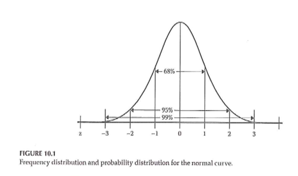

<div class="notes">

Figure 10.1 shows the standard bell shaped curve.

</div>

***
### Descriptive Statistics 

+ Descriptive graphs
	+ How to look at your data
	+ Options for viewing your data
		+ Frequency polygons
		+ Histograms
		+ Bar charts

<div class="notes">

Even for a qualitative study, you'll still want to describe characteristics of your sample.

For a fancier inferential analysis, you still should start with a descriptive analysis.

</div>

***
### Descriptive Statistics 

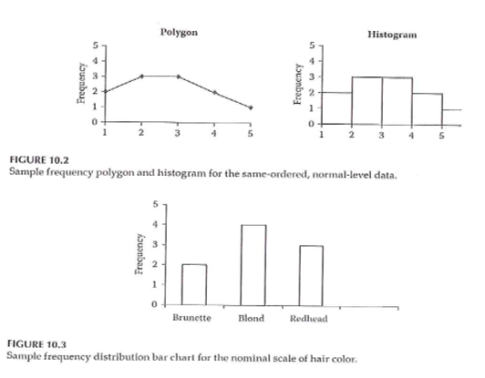

<div class="notes">

Figures 10.2 and 10.3.

Frequency polygon has a line connecting values and implicitly represents a normal distribution.

</div>

***
### Descriptive Statistics 

+ Measures of central tendency
	+ Mean
	+ Median
	+ Mode

<div class="notes">

These terms should already be familiar to you. The mean is the best choice for approximately normal distribution. The median is better for non-normal continuous variables and ordinal variables.

</div>

***
### Descriptive Statistics 

+ Measures of variability
	+ Range
	+ Standard deviation
	+ Interquartile range
	+ How many categories

<div class="notes">

The standard deviation is considered a poor measure of variability for a non-normal population. The interquartile is the difference between the 75th percentile and the 25th percentile. Define the 25th percentile as the value so that approximately 25% of the values are smaller and 75% are larger.

</div>

***
### Descriptive Statistics 

+ Measures of association between 2 variables
	+ Correlation
		+ Pearson
		+ Spearman
	+ Cross-tabulation
	+ Scatterplot

<div class="notes">

A correlation is a value between -1 and +1. There are two versions. Use Spearman for non-normal or ordinal variables.

Cross-tabulation is best for nominal and ordinal variables.

</div>

***
### Descriptive Statistics 

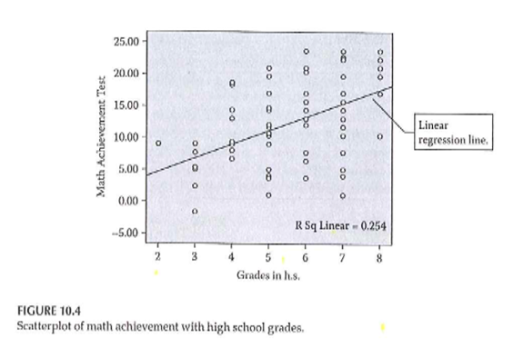

<div class="notes">

Figure 10.4 shows the relationship between grade level and performance on a math achievement test. It shows a trend line and an R-squared value.

Note that this is an association but not necessarily a causal relationship. Knowledge of one variable helps you predict the other.

</div>

***
### Descriptive Statistics 

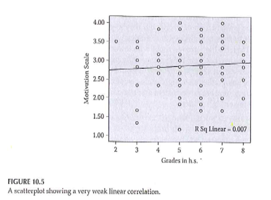

<div class="notes">

Figure 10.5 shows a much weaker relationship between grade level and motivation scale. The trend line is flat and the R-squared value is small.

</div>

***
### Descriptive Statistics 

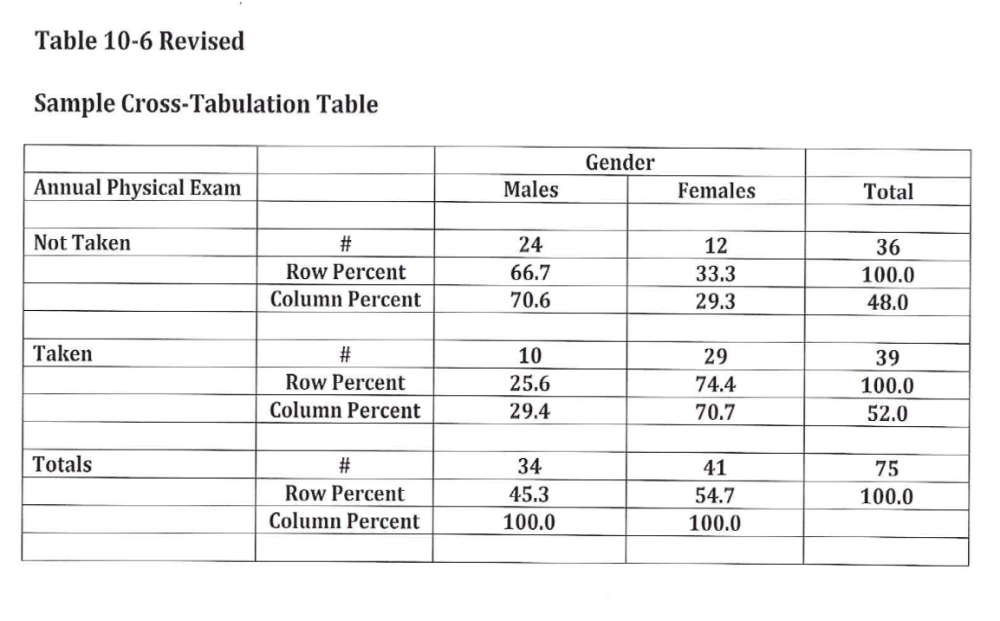

<div class="notes">

Table 10.6 shows a cross-tabulation. Mary revised this to include row and column percentages. Orient towards the row totals or the column totals. Row percentages add up to 100% within each row and column percentages add up to 100% within each row.

You might compute both row and column percentages, but only include one in your final table.

</div>

***
### Descriptive Statistics 

+ Properties of the normal curve
	+ Unimodal
	+ Mean, median, and mode are equal
	+ Symmetric curve (skew)
	+ Range is infinite
	+ Shape – not too peaked or flat (kurtosis)

<div class="notes">

This is not a Statistics class, but is intended to help you decide how to choose analyses for your research plan.

There are five properties. Unimodal, symmetric (no skewness), infinite range, peakedness or flatness tells you information about the tendency to produce outliers.

[[Talk about range restrictions.]]

</div>

***
### Descriptive Statistics 


<div class="notes">

Figure 10.1 (normal curve) again.

</div>

***
### Descriptive Statistics 

+ Standard normal curve
	+ Definition
	+ How to compute
	+ Effect size

<div class="notes">

Set the mean to zero and a standard deviation of one. The standard normal curve is useful for effect size calculations and power analysis.

</div>

***
### Measurement & Descriptive Statistics 

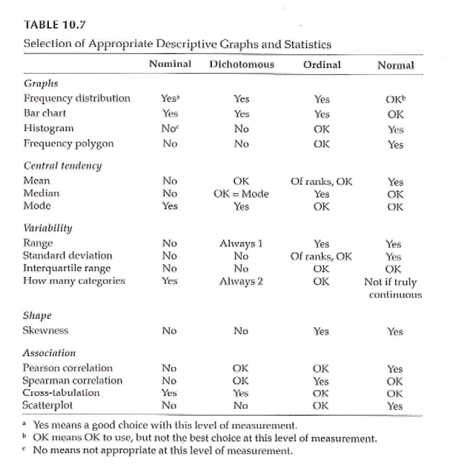

<div class="notes">

Table 10.7. This is a great table that tells you what graphical and numeric summaries are appropriate for what types of data. This doesn't address the statistical tests (inferential analyses).

</div>

***
### Making Inferences - NHST 

+ Populations versus Samples
+ Use inferential statistics
	+ Sample statistics (M, SD) <U+F0E8>
	+ Population parameters (mu, sigma)
+ Null Hypothesis Significance Testing (NHST)
	+ Null hypothesis (H 0 )
	+ Alternative hypothesis (H 1 )
		+ AKA research hypothesis
		+ Directional
		+ Non-directional

<div class="notes">

We are talking about data analysis and interpretation. Planning. Some of this will be familiar to you. This is not a full statistical coverage of the topic.

Take the data from the sample and make inferences about the population. The sample is a subset. Inferential statistics is the process by which you infer information about the population.

NHST is the traditional way that a huge amount of research relies on.

Null hypothesis is no difference or no relationship. The alternative is often called the research hypothesis.

</div>

***
### Making Inferences - NHST 

+ NHST – Goal of research –
	+ Reject the H 0 in favor of H 1
+ “Reject” the null hypothesis
	+ Practically – “reject” means difference / relationship greater than just random variability
+ Alternative hypothesis –
	+ 3 versions
		+ Non-directional
		+ Directional positive
		+ Directional negative

<div class="notes">

Does the data allow us to reject the null hypothesis. Rejecting means the difference or relationship is greater than what you'd expect due to sampling error.

[[Directional only for two group comparisons or bivariate relationships]]

never talk about proving the null hypothesis. A large p-value does not mean that you proved the null hypothesis. There might be sources of error that lead to failure to reject the null hypothesis.

</div>

***
### Making Inferences - NHST 

+ Directional vs Non-directional H 1
	+ Comparing treatment to control
	+ Comparing different treatments
+ Choosing directional vs non-directional
	+ Basis for choice
	+ Consequences
		+ Statistical analysis
		+ Interpretation

<div class="notes">

Directional is more likely when comparing a treatment to a control [[placebo]]. When comparing two different treatments, you would have to use a non-directional hypothesis.

Is there existing evidence to support a directional hypothesis.

If you use a directional hypothesis, and you get an extreme result in the opposite direction, you can't claim statistical significance.

Some people think that directional hypotheses are "cheating".

</div>

***
### Making Inferences - NHST 

+ Sampling review
	+ Target / theoretical population
	+ Accessible population
	+ Sample
+ Inference from the study sample to the population

<div class="notes">

So how well does your sample reflect the population?

</div>

***
### Making Inferences - NHST 

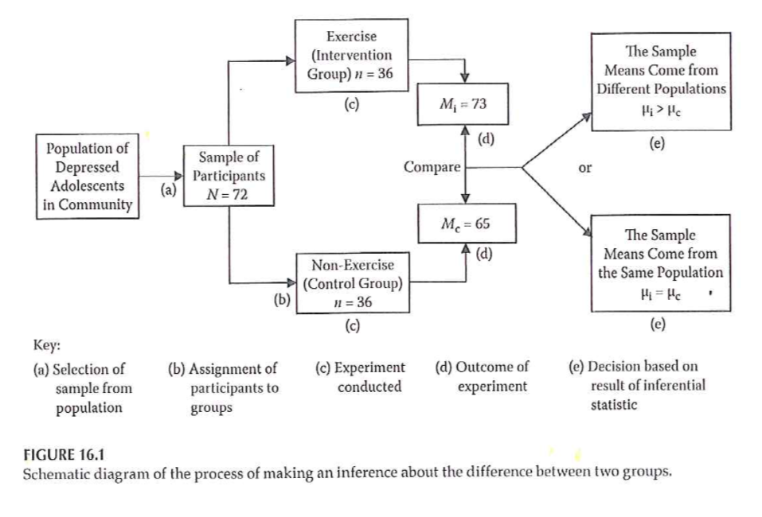

<div class="notes">

+ Example

Figure 16.1 from your book.

Flow chart of selecting from a population, randomizing to two groups, and then comparing the results in each group, and choosing between two hypotheses.

</div>

***
### Making Inferences - NHST 

+ Accessible population -> Sample
+ Random assignment to groups
+ Conduct study and collect data
+ Conduct statistical analysis
	+ Intervention group: mean = 73
	+ Control group: mean = 65

<div class="notes">

[[This is a re-iteration of Figure 16.1]]

From your basic Statistics class, you may recognize that this setting would require a two-sample t-test.

[[Knowing which statistic to use in what setting is one of the most difficult tasks that you will encounter.]]

</div>

***
### Making Inferences - NHST 

+ Significant difference or not?
	+ Inferential statistics – allow you to determine this
+ Reject the null ->
	+ The observed difference is highly unlikely if the null hypothesis is actually true
+ Fail to reject the null ->
	+ We can not say that the observed difference is highly unlikely
	+ Do NOT “accept” the null hypothesis

<div class="notes">

[[If a particular sample result is unlikely under the null hypothesis, this causes you to question the null hypothesis.]]

Reasons why you failed to reject the null hypothesis. A poorly implemented intervention, failure to use valid and reliabile measures, quality problems during the study.

Why never say that we accept the null.

</div>

***
### Making Inferences - NHST 

+ ( Portney & Watkins, 2009)

<div class="notes">

This is a table of possible outcomes H0 true, H0 false versus reject H0, accept H0.

Define power as the probability of rejecting the null hypotheis when the alternative hypothesis is true. [[Since the ]]

</div>


***
### Making Inferences - NHST 

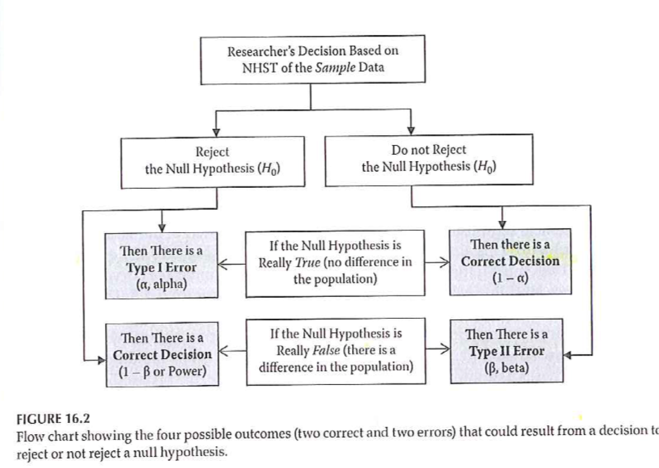

<div class="notes">

+ Statistical testing – possible outcomes

Figure 16.2 provides a different way of displaying Type I and Type II errors in a two by two table.

</div>

***
### Making Inferences - NHST 

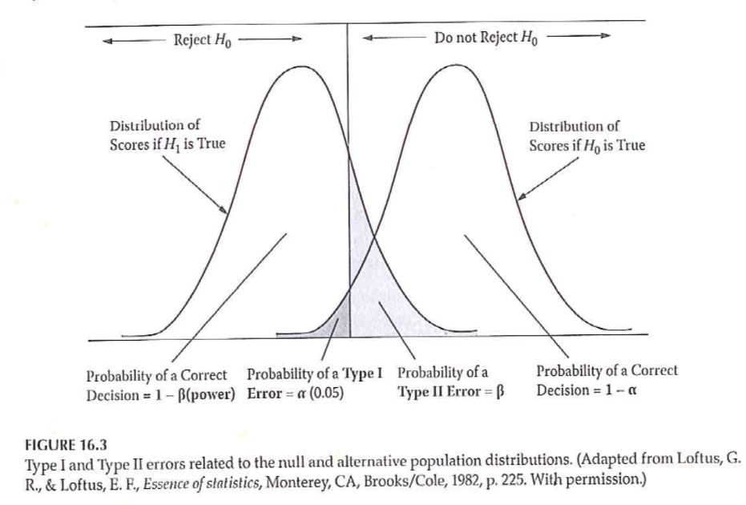

<div class="notes">

+ Statistical testing – possible outcomes

Two normal distributions and bell shaped curves. 

Figure 16.3 from your book. Directional negative hypothesis. Example an intervention that results in a reduction in symptoms/pain.

</div>

***
### Making Inferences - NHST 

+ Statistical testing
	+ Fig 16.3 – Directional negative
		+ Example – hypothesize that intervention will result in reduction of symptoms
	+ If you made a directional positive alternative hypothesis …. ?

<div class="notes">

[[This is a rehash of Figure 16.3.]]

</div>

***
### Making Inferences - NHST 

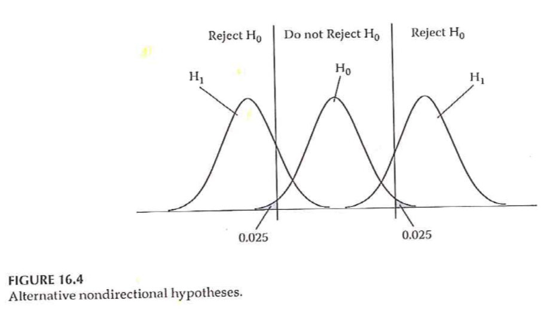

<div class="notes">

+ Statistical testing
	+ Fig 16.4 – Non-directional

</div>

***
### Null value

```{r null-value, echo=FALSE}
x <- seq(-3.5, 6.5, length=100)
y <- dnorm(x)
plot(x, y, xlab=" ", ylab=" ", axes=FALSE, type="n", ylim=c(0, 0.6))
abline(h=0)
segments(0, 0, 0, 0.45)
text(0, 0.55, cex=0.5, "Null\nvalue")
```

***
### Critical value

```{r critical-value, echo=FALSE}
x <- seq(-3.5, 6.5, length=100)
y <- dnorm(x)
lb <- c("\nNull\nvalue", "\nCritical\nvalue")
plot(x, y, xlab=" ", ylab=" ", axes=FALSE, type="n", ylim=c(0, 0.6))
abline(h=0)
segments(0, 0, 0, 0.45, col="gray")
text(0, 0.55, cex=0.5, "Null\nvalue", col="gray")
segments(1.2, 0, 1.2, 0.45)
text(1.2, 0.55, cex=0.5, "Critical\nvalue")
```

***
### Alpha level

```{r alpha-level, echo=FALSE}
x <- seq(-3.5, 6.5, length=100)
y <- dnorm(x)
lb <- c("\nNull\nvalue", "\nCritical\nvalue")
plot(x, y, xlab=" ", ylab=" ", axes=FALSE, type="l", ylim=c(0, 0.6))
abline(h=0)
segments(0, 0, 0, 0.45, col="gray")
text(0, 0.55, cex=0.5, "Null\nvalue", col="gray")
segments(1.2, 0, 1.2, 0.45, col="gray")
text(1.2, 0.55, cex=0.5, "Critical\nvalue", col="gray")
```


```{r beta-level, echo=FALSE}
x <- seq(-3.5, 6.5, length=100)
y <- dnorm(x, m=3)
lb <- c("\nNull\nvalue", "\nCritical\nvalue")
plot(x, y, xlab=" ", ylab=" ", axes=FALSE, type="l", ylim=c(0, 0.6))
abline(h=0)
segments(0, 0, 0, 0.45, col="gray")
text(0, 0.55, cex=0.5, "Null\nvalue", col="gray")
segments(1.2, 0, 1.2, 0.45, col="gray")
text(1.2, 0.55, cex=0.5, "Critical\nvalue", col="gray")
```

***
### Power Analysis 

+ Probability of rejecting a false H 0
	+ This is a GOOD thing!
	+ Want to maximize this (within reasonable limits!)
	+ What is power analysis
	+ “… the probability that his investigation would lead to statistically significant results.”

<div class="notes">


</div>

***
### Power Analysis 

+ ( Portney & Watkins, 2009)

<div class="notes">


</div>

***
```{r tbl14, echo = FALSE, eval=FALSE}
tbl14 <- tibble::tribble(
~` `, ~`TRUTH`, ~` `,
"DECISION","H o is true (there is no relationship)","H o is false (there is a relationship)",
"Reject H o (you find a relationship)","Type I Error Alpha","Correct  (Decision agrees with Truth ) Power",
"Do not reject H o (you do NOT find a relationship)","Correct  (Decision agrees with Truth)","Type II Error Beta (Power = 1 - Beta)"
)

kableExtra::kable_styling(knitr::kable(tbl14), font_size = 18)
```

<div class="notes">


</div>

***
### Power Analysis 

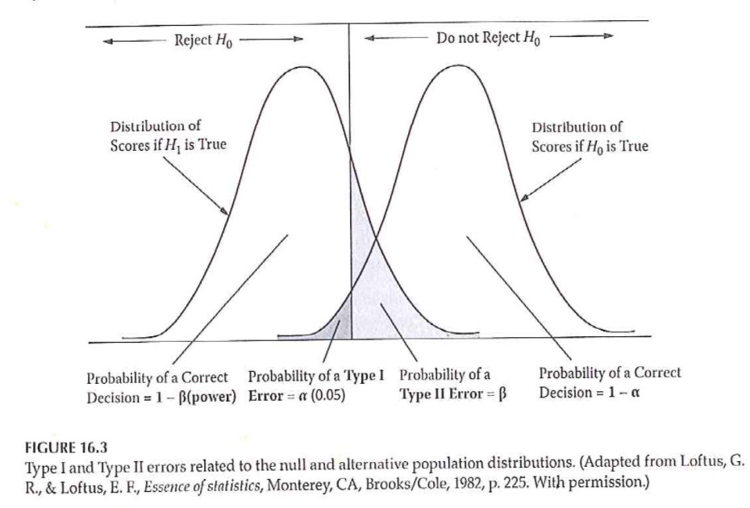

<div class="notes">

+ Power of a study – probability of rejecting a false null hypothesis

</div>

***
### Power Analysis 

+ Statistical power analysis concepts (Cohen)
	+ Significance criterion – alpha
	+ Power – desired level
	+ Sample size
	+ Effect size
+ Power analysis method depends on research design

<div class="notes">


</div>

***
### Power Analysis 

+ Performing a power analysis when planning a study
	+ What is the study design?
	+ What do you already know about the measure you are interested in?
	+ What significance level to you want to use for hypothesis testing?
	+ What level of power do you want to achieve?

<div class="notes">


</div>

***
### Power Analysis 

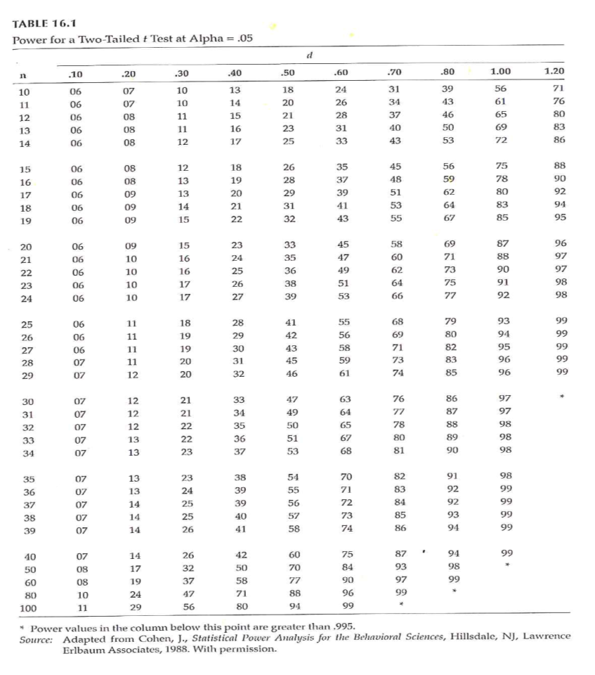

<div class="notes">

+ Determining power (Fig 16.1)

</div>

***
### Power Analysis 

+ Increasing power –
	+ Alpha level
	+ Formulation of hypothesis
	+ Decrease variability / increase precision
		+ Groups
		+ Outcome measure(s)
	+ Increase sample size

<div class="notes">


</div>

***
### Power Analysis 

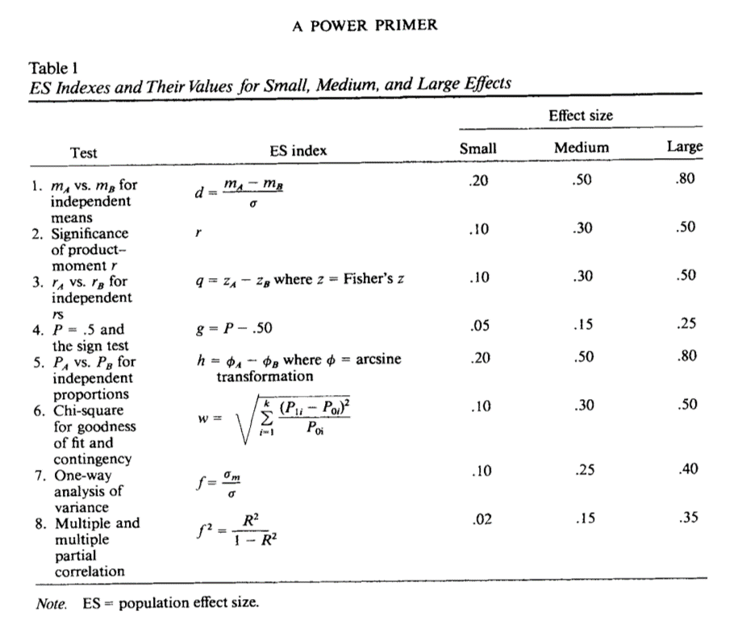

<div class="notes">


</div>

***
### Power Analysis 

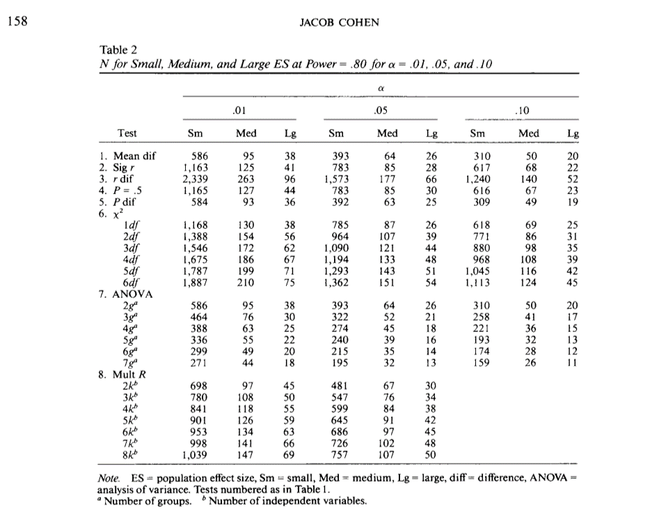

<div class="notes">


</div>

***
### Problems with NHST 

+ Knowledge based on outcome of single study
+ Interpretation of statistical significance
+ Complications
	+ H 0 is rarely true – in a strict sense
	+ Too large of a sample size – hard NOT to get statistical significance
	+ Significance testing as a dichotomous decision
	+ Interpretation of changes in the p value
	+ Statistical significant versus clinical/ substative meaningfulness

<div class="notes">

There is always a level of uncertainty associated with a single study.

[[ASA statement on p-values]]

[[Sackett article. http://www.cmaj.ca/content/165/9/1226.short or http://blog.pmean.com/physiological-statistics/ ]]

[[ Example of PiFace http://blog.pmean.com/simple-sample-size/ ]]

[[ Range of clinical indifference http://www.pmean.com/04/confidence.html ]]

[[p-values with lots of zeros, doesn't make up for biases in the study.]]

</div>

***
### Improving NHST 

+ Propose specific alternative hypotheses
+ Use a random sample if possible
+ Use an outcome variable that has good reliability and validity
+ Have a good idea of the level of difference that will be clinically important

<div class="notes">


</div>

***
### Making Inferences - EBA 

+ EBA – Evidence-Based Approach
	+ Reliability of findings
	+ Accumulation of evidence
+ Premise – “… a single study is not sufficient to use as evidence to substantiate a hypothesis or theory.”
+ Methods
	+ Confidence intervals
	+ Effect sizes
	+ Meta-analysis

<div class="notes">


</div>

***
### Making Inferences - EBA 

+ Confidence Intervals (CI)
	+ Range of scores that should contain the true population score
+ CI <U+F0E8> An interval around the point estimate
+ CI <U+F0E8> “… range of the dependent variable scores that *should contain the true population difference between means* .”
+ CI computed using sample mean and standard deviation

<div class="notes">


</div>

***
### Making Inferences - EBA 

+ Interpretation of CI –
	+ 95% CI most common
	+ 95% CI – with infinite studies and computed CI, the true population difference would be found within 95% of the intervals
	+ NOT – .95 probability that true population difference is within the CI computed from our single study
	+ Option – 95% CI for a given study “… *estimates* the population mean difference with 95% confidence.”

<div class="notes">


</div>

***
### Making Inferences - EBA 

+ Why compute and report CI?
	+ Part of philosophy to encourage replication
	+ Size of interval – “… how much of the estimate might be due to sampling error.”

<div class="notes">


</div>

***
### Making Inferences - EBA 

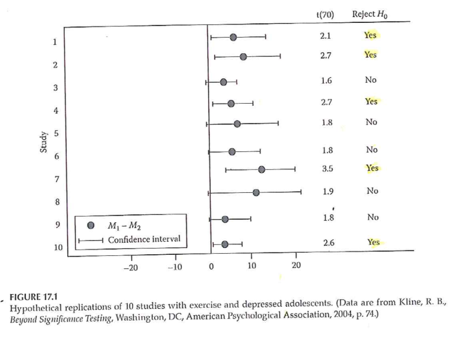

<div class="notes">

+ Interpreting 95% CI (Fig 17.1)

</div>

***
### Making Inferences – EBA 

+ Effect size –
	+ Strength of relationship between IV & DV
	+ Magnitude of the difference between levels of the IV with respect to the DV
	+ 3 types of effect size measures
		+ r family
		+ d family
		+ Measures of risk potency

<div class="notes">


</div>

***
### Making Inferences – EBA 

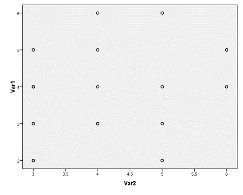

<div class="notes">

+ Why is effect size at least as important as significance level?
	+ Influence of sample size on results

</div>

***
### Making Inferences – EBA 

+ Effect sizes –
	+ Unstandardized – in the units of the raw DV
	+ Standardized –
		+ Standardized using pooled standard deviation of the groups
		+ Measure that can be used to compare to other studies with different DVs

<div class="notes">


</div>

***
### Making Inferences – EBA 

+ Types of effect sizes –
	+ R family – strength of association
	+ D family – magnitude of differences
	+ Measures of risk potency – when both IV and DV are dichotomous
		+ Odds ratio
		+ Relative risk
		+ Risk difference

<div class="notes">


</div>

***
### Making Inferences – EBA 

+ R family of effect sizes – association
	+ r 2  vs r
+ Cohen’s guidelines
	+ Weak approx +/- .1
	+ Medium approx +/- .3
	+ Strong approx +/- .5
+ Authors labeling
	+ Less than typical
	+ Typical
	+ Greater than typical
+ Also rho, phi, eta, R

<div class="notes">


</div>

***
### Making Inferences – EBA 

+ D family of effect sizes – differences
+ d <U+F0E8> Two group comparison
	+ Treatment group mean – Comparison group mean
	+ Divided by pooled standard deviations from both samples
+ eta 2  <U+F0E8> Multiple group comparison
	+ Statistics packages will compute
	+ Interpret like r 2 (amount of variance in DV accounted for by IV)

<div class="notes">


</div>

***
### Making Inferences – EBA 

+ Risk family of effect sizes – When both IV and DV are dichotomous
	+ Phi – measure of association / correlation
+ Clinical / medical research – the risk of clinical outcomes
	+ Relative risk – ratio that compares the risk of an outcome between groups
	+ Risk difference – percentage difference that compares risk of an outcome between groups
	+ Odds ratio – Odds of outcome in control group compared to odds in treatment group

<div class="notes">


</div>

***
### Making Inferences – EBA 

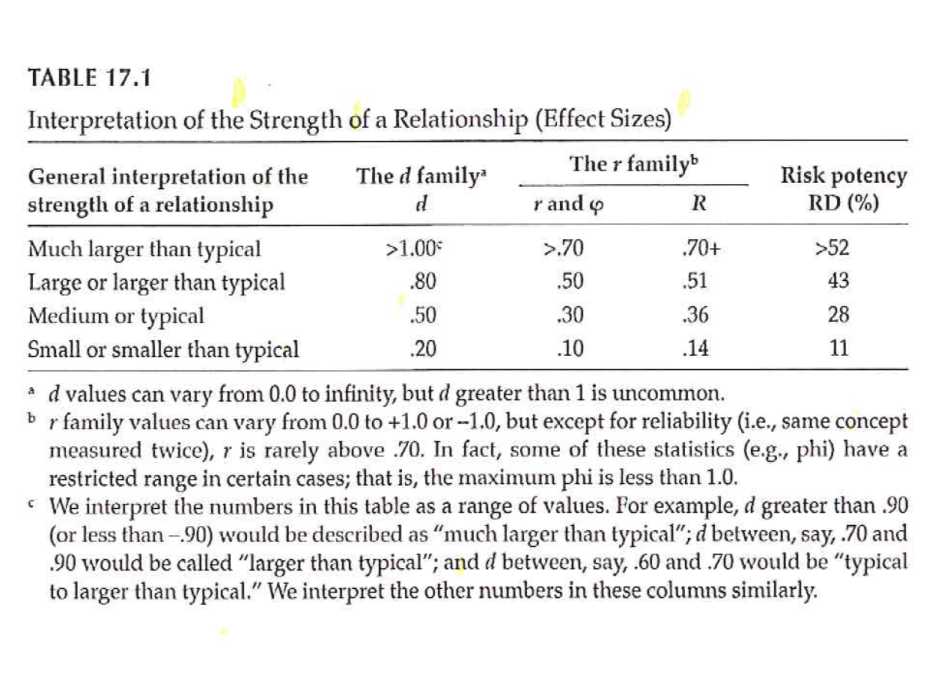

<div class="notes">

+ Interpretation of effect sizes –

</div>

***
### Making Inferences – EBA 

+ Value of effect sizes –
	+ Indicates the strength of a relationship or a difference
	+ Allows you
		+ Combine results from studies with dissimilar outcome measures
		+ Use findings of previous study to plan study with different outcome measure
+ Online source to perform power analysis –
	+ Sample Power (part of SPSS)
	+ Russell Lenth – U of Iowa

<div class="notes">


</div>

***
### Making Inferences – EBA 

+ Meta-Analysis
	+ Research synthesis of multiple studies
	+ Uses effect size value from each study
	+ Advantage over systematic review – compute a summary statistic that represents overall estimate
	+ Provides evidence of reliability of research finding
	+ Include findings from studies that failed to find statistical significance
	+ Increased external validity

<div class="notes">


</div>

***
### Making Inferences – EBA 

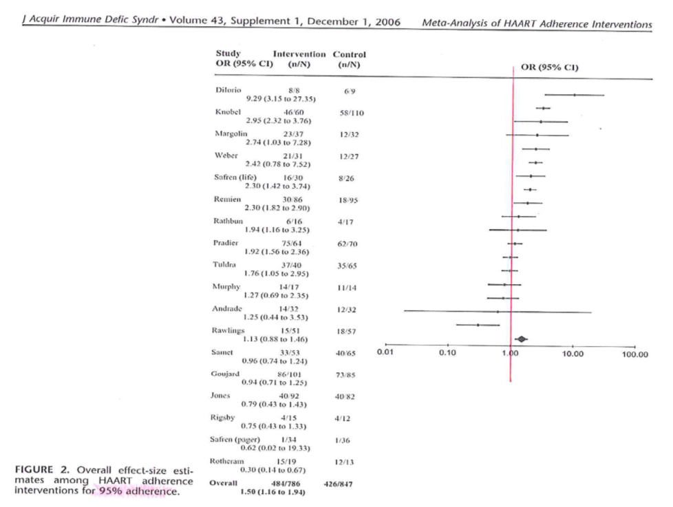

<div class="notes">

+ Simoni et al., 2006

</div>

***
### Making Inferences – EBA 

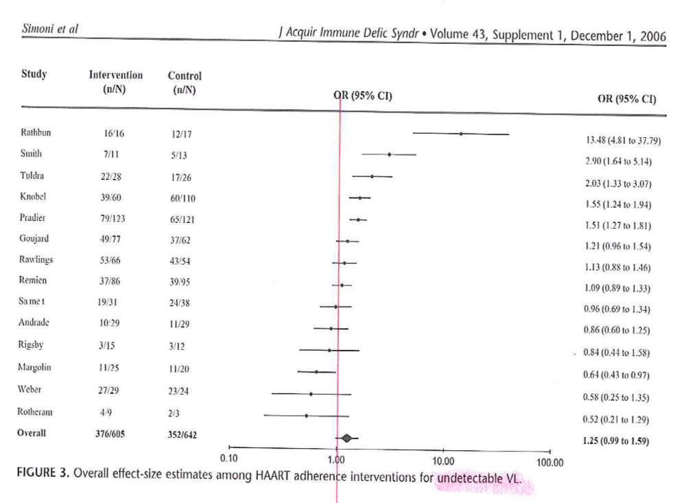

<div class="notes">

+ Simoni et al., 2006

</div>


* http://blog.pmean.com/semi-structured-interviews/

* Positivism versus constructivism, revisited
  + https://www.sagepub.com/sites/default/files/upm-binaries/29985_Chapter1.pdf
  + http://blog.pmean.com/recommended-philosophy-news-network-postmodernism-special-report/
  
Tools: semi-structured interviews, participant observation, photo elicitation(?), mapping exercises(?), web and space design workshops(?), archival records, physical artifacts, 

Typically, a one-hour interview requires a minimum of three to four hours (or more) of analysis.

Involve the participants in the process, especially for narrative research.

### Analysis of Qualitative Data 

+ Inductive process –
	+ Start with the specific (raw data / transcript)
	+ Develop a theoretical framework from the data
	+ Conceptual categories emerge from the data

<div class="notes">


</div>


### Analysis of Qualitative Data 

+ Start the study with a research question
	+ This may provide a potential starting point for analyzing text
	+ If you do this, DO NOT let it prevent you from seeing what is in the text
+ Steps
	+ From raw data to theory building
	+ “ Iterative ” process
		+ e.g. , as you are developing categories, check them back against the raw data – do they continue to reflect the original data?

<div class="notes">

Keep alert and look for things that come out in the material that you were not anticipating. As your categories, go back and compare them against the raw data. Make sure that you allow the data to guide you. Often coding from transcripts. But it is also good to have access to the original recordings. Sometimes there is a doubt about what some was saying (joking or sarcasm). Look for tone of voice and non-verbal cues.

Content analysis is a generic term, but you can look at things like ad messages in magazines that appeal to young adults.

Thematic analysis is looking for patterns.

</div>


### Analysis of Qualitative Data 

+ Analysis process –
	+ Given research question, may have some idea of a general conceptual structure; serve only as a starting point
	+ Usually work from transcripts
	+ If possible, refer back to audio recordings when needed
	+ Qualitative form of analysis
		+ Content analysis – analysis of the content of communication
		+ Thematic analysis – identifying patterns or themes in the data

<div class="notes">

Break up the text into "bits" that represent specific thoughts. Open coding lots of themes. Axial coding looks at the relationships between themes, builds a superstructure of ideas.

</div>


### Analysis of Qualitative Data 

+ Category Formation – assign sections (data bits) to analytical categories/themes "coding"
	+ Summarizing the data by identifying similarities and differences / commonalities and contrasts
	+ Categories:
		+ More manageable units of information
		+ "open coding"
		+ Descriptive – Concrete
		+ Interpretive – Abstract
		+ Relational
	+ Cross-reference categories back to text
		+ Makes it easier to revise coding as needed

<div class="notes">

Software allows you to go back and forth between themes and the original text. Cross-referencing is important. Find examples easily. It helps provide validity checks. Does someone agree with your categorization.

Categories need to be faithful to the data. This is internal validity. But you need to place this in a broader understanding.

You need to be careful about trying to quantify this too much. Keep in mind that just because someone talks about something a lot does not mean that this is the most important thing to them. The most important thing might be something that people are uncomfortable talking about.

</div>


### Analysis of Qualitative Data 

+ Category Formation
	+ Faithful to the data – "internal" aspect
	+ Meaningful to other categories – "external" aspect
	+ Balance
		+ Generality vs Specificity
		+ Inclusivity vs Exclusivity
	+ Number of times idea mentioned does NOT necessarily reflect importance

<div class="notes">


</div>


### Analysis of Qualitative Data 

+ Labeling / Revising Categories
	+ Member-generated – “ first-order ” account
	+ Observer-generated – “ second-order ” account
	+ Labels are provisional; may be revised
	+ Iteration – move back and forth between raw data and labeled categories
	+ “ Zoom in ” vs “ Wide angle ” view of the coding
	+ Revision – may end up dividing or combining categories
	+ May establish criteria for category coding

<div class="notes">

Phrasing of the person versus observations generated by the researcher. Labels should be considered as provisional as you work with more complete information. It is an iterative process. Go back to original data. You're looking at the specific of what's been told versus a broader understanding.

Establishing the criteria may depend on how many people are doing the coding. If you don't have a pre-existing structure, the coding may evolve and may involve 100% review (both raters review everything and resolve discrepancy). Then a third person does an audit.

</div>


### Analysis of Qualitative Data 

+ Saturation – the point at which you are not gaining any new insight, no new categories being identified, no new relationships being defined
	+ Don't need any additional analysis
	+ Don't need any additional data collection (if collection & analysis done in parallel)
	+ Determinant – nature of the information being collection – NOT amount of information
	+ Keeping notes – of the coding/analysis process
	+ Help identify categories/relationships
	+ Help if "stuck"
	+ Document analysis process

<div class="notes">

Saturation is a way to assess your sample size. Have you gotten a representative amount of data. 

Really important to keep notes of the coding and analysis process, so you can check your work. Allows you to do qualirty checks on the process.

</div>


### Analysis of Qualitative Data 

+ Role of Judgment
	+ Balancing act –
		+ Level of creativity by coder to identify categories/relationships
		+ Must reflect the informants thoughts
		+ Audit of the coding by an independent person can check for the match between the coding and the source information
	+ Low-inference descriptors
	+ Look for "negative cases"

<div class="notes">

You develop a framework, but that framework must always represent what the subjects have said.

Low inference descriptors are those things involving just the basic words or text.

</div>


### Analysis of Qualitative Data 

+ Quantifying Information
	+ Pros & Cons
	+ When quantifying might be of value
	+ Simple frequency of occurrence does NOT necessarily reflect importance

<div class="notes">

This was mentioned earlier.

</div>

***
### Descriptive Statistics 


<div class="notes">

Figure 10.1 shows the standard bell shaped curve.

</div>

***
### Descriptive Statistics 

+ Descriptive graphs
	+ How to look at your data
	+ Options for viewing your data
		+ Frequency polygons
		+ Histograms
		+ Bar charts

<div class="notes">

Even for a qualitative study, you'll still want to describe characteristics of your sample.

For a fancier inferential analysis, you still should start with a descriptive analysis.

</div>

***
### Descriptive Statistics 


<div class="notes">

Figures 10.2 and 10.3.

Frequency polygon has a line connecting values and implicitly represents a normal distribution.

</div>

***
### Descriptive Statistics 

+ Measures of central tendency
	+ Mean
	+ Median
	+ Mode

<div class="notes">

These terms should already be familiar to you. The mean is the best choice for approximately normal distribution. The median is better for non-normal continuous variables and ordinal variables.

</div>

***
### Descriptive Statistics 

+ Measures of variability
	+ Range
	+ Standard deviation
	+ Interquartile range
	+ How many categories

<div class="notes">

The standard deviation is considered a poor measure of variability for a non-normal population. The interquartile is the difference between the 75th percentile and the 25th percentile. Define the 25th percentile as the value so that approximately 25% of the values are smaller and 75% are larger.

</div>

***
### Descriptive Statistics 

+ Measures of association between 2 variables
	+ Correlation
		+ Pearson
		+ Spearman
	+ Cross-tabulation
	+ Scatterplot

<div class="notes">

A correlation is a value between -1 and +1. There are two versions. Use Spearman for non-normal or ordinal variables.

Cross-tabulation is best for nominal and ordinal variables.

</div>

***
### Descriptive Statistics 


<div class="notes">

Figure 10.4 shows the relationship between grade level and performance on a math achievement test. It shows a trend line and an R-squared value.

Note that this is an association but not necessarily a causal relationship. Knowledge of one variable helps you predict the other.

</div>

***
### Descriptive Statistics 


<div class="notes">

Figure 10.5 shows a much weaker relationship between grade level and motivation scale. The trend line is flat and the R-squared value is small.

</div>

***
### Descriptive Statistics 


<div class="notes">

Table 10.6 shows a cross-tabulation. Mary revised this to include row and column percentages. Orient towards the row totals or the column totals. Row percentages add up to 100% within each row and column percentages add up to 100% within each row.

You might compute both row and column percentages, but only include one in your final table.

</div>

***
### Descriptive Statistics 

+ Properties of the normal curve
	+ Unimodal
	+ Mean, median, and mode are equal
	+ Symmetric curve (skew)
	+ Range is infinite
	+ Shape – not too peaked or flat (kurtosis)

<div class="notes">

This is not a Statistics class, but is intended to help you decide how to choose analyses for your research plan.

There are five properties. Unimodal, symmetric (no skewness), infinite range, peakedness or flatness tells you information about the tendency to produce outliers.

[[Talk about range restrictions.]]

</div>

***
### Descriptive Statistics 


<div class="notes">

Figure 10.1 (normal curve) again.

</div>

***
### Descriptive Statistics 

+ Standard normal curve
	+ Definition
	+ How to compute
	+ Effect size

<div class="notes">

Set the mean to zero and a standard deviation of one. The standard normal curve is useful for effect size calculations and power analysis.

</div>

***
### Measurement & Descriptive Statistics 


<div class="notes">

Table 10.7. This is a great table that tells you what graphical and numeric summaries are appropriate for what types of data. This doesn't address the statistical tests (inferential analyses).

</div>

***
### Making Inferences - NHST 

+ Populations versus Samples
+ Use inferential statistics
	+ Sample statistics (M, SD) <U+F0E8>
	+ Population parameters (mu, sigma)
+ Null Hypothesis Significance Testing (NHST)
	+ Null hypothesis (H 0 )
	+ Alternative hypothesis (H 1 )
		+ AKA research hypothesis
		+ Directional
		+ Non-directional

<div class="notes">

We are talking about data analysis and interpretation. Planning. Some of this will be familiar to you. This is not a full statistical coverage of the topic.

Take the data from the sample and make inferences about the population. The sample is a subset. Inferential statistics is the process by which you infer information about the population.

NHST is the traditional way that a huge amount of research relies on.

Null hypothesis is no difference or no relationship. The alternative is often called the research hypothesis.

</div>

***
### Making Inferences - NHST 

+ NHST – Goal of research –
	+ Reject the H 0 in favor of H 1
+ “Reject” the null hypothesis
	+ Practically – “reject” means difference / relationship greater than just random variability
+ Alternative hypothesis –
	+ 3 versions
		+ Non-directional
		+ Directional positive
		+ Directional negative

<div class="notes">

Does the data allow us to reject the null hypothesis. Rejecting means the difference or relationship is greater than what you'd expect due to sampling error.

[[Directional only for two group comparisons or bivariate relationships]]

never talk about proving the null hypothesis. A large p-value does not mean that you proved the null hypothesis. There might be sources of error that lead to failure to reject the null hypothesis.

</div>

***
### Making Inferences - NHST 

+ Directional vs Non-directional H 1
	+ Comparing treatment to control
	+ Comparing different treatments
+ Choosing directional vs non-directional
	+ Basis for choice
	+ Consequences
		+ Statistical analysis
		+ Interpretation

<div class="notes">

Directional is more likely when comparing a treatment to a control [[placebo]]. When comparing two different treatments, you would have to use a non-directional hypothesis.

Is there existing evidence to support a directional hypothesis.

If you use a directional hypothesis, and you get an extreme result in the opposite direction, you can't claim statistical significance.

Some people think that directional hypotheses are "cheating".

</div>

***
### Making Inferences - NHST 

+ Sampling review
	+ Target / theoretical population
	+ Accessible population
	+ Sample
+ Inference from the study sample to the population

<div class="notes">

So how well does your sample reflect the population?

</div>

***
### Making Inferences - NHST 


<div class="notes">

+ Example

Figure 16.1 from your book.

Flow chart of selecting from a population, randomizing to two groups, and then comparing the results in each group, and choosing between two hypotheses.

</div>

***
### Making Inferences - NHST 

+ Accessible population -> Sample
+ Random assignment to groups
+ Conduct study and collect data
+ Conduct statistical analysis
	+ Intervention group: mean = 73
	+ Control group: mean = 65

<div class="notes">

[[This is a re-iteration of Figure 16.1]]

From your basic Statistics class, you may recognize that this setting would require a two-sample t-test.

[[Knowing which statistic to use in what setting is one of the most difficult tasks that you will encounter.]]

</div>

***
### Making Inferences - NHST 

+ Significant difference or not?
	+ Inferential statistics – allow you to determine this
+ Reject the null ->
	+ The observed difference is highly unlikely if the null hypothesis is actually true
+ Fail to reject the null ->
	+ We can not say that the observed difference is highly unlikely
	+ Do NOT “accept” the null hypothesis

<div class="notes">

[[If a particular sample result is unlikely under the null hypothesis, this causes you to question the null hypothesis.]]

Reasons why you failed to reject the null hypothesis. A poorly implemented intervention, failure to use valid and reliabile measures, quality problems during the study.

Why never say that we accept the null.

</div>

***
### Making Inferences - NHST 

+ ( Portney & Watkins, 2009)

<div class="notes">

This is a table of possible outcomes H0 true, H0 false versus reject H0, accept H0.

Define power as the probability of rejecting the null hypotheis when the alternative hypothesis is true. [[Since the ]]

</div>

***
### Making Inferences - NHST 


<div class="notes">

+ Statistical testing – possible outcomes

Figure 16.2 provides a different way of displaying Type I and Type II errors in a two by two table.

</div>

***
### Making Inferences - NHST 


<div class="notes">

+ Statistical testing – possible outcomes

Two normal distributions and bell shaped curves. 

Figure 16.3 from your book. Directional negative hypothesis. Example an intervention that results in a reduction in symptoms/pain.

</div>

***
### Making Inferences - NHST 

+ Statistical testing
	+ Fig 16.3 – Directional negative
		+ Example – hypothesize that intervention will result in reduction of symptoms
	+ If you made a directional positive alternative hypothesis …. ?

<div class="notes">

[[This is a rehash of Figure 16.3.]]

</div>

***
### Making Inferences - NHST 


<div class="notes">

+ Statistical testing
	+ Fig 16.4 – Non-directional

</div>

***
### Null value

```{r null-value, eval=FALSE, echo=FALSE}
x <- seq(-3.5, 6.5, length=100)
y <- dnorm(x)
plot(x, y, xlab=" ", ylab=" ", axes=FALSE, type="n", ylim=c(0, 0.6))
abline(h=0)
segments(0, 0, 0, 0.45)
text(0, 0.55, cex=0.5, "Null\nvalue")
```

***
### Critical value

```{r critical-value, eval=FALSE, echo=FALSE}
x <- seq(-3.5, 6.5, length=100)
y <- dnorm(x)
lb <- c("\nNull\nvalue", "\nCritical\nvalue")
plot(x, y, xlab=" ", ylab=" ", axes=FALSE, type="n", ylim=c(0, 0.6))
abline(h=0)
segments(0, 0, 0, 0.45, col="gray")
text(0, 0.55, cex=0.5, "Null\nvalue", col="gray")
segments(1.2, 0, 1.2, 0.45)
text(1.2, 0.55, cex=0.5, "Critical\nvalue")
```

***
### Alpha level

```{r alpha-level, eval=FALSE, echo=FALSE}
x <- seq(-3.5, 6.5, length=100)
y <- dnorm(x)
lb <- c("\nNull\nvalue", "\nCritical\nvalue")
plot(x, y, xlab=" ", ylab=" ", axes=FALSE, type="l", ylim=c(0, 0.6))
abline(h=0)
segments(0, 0, 0, 0.45, col="gray")
text(0, 0.55, cex=0.5, "Null\nvalue", col="gray")
segments(1.2, 0, 1.2, 0.45, col="gray")
text(1.2, 0.55, cex=0.5, "Critical\nvalue", col="gray")
```


```{r beta-level, eval=FALSE, echo=FALSE}
x <- seq(-3.5, 6.5, length=100)
y <- dnorm(x, m=3)
lb <- c("\nNull\nvalue", "\nCritical\nvalue")
plot(x, y, xlab=" ", ylab=" ", axes=FALSE, type="l", ylim=c(0, 0.6))
abline(h=0)
segments(0, 0, 0, 0.45, col="gray")
text(0, 0.55, cex=0.5, "Null\nvalue", col="gray")
segments(1.2, 0, 1.2, 0.45, col="gray")
text(1.2, 0.55, cex=0.5, "Critical\nvalue", col="gray")
```

### Power Analysis 

+ Probability of rejecting a false H 0
	+ This is a GOOD thing!
	+ Want to maximize this (within reasonable limits!)
	+ What is power analysis
	+ “… the probability that his investigation would lead to statistically significant results.”

<div class="notes">


</div>

***
### Power Analysis 

+ ( Portney & Watkins, 2009)

<div class="notes">


</div>

### Type I and II errors

~` `, ~`TRUTH`, ~` `,
"DECISION","H o is true (there is no relationship)","H o is false (there is a relationship)",
"Reject H o (you find a relationship)","Type I Error Alpha","Correct  (Decision agrees with Truth ) Power",
"Do not reject H o (you do NOT find a relationship)","Correct  (Decision agrees with Truth)","Type II Error Beta (Power = 1 - Beta)"

<div class="notes">


</div>

***
### Power Analysis 


<div class="notes">

+ Power of a study – probability of rejecting a false null hypothesis

</div>

***
### Power Analysis 

+ Statistical power analysis concepts (Cohen)
	+ Significance criterion – alpha
	+ Power – desired level
	+ Sample size
	+ Effect size
+ Power analysis method depends on research design

<div class="notes">


</div>

***
### Power Analysis 

+ Performing a power analysis when planning a study
	+ What is the study design?
	+ What do you already know about the measure you are interested in?
	+ What significance level to you want to use for hypothesis testing?
	+ What level of power do you want to achieve?

<div class="notes">


</div>

***
### Power Analysis 


<div class="notes">

+ Determining power (Fig 16.1)

</div>

***
### Power Analysis 

+ Increasing power –
	+ Alpha level
	+ Formulation of hypothesis
	+ Decrease variability / increase precision
		+ Groups
		+ Outcome measure(s)
	+ Increase sample size

<div class="notes">


</div>

***
### Power Analysis 


<div class="notes">


</div>

***
### Power Analysis 


<div class="notes">


</div>

***
### Problems with NHST 

+ Knowledge based on outcome of single study
+ Interpretation of statistical significance
+ Complications
	+ H 0 is rarely true – in a strict sense
	+ Too large of a sample size – hard NOT to get statistical significance
	+ Significance testing as a dichotomous decision
	+ Interpretation of changes in the p value
	+ Statistical significant versus clinical/ substative meaningfulness

<div class="notes">

There is always a level of uncertainty associated with a single study.

[[ASA statement on p-values]]

[[Sackett article. http://www.cmaj.ca/content/165/9/1226.short or http://blog.pmean.com/physiological-statistics/ ]]

[[ Example of PiFace http://blog.pmean.com/simple-sample-size/ ]]

[[ Range of clinical indifference http://www.pmean.com/04/confidence.html ]]

[[p-values with lots of zeros, doesn't make up for biases in the study.]]

</div>

***
### Improving NHST 

+ Propose specific alternative hypotheses
+ Use a random sample if possible
+ Use an outcome variable that has good reliability and validity
+ Have a good idea of the level of difference that will be clinically important

<div class="notes">


</div>

***
### Making Inferences - EBA 

+ EBA – Evidence-Based Approach
	+ Reliability of findings
	+ Accumulation of evidence
+ Premise – “… a single study is not sufficient to use as evidence to substantiate a hypothesis or theory.”
+ Methods
	+ Confidence intervals
	+ Effect sizes
	+ Meta-analysis

<div class="notes">


</div>

***
### Making Inferences - EBA 

+ Confidence Intervals (CI)
	+ Range of scores that should contain the true population score
+ CI <U+F0E8> An interval around the point estimate
+ CI <U+F0E8> “… range of the dependent variable scores that *should contain the true population difference between means* .”
+ CI computed using sample mean and standard deviation

<div class="notes">


</div>

***
### Making Inferences - EBA 

+ Interpretation of CI –
	+ 95% CI most common
	+ 95% CI – with infinite studies and computed CI, the true population difference would be found within 95% of the intervals
	+ NOT – .95 probability that true population difference is within the CI computed from our single study
	+ Option – 95% CI for a given study “… *estimates* the population mean difference with 95% confidence.”

<div class="notes">


</div>

***
### Making Inferences - EBA 

+ Why compute and report CI?
	+ Part of philosophy to encourage replication
	+ Size of interval – “… how much of the estimate might be due to sampling error.”

<div class="notes">


</div>

***
### Making Inferences - EBA 


<div class="notes">

+ Interpreting 95% CI (Fig 17.1)

</div>

***
### Making Inferences – EBA 

+ Effect size –
	+ Strength of relationship between IV & DV
	+ Magnitude of the difference between levels of the IV with respect to the DV
	+ 3 types of effect size measures
		+ r family
		+ d family
		+ Measures of risk potency

<div class="notes">


</div>

***
### Making Inferences – EBA 


<div class="notes">

+ Why is effect size at least as important as significance level?
	+ Influence of sample size on results

</div>

***
### Making Inferences – EBA 

+ Effect sizes –
	+ Unstandardized – in the units of the raw DV
	+ Standardized –
		+ Standardized using pooled standard deviation of the groups
		+ Measure that can be used to compare to other studies with different DVs

<div class="notes">


</div>

***
### Making Inferences – EBA 

+ Types of effect sizes –
	+ R family – strength of association
	+ D family – magnitude of differences
	+ Measures of risk potency – when both IV and DV are dichotomous
		+ Odds ratio
		+ Relative risk
		+ Risk difference

<div class="notes">


</div>

***
### Making Inferences – EBA 

+ R family of effect sizes – association
	+ r 2  vs r
+ Cohen’s guidelines
	+ Weak approx +/- .1
	+ Medium approx +/- .3
	+ Strong approx +/- .5
+ Authors labeling
	+ Less than typical
	+ Typical
	+ Greater than typical
+ Also rho, phi, eta, R

<div class="notes">


</div>

***
### Making Inferences – EBA 

+ D family of effect sizes – differences
+ d <U+F0E8> Two group comparison
	+ Treatment group mean – Comparison group mean
	+ Divided by pooled standard deviations from both samples
+ eta 2  <U+F0E8> Multiple group comparison
	+ Statistics packages will compute
	+ Interpret like r 2 (amount of variance in DV accounted for by IV)

<div class="notes">


</div>

***
### Making Inferences – EBA 

+ Risk family of effect sizes – When both IV and DV are dichotomous
	+ Phi – measure of association / correlation
+ Clinical / medical research – the risk of clinical outcomes
	+ Relative risk – ratio that compares the risk of an outcome between groups
	+ Risk difference – percentage difference that compares risk of an outcome between groups
	+ Odds ratio – Odds of outcome in control group compared to odds in treatment group

<div class="notes">


</div>

***
### Making Inferences – EBA 


<div class="notes">

+ Interpretation of effect sizes –

</div>

***
### Making Inferences – EBA 

+ Value of effect sizes –
	+ Indicates the strength of a relationship or a difference
	+ Allows you
		+ Combine results from studies with dissimilar outcome measures
		+ Use findings of previous study to plan study with different outcome measure
+ Online source to perform power analysis –
	+ Sample Power (part of SPSS)
	+ Russell Lenth – U of Iowa

<div class="notes">


</div>

***
### Making Inferences – EBA 

+ Meta-Analysis
	+ Research synthesis of multiple studies
	+ Uses effect size value from each study
	+ Advantage over systematic review – compute a summary statistic that represents overall estimate
	+ Provides evidence of reliability of research finding
	+ Include findings from studies that failed to find statistical significance
	+ Increased external validity

<div class="notes">


</div>

***
### Making Inferences – EBA 


<div class="notes">

+ Simoni et al., 2006

</div>

***
### Making Inferences – EBA 


<div class="notes">

+ Simoni et al., 2006

</div>

### Additional topics

* As another aside, I was involved with a similar study (prospective, not retrospective). We planned this study using a one-sided hypothesis (remote prayer has a positive effect on health). The Institutional Review Board suggested changing this to a two-sided hypothesis (remote prayer has either a positive or a negative effect on health). Thankfully, we did not observe an outcome in the opposite tail as that would have been very difficult to explain.

### Pilot testing

* Clarity of items
* Content
* "Whether your items cover all aspects of the domain you intend to measure and whether they are in appropriate proportions relative to that domain."
  + page 258

### Data Collection Techniques 

+ Process of developing a survey
	+ List of measures/variables
	+ What's already available?
	+ Put the pieces together
	+ Test and revise as needed
	+ Final check – do you really need all of the items?
+ Analysis of survey data

<div class="notes">

Flows well and is clear.

Get some real test runs with people who have seen it for the first time. Do you really need all of these items? 

[[Example of sexual preferences in survey on Internet usage.]]

http://www.pmean.com/10/BadSurvey.html

</div>

### Coding

* Mutually exclusive
* Multiple response
* "Other" responses
* Use number codes for categorical data
* Missing codes
  + Never use blanks for missing (book is wrong)
  + -1, 99
  + Multiple codes for multiple reasons
* Dummy coding
  + 0/1 for absence/presence
* Reverse coding
  + High is always positive
* Tabular format
  + No more than one piece of information
* Double entry coding
* Standard coding for race/ethnicity

### Variable names

* Not too short, not too long
* Word delimiters
  + No spaces, symbols
* Example for Mother's age
* Bad choices
  + mom age
  + mom-age
  + momage
* Good choices
  + mom.age
  + mom_age
  + MomAge

### Codebook

* Also known as data dictionary

### Quality checks

* Minimum and maximum checks
  + Out of range
  + Zero variation
* Missing value count
* List five five rows, last five rows
* Correlations

### Data reduction

* Create composite scores
  + Check Cronbach's alpha
  + Examine leaving out single items
* Factor analysis
  + Supplanted by Structural Equations Modeling

### Data transformations

* Ideal - selected a priori
  + Sometimes based on precedent
  + Sometimes motivated by theory
  + Sometimes based on empirical findings


