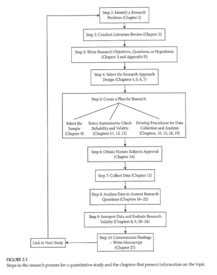
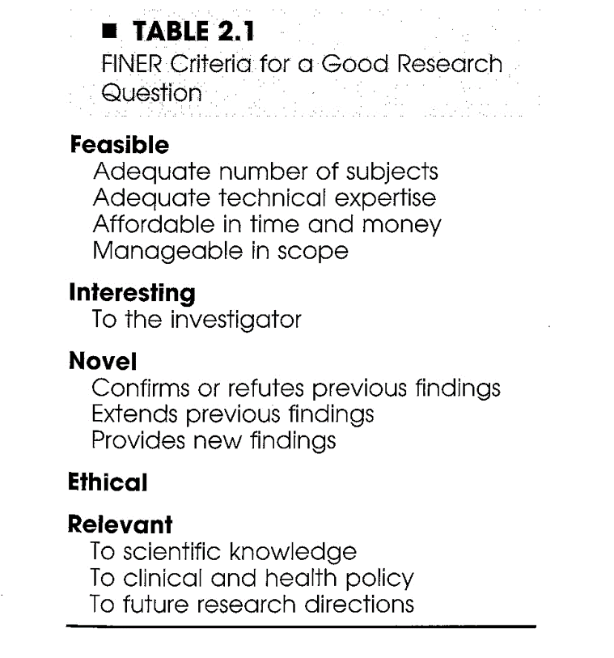
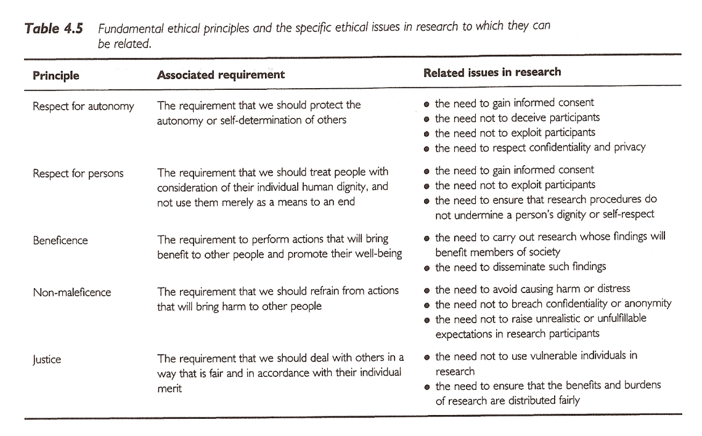
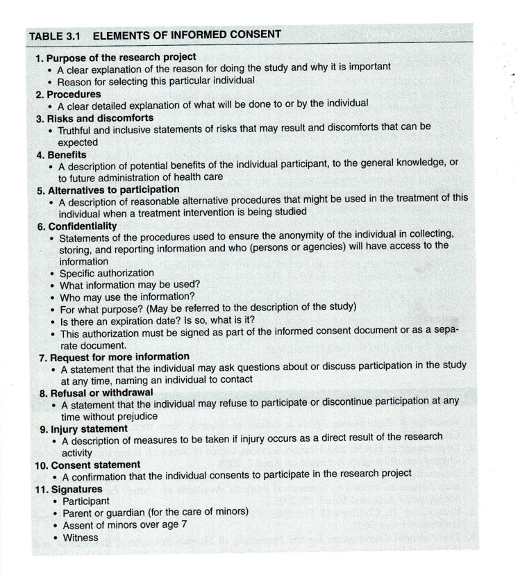

```{r echo=FALSE}
source("prelims.R", echo=FALSE)
```

***
`r read_text("objectives02")`

***
`r read_text("readings02")`

***
### Planning a Research Project 




***
### Planning a Research Project 

+ Step 1 ? Identify a research problem
+ What is a research problem?
+ Sources of research problems ?
	+ Existing research literature
	+ Theory
	+ Personal experience
	+ Clinical observation


***
### Planning a Research Project 

+ Characteristics of a good research problem?
	+ Broad vs Narrow
	+ Widespread vs Limited interest
	+ Well-researched vs Unknown territory


***
### Planning a Research Project 

+ Considerations in Choosing a Topic
	+ Interest and enthusiasm
	+ Time
	+ Cost
	+ Scope of the problem
	+ Contribution to the profession
	+ Support and expertise
	+ Access issues/human subjects
	+ Degree of control
	+ Design considerations
	+ Values and comfort level of the researcher

Cottrell & McKenzie. *Health Promotion & Education Research Methods* . 2005.

***
### Planning a Research Project 

+ What should NOT drive picking a research question
	+ A specific research methodology
	+ A specific funding opportunity
	+ A publication-focused motivation

***
### Planning a Research Project 

+ Importance and feasibility of the research question
	+ ?So What? test
	+ Is the question answerable?
	+ Is it feasible?

***
### Planning a Research Project 

+ Characteristics of a good research project
+ FINER
	+ Feasible
	+ Interesting
	+ Novel
	+ Ethical
	+ Relevant

Hulley, Cummings, Browner, Grady, Hearst, & Newman. *Designing Clinical Research* . 2001.

***
### Planning a Research Project 


Hulley, Cummings, Browner, Grady, Hearst, & Newman. *Designing Clinical Research* . 2001.



***
### Planning a Research Project 

+ Step 2 ? Conduct literature review
+ Purposes of literature review
+ What a literature review is NOT ?
+ What a literature review is ?
+ Sources to be used in literature review

***
### Planning a Research Project 

+ Reviewing the literature
	+ What is known
	+ What questions remain
	+ Evaluating research reports
		+ Journal quality
		+ What is the study about?
		+ Are the results of the study valid?
		+ Are the results meaningful?
		+ What does it all mean and how does it contribute to what you want to do?

***
### Research Project ? Key Concepts 

+ Variables
	+ Independent variables
		+ Active or Manipulated
		+ Attribute or Measured
	+ Dependent variables
	+ Extraneous variables

***
### Research Project ? Key Concepts 

+ Research Hypotheses vs Research Questions
	+ Difference
	+ Associational
	+ Descriptive
+ Analyses associated with each type of RH/RQ

***
### Clinical Research Introduction 


### Research Ethics 

+ Basic sources of research ethics
	+ Professional codes
	+ Government regulations
	+ Institutional policies
	+ Personal convictions and responsibility
	+ Mentors

***
### Research Ethics 

+ Integrity of the researcher
	+ ?The buck stops here?
+ Protection of human rights in clinical research
	+ Guiding Principles (Belmont Report)
		+ Autonomy of each individual
		+ Beneficence
		+ Justice
	+ Use of control groups

***
### Research Ethics 

+ Central issues in research ethics
	+ Informed consent
	+ Privacy and confidentiality
	+ Anonymity
	+ Deception
	+ Risk of harm
	+ Exploitation
+ Vulnerable populations

***
### Research Ethics 


Sim & Wright. *Research in Health Care* . 2000.




***
### Research Ethics 

+ Institutional Review Board
	+ Purpose
	+ Composition
	+ Responsibilities
+ Elements of Informed Consent
	+ Information elements
	+ Consent elements
	+ Authorization

***
### Research Ethics 


Portney & Watkins, 2009.


***
### Research Ethics 

+ Other research ethics issues
	+ Scientific misconduct
	+ Conflict of interest
	+ Reporting research results
		+ Plagiarism
		+ Duplication
		+ Fragmentation
		+ Authorship
	+ Use of animals in research

***
### Research Ethics 

+ NIH definition (NIH Catalyst, 2001)
+ Scientific/research misconduct is ?
	+ Fabrication ? inventing data or results
	+ Falsification ? manipulating research materials, equipment, or processes, or changing or omitting data or results
	+ Plagiarism ? appropriation of ideas, processes, results, or words of another person without giving appropriate credit

***
### Research Ethics 

+ Training ?
	+ CITI training ? used by multiple institutions
+ IRBs ?
	+ UMKC IRB
	+ IRBs at other institutions (CMH, St. Luke?s ?)
+ Research committees ?

***
### Assignment #1 

+ Complete the UMKC IRB training.
+ Get to this from the UMKC Research Support page
+  http://www.umkc.edu/ors/irb/training.cfm
+  http://www.citiprogram.org/
+ Select ?Group 1 ? Biomedical Investigator?
+ Send a copy of the Certificate of Completion to Dr. Gerkovich ( gerkovichm@umkc.edu ); this copy will be kept by me so make sure to also print out a copy for your own file.

[http://www.umkc.edu/ors/irb/training.cfm](http://www.umkc.edu/ors/irb/training.cfm)
[http://www.citiprogram.org/](mailto:gerkovichm@umkc.edu)
[gerkovichm@umkc.edu](http://www.citiprogram.org/)


***
`r read_text("hw02", fri[2])`

***
`r read_text("discussion02", fri[2])`

***

### Additional slides