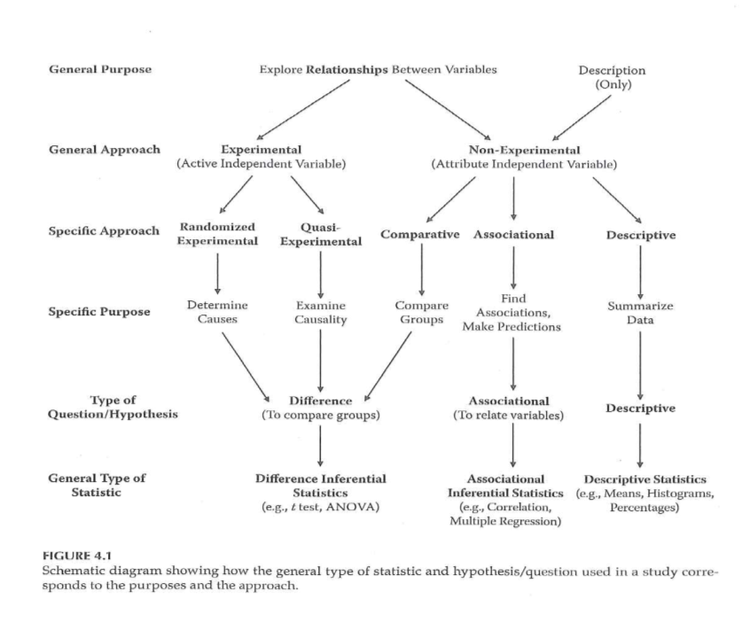

```{r echo=FALSE}
source("prelims.R", echo=FALSE)
```

***
`r read_text("objectives02")`

<div class="notes">

Welcome back. Here's what we plan to cover in this video.

</div>

***
`r read_text("readings02")`

<div class="notes">

If you haven't done these readings yet, please do so before continuing with this video.

</div>

***
### Planning a Research Project 


<div class="notes">

This figure from your book provides a nice overview of the research process. The first two steps, identifying a research problem and conducting a literature review are steps we will discuss today. The remaining steps are topics for later weeks. This table includes the chapters associated with each step.

The process is for a quantitative study, but it still matches the process that you would use for a qualitative study.Certainly the literature review, setting up a research hypothesis (if you have one), and the human subjects review are pretty much the same no matter what the type of study.

`r read_text("gliner-2017-figure-2-1", path="images")`

</div>

***
### Steps in a research project

* Step 1: Identify a research problem
  + Chapter 2 of Gliner et al.
  + Week 2 of this class.
  
<div class="notes">

The first step in this flow chart is to identify your research problem. We talked a bit about this in the first week of class and we will talk a bit more about it this week as well. Keep in mind that there is no approach that is uniformly good or uniformly bad. A good researcher should be comfortable with both qualitative and quantitative methods, with applied and theoretical research, and so forth.

</div>

***
### Steps in a research project

* Step 2: Conduct your literature review
  + Chapter 2 of Gliner et al.
  + Various web resources.
  + Week 3 of this class.
  
<div class="notes">

The second step is to conduct a literature review. This is also covered in Chapter 2 of your book. There are also some very good web resources as well. 

We will cover this topic in week 3. The key thing to keep in mind is that your literature review has to flow. It needs a direction: from general to specific, for example.

</div>

***
### Steps in a research project

* Step 3: Specify your research hypothesis
  + Chapter 3 of Gliner et al.
  + Week 2 of this class.
  + PICO format, PICOTS format
  + Research without a research hypothesis
  
<div class="notes">

The next step is specifying your research hypothesis. Not every research study has a research hyothesis, but it it does, you should structure it using the PICO format (Patient group, Intervention, Control group, and Outcomes). We'll talk more about the research hypothesis and research that does not need a research hypothesis in this week's lecture.

</div>

***
### Steps in a research project

* Step 4: Select your research approach
  + Randomized experiments (Chapter 4, Week 4)
  + Quasi experimental designs (Chapter 4, Week 5)
  + Observational designs (Chapter 6, Week 6)

<div class="notes">

There are three different research approaches that you can choose from. In a randomized experiment, you control who gets what, and you use a random device, typically a computer random number generator. In a quasi-experimental design, you have less control over who gets what, and the choices are made without the benefits of randomization. In an observational study, you do not control the asisgnnment of patients into the groups being studied. These are important topics and I'll be spending three full on them.

</div>

***
### Steps in a research project

* Step 5: Create a plan for your research
  + Sampling issues (Chapter 9, Week 7)
  + Measurement issues (Chapters 10-12, Week 8)

<div class="notes">

Your research plan should mention how you get your sample, which we will cover in Week 7 and how you measure variables, which we will cover in Week 8.

</div>

***
### Steps in a research project

* Step 6: Obtain ethical approval
  + Chapter 14 of Gliner et al.
  + Week 2 of this class.
  + Think about ethical issues from the very start.
  
<div class="notes">

Your book places the material on ethical improvement fairly late in the book, but we will cover it very early (this week) because ethical conduct will often influence choices in your research hypothesis and yours research design.


</div>

***
### Steps in a research project

* Step 7: Collect your data
  + Chapters 13, 15.
  + Week 9.
  
<div class="notes">

Collecting your data takes a lot of time and if you don't plan for this well, a lot of the time will be wasted in rework.

How you collect your data will depend in a large part on what type of data you collect. Qualitative data, of course, is in a world all it's own. Within quantitative data, though, you need to think about collection issues for self-report data versus investigator collected data. A codebook is vital, especially if you are doing the data entry yourself.

</div>

***
### Steps in a research project

* Step 8: Analyze your data
  + Chapters 16-22 of Gliner et al.
  + Week 10, 12 of this class.
  
<div class="notes">
 
This class is not a course in data analysis, but I do want to give you enough information so you can write a decent data analysis plan. You'll learn about the foundations of inferential statistics and five common modeling approaches (linear regression, logistic regresion, analysis of two by two crosstabulations, analysis of variance, and survival models)

</div>

***
### Steps in a research project

* Step 9: Interpret your data
  + Chapter 8, 9, 20-23 of Gliner et al.
  + ... and evaluate research validity
  + Week 13.
  
<div class="notes">

You'll get an overview of how to interpret your data analyses and evaluate the validity of your research. This includes how to write a good discussion secton about the strengths and weaknesses of your study as well as directions for future research.

</div>

***
### Steps in a research project

* Step 10: Communicate your findings
  + Chapter 26 of Gliner et al.
  + Week 14.
  + Written paper
  + Oral presentation
  + Poster presentation
  + Research grants
  
<div class="notes">

Research is not complete until you disseminate your findings. The different formats (written paper, oral presentation, and poster presentation) have fairly standardized formats. You'll also get an overview of how to write a research grant.

As the class goes along, if there is a particular topic that you want me to spend more time on, I'm happy to do it.

If I can brag here a bit, there is no one in the Kansas City area who understands the research process as well as I do. There are some very good people, including Mary Gerkovich, who I have leaned on to produce this class. There are people who have greater depth--they know more about one or two areas than I do. But no one else has the breadth of knowledge that I do. It comes in part with being old. There's nothing that I haven't seen before. Also a big part of it is that I understand the research process from a very fundamental  and foundational level.

</div>

***
### Step 1 - Identify a research problem

Definitions are vague

  + What is a research problem? question? aim? goal?
  
* Sources of research problems

	+ Read

	+ Listen
	
	+ Observe

<div class="notes">

There are varying terms: research problem, research question, research aim, research goal, that all involve stating in very general terms what you can do.

These represent statements about issue the you are trying to address, or what are you trying to discover.

I find these distinctions annoying, and prefer to talk only about a research hypothesis. We'll get to that in a bit.

You can find your research problem during your literature review. You can look at replicating someone else's work or extending it into a new area.

Pure replications are rare because of resource limitations, but there is a lot of research showing that many important research findings are not replicable.

You may also get good research ideas from attending other research presentations, such as thesis defenses of your fellow students or at regional/national conference.

You may hear about topics in the classes that you take.

[[Describe my research interests]]

If you are already working, what comes up in that environment? 

Community or participatory research is another way to develop research ideas. You ask people who are affected by the research you are thinking about doing what they think would work. It forces you to distill your ideas and explain them at a lay person's level. It also requires great listening skills and an open mind.

</div>

***
### Characteristics of a good research problem

* More dichotomies
	
	+ Broad vs Narrow
	
	+ Widespread vs Limited interest
	
	+ Well-researched vs Unknown territory

<div class="notes">

A good research problem. How broad versus narrow? Narrow enough to be feasible, but broad enough to be of interest to a large audience. 

[[Think about research as a series.]]

It still has to be interesting to you, of course.

Do you want to be a big fish in a small pond or a small fish in a big pond.

If your area is fairly new, 

Conferences great for identifying new areas that have not been studied extensively.

Beware. Little research in that area could mean that there is little value in that research.

If there is a lot of research, is there a gap that you can fill?


</div>

***
### Considerations in Choosing a Topic

* Interest and enthusiasm
* Time/Cost
* Scope of the problem
* Contribution to the profession
* Support and expertise
* Access issues/human subjects
* Degree of control
* Design considerations
* Values and comfort level of the researcher
  + Cottrell & McKenzie. *Health Promotion & Education Research Methods* . 2005.

<div class="notes">

Don't let your enthusiasm blind you.

Timing is especially important in this program. Prospective studies and especially prospective longitudinal studies take more time than you may have available.

Contribution to the profession addresses the "so what" question. Is it going to be publishable. You shouldn't be obsessed about publication, but it is a marker of whether

Resources go beyond the financial. Do you have the right expertise or do you have access to colleagues who have that expertise. The era of the "Lone Ranger" scientist is long gone.

Can you get the data you need?

What level of control do you have? If oyu don't have control, do you have a "champion" in all of the areas that you need help in.

Design considerations.

Think about what happens if the results do not turn out they way you "want" them to. There is a myth that researchers are fully disinterested, but you have to think about your responsibilities of sharing information even if it is not what you wanted.

</div>

***
### Planning a Research Project 

+ What should NOT drive picking a research question
	+ A specific research methodology
	+ A specific funding opportunity
	+ A publication-focused motivation

<div class="notes">

Don't get stuck in a rut with a single research methodology. Funding is great, but don't fit your square research idea into a round funding hole.

Publications are important, but the goal is not publication but making a substantive contribution to the field.

</div>

***
### Planning a Research Project 

* Importance and feasibility of the research question
	+ "So What" test
	+ Is the question answerable?
	+ Is it feasible?

<div class="notes">

NIH talks about "significance" in its grants review process. Importance, critical barrier to progress. Improve scientific knowledge, technical capability and/or clinical practice.
   
Explain how your field will change if the aims of the proposed project are achieved. What is the value beyond this study itself.

Type III error. Collecting data that does not answer your research question.

</div>

***
### Planning a Research Project 

Hulley, Cummings, Browner, Grady, Hearst, & Newman. *Designing Clinical Research* . 2001.

<div class="notes">

Think about these five criteria while designing a study.

</div>

***
### Planning a Research Project 


<div class="notes">

+ Characteristics of a good research project
+ FINER

	+ Feasible
	
	Subjects
	
	Expertise
	
	Time
	
	Money
	
	Scope: Don't bite off more than you can chew. Take baby steps.
	
	+ Interesting
	
	Don't waste time on somthing that doesn't appeal to you.
	
	+ Novel
	
	Confirm or refute existing findings.
	
	Extend
	
	Impact on the community.
	
	+ Ethical
	+ Relevant

Hulley, Cummings, Browner, Grady, Hearst, & Newman. *Designing Clinical Research* . 2001.


</div>

  + A research hypothesis is more specific than any of these.
  
* Identify your research hypothesis early.

  + P = patient
  
  + I = intervention
  
  + C = comparison
  
  + O = outcome

* Your hypothesis may change as you delve deeper.

* Not all research needs a hypothesis.

  + Estimation
  
  + Identification

***
### Conduct literature review 

+ Step 2: Conduct literature review
+ Purposes of literature review
+ What a literature review is NOT ?
+ What a literature review is ?
+ Sources to be used in literature review

<div class="notes">

What has already been done and what hasn't. You need to make a strong argument that your work hasn't already been done.

It helps you identify what research methods have been used by others. These are probably the best choices for your research.

It is not an annotated bibliography. An annotated bibliography is great for other areas. Don't talk about each paper in isolation. 

Your interpretation of the relevant literature. Analysis, evaluation, and synthesis. Last paragraph summarizes everything and leads into the work you plan.

Start with the general and move to the specific. Or state the problem, state what has already been done, and identify what needs to be done.

The Internet is great place to start, and that includes Wikipedia, but it is important to use primary sources whenever possible. If you find an excellent secondary source, take the time to review the primary sources


</div>

***
### Planning a Research Project 

+ Reviewing the literature
	+ What is known
	+ What questions remain
	+ Evaluating research reports
		+ Journal quality
		+ What is the study about?
		+ Are the results of the study valid?
		+ Are the results meaningful?
		+ What does it all mean and how does it contribute to what you want to do?

<div class="notes">

Portney and Watkins.

Think about the research methods, the samples they collected. Evaluate the quality of the source. Peer-reviewed articles are the place to start out with. 

Don't rely just on the abstract.

Do you feel that the author's interpretation is supported by their data. Did they discussion limitations and are those limitations relevant to you. Have they placed their results in a bigger context?

Don't accept everything blindly just because it has been published. Become critical evaluators. Note that critical means more than just criticizing, though.

</div>

***
### Research Project - Key Concepts 

+ Variables
	+ Independent variables
		+ Active or Manipulated
		+ Attribute or Measured
	+ Dependent variables
	+ Extraneous variables

<div class="notes">

An active independent variable can be manipulated and is suited for experimental studies. Atrribute independent variables cannot be manipulated and .

Dependent, outcome, criterion are all the same.

Extraneous (covariates) are not of direct interest but which can influence your outcome.

</div>

***
### Research Project ? Key Concepts 

+ Research Hypotheses vs Research Questions
	+ Difference
	+ Associational
	+ Descriptive
+ Analyses associated with each type of RH/RQ

<div class="notes">

A research hypothesis differs from a research question is that it makes a prediction.

Hypothesis could be based on your work and other peoples work or based on theoretical understanding.

Directional hypothesis.

Associational implies a relationship but not necessarily that one causes another.

</div>

***
### Clinical Research Introduction 



<div class="notes">

Experimental, quasi-experimental, and certain observational studies (comparative observational studies) will tend to use inferential statistics like t-tests and ANOVA. Other observational studies (associational observational studies) will rely on correlations instead. Note that this table places regression models in the associational column, but regression models (linear regression, logistic regression, and Cox regression) straddle the line between inferential and associational analysis. Some observational studies are purely descriptive and these lend themselves towards univariate summarizes (means and percentages). Note also that although confidence intervals find their place in descriptive studies, they also are useful for associational and inferential studies.

</div>

***
### Research Ethics 

+ Basic sources of research ethics
	+ Professional codes
	+ Government regulations
	+ Institutional policies
	+ Personal convictions and responsibility
	+ Mentors

<div class="notes">

We are starting this process early on because you need to think about ethical issues very early in the design. Don't force a discussion of ethical considerations late in the process when the design has been finalized.

Treat your research projects as if you are going to have to testify about them. 

The Price article get into this. The Charles Lids article is also relevant.

</div>

***
### Research Ethics 

+ Integrity of the researcher
	+ "The buck stops here"
+ Protection of human rights in clinical research
	+ Guiding Principles (Belmont Report)
		+ Autonomy of each individual
		+ Beneficence
		+ Justice
	+ Use of control groups

<div class="notes">

Belmont report talks about autonomy. Keep in mind vulnerable populations. Beneficence. Balancing risks and benefits. Justice, fairness. Equitable distribution of benefits and risk. Don't limit risk to a group of people who have less power and less influence.

Use of control groups (see Chen article)

Does anyone recognize the name Andrew Wakefield?

How the nature of control trials has changed because of the AIDS trials.

More recently, the add-on designs, such as in herbal therapies, where both the herbal remedy and the placebo are given in addition to the standard treatment.

</div>

***
### Research Ethics 

+ Central issues in research ethics
	+ Informed consent
	+ Privacy and confidentiality
	+ Anonymity
	+ Deception
	+ Risk of harm
	+ Exploitation
+ Vulnerable populations

<div class="notes">

Informed consent is more than the information. It is the entire process.

Passive consent is an option for some studies.

Pediatric studies have both assent (from the child) and consent (from the parent) because under a certain age (usually 18), you do not have legal authority to provide consent.

What information you get and how you treat it.

That's not the same as anonymous information.

Deception, especially in the area of Social Psychology, has fallen out of favor research. Previous examples of deception (the shocking of patients, )

Okay if information would undermine the goals of the experiment, but you need to disclose the 

Some level of risk or discomfort might be okay. Think of harms broadly, including monetary harm, legal harm. Make counseling available if people need it.

Certificate of confidentiality can help here.

People should not be guinea pigs. We should respect the contribution that people who volunteer to provide to us.

You should not exploit vulnerable populations (e.g., prisoners).

</div>

***
### Research Ethics 


<div class="notes">

Autonomy implies informed consent, no deception. Don't share information without permission from the patient. Compliance study requires honesty and we can't "tattle" on them.

Sim & Wright. *Research in Health Care* . 2000.

</div>

***
### Research Ethics 

+ Institutional Review Board
	+ Purpose
	+ Composition
	+ Responsibilities
+ Elements of Informed Consent
	+ Information elements
	+ Consent elements
	+ Authorization

<div class="notes">

Purpose to review research to insure that the rights of the participants is protected.

At least five members, mix of gender, race/ethnicity, background. At least one member who is a member of the public.

Review proposals, ask questions, request information.

Focus on scientific, investigator qualifications, risks, feasible, compensation should not be coercive.

Does the consent form contain all the information needed? Is the recruitment process okay.

Expedited or exempt review. This is a choice made by the IRB and not by you alone.

</div>

***
### Research Ethics 


<div class="notes">

Portney and Watkins. Items 1-7 are information components. Assure them that they are not pressured. Items 8-10 are consent components.

Authorizing portion is item 11. Most IRBs have sample consent forms.

Issues associated with compensation and Social Security Numbers. This varies from institution to institution.

Portney & Watkins, 2009.

</div>

***
### Research Ethics 

+ Other research ethics issues
	+ Scientific misconduct
	+ Conflict of interest
	+ Reporting research results
		+ Plagiarism
		+ Duplication
		+ Fragmentation
		+ Authorship
	+ Use of animals in research

<div class="notes">

Misconduct has been in the news recently.

Conflict of interest. Are you conducting a research project where you might have a financial benefit.

Issues associated with senior authorship. What earns you the right to be an author. Defend and explain the role of that person on the project. What did that person contribute?

Acknowledge external support.

IACUC. Institutional Animal Care and Use Committee.

Show UMKC Financial Disclosure Form. Journal disclosure form.

Show funders of projects and disclaimer.

Show example of plagiarism.

</div>

***
### Research Ethics 

+ NIH definition (NIH Catalyst, 2001)
+ Scientific/research misconduct is ?
	+ Fabrication ? inventing data or results
	+ Falsification ? manipulating research materials, equipment, or processes, or changing or omitting data or results
	+ Plagiarism ? appropriation of ideas, processes, results, or words of another person without giving appropriate credit

<div class="notes">

Uniform definition: fabrication, falsification, plagiarism.

Note that when you review a paper or grant, You cannot use any ideas, words, results, or processes from that paper or proposal.

Example of NIH report of research misconduct.

The penalties are fairly severe.

</div>

***
### Research Ethics 

+ Training ?
	+ CITI training - used by multiple institutions
+ IRBs
	+ UMKC IRB
	+ IRBs at other institutions (CMH, St. Luke's)
+ Research committees

<div class="notes">


</div>

***
### Landmarks in research ethics

* Nuremberg code

* Declaration of Helsinki

* Belmont report

* Title 45 of the Code of Federal Regulations, Part 46 (1974)

* HIPAA

<div class="notes">

It helps to have a brief understanding of some of the historical milestones in research ethics.

The Nurembery code was developed in 1947. It is a bit dated today, but many of the basic concepts are foundational to later work.

The relevant portions of the law mandating ethical review of any federally funded research (45 CFR 46) was written in 1974.

</div>

***
### Questions to ask

* Is it research?

* Does it involve human subjects?

***
### Ethical issues

* Conflict of interest

* Unfavorable risk/benefit ratio

* Loss of equipoise

* Deception

* Violating privacy

* Violating confidentiality

<div class="notes">

</div>

***
### Fraud in research

Fraud falls into three broad categories (FFP).

* Fabrication

* Falsification

  + Data alteration

  + Misreporting

* Plagiarism.

Note: A difference of scientific opinion does not mean that one party is behaving fraudulently.

<div class="notes">


</div>

***
### Research misconduct (other than fraud)

* Inappropriate authorship

  + Leaving off deserving authors
  
  + Ghost writing
  
  + "Honorary" authorship

* Violation of confidentiality

* Sabotage

* Failure to report misconduct

* Retaliation

<div class="notes">


</div>

***
### Whistle blowing

* Failure to report research misconduct is research misconduct

* There is more than one avenue for reporting misconduct

  + Do nothing.
  
  + Talk with the person directly.
  
  + Talk to some of your peers.
  
  + Talk with your own supervisor.
  
  + Talk to a person higher up in the organizational structure
  
  + Report a complaint anonymously.

* No retaliation for legitimate complaints.

<div class="notes">

When you witness research misconduct, you have an obligation to report it. Failure to report research misconduct is itself research misconduct. This is very difficult, of course, if you find yourself in a position subordinate to the person who is behaving badly.

If you experience something that you feel is not right, you have the option of doing nothing. That's a risky option, but if you feel that all the other options are riskier, I, for one, would understand. Depending on the dynamics, you might consider talking to the offending party directly. You might ask your peers or your own supervisor (assuming that they are not parties to the misconduct allegation) or someone higher up in the organizational structure than the offending party. Most organizations have an ombudsperson who you can talk to. An ombudsperson will never divulge information without your permission. Your organization may also have other anonymous reporting avenues.

If you do talk to someone, please be open to the possibility that you may just be misunderstanding the situation.

There are protections for whistleblowers, but that does not always protect you against retaliation. I've never found myself in a situation where I have observed research misconduct, so I can't offer too much advice.

</div>

***
### Assignment #1 

+ Complete the UMKC IRB training.
+ Get to this from the UMKC Research Support page
+  http://www.umkc.edu/ors/irb/training.cfm
+  http://www.citiprogram.org/
+ Select Group 1 Biomedical Investigator
+ Send a copy of the Certificate of Completion to Dr. Simon (simons@umkc.edu ); this copy will be kept by me so make sure to also print out a copy for your own file.

[http://www.umkc.edu/ors/irb/training.cfm](http://www.umkc.edu/ors/irb/training.cfm)
[http://www.citiprogram.org/](mailto:gerkovichm@umkc.edu)
[gerkovichm@umkc.edu](http://www.citiprogram.org/)

<div class="notes">

Due before the week 3 class session. If you have already completed this training, send documentation.

</div>

***
`r read_text("hw02", fri[2])`

<div class="notes">


</div>

***
`r read_text("discussion02", fri[2])`

<div class="notes">


</div>