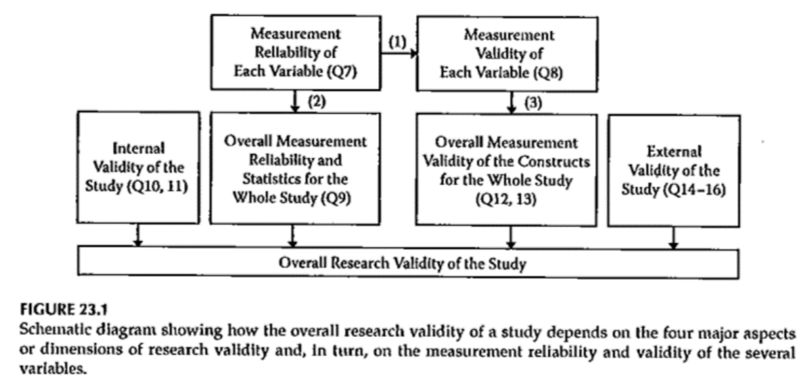
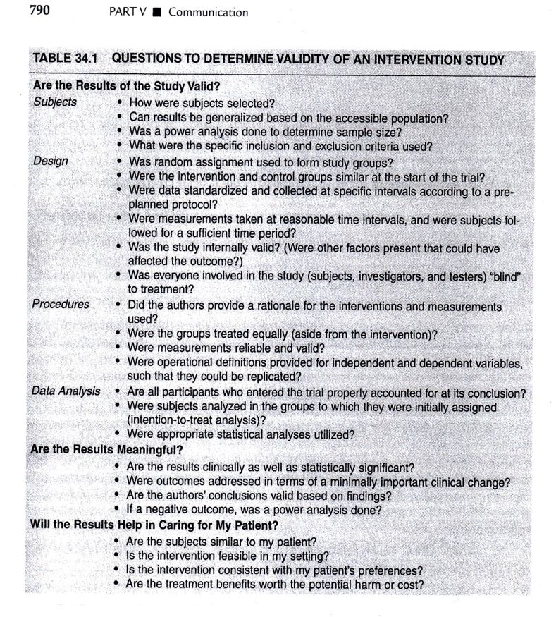

```{r echo=FALSE}
source("prelims.R", echo=FALSE)
```

***
`r read_text("objectives03")`

<div class="notes">

This is what we will cover this week.

</div>

***
`r read_text("readings03")`

<div class="notes">

Here are the readings for this week. If you have not read these yet, please do so before viewing this video.

</div>

***
### What is a literature review 

Definition (from your book): "An interpretation of a selection of documents (published or unpublished) on a specific topic that involves summarization, analysis, evaluation, and synthesis of the documents."

<div class="notes">

Take a careful look at this definition.

A literature review involves summarization. You take a ten page research article and boil it down to one or two sentences.

It involves analysis. You need to gain an understanding of what is in each research paper.

It involves evaluation. You need to assess the validity of the research papers. This is synonymous with the critical appraisal step in Evidence Based Medicine.

It involves synthesis. You have to combine your knowledge of each individual study into a cohesive structure.

What all of this means is that you have to live and breath these studies. You can't summarize, analyzie, evaluate, or synthesize with only a superficial understanding of these papers.

</div>

***
### Why do a literature review?

0. Because you have to.

(From your book)

1. "Identify gaps in the literature"

2. "Help to select appropriate methods for your new topic"

3. "Describe the inferences that have come from past research"

4. Other reasons???

<div class="notes">

A literature review is a requirement for pretty much any research paper or presentation, for any IRB proposal, or for any grant proposal. 

A literature review can and should influence your work. Even if you already have a strong idea of what you plan to do, keep an open mind about the direction of your research while doing the literature review. The literature review might change your mind about what is known and where the gaps in knowledge area. It may suggest an alternative research design or data analysis approach than you had first thought about. And it may change your impression of what the current state of knowledge is.

Even if the literature review does not help you, it is still of value to anyone who has to read and evaluation your research proposal. It gives them some background so they can understand the magnitude of the problem you are addressing, and what has been done and what still needs to be done to solve this problem.

</div>

***
### Contrasts to the literature review

* Annotated bibliography

  + Also requires summarization
  
  + Often requires analysis and evaluation
  
  + Lacks synthesis (no organization)

  + Strives for completeness

<div class="notes">

Let me mention a couple of things that have some similarities to a literature review, but which also have important differences.

An annotated bibliography is a great thing. It provides a fairly complete set of references with a brief summary of each reference. 

If you are thinking of starting a website or blog, consider developing an annotated bibliography. It will be a very popular resource because people want to know what they are going to click on before they actually click. It's also a lot easier to develop an annotated bibliography rather than your own original content.

Like a literature review, an annotated bibliography requires summarization. Usually the summaries are a bit longer in an annotated bibliography. In fact, in a literature review, if you find three articles that say the same thing, you lump them all together and talk about them as if they were one.

Annotated bibliographies are also like literature rviews in that most of them provide an analysis and evaluation of the articles.

The big difference is that an annotated bibliography does not try to synthesize the articles. It discussed each article individually, but does not try to organize them in a narrative flow (we'll talk about organizaiton in just a bit).

The other difference is that an annotated bibliography, you usually try to be comprehensive in the studies you cite. In a literature review, if you find one or two articles that make a particular point, then you don't typically need or want to include others as well.

</div>

***
### Contrasts to the literature review

* Systematic overview

  + Systematic

  + Exhaustive search
  
  + Usually a quantitative summary
  
  + Lacks synthesis
  
<div class="notes">

A systematic overview (often called a meta-analysis, though there is a subtle distinction between the two) also has some similarities to a literature review.

The first distinguishing feature of a systematic overview is that it is systematic. It follows a pre-specified structure from a detailed protocol.  You require such rigidity because you want a systematic overview to be repeatable. With a literature review, you change how you search for articles and how you evaluate them as you go along. It is a very ad hoc approach.

A systematic overview attempts to get all studies related to a particular research hypothesis and this hypothesis is usually drawn more narrowly than a literature review. In a literature review, by contrast, you might talk first about defining stuides that define the magnitude of your health care problem and then switch to interventions that have been tested in your area. The systematic overview is likely to consider only studies within a certain time range, but your literature review might provide some much earlier studies to provide some historical context.

Systematic overviews often contain a quantitative summary (the meta-analysis) while literature reviews almost always use a qualitative approach.

Systematic overviews do not consider any synthesis (other than the quantitative summary) and just toss all of the studies into a big pot and stir.

The other distinction is that a systematic overview works with an almost obsessive fervor to identify every possible study in a topic. One of the greatest threats to the validity of a systematic overview is publication bias, and you have to work very very hard to overcome this.

For what it's worth, there has been a call in the research community to replace the literature review with a systematic overview for the benefit of an IRB submission. The systematic overview would establish whether sufficient evidence has already accumulated to make the proposed research unnecessary (and therefore unethical). This suggestion has not really been adopted anywhere, as far as I know, but it is interesting.

</div>

***
### Finding sources for your literature review

* Talk to a librarian

* Specify your score

* Find a good summary

* Talk to a librarian

* Snowball sampling

* Iterate between writing and searching

* Talk to a librarian

* Organization: note cards, spreadsheet

* Talk to a librarian

<div class="notes">


</div>

***
### Summarizing

* No direct quotes.

* Contextual clues

  + Also, in addition
  
  + However, on the other hand
  
<div class="notes">

This is not a hard and fast rule, but you generally want to avoid direct quotes in a literature review. In other places, direct quotes are fine, but in a literature review, it makes the writing unwieldy. 

Make sure that your discussion of one study is placed in context with the discussion that directly preceded it. If the study is providing further support to the results of the previous study, emphasize this with words like "also" or "in addition". If the study contrasts or contradicts the previous study, emphasize this using words like "in contrast" or "on the other hand".

</div>

***
### Example of contextual words

"Dosage compensation in mammalian females is a recognized phenomenon whereby inactivation of one X chromosome ...[1]. **However,** not all X-linked genes are inactivated. Recently, an inactivation profile...was reported by Carrel and Willard [2]. ... **Subsequently**, Lyon [3] ... enhanced our knowledge about X-chromosome inactivation..."

  + Talebizadeh et al. X chromosome gene expression in human tissues: Male and female comparisons. Genomics 2006.

***
### Example of descriptive and comparative analysis

"African Americans represent nearly 45% of new HIV cases each year (1–2). Due to delayed HIV diagnosis, African Americans tend to enter HIV treatment at advanced stages and die from AIDS sooner than Whites (1)."

  + Berkley-Patton et al. An HIV Testing Intervention in African American Churches: Pilot Study Findings. Ann Behav Med. 2016. 
 
<div class="notes">

This is a nice example of description where you provide an estimate (45%) followed by a comparison (advance stages, die sooner).

</div>

</div>

***
### Example of descriptive analysis

"Studies suggest many African American faith leaders are willing to provide HIV education ...(14–17); however, their reported challenges in doing so have included church capacity issues (e.g., lack of HIV training, church-appropriate HIV materials, time, and resources), controversial church issues (e.g., condom use, premarital sex, homophobia), and HIV stigma (18–22)."

  + Berkley-Patton et al 2016. 
 
<div class="notes">

This is a nice example of a descriptive result where you mention a list of features.

Don't feel that you have to follow these writing guidelines slavishly. Use them if you are not sure how to proceed, but if you are making good writing progress without these guidelines, then ignore them.

</div>

***
### Analyzing

* More than just the abstract

  + Inconsistencies with main text
  
  + Misplaced emphasis in abstract

* Research types

  + Comparative
  
  + Associational
  
  + Descriptive (Estimate, Identify)
  
<div class="notes">

Most research involves comparison, so try to use words that emphasize superiority like "improved" or "better" or that emphasize comparability like "similar" or "equivalent".

Don't try to be dispassionate in your analysis. It is okay to invoke emotions like surprise or disappointment. Provide guidance to magnitude with phrases like "substantial change" or "moderate improvement"

Your analysis will be quite different, of course, for descriptive studies. For these, you offer an estimate (such as "1.2 million people in the United States have diabetes") or list one or more features of a group (such as "the most commonly used drugs in transplant patients to prevent rejection are calcineurin inhibitors, antiproliferative agents, and steroids").

</div>

***
### Evaluating

<div class="notes">


</div>

***
### Synthesizing

* Organization of a literature review

  + Chronologic (warning: can be boring!)

  + From general to specific

  + Thematic

<div class="notes">

One way of organizing your review might by chronological. This is appealing if new theories or new approaches emerge over time. But beware, becuase a chronological list can sometimes come across as dull.

The approach I like best (and your book also likes it) is to move from the general to the specific.

</div>

***
### Example of general to specific

1st paragraph. "African Americans represent nearly 45% of new HIV cases each year (1–2)."

2nd paragraph. "The Black Church is a powerful institution with a history of mobilizing African American communities for social change (5)..."

3rd paragraph. "Studies suggest many African American faith leaders are willing to provide HIV education and testing for their church/community members (14–17)..."

  + Berkley-Patton et al 2016. 

***
### Synthesizing

* Possible themes

  + Consensus, disagreements, the unknown
  
  + Problem, old remedies, new needs
  
  + Supportive, then non-supportive
  
  + Methodologies, theories, schools of thought

<div class="notes">

There are more possible themes than I could mention, but here are a few examples. 

Start with consensus (questions where everyone agrees on the correct answer), then list disagrements (questions with debates among competing answers), and end with the unknown (questions with no answers yet).

Or say what the problem is, say what has already been done, and say what needs to be done.

Or offer a thesis and group your references into two sections, articles that are supportive of your thesis and articles that are not supportive.

You might organize your articles into groups sharing common methodologies. In a study of mitigation of home exposures that might exacerbate asthma, the studies might be grouped by those that study a physical intervention (like improved ventilation) and by those that study a chemical intervention (spraying for dust mites). 

In a review of behavioral change, you might organize articles by the different theories of change (Lewin, Rogers, or Spradley) that they rely on. Likewise, there are four schools of thought on management (biologic, chaotic, deterministic, and empircal).

Some studies of child welfare management might utilize the attachment theory while others might use crisis intervention theory or social construction theory.

</div>

***
###

+ Step 2: Conduct literature review
+ Purposes of literature review
+ What a literature review is NOT ?
+ What a literature review is ?
+ Sources to be used in literature review

<div class="notes">

What has already been done and what hasn't. You need to make a strong argument that your work hasn't already been done.

It helps you identify what research methods have been used by others. These are probably the best choices for your research.

It is not an annotated bibliography. An annotated bibliography is great for other areas. Don't talk about each paper in isolation. 

Your interpretation of the relevant literature. Analysis, evaluation, and synthesis. Last paragraph summarizes everything and leads into the work you plan.

The Internet is great place to start, and that includes Wikipedia, but it is important to use primary sources whenever possible. If you find an excellent secondary source, take the time to review the primary sources


</div>

***
### Planning a Research Project 

+ Reviewing the literature
	+ What is known
	+ What questions remain
	+ Evaluating research reports
		+ Journal quality
		+ What is the study about?
		+ Are the results of the study valid?
		+ Are the results meaningful?
		+ What does it all mean and how does it contribute to what you want to do?

<div class="notes">

Portney and Watkins.

Think about the research methods, the samples they collected. Evaluate the quality of the source. Peer-reviewed articles are the place to start out with. 

Don't rely just on the abstract.

Do you feel that the author's interpretation is supported by their data. Did they discussion limitations and are those limitations relevant to you. Have they placed their results in a bigger context?

Don't accept everything blindly just because it has been published. Become critical evaluators. Note that critical means more than just criticizing, though.

</div>

***
### Literature Reviews 

+ Additional Resources
	+ L.G. Portney & M.P. Watkins. Chapter 34, ?Evaluating research reports.? *Foundations of Clinical Research: Applications to Practice, 3rd ed.* Upper Saddle River, New Jersey: Pearson Prentice Hall.

<div class="notes">

At least one table from Portney and Watkins.

</div>

***
### Literature Reviews 

+ Step 2 ? Conduct literature review
+ Purposes of literature review
+ What a literature review is ?
+ What a literature review is NOT ?
+ Sources to be used in literature review

<div class="notes">

Identify gaps in the literature, select appropriate methods, provide an interpretation and synthesis. It reflects your own understanding of what has been done. 

I hope you become a more critical reviewer of the literature review.

It is not an annotated bibliography.

Look for unpublished research. Use primary sources. Do not trust what someone else says about that article.

Note this is not a formal systematic review. The goal of a systematic review is to be comprehensive.

You will revisit your literature review when you write the discussion section of your paper.

There is a standard format for the literature review for a thesis. This is more detailed than what you might put in a paper.

</div>

***
### Literature Reviews 

+ Reviewing the literature
	+ What is known
	+ What questions remain
	+ Evaluating research reports
		+ Journal quality
		+ What is the study about?
		+ Are the results of the study valid?
		+ Are the results meaningful?
		+ What does it all mean and how does it contribute to what you want to do?

<div class="notes">

How much weight should you place on a particular study. Where was it published? Was it peer-reviewed? Are the results valid? Become a critical reader.

Look beyond statistical significance to practical significance.

</div>

***
### Evaluating Research Validity 

+ Evaluation of the quality of the design and analysis of a study
+ GM&L framework ?
	+ designed to be used with both experimental and non-experimental research
+ Assess research validity
	+ Series of continua
+ Emphasis on methods and results

<div class="notes">

Portney and Watkins Table 34.1 on whether the results of a study are valid.

The authors of your textbook have developed a framework that is suitable for both experimental and observational studies. The emphasis is on methods and results.

</div>

***
### Evaluating Research Validity 

+ GM&L framework ?
	+ 19 questions
	+ 8 rating scales
+ 19 questions <U+F0E8> 3 main groups
	+ Key aspects of the design and methods (1 ? 8)
	+ Evaluative ratings (9 ? 16)
	+ General evaluation questions (17 ? 19)
+ ?? merit or worth of the study as a whole??

<div class="notes">

There is a document on the week 3 folder that consolidates several tables in your book. The first eight questions cover these areas: measurement reliability and statistics, the internal validity of the study, and the external validity of the study. The last three questions get at peer review, journal quality, and clarity of the writing.

You need to evaluated the worth of the study as a whole. No one criteria will condemn a study and no one criteria by itself makes a study credible.

</div>

***
### Evaluating Research Validity 



<div class="notes">

+ GM&L framework document

Second block is on equivalence of groups (control of extraneous factors).

Did the authors overstate the importance of their findings.

"It's great news, if you're a rat."

Building on the work of Campbell and Stanley reference, "What Works", the Campbell Collaboration.

Get at what variables were used as independent and dependent variables.

</div>

***
### Evaluating Research Reports 




<div class="notes">

Portney & Watkins, 2009.

Table 34.1.

Factors that contribute to the overall validity of the study include the individual reliability and validity of variables, and the internal and external validity of the study as a whole.

We will talk about Table 23.2 again later in this class.


</div>

***
### Evaluating Research Validity 

+ Other Options - examples
	+ MEDB 5511 Literature review form
	+ MEDB 5511 .xls template
	+ Proposal literature review file

<div class="notes">

Here are some examples of Excel spreadsheets summarizing literature review.

Setting up columns: Number (write this on the article itself), Citation, Sample, Did they use motivational interviewing, Inclusion criteria, Intervention, Control arm, Outcomes, Findings, Notes.

Second sheet has study design, participants, groups, controls, time, outcome measure, sample size including completers.

Third sheet has a checklist of exclusion criteria.

Adverse event summary, dosing.

This can help you having to constantly refering back to the articles. But you will find yourself going back to the articles when you need more information that is not yet in your spreadsheet.

Medical literature review form for MEDB 5511 (Epidemiology).

Another spreadsheet has primary versus secondary analysis, exposure, primary outcome(s), study sample (broken down by age, sex, and race/ethnicity), sample size, duration of followup, unadjusted results, adjustments for confounders.

PICOTS

</div>

***
### Assignment 

+ Nothing to be turned in next week

+ Work on identifying a research topic you want to work on for the final project .

<div class="notes">

We will doing a session with Sue Sykesbury. You need to start your research review and will soon have to provide a brief summary of your research.

</div>

***
`r read_text("hw03", fri[3])`

<div class="notes">


</div>

***
`r read_text("discussion03", fri[3])`

<div class="notes">


</div>

***

### Additional slides