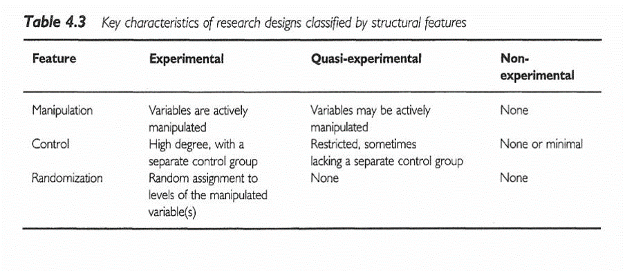

```{r echo=FALSE}
source("prelims.R", echo=FALSE)
```

***
`r read_text("objectives04")`

<div class="notes">

Here are the objectives for this week.

</div>

***
`r read_text("readings04", char_max=800)`

<div class="notes">

This is what you should have read already. If you haven't done the reading yet, pause this video and read this material. You'll get more out of the video if you do so.

</div>

***
### (New)  Cameron and Pauling study of Vitamin C.

* Linus Pauling
  + Two-time Nobel prize winner (Chemisty, Peace)
  + Fervent advocate of mega-doses of Vitamin C
* Non-randomized study of cancer
  + All patients got Vitamin C
  + Ten controls per treated patient
  
* References
  + Cameron E, Pauling L. Supplemental ascorbate in the supportive treatment of cancer: Prolongation of survival times in terminal human cancer. Proc Natl Acad Sci U S A. 1976 Oct;73(10):3685-9. PubMed PMID: 1068480; PubMed Central PMCID: PMC431183.
  + 

<div class="notes">

    Paul Rosenbaum, in the first chapter of his book, Observational Studies, gives a fascinating example of an apples to oranges comparison. Ewan Cameron and Linus Pauling published an observational study of Vitamin C as a treatment for advanced cancer (Cameron 1976). For each patient, ten matched controls were selected with the same age, gender, cancer site, and histological tumor type. Patients receiving Vitamin C survived four times longer than the controls (p < 0.0001).

    Cameron and Pauling minimize the lack of randomization. "Even though no formal process of randomization was carried out in the selection of our two groups, we believe that they come close to representing random subpopulations of the population of terminal cancer patients in the Vale of Leven Hospital."

    Ten years later, the Mayo Clinic (Moertel 1985) conducted a randomized experiment which showed no statistically significant effect of Vitamin C. Why did the Cameron and Pauling study differ from the Mayo study?

    The first limitation of the Cameron and Pauling study was that all of their patients received Vitamin C and followed prospectively. The control group represented a retrospective chart review. You should be cautious about any comparison of prospective data to retrospective data.

    But there was a more important issue. The treatment group represented patients newly diagnosed with terminal cancer. The control group was selected from death certificate records. So this was clearly an apples versus oranges comparison because the initial prognosis was worse in the control group than in the treatment group. As Paul Rosenbaum says so well: one can say with total confidence, without reservation or caveat, that the prognosis of the patient who is already dead is not good. (page 4)

    When the treatment group is apples and the control group is oranges, you can't make a fair comparison.

</div>

### Experimental versus observational

* Experimental: Active independent variable
* Observational: Attribute independent variable
* Who does the choosing?
  + Patients or doctors? = Observational
  + Researcher? = Experimental
* Patients in a randomized trial are giving you a gift.
  
<div class="notes">

One of the major distinctions in research design is experimental studies versus non-experimental (observational) studies. 

Your book makes the distinction through the independent variable. An active independent variable allows for either a experimental or quasi-experimental study. An attribute independent variable makes your study non-experimental. That's your book's term, but I prefer the term observational. It is fairly common in the medical literature. Think of observational as "look but don't touch." You observe patients without meddling with them.

Another way of looking at it is to ask the question "Who does the choosing?" If the patient and/or the doctor has a part in deciding, then the study is observational. If the researcher is the only one who decides, and uses a coin flip to decide, that is a randomized clinical trial.

We owe a great debt of graditude to the volunteers in a randomized clinical trial. They are sacrificing a lot of autonomy over what drug or therapy to choose. And they are ceding that autonomy, not to an expert clinician but to the flip of a coin. That's a truly amazing.

</div>

### Randomized versus quasi-experimental

* Quasi-experimental
  + Logistics prevent randomization
  + Very common in Quality Improvement

<div class="notes">

When you have an active independent variable, you don't always have a level of control that allows for randomization. Usually this is caused by logistical issues. Once you go down a certain path, it is impossible to go back. Or the setting that you are studying, like an emergency room is so chaotic that no one can keep track of a randomization table.

It's easy to sneer at quasi-experimental studies and think of them as an inferior form of research. But they are not, and quasi-experimental designs form the backbone of many quality improvement studies. We'll talk more about this in the following week.

</div>


### How to randomize

* Use of a random device
* Avoid haphazard approaches
* Avoid alternating assignment

<div class="notes">


</div>

### Advantages of randomization

* Insures covariate balance
* Both measured and unmeasured covariates
* Avoids selection bias

<div class="notes">

A covariate is a variable that is not of direct interest in the research, but which could affect the outcome. If a covariate is imbalanced between the two groups you are comparing, that can interfere with your ability to detect whether there is a difference between the treatment and control group.

There was a study that looked at smoking during pregnancy and found the suprising conclusion that smoking reduced the risk of Down Syndrome. Now smoking does a lot of really bad things to you: cancer, hypertension, stroke, heart attacks, etc. So it would be quite surprising to see cigarettes being protective instead of harmful. The researchers knew, however, that this finding was not real. It turns out that younger women are more likely to smoke during pregnancy than older women. This is a covariate imbalance. The smoking group had a much younger average age than the non-smoking group. Down Syndrome occurs much more often among older women than younger. Once you control for mother's age, the protective effect of smoking pretty much disappears.

Covariate imbalance is a big big problem for observational studies. You have to spend a lot of time and energy worrying about it during the planning phase and controlling for it in the analysis phase. We'll talk more about this in a couple of weeks.

The value of randomization is that an older woman is just as likely to find herself in the treatment group as in the control group. So the law of large numbers assures that you will have good covariate balance.

This applies for both covariates that you can measure, like demographics, and covariates that you might not be able to measure, such as number of co-morbidities, psychological state, and severity of the illness at baseline.

There is a different perspective that is worth mentioning here. Covariate imbalance is sometimes caused by selection bias.

Some of the patients in your research study may prefer one or the other of the two completing therapies being studied. The physicians who are managing the patients in your research study may also have a preference for some of their patients. 

If the patients and/or their physicians pay a role, even indirectly, in choosing between the two competing therapies, then you have to potential for selection bias. Patients might differ on key prognostic variables, leading to an biased comparison that might mask a true effect or produce an artefactual effect.

Randomization removes the patient and physician choice and prevents selection bias.

</div>

### Disadvantages of randomization

* Expensive
* Artificial
  + Extra tests, extra attention
  + Explicit acknowledgement of uncertainty

<div class="notes">

There are a fair number of researchers who get very snobbish about randomization. If it's not randomized, it's not real. This is wrong, wrong, wrong.

I wrote a book back in 2006 that talked about critical appraisal. It covered things like blinding, low drop out rates, patient oriented outcome measures, among other things that make a study more persuasive. I wanted to make the point that while all of these things are "nice to have", none of them are "have to have". So at the end of each chapter, I included a counterpoint: blinding is overrated, intention to treat analysis is overrated.

The end of my first chapter was "randomization is overrated." One of the reviewers for my book threw a fit. How dare a statistician criticize randomization! Well, there are lots of criticisms of randomization made by people who are a lot smarter than me. We'll talk about those in a minute. But the belief that we should always fight for randomization is a misguided belief. It sneers at non-randomized studies and claims that these trials are "weak" and should not become part of the evidence base.

Don't get me wrong. I like randomization. I use it whenever I can. I point out when failure to randomize hurts the persuasiveness of a particular research study. But I'd be remiss in my duty if I did not embrace those well designed non-randomized studies and endorse them when they make more sense than a randomized study.

</div>

### When can't you randomize

* In what situations is randomization unethical, impractical, or impossible?

  + Retrospective prayer study. http://www.pmean.com/04/temporality.html

### Wait list control groups

In some settings, people will resist participating in 

### Blinding/partial blinding. Who knew what when?

* Hiding information (not deception)
* Not always possible (bilateral orchiectomy)

<div class="notes">

Blinding is withholding information about which treatment is which during the conduct of a research study. It is not the same thing as deception. You tell the participants in a study that they will not know until after the study ends whether they received the treatment or the control.

Full blinding is not always possible. I have a joke about how blinding is difficult in a study where one of the treatments is a bilateral orchiectomy. Sooner or later the patient notices that something is missing. Even when full blinding is impossible, partial blinding is usually an option. So the patient knows about the treatment, but the person interviewing the patient does not.

</div>
  
### Types of blinding

* Double blind
  + Physician and patient blinded
* Single blind
  + Patient only
* Partial blind
  + Evaluators blinded

<div class="notes">

There is some ambiguity in the terminology, but a double blind study means that neither the patient nor the physician knows what treatment a patient was randomized to. Now someone always knows, but this person is buried deep in the basement of the pharmacy and has no interactions with the patient or treating physician.

In a single blind, only one of the parties is blinded. This is usually the patient. You can't blind a surgery from the surgeon, but you can do things like use an extra large bandage so the patient cannot see the size of the incision.

Even if you can't blind the patient, you should still try to blind the evaluators. So in a surgery trial, don't collect data from the surgeon who performed the operation, but rather from an independent observer who does not know what surgery was assigned to a particular patient.

The blinded evaluator is even an option for non-randomized trials. There was a case control study where the cases had lung cancer and the controls did not. You can't hide lung cancer from a patient, of course. But the person who interviewed the patient did not know and that stopped the interviewer from probing a bit more aggressively for cancer patients. ("Are you sure you've never smoked any cigarettes? Think hard now.")

</div>

### Hawthorne effect

* Series of studies at a GE factory.
  + Any change, no matter what, improved productivity
  + Positive response to attention.

<div class="notes">

Blinding protects against two sources of bias. The first is known as the Hawthorne effect. It was named after a General Electric factory where a series of experiments were run during the 1920s. One of the experiments involved lighting on a factory floor and worker productivity. The researchers would run an experiment where they lowered the lighting level, and every time they did this, productivity shot up. It got to the point where you could almost not see. Then the researchers tried an experiment where the lighting was restored to normal. In that experiment, the productivity went up as well.

This continued with other interventions as well. The workers liked the attention they got whenever the researchers came by and responded with an increase in productivity.

This is part of what is generally called the placebo effect. There's been a lot written about this, and while you do want to control for the placebo effect if you can, it is important to recognize how misunderstood the placebo effect is. 

</div>

### Ascertainment bias

* The tendency to self deception.
  +  "Linus Pauling actively promoted the use of massive doses of vitamin C during the last few decades of his life. He believed it could cure just about anything from the common cold to cancer. During one interview he explained that after he and his family started taking Vitamin C supplements, they never had colds. The interviewer was a bit surprised probed a bit further 'No colds? Ever?' Linus Pauling responded, 'Oh just an occasional sniffle.'"
 + Steve Simon. StATS: Quantifying the ability of dreams to predict the future (April 10, 2007). Available in [html format](http://www.pmean.com/07/QuantifyingPredictions.html).

<div class="notes">

Every one of has a tendency towards self-deception. I don't mean to pick on Linus Pauling too much, but there's a great story about an interview he had.

Im not sure where I first read this story. If you happen to run across the original source, please let me know.

This is an example of ascentainment or observer bias. There is a tendency to read things differently if you know something about the treatment being studied. It could also be a tendency to probe further or harder.

</div>

### Confusion about the placebo effect

* Natural course of a disease
  + "If a doctor treats your cold, it will go away in fourteen days. If you leave it alone, it will go away in two weeks." Gloria Silverstein.
  + "The art of medicine consists in amusing the patient while nature affects the cure." Voltaire
* Regression to the mean
  + You're never as good as you think you are on your good days and you're never as bad as you think you are on your bad days.
* Hróbjartsson and Gøtzsche study of placebo effect

<div class="notes">

Sometimes improvements in on a placebo represent improvements that you would have seen if there were no blinding. Some disease conditions will end naturally with or without treatment, as the two quotes listed here illustrate.

There is a statistical phenomenon, regression to the mean, that also can be confused for the placebo effect. Regression to the mean occurs when you have a baseline measurement and another measurement at the end of the study. Even with no effect, these measurements will be correlated, because you are you and someone else is someone else.  But there is also some randomness involved. If you have a low baseline score, it is partly you, but partly noise, because measurements fluctuate over time. Same for a high baseline score. The interesting thing is that the noise or random errors will tend to be negative for low baselines and tend to be positive for high baselines. But the measurement at the end of the study is not going to follow this pattern, because noise is random and uninfluenced by the past. So extreme values at baseline tend to become less extreme at the end of the study. This is just a tendency. It's possible that the end of study score will be more extreme, but this happens less often than the score being less extreme.

This has lots of implications for research, but most importantly, if there is an implicit or explicit selection criteria that tends to select patients only the low extreme during the baseline, then that group will improve (become less extreme) at the end of the study, even if the treatment has no effect. And, as we generally study people who are sick, these are people who are, by definition, as the low extreme at baseline.

A large meta-analysis (Hróbjartsson and Gøtzsche 2001) studied the placebo effect in three arm studies. These studies had an active treatment, a placebo, and an unblinded no treatment arm. In these studies, there was very limited evidence of a placebo effect.

Any therapy that claims it is harnessing the power of the placebo effect is hitching their wagon to a falling star.

</div>

### Subversion of the randomization process

* Physician subversion
  + Waiting until the right number pops up
  + Biased implementation of exclusion criteria
  + Not a problem in single investigator trials
* Hiding the randomization list.
  + Sealed envelopes
  + 800 number
* Patient subversion of the randomization process
  + Early anti-retroviral trials for AIDS

<div class="notes">

In theory, the two therapies you are comparing have to have equipoise. There needs to be genuine uncertainty as to which therapy is better. That's a theoretical concept that is rarely met in practice.

There is anecdotal evidence, plus a limited amount of empirical evidence, that suggests that some physicians will try to subvert the randomization process for some of their patients. These might be patients who are a bit more frail and might be bad candidates for one of the two treatment arms. If you steered only the frail patients away from one treatment arm, that arm ends up looking a lot better at the end.

Physicians could subvert the process by peeking at the randomization list and delaying a patient's entry into the study until the right number comes up. This is a blatant violation of research ethics, but it does happen.

It could also occur more subtely. If you know that one arm is coming up next for a particular patient, you might conciously or subconciously apply the exclusion criteria more strictly and then become a bit more lax when the alternate arm is up for grabs.

For the most part, this is only an issue in trials with more than one recruiting physician. If there is a single recruiter, it's typically the person who also designed the study and this person is unlikely to undermine their own research.

The preventive measure for subversion of the randomization process is to take possession of the randomization list away from the recruiting physician. You allocate patients using a series of sealed opaque envelopes. Or the assignment of patients is done at a central location that recruiting physicians access through a toll free telephone call.

Patients themselves may try to subvert the randomization process. In the era before AZT became available (prior to 1987), AIDS was considered a death sentence. So when researchers wanted to try to test new therapies, and insisted on a placebo arm, the patients rebelled. They tried to subvert the intent of the trials by doing one of two things. Some patients would get together in small groups and would pool their medication. They would grind up all the pills and then redistribute them. They felt that a half dose of a promising new drug would be a better choice than a 50% chance of getting an ineffective placebo. Other patients would take their first batch of pills to a chemist for analysis. If they found out that they were taking sugar pills, they would drop out and re-enroll under a different name.

You can't blame the patients for this behavior. They are acting in their best interests. In fact, it was largely because of the AIDS crisis that researchers have recognized that the placebo controlled trial is not an absolute requirement in all research studies. There is now general consensus that in a disease that has close to 100% morbidity or mortality, there is no need for a control group at all. Any treatment that is helps even a small fraction of patients to survive will stand out clearly against a background rate of 0% survival.

</div>

### Problems with randomized trials

* Volunteer bias.
* Strong personal preferences
  + Birth control methods
  + Surgical versus non-surgical trials
  + Less invasive surgery
* Professional volunteers

<div class="notes">


</div>

### Intention to treat analysis

* Controversial
* Analyze in groups originally randomized to
  + Maintains benefit of randomization
  + Measures practical impact of treatment
* Alternative: per protocol analysis

<div class="notes">


</div>

### (New)  Equipoise, Early stopping

### (New)  The law of large numbers

### (New)  Randomization approaches

  + Stratified randomization
  
  + Block randomization

### Baseline measurements

* Not an absolute requirement
* Reduces variance
* Allows quality checks
  + Subversion of randomization
  + Differential dropout
* Several competing analysis strategies

<div class="notes">

Your book encourages the use of baseline measurements, but these are not really needed for a randomized experiment. The process of randomization will insure balance across any baseline measurements, so (unlike observational studies) there is no potential for bias.

There are still several important benefits to measuring an outcome at baseline, if you can.

You can incorporate the measurement at baseline into your statistical model and it will almost always improve the precision of your results. There are several competing analysis strategies (analysis of covariance, change scores) that you can choose from, and I will talk about these choices in a future lecture.

A baseline value also allows you to run a couple of quality checks. If, in spite of your randomization, there is a difference in baseline measures, you might want to investiage for the possibility that there is some subversion of the randomization process.

A baseline measurement also provides a nice quality check for drop outs. You should always worry about those patients who drop out of your study. They might have a different prognosis than those who stayed in the study. But if the baseline measures are comparable between those who dropped out and those who completed the study, that provides a limite amount of re-assurance that the drop-outs are not seriously biasing the results of your study.

</div>

### (New)  Matching, crossover designs


### (New)  Crossover designs

+ Within-Subjects Randomized Experimental (Crossover) Design
	+ R	Order 1	X	O1	~X	O2
	+ R  Order 2	~X  O1	X	O2
	+ Strengths
	+ Weaknesses

<div class="notes">

People are randomized into two or more groups. In this case there are two groups. Both groups get the treatment and the control, but the order is reversed.

Each person serves as their control. This really reduces the amount of variance, allowing you to get by with a much smaller sample size. How much smaller depends on a lot of factors, but effectively

You cannot use this design if there are carry over effects. Interventions that involve learning or training will not work with this design.

With drug trials, you need a sufficient period of time for one drug to wash out of the system before you switch. This can be a problem if leaving a patient untreated, even for a short amount of time.

</div>


### (New)  Criticisms


### (Old)  Randomized Experimental Designs 

+ Characteristics
	+ Assignment
	+ Type of IV
	+ Control of IV
+ Purpose

<div class="notes">

Random assignment of an active independent variable. This design allows us to talk about cause.

Causality, actually, is easier to establish with a randomized study, but you can establish causation with an observational study, but it takes more work.

Add-on design. Take existing treatment and add either a new tre

An article by Debruyn (sp?)

</div>


### (Old)  Randomized Experimental Designs 

+ Posttest-Only Control Group
	+ R	E:	X	O
	+ R	C:	X	O
	+ Strengths
	+ Weaknesses

<div class="notes">

The random assignment assures that, on average, the two groups are comparable. You do not have pre measures. That prevents us from establishing comparability by comparing the pre measure values.

You don't have a measure of change.

</div>


### (Old)  Randomized Experimental Designs 

+ Pretest-Posttest Control Group
	+ R	E:	O1	X	O2
	+ R	C:	O1	~X	O2
	+ Strengths
	+ Weaknesses

<div class="notes">

This is the most common type of experimental design. You still have to worry about learning effects or fatigue effects.

There is a general rule of thumb, that a sample size of 30 per group allows you to be comfortable with a posttest only design, but don't rely on this rule. A pretest measure is very important.

</div>


### (Old)  Randomized Experimental Designs 

+ Solomon Four-Group
	+ R	E1:	O1	X	O2
	+ R	E2:	 	X	O2
	+ R C1: O1 ~X O2
	+ R C2:    ~X  O2
	+ Strengths
	+ Weaknesses

<div class="notes">

People are in one group only. This is useful if the pre-measure has an influence on the post-measure (learning or fatigue effects).

Notice that this design doubles the number of people needed for the research.

</div>


### (Old)  Randomized Experimental Designs 

+ Randomized Experimental Design with Matching
	+ M R		E:	X	O
	+ M R  C:  ~X  O
	+ Strengths
	+ Weaknesses

<div class="notes">

Bring in matched pairs of people. Once you have those matched pairs, you randomly assign within each pair.

This design has a post-measure only, but matching minimizes the need for this measure.

One issue is that determining what variables to match, it places a burden on recruiting, and unmatched people are not included in the design.

</div>


### (Old)  Randomized Experimental Designs 

### (Old)  Delayed start design.Randomized Experimental and Q-E Designs 

Find the image from D'Agostino.

<div class="notes">

This image is from a delayed start design. D'Agostino. Column in the NEJM that is a tutorial.

During phase 1, half are getting treatment and half are getting placebo. After a certain amount of time the patients in the placebo group are switched to the treatment group. There is an allowance for a transitory time. 

</div>


### (Old)  Randomized Experimental and Q-E Designs 


<div class="notes">

This image is from a delayed start design. D'Agostino. Column in the NEJM that is a tutorial.

During phase 1, half are getting treatment and half are getting placebo. After a certain amount of time the patients in the placebo group are switched to the treatment group. There is an allowance for a transitory time. 

</div>


### (Old)  Research Design 


<div class="notes">

All of the designs talked about (other than the delayed start design), are in this figure that we saw earlier.

+ Sim & Wright. *Research in Health Care* . 2000. Table 4.2

Figure 5.1

</div>


### (Old)  Research Design 



<div class="notes">

+ Sim & Wright. *Research in Health Care* . 2000. Table 4.3

</div>

### (Old)  Ioannidis article

[[Find image/table]]

<div class="notes">

Ioannidis found 49 articles. The first group, the contradicted studies, represent findings that were later contradicted by other studies. The next group shows where the initial findings were supported, but the strength of the effect has not been replicated. The benefit is much weaker.

The Leaf article talks about some alternatives and will be the basis of some discussion later in this class.


### (Old)  #2 Assignment 

+ Go to a source of secondary data. Review available data types / topics on the data web site. Using the template provided in the Week 4 folder, write a brief description of a research topic you could address using this data source. Include in your description information on the variables that would be used . Use the hand-out with the list of possible web sites or your own source to identify a dataset you are interested in. 

<div class="notes">


</div>

***
`r read_text("hw04", fri[7])`

<div class="notes">


</div>

***
`r read_text("discussion04", fri[4])`

<div class="notes">


</div>

***
