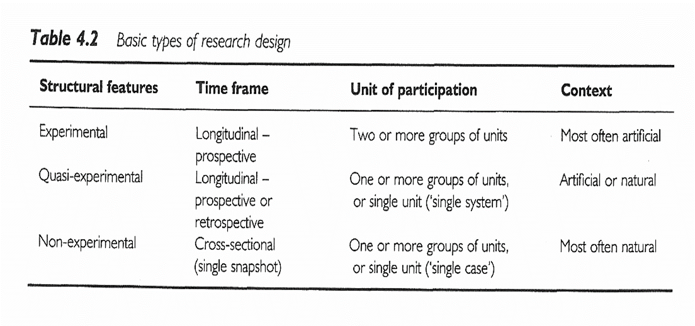

```{r echo=FALSE}
source("prelims.R", echo=FALSE)
```

***
`r read_text("objectives04")`

<div class="notes">

Here are the objectives for this week.

</div>

***
`r read_text("readings04")`

<div class="notes">

This is what you should have read already. If you haven't done the reading yet, pause this video and read this material. You'll get more out of the video if you do so.

There is a second video on this topic, presented by Tim Hickman.

</div>

***
### Topics

* Subversion of randomizaton

* Intention to treat analysis

* Blinding/partial blinding

* Concealed allocation

* The law of large numbers

* Randomization approaches

  + Stratified randomization
  
  + Block randomization

* How to randomize

* Baseline measurements

* Crossover designs

* Criticisms

***
### Experimental versus observational

* Active independent variable

  + Researcher controls
  
* Attribute independent variable

  + Demographic feature
  
* Who does the choosing?

  + Patients or doctors? = Observational
  
  + Researcher? = Experimental
  
<div class="notes">


</div>

***
### Randomized versus quasi-experimental

* Quasi-experimental

  + Logistics prevent randomization
  
* Randomized

  + Patients giving you a gift
  
<div class="notes">


</div>

***
### Pros and cons of randomization

Benefits of randomization

  + Insures comparability

Disadvantages of randomization

* Expensive

* Artificial


***
### Randomized Experimental Designs 

+ Characteristics
	+ Assignment
	+ Type of IV
	+ Control of IV
+ Purpose

<div class="notes">

Random assignment of an active independent variable. This design allows us to talk about cause.

Causality, actually, is easier to establish with a randomized study, but you can establish causation with an observational study, but it takes more work.

Add-on design. Take existing treatment and add either a new tre

An article by Debruyn (sp?)

</div>

***
### Randomized Experimental Designs 

+ Posttest-Only Control Group
	+ R	E:	X	O
	+ R	C:	X	O
	+ Strengths
	+ Weaknesses

<div class="notes">

The random assignment assures that, on average, the two groups are comparable. You do not have pre measures. That prevents us from establishing comparability by comparing the pre measure values.

You don't have a measure of change.

</div>

***
### Randomized Experimental Designs 

+ Pretest-Posttest Control Group
	+ R	E:	O1	X	O2
	+ R	C:	O1	~X	O2
	+ Strengths
	+ Weaknesses

<div class="notes">

This is the most common type of experimental design. You still have to worry about learning effects or fatigue effects.

There is a general rule of thumb, that a sample size of 30 per group allows you to be comfortable with a posttest only design, but don't rely on this rule. A pretest measure is very important.

</div>

***
### Randomized Experimental Designs 

+ Solomon Four-Group
	+ R	E1:	O1	X	O2
	+ R	E2:	 	X	O2
	+ R C1: O1 ~X O2
	+ R C2:    ~X  O2
	+ Strengths
	+ Weaknesses

<div class="notes">

People are in one group only. This is useful if the pre-measure has an influence on the post-measure (learning or fatigue effects).

Notice that this design doubles the number of people needed for the research.

</div>

***
### Randomized Experimental Designs 

+ Randomized Experimental Design with Matching
	+ M R		E:	X	O
	+ M R  C:  ~X  O
	+ Strengths
	+ Weaknesses

<div class="notes">

Bring in matched pairs of people. Once you have those matched pairs, you randomly assign within each pair.

This design has a post-measure only, but matching minimizes the need for this measure.

One issue is that determining what variables to match, it places a burden on recruiting, and unmatched people are not included in the design.

</div>

***
### Randomized Experimental Designs 

+ Within-Subjects Randomized Experimental (Crossover) Design
	+ R	Order 1	X	O1	~X	O2
	+ R  Order 2	~X  O1	X	O2
	+ Strengths
	+ Weaknesses

<div class="notes">

People are randomized into two or more groups. In this case there are two groups. Both groups get the treatment and the control, but the order is reversed.

Each person serves as their control. This really reduces the amount of variance, allowing you to get by with a much smaller sample size. How much smaller depends on a lot of factors, but effectively

You cannot use this design if there are carry over effects. Interventions that involve learning or training will not work with this design.

With drug trials, you need a sufficient period of time for one drug to wash out of the system before you switch. This can be a problem if leaving a patient untreated, even for a short amount of time.

</div>

***
### Delayed start design.Randomized Experimental and Q-E Designs 

Find the image from D'Agostino.

<div class="notes">

This image is from a delayed start design. D'Agostino. Column in the NEJM that is a tutorial.

During phase 1, half are getting treatment and half are getting placebo. After a certain amount of time the patients in the placebo group are switched to the treatment group. There is an allowance for a transitory time. 

</div>

***
### Randomized Experimental and Q-E Designs 


<div class="notes">

This image is from a delayed start design. D'Agostino. Column in the NEJM that is a tutorial.

During phase 1, half are getting treatment and half are getting placebo. After a certain amount of time the patients in the placebo group are switched to the treatment group. There is an allowance for a transitory time. 

</div>

***
### Research Design 



<div class="notes">

All of the designs talked about (other than the delayed start design), are in this figure that we saw earlier.

+ Sim & Wright. *Research in Health Care* . 2000. Table 4.2

Figure 5.1

</div>

***
### Research Design 


<div class="notes">

+ Sim & Wright. *Research in Health Care* . 2000. Table 4.3

</div>

### Ioannidis article

[[Find image/table]]

<div class="notes">

Ioannidis found 49 articles. The first group, the contradicted studies, represent findings that were later contradicted by other studies. The next group shows where the initial findings were supported, but the strength of the effect has not been replicated. The benefit is much weaker.

The Leaf article talks about some alternatives and will be the basis of some discussion later in this class.

***
### #2 Assignment 

+ Go to a source of secondary data. Review available data types / topics on the data web site. Using the template provided in the Week 4 folder, write a brief description of a research topic you could address using this data source. Include in your description information on the variables that would be used . Use the hand-out with the list of possible web sites or your own source to identify a dataset you are interested in. 

<div class="notes">


</div>

***
`r read_text("hw04", fri[4])`

<div class="notes">


</div>

***
`r read_text("discussion04", fri[4])`

<div class="notes">


</div>

***

### Additional slides