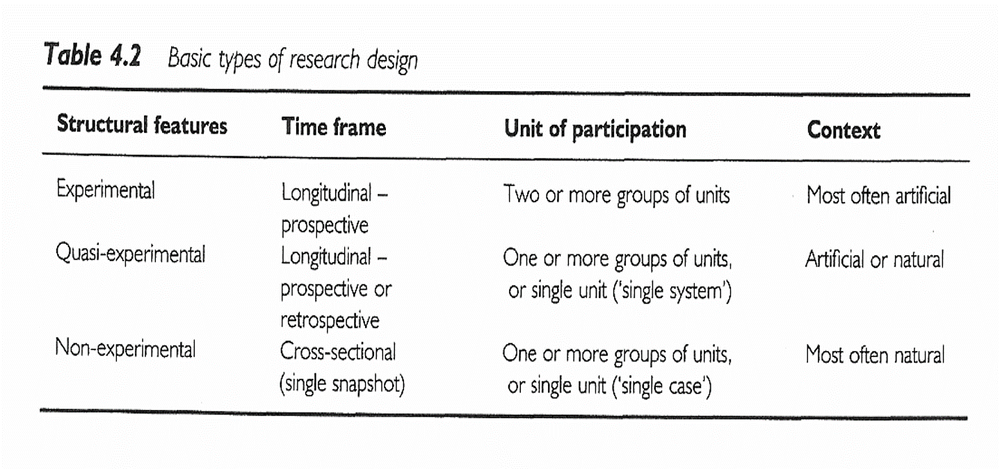
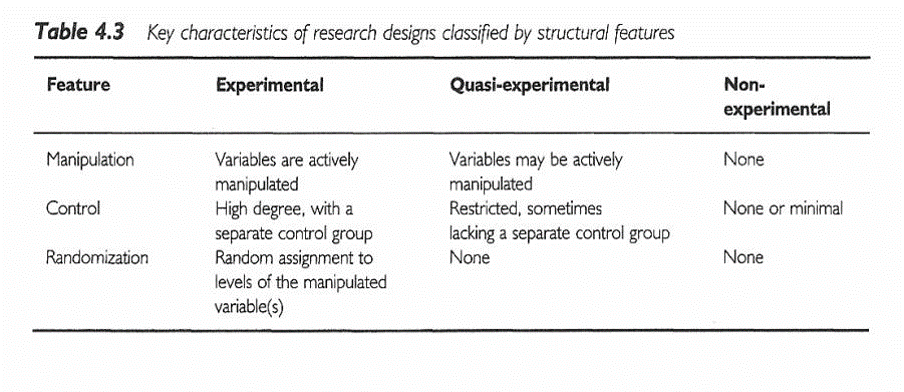

```{r echo=FALSE}
source("prelims.R", echo=FALSE)
```

***
`r read_text("objectives04")`

<div class="notes">

Here are the objectives for this week.

</div>

***
`r read_text("readings04")`

<div class="notes">

This is what you should have read already. If you haven't done the reading yet, pause this video and read this material. You'll get more out of the video if you do so.

</div>

***
### Topics

* Subversion of randomization

In theory, the two therapies you are comparing have to have equipoise. You need to have a genuine uncertainty as to which therapy is better. That's a theoretical concept that is not always met in practice.

If you are considering enrolling a patient in a clinical trial and for this patient you believe (it has to be more than just a hunch) that only one of the two therapies is appropriate, then you are ethically obligated to keep this patient out of the trial, because there is a 50% chance that your patient will be given the wrong therapy.

Some physicians, sad to say, are not ethical. They will recruit a patient into a trial and then find a way to insure that their patient gets the correct therapy. If they have access to the randomization list, they might delay enrollment for a day or two, until the right number comes up on the list.

This is definitely cheating and it is definitely bad. Here’s a hypothetical example. Suppose there are two drugs. One has a very harsh side effect profile with some compensatory advantages, presumably, on the efficacy side of the equation. A physician might steer some of their weaker and frailer patients away from this harsh drug. It might be a conscious decision and it might be subconscious, such as reading the inclusion/exclusion criteria more strictly when the harsh drug is next in line on the randomization list and read those same inclusion/exclusion criteria more loosely when the other drug is next in line. This might be okay for the patient, but it is a disaster for the clinical trial. All of a sudden, the frail and weak patients are excluded only from one arm of the trial, leading to a serious bias.

If a patient is too frail, the ethical thing to do is to not enroll the patient at all. But there is evidence that some doctors take the wrong path.

What can you do about this? Well, it is not an issue for a double-blind trial, where both the physician and the patient are kept in the dark until the study is completed. It does become an issue for single blind and unblended trials.

What you do is to conceal the randomization list from the physician. They work through the inclusion and exclusion criteria and get informed consent from the patient. Once this is done, they call up an 800 number to find out which arm of the study that patient is randomized to. This is known as concealed allocation and it is worth the effort, especially for large multi-center clinical trials. In those trials, you will not know enough about the individual recruiting physicians to be able to trust all of them.

Concealed allocation can also be done with sealed envelopes, though it is not considered a secure enough system by some.

* Volunteer bias.

Randomized trials rely on volunteers, and volunteers are not like you and me. I did volunteer when I was 18 for a trial evaluating a flu vaccine. I had to stay in their clinic 24/7 for two full weeks, because they didn’t want me roaming free to potentially infect all of Baltimore City. I got free food and could play Risk all day long, and at the end of the study I got the enormous sum of $700. For a poor college student it was heaven, but I wouldn’t even dream of doing something like that today.

So what sort of person volunteers for a randomized trial. It depends, but for trials involving healthy volunteers, it has to be someone who doesn’t mind all the inconveniences associated with the trial and who views a paltry sum of money as something other than a paltry sum.

There are a couple of empirical studies about research volunteers that are worth mentioning. The first is a study that started out with a series of paper and pencil personality trait surveys (this was long before we had things like REDCap). The second half of the study involved correlating these personality traits with certain biochemical markers in cerebrospinal fluid. You get this with a lumbar puncture, which sounds a whole lot nicer than the other term, spinal tap. A lumbar puncture is quite painful and many of the patients in the first phase of the study did not volunteer for the second phase. Normally when someone doesn’t volunteer, you do not get any data on them, but in this case, they had a full personality profile of refusers and the volunteers. The volunteers differed from the refusers on one personality trait, impulsivity. It makes sense when you think about it. But the fact that the volunteers were skewed to one side of the impulsivity scale was problematic when you are interested in correlates of personality traits and markers in spinal fluid.

A second example of volunteer bias involved the genetic profiling of a group of professional volunteers. These are people who sign up repeatedly at places like Vince and Associates. It’s not a lot of money, but you can get by on the money that these sites pay. The genetic profile fond something quite interesting. A certain genetic variant that was associated with slow metabolism of drugs was almost entirely absent from the professional volunteers. Slow metabolism would be associated with a greater risk of side effects. This was a genetic variant that the volunteers themselves probably did not know that they had, but you can envision how this might happen. A hundred people volunteer for their first study and the seven that have this genetic variant end up with blistering headaches, blotchy purple skin, and a wicked bout of diarrhea. The 93 patients with the normal gene think that the trial went pretty well and seriously consider signing up for another one. The seven with purple skin figure that maybe a career of plasma donation is more up there alley.

Now from a research perspective, if studies involving professional volunteers excludes patients who are more likely to experience side effects, it’s a disaster. That patient population is going to make any drug that they test look a lot safer than it really is.

Gustavsson, J. P., Åsberg, M. and Schilling, O. (1997), The healthy control subject in psychiatric research: impulsiveness and volunteer bias. Acta Psychiatrica Scandinavica, 96: 325-328. doi:10.1111/j.1600-0447.1997.tb09924.x

Chen S, Kumar S, Chou WH, Barrett JS, Wdlund PJ (1997). A Genetic Bias in Clinical Trials? Cytochroe P450-2D6 (CYP2D6) Genotype in General vs Selected Healthy Subject Populations [letter], British Journal of Clinical Pharmacology 44(3): 303-4.

* In what situations is randomization unethical, impractical, or impossible?

  + Retrospective prayer study. http://www.pmean.com/04/temporality.html

* Cameron and Pauling study of Vitamin C.

* Wait list control groups

* Matching, crossover designs

* Intention to treat analysis

* Equipoise, Early stopping

* Blinding/partial blinding. Who knew what when.

* Concealed allocation

* The law of large numbers

* Randomization approaches

  + Stratified randomization
  
  + Block randomization

* How to randomize

* Baseline measurements

* Crossover designs

* Criticisms

***
### Experimental versus observational

* Experimental

  + Active independent variable

* Observational

  + Attribute independent variable

<div class="notes">

One of the major distinctions in research design is experimental studies versus non-experimental (observational) studies. 

Your book makes the distinction through the independent variable. An active independent variable allows for either a experimental or quasi-experimental study. An attribute independent variable makes your study non-experimental. That's your book's term, but I prefer the term observational. It is fairly common in the medical literature. Think of observational as "look but don't touch." You observe patients without meddling with them.

</div>

***
### Experimental versus observational

* Who does the choosing?

  + Patients or doctors? = Observational
  
  + Researcher? = Experimental
  
* Patients in a randomized trial are giving you a gift.
  
<div class="notes">

Another way of looking at it is to ask the question "Who does the choosing?" If the patient and/or the doctor has a part in deciding, then the study is observational. If the researcher is the only one who decides, and uses a coin flip to decide, that is a randomized clinical trial.

We owe a great debt of graditude to the volunteers in a randomized clinical trial. They are sacrificing a lot of autonomy over what drug or therapy to choose. And they are ceding that autonomy, not to an expert clinician but to the flip of a coin. That's a truly amazing.

</div>

***
### Randomized versus quasi-experimental

* Quasi-experimental

  + Logistics prevent randomization
  
  + Very common in Quality Improvement

<div class="notes">

When you have an active independent variable, you don't always have a level of control that allows for randomization. Usually this is caused by logistical issues. Once you go down a certain path, it is impossible to go back. Or the setting that you are studying, like an emergency room is so chaotic that no one can keep track of a randomization table.

It's easy to sneer at quasi-experimental studies and think of them as an inferior form of research. But they are not, and quasi-experimental designs form the backbone of many quality improvement studies. We'll talk more about this in the following week.

</div>

***
### Advantages of randomization

* Insures covariate balance
  
* Both measured and unmeasured covariates

* Avoids selection bias

<div class="notes">

A covariate is a variable that is not of direct interest in the research, but which could affect the outcome. If a covariate is imbalanced between the two groups you are comparing, that can interfere with your ability to detect whether there is a difference between the treatment and control group.

There was a study that looked at smoking during pregnancy and found the suprising conclusion that smoking reduced the risk of Down Syndrome. Now smoking does a lot of really bad things to you: cancer, hypertension, stroke, heart attacks, etc. So it would be quite surprising to see cigarettes being protective instead of harmful. The researchers knew, however, that this finding was not real. It turns out that younger women are more likely to smoke during pregnancy than older women. This is a covariate imbalance. The smoking group had a much younger average age than the non-smoking group. Down Syndrome occurs much more often among older women than younger. Once you control for mother's age, the protective effect of smoking pretty much disappears.

Covariate imbalance is a big big problem for observational studies. You have to spend a lot of time and energy worrying about it during the planning phase and controlling for it in the analysis phase. We'll talk more about this in a couple of weeks.

The value of randomization is that an older woman is just as likely to find herself in the treatment group as in the control group. So the law of large numbers assures that you will have good covariate balance.

This applies for both covariates that you can measure, like demographics, and covariates that you might not be able to measure, such as number of co-morbidities, psychological state, and severity of the illness at baseline.

There is a different perspective that is worth mentioning here. Covariate imbalance is sometimes caused by selection bias.

Some of the patients in your research study may prefer one or the other of the two completing therapies being studied. The physicians who are managing the patients in your research study may also have a preference for some of their patients. 

If the patients and/or their physicians pay a role, even indirectly, in choosing between the two competing therapies, then you have to potential for selection bias. Patients might differ on key prognostic variables, leading to an biased comparison that might mask a true effect or produce an artefactual effect.

Randomization removes the patient and physician choice and prevents selection bias.

</div>

***
### Disadvantages of randomization

* Expensive

* Artificial

  + Extra tests, extra attention
  
  + Explicit acknowledgement of uncertainty

<div class="notes">

There are a fair number of researchers who get very snobbish about randomization. If it's not randomized, it's not real. This is wrong, wrong, wrong.

I wrote a book back in 2006 that talked about critical appraisal. It covered things like blinding, low drop out rates, patient oriented outcome measures, among other things that make a study more persuasive. I wanted to make the point that while all of these things are "nice to have", none of them are "have to have". So at the end of each chapter, I included a counterpoint.  cvxvx

***
### Randomized Experimental Designs 

+ Characteristics
	+ Assignment
	+ Type of IV
	+ Control of IV
+ Purpose

<div class="notes">

Random assignment of an active independent variable. This design allows us to talk about cause.

Causality, actually, is easier to establish with a randomized study, but you can establish causation with an observational study, but it takes more work.

Add-on design. Take existing treatment and add either a new tre

An article by Debruyn (sp?)

</div>

***
### Randomized Experimental Designs 

+ Posttest-Only Control Group
	+ R	E:	X	O
	+ R	C:	X	O
	+ Strengths
	+ Weaknesses

<div class="notes">

The random assignment assures that, on average, the two groups are comparable. You do not have pre measures. That prevents us from establishing comparability by comparing the pre measure values.

You don't have a measure of change.

</div>

***
### Randomized Experimental Designs 

+ Pretest-Posttest Control Group
	+ R	E:	O1	X	O2
	+ R	C:	O1	~X	O2
	+ Strengths
	+ Weaknesses

<div class="notes">

This is the most common type of experimental design. You still have to worry about learning effects or fatigue effects.

There is a general rule of thumb, that a sample size of 30 per group allows you to be comfortable with a posttest only design, but don't rely on this rule. A pretest measure is very important.

</div>

***
### Randomized Experimental Designs 

+ Solomon Four-Group
	+ R	E1:	O1	X	O2
	+ R	E2:	 	X	O2
	+ R C1: O1 ~X O2
	+ R C2:    ~X  O2
	+ Strengths
	+ Weaknesses

<div class="notes">

People are in one group only. This is useful if the pre-measure has an influence on the post-measure (learning or fatigue effects).

Notice that this design doubles the number of people needed for the research.

</div>

***
### Randomized Experimental Designs 

+ Randomized Experimental Design with Matching
	+ M R		E:	X	O
	+ M R  C:  ~X  O
	+ Strengths
	+ Weaknesses

<div class="notes">

Bring in matched pairs of people. Once you have those matched pairs, you randomly assign within each pair.

This design has a post-measure only, but matching minimizes the need for this measure.

One issue is that determining what variables to match, it places a burden on recruiting, and unmatched people are not included in the design.

</div>

***
### Randomized Experimental Designs 

+ Within-Subjects Randomized Experimental (Crossover) Design
	+ R	Order 1	X	O1	~X	O2
	+ R  Order 2	~X  O1	X	O2
	+ Strengths
	+ Weaknesses

<div class="notes">

People are randomized into two or more groups. In this case there are two groups. Both groups get the treatment and the control, but the order is reversed.

Each person serves as their control. This really reduces the amount of variance, allowing you to get by with a much smaller sample size. How much smaller depends on a lot of factors, but effectively

You cannot use this design if there are carry over effects. Interventions that involve learning or training will not work with this design.

With drug trials, you need a sufficient period of time for one drug to wash out of the system before you switch. This can be a problem if leaving a patient untreated, even for a short amount of time.

</div>

***
### Delayed start design.Randomized Experimental and Q-E Designs 

Find the image from D'Agostino.

<div class="notes">

This image is from a delayed start design. D'Agostino. Column in the NEJM that is a tutorial.

During phase 1, half are getting treatment and half are getting placebo. After a certain amount of time the patients in the placebo group are switched to the treatment group. There is an allowance for a transitory time. 

</div>

***
### Randomized Experimental and Q-E Designs 


<div class="notes">

This image is from a delayed start design. D'Agostino. Column in the NEJM that is a tutorial.

During phase 1, half are getting treatment and half are getting placebo. After a certain amount of time the patients in the placebo group are switched to the treatment group. There is an allowance for a transitory time. 

</div>

***
### Research Design 



<div class="notes">

All of the designs talked about (other than the delayed start design), are in this figure that we saw earlier.

+ Sim & Wright. *Research in Health Care* . 2000. Table 4.2

Figure 5.1

</div>

***
### Research Design 



<div class="notes">

+ Sim & Wright. *Research in Health Care* . 2000. Table 4.3

</div>

### Ioannidis article

[[Find image/table]]

<div class="notes">

Ioannidis found 49 articles. The first group, the contradicted studies, represent findings that were later contradicted by other studies. The next group shows where the initial findings were supported, but the strength of the effect has not been replicated. The benefit is much weaker.

The Leaf article talks about some alternatives and will be the basis of some discussion later in this class.

***
### #2 Assignment 

+ Go to a source of secondary data. Review available data types / topics on the data web site. Using the template provided in the Week 4 folder, write a brief description of a research topic you could address using this data source. Include in your description information on the variables that would be used . Use the hand-out with the list of possible web sites or your own source to identify a dataset you are interested in. 

<div class="notes">


</div>

***
`r read_text("hw04", fri[4])`

<div class="notes">


</div>

***
`r read_text("discussion04", fri[4])`

<div class="notes">


</div>

***

### Additional slides

