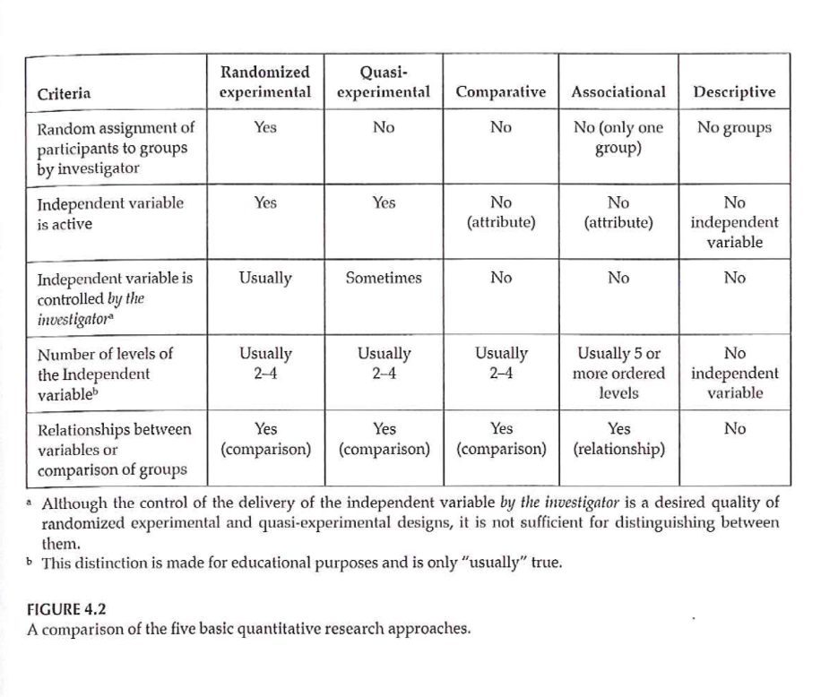

```{r echo=FALSE}
source("prelims.R", echo=FALSE)
```

***
`r read_text("objectives05")`

<div class="notes">


</div>

***
`r read_text("readings05")`

<div class="notes">


</div>

***
### Research Approaches 


<div class="notes">


</div>

***
### Research Approaches 



<div class="notes">


</div>

***
### Research Approaches 

+ Randomized Experimental
+ Criteria
	+ Random assignment
	+ Active independent variable
	+ (Experimenter control of active independent variable)
		+ What is “treatment”
		+ When it will be given
		+ Who it will be given to

<div class="notes">


</div>

***
### Research Approaches 

+ Randomized Experimental
+ Importance of random assignment
	+ Bias
	+ Equivalence of groups before treatment
+ Random selection (sampling)
	+ What does this mean?
	+ How does it relate to random assignment?
	+ Value of random selection?

<div class="notes">


</div>

***
### Research Approaches 

+ Quasi-Experimental
+ What criteria of Experimental not met?
+ Categories of Q-E approach
	+ Q-E with major limitations
	+ Pretest-Posttest designs
	+ Time-series designs
	+ Single-subject designs

<div class="notes">


</div>

***
### Research Approaches 


<div class="notes">


</div>

***
### Randomized Experimental and Q-E Designs 


<div class="notes">


</div>

***
### Quasi-Experimental Designs 

+ Categories of Q-E approach
	+ Q-E with major limitations
	+ Pretest-Posttest designs
	+ Time-series designs
	+ Single-subject designs

<div class="notes">


</div>

***
### Quasi-Experimental Designs 

+ Q-E with major limitations
+ Also called Pre-experimental
	+ One-Group Posttest-Only
		+ NR	E:		X	O

<div class="notes">


</div>

***
### Quasi-Experimental Designs 

+ Q-E with major limitations
+ Also called Pre-experimental
	+ One-Group Pretest-Posttest
		+ NR	E:	O1	X	O2
	+ Improvement - Wait-List Comparison Group
		+ Immediate Group	O1	X	O2
		+ Wait-List Group	O1	~X	O2	X	O3

<div class="notes">


</div>

***
### Quasi-Experimental Designs 

+ Q-E with major limitations
+ Also called Pre-experimental
	+ Posttest-Only Nonequivalent Groups
		+ NR	E:		X	O
		+ NR	C:		~X	O

<div class="notes">


</div>

***
### Quasi-Experimental Designs 

+ Better Q-E Designs
	+ Pretest-Posttest Nonequivalent Comparison Group
		+ NR	E:	O1	X	O2
		+ NR	C:	O1	~X	O2
		+ 3 strengths based on
			+ How participants got into the groups/conditions
			+ How much control investigator has over IV
		+ Strong
		+ Moderate-strength
		+ Weak

<div class="notes">


</div>

***
### Quasi-Experimental Designs 

+ Better Q-E Designs
	+ Single-Group Time-Series
		+ Characteristics
		+ Temporary treatment vs Continuous treatment
	+ Multi-Group Time-Series
		+ Characteristics
		+ Temporary treatment vs Continuous treatment

<div class="notes">


</div>

***
### Q-E Time Series Designs 


<div class="notes">


</div>

***
### Q-E Time Series Designs 

+ Portney & Watkins, 2009


<div class="notes">


</div>

***
### Quasi-Experimental Designs 

+ Typical examples of Q-E designs
	+ Case-control study
	+ Cohort study
	+ Non-equivalent control group design
	+ Interrupted time-series design
	+ Single system design

<div class="notes">


</div>

***
### Randomized Experimental Designs 

+ Characteristics
	+ Assignment
	+ Type of IV
	+ Control of IV
+ Purpose

<div class="notes">


</div>

***
### Randomized Experimental Designs 

+ Posttest-Only Control Group
	+ R	E:	X	O
	+ R	C:	X	O
	+ Strengths
	+ Weaknesses

<div class="notes">


</div>

***
### Randomized Experimental Designs 

+ Pretest-Posttest Control Group
	+ R	E:	O1	X	O2
	+ R	C:	O1	~X	O2
	+ Strengths
	+ Weaknesses

<div class="notes">


</div>

***
### Randomized Experimental Designs 

+ Solomon Four-Group
	+ R	E1:	O1	X	O2
	+ R	E2:	 	X	O2
	+ R C1: O1 ~X O2
	+ R C2:    ~X  O2
	+ Strengths
	+ Weaknesses

<div class="notes">


</div>

***
### Randomized Experimental Designs 

+ Randomized Experimental Design with Matching
	+ M R		E:	X	O
	+ M R  C:  ~X  O
	+ Strengths
	+ Weaknesses

<div class="notes">


</div>

***
### Randomized Experimental Designs 

+ Within-Subjects Randomized Experimental (Crossover) Design
	+ R	Order 1	X	O1	~X	O2
	+ R  Order 2	~X  O1	X	O2
	+ Strengths
	+ Weaknesses

<div class="notes">


</div>

***
### Randomized Experimental and Q-E Designs 


<div class="notes">


</div>

***
### Research Design 

+ Sim & Wright. *Research in Health Care* . 2000. Table 4.2


<div class="notes">


</div>

***
### Research Design 

+ Sim & Wright. *Research in Health Care* . 2000. Table 4.3


<div class="notes">


</div>

***
### Assignment #3 

+ Prepare a brief description of the topic you are planning to focus on for your research proposal. (Introduction)

<div class="notes">


</div>

***
`r read_text("hw05", fri[5])`

<div class="notes">


</div>

***
`r read_text("discussion05", fri[5])`

<div class="notes">


</div>

***

### Additional slides