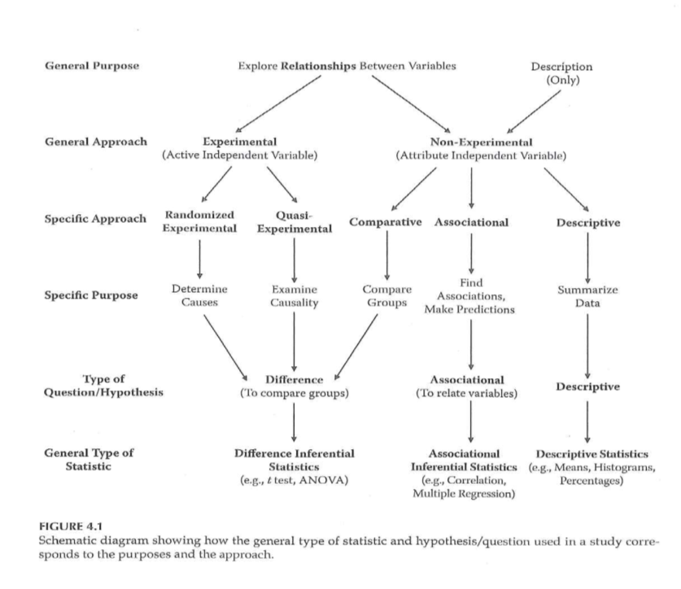
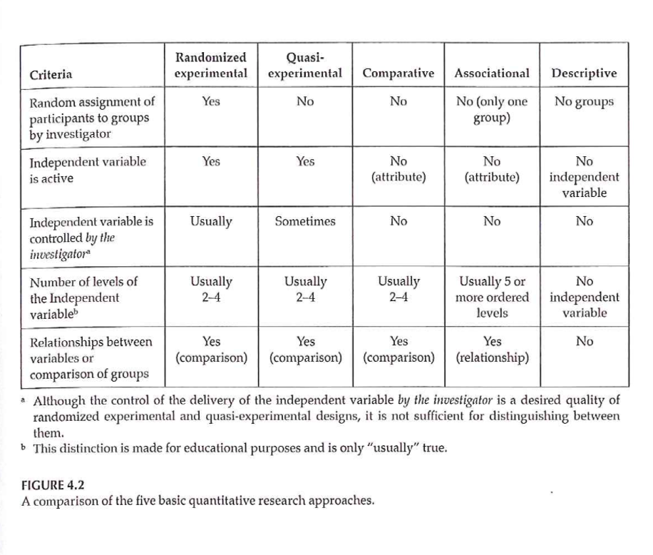
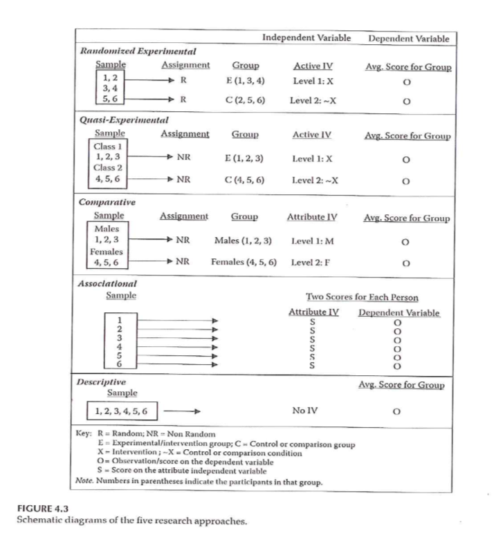
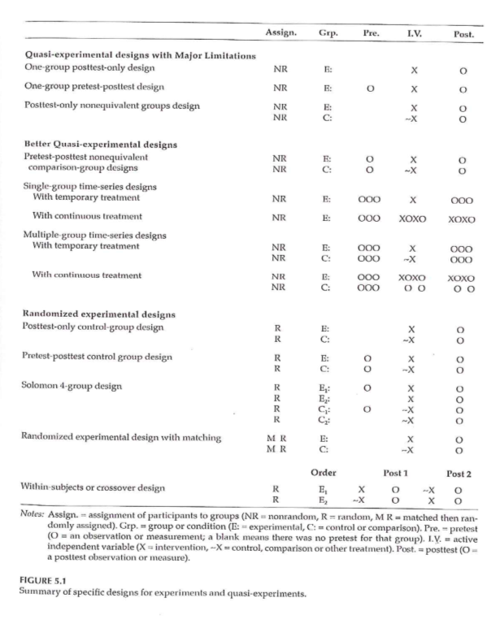
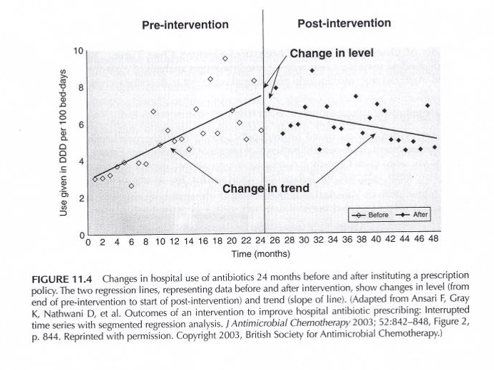

```{r echo=FALSE}
source("prelims.R", echo=FALSE)
```

***
`r read_text("objectives05")`

<div class="notes">

Here are the objectives for this week.

</div>

***
`r read_text("readings05")`

<div class="notes">

This is what you should have read already. If you haven't done the reading yet, pause this video and read this material. You'll get more out of the video if you do so.

</div>

###
*** What is quality improvement?

* Systematic approach
  + Commitment to teams
  + Organization-wide support
  + Passion for measurement
* Differences from research
  + Systems approach
  + Little or no attention to generalizability
  + Continuous and Cyclical process
  + Major reliance on quasi-experimental studies

<div class="notes">

Some of the material discussed on this page was taken from

https://www.hrsa.gov/sites/default/files/quality/toolbox/508pdfs/qualityimprovement.pdf

Quality Improvement (QI) is a systematic approach to changing how a health care organization works with the goal of providing better health care delivery. The QI process makes a strong commitment to teams and emphasizes the importance of broad representation on the team and careful elicitation of viewpoints from every persepctive. While it is possible to run a QI team in a small corner of an organiation, the PI process can only function well with organization-wide support, especially support from upper management. The QI process has a strong commitment to measurement, as measurement is the only way to evaluate the success or failure of changes made by the QI process.

There is substantial overlap between QI and health care research, but you should be aware of several important differences. QI takes a systems approach to solving problems. Some research takes a systems approach as well, but it's not really a research requirement. QI pays little or no attention to generalizability. The focus of QI is on your particular organization, and ateempts to generalize to other organizations is not a priority. The QI process is not a single step but a continuous effort. This effort is usually represented by the PDCA or PDSA processs (Plan, Do, Check/Study, and Act) and each time you reach the end of a PDCA cycle, you start over again with a new plan.

The final distinction and the reason I am talking about the QI process in this class it that QI relies heavily (but not exclusively) on quasi-experimental studies.

</div>

### What is a quasi-experimental study?

* Could but does not use randomization
* Never sneer at quasi-experimental studies
* Problems with randomization
  + Cost
  + Logistical constraints
  + Contamination
  + Small n
  + Difficult to get buy-in
  
<div class="notes">

A quasi-experimental study uses an active independent variable, but does not use a formal process of randomization to control that variable.

The choice to forgo randomization is usually a deliberate choice. Many people, including the authors of your book, dismiss the quasi-experimental design as an inferior alternative to a randomized design, but that are wrong. In some settings, randomization puts you at a disadvantage. If you decide to use a quasi-experimental design, recognize that you are choosing this design because it is superior to a randomized trial. 

What are the problems with randomization? First, it is expensive. It takes a lot of money (and a lot of time=remember that time is money). The machinery associated with randomization does not come cheap.

Contamination is the tendency for a particular intervention to "bleed over" into the control group. You may ask a health care provider to use a new approach for patients, but it is soemtimes very easy to let some of the new approach slip in when that person is treating a randomly selected control patient.

Certain interventions, such as changes to the physical layout of a work area are one directional and cannot be undone. This is also true of certain training interventions (Uh-oh! A control patient is next on my randomization list. Time to forget everything that I've just learned.)

The sample size available to randomize may be too small to assure that randomization would work. This is especially true when you are looking at an intervention that can be implemented only at a very broad scale, such as with an entire floor or wing of a hospital.

Even when 

</div>

Institue for Healthcare Improvement

Any model is fine, but it has to be consistent across the organization.

The QI model is one that is open to failure, but controls the process so that failure doesn't have a large cost.

What are we trying to accomplish?

How will we know that a change is an improvement? (How do you measure?)

What change can we make that will result in improvement? (Interventions)

Quality improvment typically is measured over time and this leads to a different type of statistical analysis.

Plan, Do, Study, Act

Aim is SMART (Specific, Measurable, Actionable, Relevant, Time Bounded)

Don't try to boil the ocean.

Types of waste mnemonic: 
Downtime

D=Defects
O=Overproduction
W=Waiting (patient or staff)
N=Non-utilized intellect
T=Transportation
I=Inventory (have it and have it where we need it, too many suppl)
M=Motion
E=Extra processing (Perfectionist)


***
### Research Approaches 



<div class="notes">

We are using this figure a lot because it helps us organize information. Are you trying to explore relationships or describe. Experimental designs almost always explore relationships. 

An experimental design has an active independent variable (one that is manipulated).

The split in experimental designs

</div>

***
### Research Approaches 



<div class="notes">

Figure 4.2 walks you through the major designs. Note that the random assignment of patients to groups is not the same as the random selection of groups.

In a quasi-experimental design, sometimes the active independent variable is manipulated by the investigator, sometimes not. 

</div>

***
### Research Approaches 

+ Randomized Experimental
+ Criteria
	+ Random assignment
	+ Active independent variable
	+ (Experimenter control of active independent variable)
		+ What is “treatment”
		+ When it will be given
		+ Who it will be given to

<div class="notes">

Random assignment of people into groups or conditions. Controling the type of treatment or when it is given.

Sometimes the treatment is delivered by someone other the investigator, but gives randomization information to someone else.

</div>

***
### Research Approaches 

+ Randomized Experimental
+ Importance of random assignment
	+ Bias
	+ Equivalence of groups before treatment
+ Random selection (sampling)
	+ What does this mean?
	+ How does it relate to random assignment?
	+ Value of random selection?

<div class="notes">

Random sample does not rely on any characteristics of an individual.

You can use a random number generator to assign or a random number table.

Randomization gives you the best chance of the two groups being equivalent.

Note that alternating assignment is not the same as random assignment. Does a temporal trend cause bias?

Also note that haphazard assignment is not the same as random assignment.

Alternatives to random assignment leaves you with a good chance that your study will not end up getting included in a systematic overview.

Random sampling. How do people get included in a study?

Most random assignment studies use a non random selection.

It is quite difficult to do random selection, but easy to do random assignment.

</div>

***
### Research Approaches 

+ Quasi-Experimental
+ What criteria of Experimental not met?
+ Categories of Q-E approach
	+ Q-E with major limitations
	+ Pretest-Posttest designs
	+ Time-series designs
	+ Single-subject designs

<div class="notes">

Quasi-experimental designs fail to meet the goal of randomization. It could be that we do not have control over the treatment assignment. A quasi-experimental design does not allow you to establish causality.

Single subject designs are covered separately.

</div>

***
### Research Approaches 



<div class="notes">

Figure 4.3. The way notations are used to describe designs.

R = randomized, NR = not randomized.

E = experimental, C = control

Active vs Attribute variable.

This notation is used as we talk about different designs.

</div>

***
### Randomized Experimental and Q-E Designs 



<div class="notes">

Figure 5.1 talks about verious experimental and quasi-experimental designs. Designs increase in rigor as you go down the table. When are measurements made.

</div>

***
### Quasi-Experimental Designs 

+ Categories of Q-E approach
	+ Q-E with major limitations
	+ Pretest-Posttest designs
	+ Time-series designs
	+ Single-subject designs

<div class="notes">


</div>

***
### Quasi-Experimental Designs 

+ Q-E with major limitations
+ Also called Pre-experimental
	+ One-Group Posttest-Only
		+ NR	E:		X	O

<div class="notes">

Only one group. No randomization. Treatment given to everyone and you get a measurement only after the treatment. It could be useful for pilot studies (feasibility)

Expectancy effect.

</div>

***
### Quasi-Experimental Designs 

+ Q-E with major limitations
+ Also called Pre-experimental
	+ One-Group Pretest-Posttest
		+ NR	E:	O1	X	O2
	+ Improvement - Wait-List Comparison Group
		+ Immediate Group	O1	X	O2
		+ Wait-List Group	O1	~X	O2	X	O3

<div class="notes">

One group, pre-test versus post-test. You can look at change before and after the intervention. You still don't know if the change would have occured even without this intervention.

A wait list comparison, one group gets the treatment immediately and the second group has to wait before getting the treatment.

This is an attractive design when the clinicians want to avoid giving the placebo to anyone.

From a recruitment point of view, people who want the treatment may be willing to tolerate a delay.

Note that there are two changes (O2 minus O1) and (O3 minus O2).

</div>

***
### Quasi-Experimental Designs 

+ Q-E with major limitations
+ Also called Pre-experimental
	+ Posttest-Only Nonequivalent Groups
		+ NR	E:		X	O
		+ NR	C:		~X	O

<div class="notes">

We don't have random assignment, so you may have non-equivalent groups.

</div>

***
### Quasi-Experimental Designs 

+ Better Q-E Designs
	+ Pretest-Posttest Nonequivalent Comparison Group
		+ NR	E:	O1	X	O2
		+ NR	C:	O1	~X	O2
		+ 3 strengths based on
			+ How participants got into the groups/conditions
			+ How much control investigator has over IV
		+ Strong
		+ Moderate-strength
		+ Weak

<div class="notes">

Introducing a pre-test measurement offers a further improvement. The pre-measure allows us to test for differences before the intervention was introduced.

A stronger version of this design. Can you randomize which group gets the intervention, even if you can't randomize individuals?

If people self-select, but not on the basis of which group they get into, that strengthens the design. But you can't rule out the possibility of systematic differences that might still influence the outcome.

</div>

***
### Quasi-Experimental Designs 

+ Better Q-E Designs
	+ Single-Group Time-Series
		+ Characteristics
		+ Temporary treatment vs Continuous treatment
	+ Multi-Group Time-Series
		+ Characteristics
		+ Temporary treatment vs Continuous treatment

<div class="notes">

Multiple measures over time in your outcome variable.

</div>

***
### Q-E Time Series Designs 



<div class="notes">

With time series designs, you are frequently looking at two different kinds of signals. You get a feel for change in the trend before and after. You also have the possibility of a jump (shift) at the time of the intervenion.

Notice in this graph.

</div>

***
### Q-E Time Series Designs 


<div class="notes">

Figure 11.5 shows three different patterns. Four measurements before treatment and four measurements after treatment. Notice the bottom line shows an up and down pattern. If you looked only at O4 and O5, you might think, Wow! but the values at O6, O7, etc.

The middle line B shows an increasing trend but this increase appears to be unrelated to the intervention.

The top line shows a shift that is temporally associated with the intervention.

These designs show some evidence of causation without a concurrent control group.

Portney & Watkins, 2009

</div>

***
### Quasi-Experimental Designs 

+ Typical examples of Q-E designs
	+ Case-control study
	+ Cohort study
	+ Non-equivalent control group design
	+ Interrupted time-series design
	+ Single system design

<div class="notes">

You identify a group of cases matched with controls. These are, for the most part, retrospective comparisons.

Cohort design, you get a group of patients at risk of something and follow them over time. Cohort studies can be prospective or retrospective. 

Two or more pre-existing groups of people. You introduce an intervention to one group.

Case studies. 

Withdrawal design.

The Tucker article is a good example of a quasi-experimental design.

</div>

***
### Assignment #3 

+ Prepare a brief description of the topic you are planning to focus on for your research proposal. (Introduction)

<div class="notes">

A single paragraph that might serve as your introduction. There is a template available on the Canvas site. If you want to start creating your proposal using a structure, feel free to use this template.

</div>

***
`r read_text("hw05", fri[5])`

<div class="notes">


</div>

***
`r read_text("discussion05", fri[5])`

<div class="notes">


</div>

***

### Additional slides