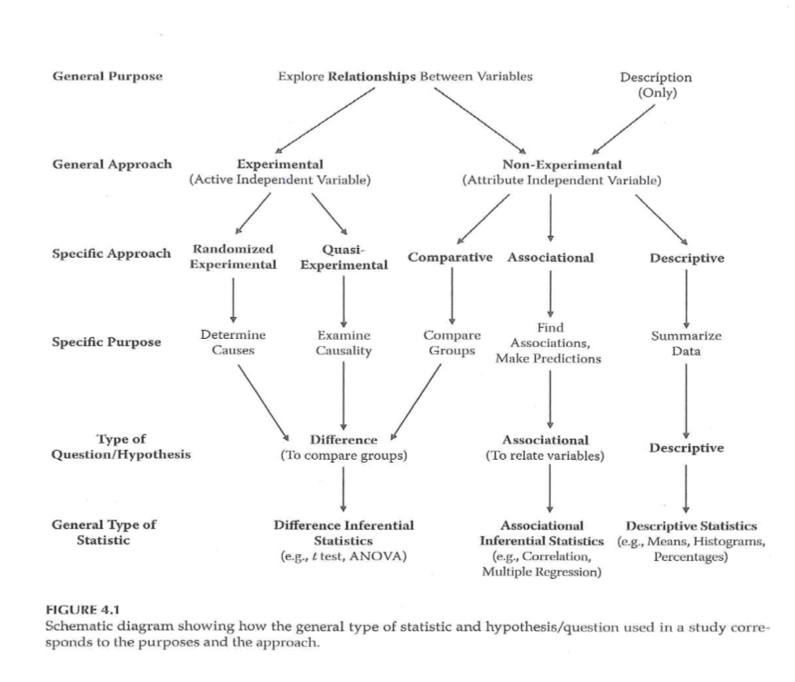
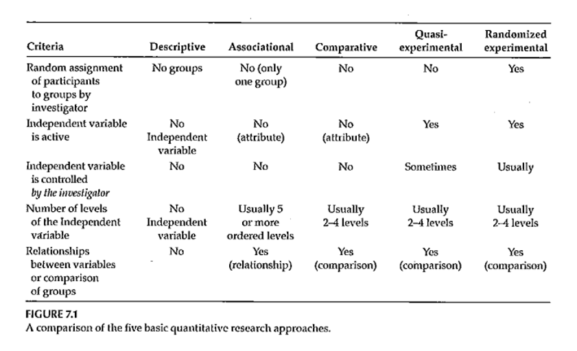

```{r echo=FALSE}
source("prelims.R", echo=FALSE)
```

***
`r read_text("objectives06")`

<div class="notes">

Here are the objectives for this week.

There will be a separate recording on single subject designs for those who are curious about it.

</div>

***
`r read_text("readings06")`

<div class="notes">

This is what you should have read already. If you haven't done the reading yet, pause this video and read this material. You'll get more out of the video if you do so.

</div>

***
### Research Approaches 



<div class="notes">

Going back to the figure that we have used. Now we will talk about comparative, associational, and descriptive studies.

Now you are talking about an attribute independent variable, one that you cannot manipulate or control. You can talk about causality easily for a randomized design but these three designs do not allow you to say anything about causality.

</div>

***
### Nonexperimental Designs 



<div class="notes">

Figure 7.1 identifies the five types of designs (descriptive, associational, comparative, quasi-experimental, and randomized experimental).

These three non-experimental approaches differ the levels of the independent variable. A large number of ordered levels (equivalent to a continuous independent variable) falls in the associational research type.

DiLorenzo compared older patients to younger patients.

Haberer article includes both quantitative and qualitative research. Interactive voice response (IVR) versus short message service (SMS) as a way of collecting adherence. It is an HIV study where adherence is very important. Mobile technology has a lot of penetration in places like Africa. Parents that could read were randomized, but parents who could not read were assigned to IVR.

They did qualitative interviews with all participants. The first theme was poor understanding of the responses. A second theme was challenges in training. The participants did not feel able to speak up and say that they don't understand.

</div>

***
### Research Approaches 

+ Comparative research approach
	+ Purpose?
	+ How is this approach similar to randomized experimental and quasi-experimental?
	+ C an this approach tell you anything about cause and effect?

<div class="notes">

Look at the very end of the introduction to get at the purpose of the research. Review the participant.

Random selection is a better representation of the population. (External validity?)

In any prospective study, you are only getting information for those people who are willing to be part of the study.

</div>

***
### Nonexperimental Designs 

+ Quantitative – Comparative
	+ Comparing groups – 2 or more
	+ Main IV has only a few levels
	+ Statistical analysis –
		+ T ypically t-test or analysis of variance
	+ Example – DiLorenzo et al., 2004 article
+ Usually – research that is reported will contain elements of more than one design
	+ Example – Haberer et al., 2010 article

<div class="notes">

Often your research has the elements of more than one design.

</div>

***
### Research Approaches 

+ Associational research approach
	+ Purpose?
	+ Characteristics of the variables measured?
	+ Can this approach tell you anything about cause and effect?

<div class="notes">


</div>

***
### Nonexperimental Designs 

+ Quantitative – Associational
	+ IV is often continuous / has many levels of an ordered variable (typically 5 or more )
	+ Looking at the association between the IV(s) and the DV
	+ Statistical analysis –
		+ Correlation-based
		+ Multiple regression when there are multiple Ivs
	+ Example – Rowan et al. 2014 article

<div class="notes">


</div>

***
### Research Approaches 

+ Descriptive research approach
	+ Purpose?
	+ When usually used?
	+ Characteristics of the variables measured?
	+ Can this approach tell you anything about cause and effect?

<div class="notes">


</div>

***
### Nonexperimental Designs 

+ Quantitative – Descriptive
	+ Descriptive statistics
		+ Averages
		+ Percentages
		+ Histogram
		+ Frequency distribution
	+ Some publication of strictly descriptive studies
	+ More often – descriptive component of a study
		+ Describe the sample …
	+ Example – Wolfe et al, 2006 study

<div class="notes">


</div>

***
### Nonexperimental Designs 

+ Qualitative – 5 main approaches
	+ Phenomenological
	+ Grounded theory
	+ Ethnographic
	+ Case study
	+ Narrative

<div class="notes">


</div>

***
### Nonexperimental Designs 

+ Qualitative – Phenomenological
	+ A llow researcher to “… understand the meaning participants place onto “… events, phenomenon, and activities.”
	+ Goal – “… explain the essence of experiences lived by the participants.”
	+ Method – usually interviews

<div class="notes">


</div>

***
### Nonexperimental Designs 

+ Qualitative – Grounded Theory
	+ Goal – “… generate theory from data collected from participants.”
	+ “… focus on the process, actions, and interactions experienced by … participants.”
	+ Method – usually interviews

<div class="notes">


</div>

***
### Nonexperimental Designs 

+ Grounded theory (Glaser & Strauss, 1967)
	+ Inferences firmly “ grounded ” in the data
	+ Prior theoretical expectations avoided
	+ Sampling proceeds parallel to data collection & analysis
	+ Categories regarded as provisional, subject to revision
	+ Research maintains skepticism, seeks disconfirming examples
	+ Ultimate purpose – construct coherent theory from the data

<div class="notes">


</div>

***
### Nonexperimental Designs 

+ Qualitative – Ethnographic
	+ Goal - “… describe a group of individuals who share the same culture.”
+ Qualitative – Case-study
	+ Goal – “…develop deep understanding of a case or cases.”
+ Qualitative – Narrative
	+ Goal – “… identify and report stories from the participants.”

<div class="notes">


</div>

***
### Analysis of Qualitative Data 

+ Inductive process –
	+ Start with the specific (raw data / transcript)
	+ Develop a theoretical framework from the data
	+ Conceptual categories emerge from the data

<div class="notes">


</div>

***
### Analysis of Qualitative Data 

+ Start the study with a research question
	+ This may provide a potential starting point for analyzing text
	+ If you do this, DO NOT let it prevent you from seeing what is in the text
+ Steps
	+ From raw data <U+F0E8> theory building
	+ “ Iterative ” process
		+ e.g. , as you are developing categories, check them back against the raw data – do they continue to reflect the original data?

<div class="notes">


</div>

***
### Analysis of Qualitative Data 

+ Analysis process –
	+ Given research question, may have some idea of a general conceptual structure; serve only as a starting point
	+ Usually work from transcripts
	+ If possible, refer back to audio recordings when needed
	+ Q ualitative form of analysis
		+ Content analysis – analysis of the content of communication
		+ Thematic analysis – identifying patterns or themes in the data

<div class="notes">


</div>

***
### Analysis of Qualitative Data 

+ Category Formation – assign sections ( data bits ) to analytical categories/themes <U+F0E8> “ coding ”
	+ Summarizing the data by identifying similarities and differences / commonalities and contrasts
	+ Categories:
		+ More manageable units of information
		+ “ open coding ”
		+ Descriptive – Concrete
		+ Interpretive – Abstract
		+ Relational
	+ Cross-reference categories back to text
		+ Makes it easier to revise coding as needed

<div class="notes">


</div>

***
### Analysis of Qualitative Data 

+ Category Formation
	+ Faithful to the data – “ internal ” aspect
	+ Meaningful to other categories – “ external ” aspect
	+ Balance
		+ Generality vs Specificity
		+ Inclusivity vs Exclusivity
	+ Number of times idea mentioned does NOT necessarily reflect importance

<div class="notes">


</div>

***
### Analysis of Qualitative Data 

+ Labeling / Revising Categories
	+ Member-generated – “ first-order ” account
	+ Observer-generated – “ second-order ” account
	+ Labels are provisional; may be revised
	+ Iteration – move back and forth between raw data and labeled categories
	+ “ Zoom in ” vs “ Wide angle ” view of the coding
	+ Revision – may end up dividing or combining categories
	+ May establish criteria for category coding

<div class="notes">


</div>

***
### Analysis of Qualitative Data 

+ Saturation – the point at which you are not gaining any new insight, no new categories being identified, no new relationships being defined
	+ Don ’ t need any additional analysis
	+ Don ’ t need any additional data collection (if collection & analysis done in parallel)
	+ Determinant – nature of the information being collection – NOT amount of information
	+ Keeping notes – of the coding/analysis process
	+ Help identify categories/relationships
	+ Help if “ stuck ”
	+ Document analysis process

<div class="notes">


</div>

***
### Analysis of Qualitative Data 

+ Role of Judgment
	+ Balancing act –
		+ Level of creativity by coder to identify categories/relationships
		+ Must reflect the informants thoughts
		+ Audit of the coding by an independent person can check for the match between the coding and the source information
	+ Low-inference descriptors
	+ Look for “ negative cases ”

<div class="notes">


</div>

***
### Analysis of Qualitative Data 

+ Quantifying Information
	+ Pros & Cons
	+ When quantifying might be of value
	+ Simple frequency of occurrence does NOT necessarily reflect importance

<div class="notes">


</div>

***
### Eton Article 

+ Long-term Goal – “… build a general, multi-domain, patient-reported measure of burden of treatment with wide applicability across diseases and treatments”
+ Semi-structured qualitative interviews
	+ “identify issues … illustrative of burden of treatment …”
	+ “inform derivation of a general, patient-reported measure of burden of treatment flexible enough for application across any disease or treatment regimen.”

<div class="notes">


</div>

***
### Eton Article 

+ Development of interview
+ Content analysis process
	+ Multiple coders
	+ Identify key themes and subthemes
	+ Discussion and consensus to develop coding scheme
	+ Repeated check and update of coding process
	+ Thematic content saturation
+ Resulting major themes and subthemes

<div class="notes">


</div>

***
### Berkley-Patton Article 

+ Goal – Use qualitative method to explore components of the Information-Motivation-Behavioral Skills model
	+ Information + Motivation <U+F0E8> Behavioral Skills <U+F0E8> Adherence
+ Focus Groups
+ Content analysis – “… identify themes on expectations and information, personal and social motivation, and behavioral skills related to ART adherence.”

<div class="notes">


</div>

***
### Berkley-Patton Article 

+ Information and expectations
+ Motivation for ART adherence
+ Behavioral skills related to ART adherence
+ Themes for each of these areas?
+ Value obtained from this kind of study?

<div class="notes">


</div>

***
### Nonexperimental - CBPR / PAR 

+ Community Based Participatory Research (CBPR)
+ Participatory Action Research (PAR)
	+ Takes place outside the normal research environment
	+ Designed to meet the needs of the community in which the research is conducted
	+ Value for the participants that goes beyond the value of the collected information

<div class="notes">


</div>

***
### Nonexperimental - CBPR / PAR 

+ Existing research data or data collected from other locations …
	+ May not reflect conditions (e.g., disease incidence) in the community of interest
	+ May not reflect underlying risk factors
	+ May not indicate how an intervention will work in a specific community

<div class="notes">


</div>

***
### Nonexperimental - CBPR / PAR 

+ CBPR/PAR research may be more generalizable than research conducted in a clinical setting
	+ Sample characteristics
+ Practice-Based Research Networks (PBRNs)
	+ Physicians from community settings work together to study research questions of mutual interest

<div class="notes">


</div>

***
### Nonexperimental - CBPR / PAR 

+ How the research context influences the research process …
	+ What issues are routinely encountered?
	+ To whom is the research important?
	+ Ripple effect of the research process
	+ Level of engagement of the target population

<div class="notes">


</div>

***
### Nonexperimental - CBPR / PAR 

+ Conducting CBPR/PAR
	+ Start simple
	+ Think of local comparative advantage
	+ Network
	+ Collaborate
		+ Top-down
		+ Bottom-up

<div class="notes">


</div>

***
### Nonexperimental - CBPR / PAR 

+ CBPR/PAR – especially appropriate for research involving health disparities
	+ Multiple individual and community-level determinants
+ Mechanism to translate basic health psychology conceptual models into interventions

<div class="notes">


</div>

***
### Nonexperimental - CBPR / PAR 

+ Contributions by researchers
	+ Know existing research evidence
	+ Can provide support/suggestions
		+ Organization
		+ Information-gathering
		+ Action
	+ Help community get in touch with resources

<div class="notes">


</div>

***
### Nonexperimental - CBPR / PAR 

+ Contributions by community
	+ Unique insight into local context
	+ Information concerning local needs and priorities
	+ Provide “ real world ” feedback/reaction
	+ Provide guidance for adapting programs/interventions to the community
+ Community involvement <U+F0E8> community capacity <U+F0E8> sustainability

<div class="notes">


</div>

***
### Assignment #4 

+ Turn in the results of a literature search on the topic you are planning to focus on for your research proposal . This is NOT expected to be a literature review; it should provide evidence that you are finding literature that is relevant to your topic. This assignment serves as the start of your References section, using the reference/citation style you plan to use in your proposal.

<div class="notes">


</div>

***
`r read_text("hw06", fri[6])`

<div class="notes">


</div>

***
`r read_text("discussion06", fri[6])`

<div class="notes">


</div>

***

### Additional slides