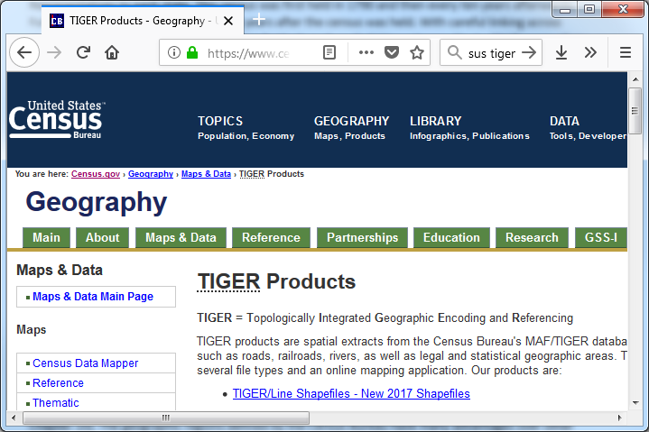
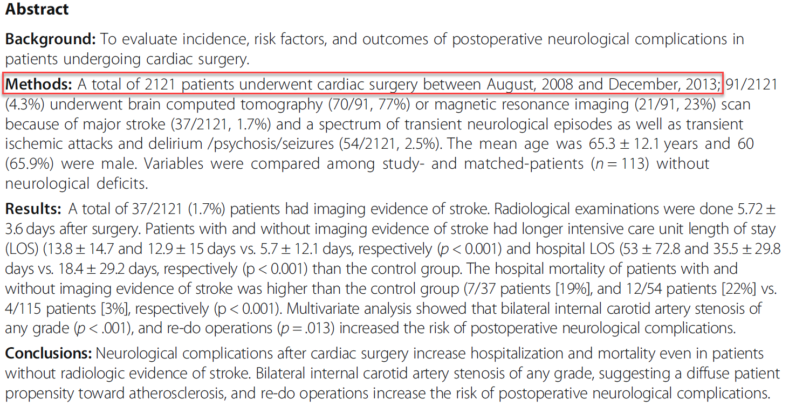
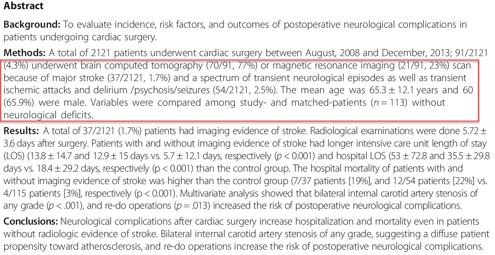
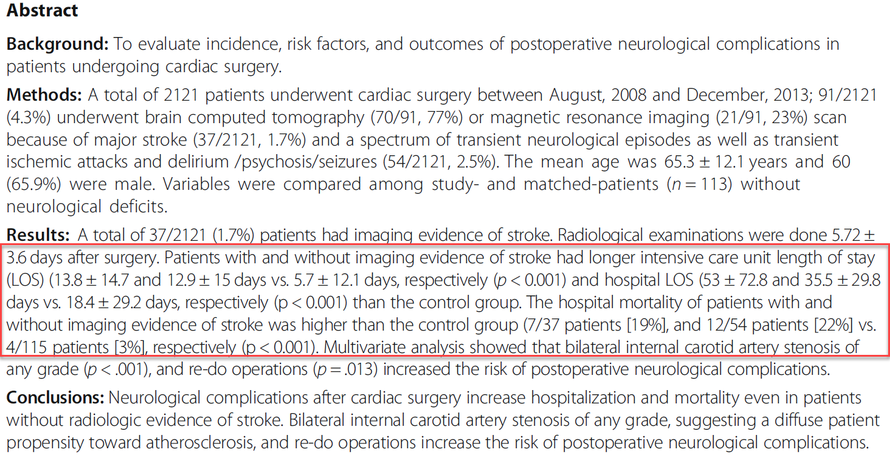
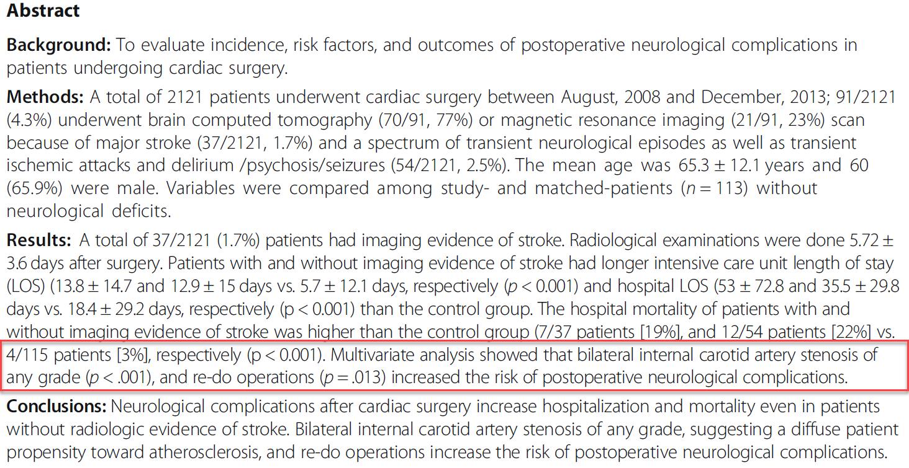

```{r echo=FALSE}
source("prelims.R", echo=FALSE)
```

***
`r read_text("objectives06")`

<div class="notes">

Here are the objectives for this week.

</div>

***
`r read_text("readings06")`

<div class="notes">

This is what you should have read already. If you haven't done the reading yet, pause this video and read this material. You'll get more out of the video if you do so.

</div>

### What is secondary data analysis?

* Primary: data that you both collect and analyze.
* Secondary: you analyze someone else's data
  + "Secondary analysis of existing data" (Cheng 2014)
* Private versus government sources
* Ancillary studies

<div class="notes">

There's a nice paper on the recommended reading list that discusses secondary data analysis. Primary data is data that you (meaning you and your research team) both collect and analyze. Secondary dta is data that someone else collected and you only provide an analysis.

There's an excellent reference in the recommended readings section and they emphasize that you should use the full phrase "secondary analysis of existing data" to avoid confusion.

Secondary data can come from private sources or from government sources. I'll talk in a bit about two excellent government sources of data: the U.S. Census Bureau and the Centers for Disease Control and Prevention.

When you work with an existing research study and ask them to add a few items to collect for your benefit, you are working on an ancillary study. This is a special treat and requires close work with the team on the existing research study. In most secondary data analyses, you con't have this luxury and have to take the data as is.

An ancillary study requires IRB approval. You need to discuss with the coordinators of the study that you are piggy baking on about who gets to be an author on your study, and what the order of authors should be. Do this before the paper is written, or you will find yourself in the middle of an ugly argument.

</div>

### What can you analyze for an already analyzed data set?

* Secondary data analysis is like eating left-over food.
* "Think different"
	+ Variables that are analyzed
	+ Relationships that are explored
	+ Different subsets of cases
	+ Different analysis techniques

<div class="notes">

If the data set has already been analyzed, is there really anything else you can do? Well, yes, but you have to live with the fact that the researchers have already selected and analyzed the most interesting parts of the data. So you are like the last person in line at a pot-luck buffet. The Swedish meatballs and the apple cobbler are already gone and you're left with the kale salad and the creamed spinach.

Don't fret, though. Many researchers collect more data than what they strictly need for their own purposes. 

You do need, as the Apple slogan says to "Think different."

You might look at different outcomes or different exposure variables that address the same general hypotheses. You could develop hypotheses involving new and untested relationships. You might be interested in a particular demographic subgroup. Or finally, you might test the same things that original researchers tested using more or less the same variables, but you might apply a new and different analysis approach.

</div>

### Combining data sets 

* Third "V" in volume, velocity, and variety
* Not the same as systematic overview, think "mash-up"
* Examples
  + Black box warnings and prescription use
  + Staffing levels and patient complaints
  + Pediatric asthma visits and housing survey

<div class="notes">

The combination of disparate data sets is one of the hallmarks of big data (the "variety" V of the three V's of big data). This is not the same as a systematic overvew, which combines several stuides of the same hypothesis. Think of the term "mash-up" which is a combination of seemingly disparite elements to create a new, but coherent product.

Here's a hypothetical example. The FDA provides lists of drugs that get "black box" warnings. This is a fairly serious thing, and you might be interested in seeing whether the prescription rates (as measured through the electronic health record) changed after the black box warning appeared.

Another hypothetical example is looking at staffing levels and the use of unplanned leave, which comes from personnel records, and the number and type of patient complaints, which are tracked in a complaints database.

I've worked with researchers who are looking at pediatric asthma visits at a local hopsital and linking the addresses to a housing survey conducted by the local government. The concern is that substandard housing could be associated with a greater need for asthma care. 

</div>

### Disadvantages of secondary analysis 

* Missing data
  + Variables not collected
  + Specific details not collected
* Wrong data
  + Wrong time
  + Wrong measures
* Stale data
* Unable to fix obvious errors

<div class="notes">

One of the big ones is the lack of control over the data collection process. You can't change how the data was collected without access to a time machine.

You may want infroation on certain variables, but the primary researchers chose not to collect this information. Or they did collect the information, but not at a level of detail that you want.

Maybe they collected the data, but collected it at the wrong time, or used a measurement approach that you dislike.

Because secondary analysis is retrospective, the data may lack "currency". It may describe an health care setting that is so different from what is done today that it represents an inappropriate extrapolation.

In a prospective study, if you get an unusual result, you can ask your research team to double check things, and maybe even go back to the patient and get a fresh set of numbers. You need to do this carefully, but it is a nice option that is totally unavailable to you in a secondary data analysis.

</div>

### Advantages of secondary analysis

* Time
* Money
* Support

<div class="notes">

The advantages of seconday analysis are almost all "comfort" factors.

Secondary data analysis takes less time because the data is already sitting there starting at you. You do, typically, have to spend more time in data management because the data collection was not optimized for your particular needs. Still, the time savings are usually quite substantial.

For the many secondary data sets, there is no cost, whatsoever for acquisition. A few data sets require a fee, but this is usually quite reasonable.

Finally, you will usually find good support for your work. Most people who make their data available for secondary data analyses want you to succeed. Your success makes them look better. This is especially true for government resources.

</div>

### Two types of secondary data sets

* Individual
  + More analysis options
  + Privacy concerns
* Aggregate
  + Mixture of apples and oranges
  + Problems with the ecologic fallacy

<div class="notes">

Some secondary data sets that have individual level records: there is separate records an indvidual unit (usually a person, but it could be an event like an emergency department visit). This is preferable in most settings, but sometimes important information has to be redacted because of privacy concerns. Other pieces of information have random noise added to them to preserve confidentiality (e.g., data shifting).

Aggregate data avoids many of the privacy issues. Aggregate data is also easier to store and to present. One big problem is that when you aggregate across a category, you end up mixing apples and oranges together and this often destroys signals that might be apparent when you look at individual values. When you mix a bunch of indvidual colors together, the results is always a blah shade of gray.

Even if you do find a signal at the aggregate level, you have to be careful. What you see may be an artefact of the ecologic fallacy. The ecologic fallacy is the belief that an association discovered at an aggregate level will also hold at an individual level.

An example of the ecologic fallacy: Sales of cigarettes are greater in states that have higher suicide rates. You don't know whether an individual who smokes is more likely to commit suicide.

</div>

### Getting started with secondary data analysis

* Start with an existing database
* Get familiar with the data
  + What variables are there?
  + WHat variables are not there?
  + How are the variables coded?
  + Identify potential pairs for associational studies
* Make sure you are answering an interesting question

<div class="notes">

You can attack a secondary data analysis from one of two ends. In a research driven study, you pose a question and then search for secondary data sources that might answer your question. In a data driven study, you decide on a particular secondary data source and then decide what interesting questions this data set might help you answer.

For the latter, read the documentation obsessively. Learn what variables you have and don't have. Make sure yuo are happy with the detail of the category levels for any categorical variable. Identify pairs of variables that you might want to explore the associations.

If you start with the database, you may end up answering a question that is easy to answer with that database, but it is to a question that no one really cares about. Get a second opinion about the interest and relevance of what you are studying.

There's a joke about someone who is searching along a street for a lost set of keys and a passerby volunteers to help them look. The keep looking for a while and the passerby asks where do you think you dropped your keys. The person responds, over there in that alley. So the passerby asks, so why are you looking for it out here? The person replies, because the light is so much better out here.

Moral: You have to be practical about what you can accomplish, but the easy to run study is not necessarily the study you should run.

</div>

### Alternative strategy for secondary analysis 

* Start with a research hypothesis
  + List the inclusion/exclusion criteria
  + List the relevant variables
* Search databases to see if they are a good fit.
  + Do they have the right patients?
  + Where is your control group?
  + Do they have the right variables?
	+ Find out if there are special qualifications for working with the database

<div class="notes">

You may instead want to start with your hypothesis. This seems a lot better. Starting with the data set is like putting the cart before the horse. But it is a lot more work and there is no guarantee that you will find the right data.

With your hypothesis, carefully list the inclusion and exclusion criteria. List the important variables: your outcome variable, your independent variables, and any covariates that you need to adjust for.

Then start looking at some candidate databases. Do they have the right patients. Especially make sure that the database provides you with a good control group. Maybe the data set only has sick people, and you want a healthy control group. There's nothing worse than collecting a bunch of data and then finding out that you did not have a control group for comparison.

</div>

### Get help from the literature

* How has database been used previously?
* What has already been answered?
* What was their analysis plan?
* Understand the limitations.

<div class="notes">

Read the literature on papers that have used this data set. This will help you identify if your work has already been done. Probably not, but it is also important because you will get a broader idea of what can be done. You'll also benefit from seeing what statistical models these researchers have chosen. Also look at the limitations mentioned in the discussion section. These limitations will probably apply to your work as well.

</div>


### "The Nation's Health Protection Agency"


<div class="notes">

These are the slides for a talk I gave last year to the graduate research seminar about a pair of articles that I am writing for the Encyclopedia of Big Data. THe two articles cover the CDC (Centers for Disease Control and Prevention) and the U.S Bureau of the Census..

CDC responds to new and emerging health threats and conducts research to track chronic and acute diseases. This talk will focus on CDC efforts in surveillance using nationwide cross sectional surveys to monitor the health of diverse populations.

</div>

### Nationwide cross sectional surveys


<div class="notes">

This paper by a former director of CDC is an excellent place to start. This talk will focus on CDC efforts in surveillance using nationwide cross sectional surveys to monitor the health of diverse populations (Frieden 2017).

</div>

### National Health Interview Survey


<div class="notes">

The National Health Interview Survey (NHIS) conducts in person interviews about the health status and health care access for 35 thousand households per year, with information collected about the household as a whole and for one randomly selected adult and one randomly selected child (if one is available) in that household (Parsons 2014). NHIS has been used to assess health insurance coverage (Martinez 2016), the effect of physical activity on health (Carlson 2016), and the utilization of cancer screening (White 2017).

</div>

### National Health and Nutrition Examination Survey

 

<div class="notes">

The National Health and Nutrition Examination Survey (NHANES) conducts in person interviews about the diet and health of roughly five thousand participants per year combined with a physical exam for each participant (Johnson 2014). Sera, plasma, and urine are collected during the physical exam. Genetic information is extracted from the sera specimens, though consent rates among various ethnic groups is uneven (Gabriel 2014). NHANES has been used to identify dietary trends in patients with diabetes (Casagrande 2017), the relationship between inadequate hydration and obesity (Chang 2016), and the association of Vitamin D levels and telomere length (Beilfuss 2017).

</div>

### Behavioral Risk Factor Surveillance System

 

<div class="notes">

The Behavioral Risk Factor Surveillance System (BRFSS) conducts telephone surveys of chronic conditions and health risk behaviors using random digit dialing (including cell phone numbers from 2008 onward) for 400 thousand participants per year. This represents the largest telephone survey in the world (Pierannunzi 2013). This survey has been used to identify time trends in asthma prevalence (Bhan 2015), fall injuries among the elderly (Bergen 2016), and mental health disparities between male and female caregivers (Edwards 2016).

</div>

### National Death Index

 

<div class="notes">

The CDC maintains the National Death Index (NDI), a centralized database of death certificate data collected from each of the 50 states and the District of Columbia. The raw data is not available for public use, but researchers can apply for access that lets them submit a file of patients that they are studying to see which ones have died (CDC 2016). Many of the CDC surveys described above are linked automatically to NDI. While privacy concerns restrict direct access to the full information on the death certificate, the CDC does offer geographically and demographically aggregated data sets on deaths (and births) as well as reduced data sets on individual deaths and births with personal identifiers removed.

</div>

### Influenza Hospitalization Surveillance Network


<div class="notes">

The CDC uses big data in its own tracking of infectious diseases. The US Influenza Hospitalization Surveillance Network (FluSurv-Net) monitors influenza hospitalizations in 267 acute care hospitals serving over 27 million people (Chaves 2015).

</div>

### FluView

 

<div class="notes">

Real time reporting on influenza is available at the FluView website (https://www.cdc.gov/flu/weekly/). This site reports on a weekly basis the outpatient visits, hospitalizations, and death rates associated with influenza. It also monitors the geographic spread, the strain type, and drug resistance rates for influenza.

</div>

### Foodborne Diseases Active Surveillance Network

 

<div class="notes">

FoodNet tracks laboratory confirmed food-borne illnesses in ten geographic areas with a population of 48 million people (Crim 2015). 

</div>

### Active Bacterial Core Surveillance

 

<div class="notes">

The Active Bacterial Core Surveillance collects data on invasive bacterial infections in ten states representing up to 42 million people (Langley 2015).

</div>

### United States Bureau of the Census

 

<div class="notes">

Question for the audience, when you think of Census Bureau, what is the first thing that springs to your mind? 

The Census Bureau is a federal agency that produces big data that is of direct value and which also provides the foundation for analyses of other big data sources. They also produce information critical for geographic information systems in the United States.

</div>

### Article I, Section II of the U.S. Constitution

 

<div class="notes">

The Census Bureau is mandated by Article I, Section II of the U.S. Constitution to enumerate the population of the United States to allow the proper allocation of members of the House of Representatives to each state. This census was first held in 1790 and then every ten years afterwards. Full data from the census is released 72 years after the census was held. With careful linking across multiple censuses, researchers can track individuals such as Civil War veterans (Costa 2017) across their full lifespan, or measure demographic changes in narrowly defined geographic regions, such as marriage rates during the boll weevil epidemic of the early 1900s (Bloome 2017). 

</div>

### Integrated Public Use Microdata Series International Partnership

 

<div class="notes">

For more recent censuses, samples of microdata are available, though with steps taken to protect confidentiality (Dreschler 2012). Information from these sources as well as census microdata from 79 other countries is available in a standardized format through the Integrated Public Use Microdata Series International Partnership (Ruggles 2015).

</div>

### American Community Survey

 

<div class="notes">

Starting in 1940, the Census Bureau asked additional questions for a subsample of the census. The questions, known informally as “the long form,” had questions about income, occupation, education, and other socioeconomic issues. In 2006, the long form was replaced with the American Community Survey (ACS), which covered similar issues, but which was run continuously rather than once every ten years (Torrieri 2007). The ACS has advantages associated with the timeliness of the data, but some precision was lost compared to the long form (Spielman 2014, Macdonald 2006).

</div>

### Master Address File

 

<div class="notes">

Both the decennial census and the ACS rely on the Master Address File (MAF), a list of all the addresses in the United States where people might live. The MAF is maintained and updated by the Census Bureau from a variety of sources, but predominantly the delivery sequence file of the United States Postal Service (Loudermilk 2009).

</div>

### Census blocks

 

<div class="notes">

The census block, the smallest of these regions, typically represent what would normally be considered a city block in an urban setting, though the size might be larger for suburban and rural settings. There are many census blocks with zero reported population, largely because the areas are uninhabitable or because residence is prohibited (Freeman 2017).

</div>

### Topologically Integrated Geographic Encoding and Referencing System

 

<div class="notes">

The geographic aggregation is possible because of another product that is of great value to big data applications, the Topologically Integrated Geographic Encoding and Referencing (TIGER) System (Marx 1990). The TIGER System, a database of land features like roads and rivers and administrative boundaries like county and state lines and has formed the foundation of many commercial mapping products used in big data analysis (Croner 1996). The TIGER system allows many useful characterizations of geographic regions, such as whether a region contains a highway ramp, a marker of poor neighborhood quality, (Friesthler 2016) and whether a daycare center is near a busy road (Houston 2006).

</div>

### American Housing Survey

 

<div class="notes">

The American Housing Survey (AHS) is a joint effort with the Department of Housing and Urban Development that surveys both occupied and vacant housing units in a nationally representative sample and a separate survey of large MSAs. The AHS conducts computer assisted interviews of roughly 47,000 housing units biennially. The AHS allows researchers to see whether mixed use development influences commuting choices (Cervero 1996) and to assess measures of the house itself (such as peeling paint) and the neighborhood (such as nearby abandoned buildings) that can correlated with health outcomes (Jacobs 2009).

</div>

### Current Population Survey

 

<div class="notes">

The Current Population Survey, a joint effort with the Bureau of Labor Statistics, is a monthly survey of 60,000 people that provides unemployment rates for the United States as a whole and for local regions and specific demographic groups. The survey includes supplements that allows for the analysis of tobacco use (Zhu 2017), poverty (Pac 2017), food security (Jernigan 2017), and health insurance coverage (Pascale 2016).

</div>

### Consumer Expenditure Survey

 

<div class="notes">

The Consumer Expenditure Survey, also a joint effort with the Bureau of Labor Statistics, is an interview survey of major expenditure components combined with a diary study of detailed individual purchases that is integrated to provide a record of all expenditures of a family. The purchasing patterns for the basis for the market basket of goods used in computation of a measure of inflation, the Consumer Price Index. Individual level data from this survey allows for detailed analysis of purchasing habits, such as expenditures in tobacco consuming households (Rogers 2017) and food expenditures of different ethnic groups (Ryabov 2016).

</div>

### National Crime Victimization Survey

 

<div class="notes">

The National Crime Victimization Survey, a joint effort with the Bureau of Justice Statistics, is a self-report survey of 160,000 households per year on nonfatal personal crimes and household property crimes. The survey has supplements for school violence (Musu-Gillette 2016) and stalking (Menard 2016).

</div>

### Summary

CDC

* NHIS, NHANES, BRFSS, NDI, FluSurv-NET, FluView, FoodNet

Census

* ACS, MAF, Census blocks, TIGER files, AHS, CPS, CES, NCVS

<div class="notes">

Here's a quick overview of all the big data produced by CDC and the Census Bureau.

</div>


### Research Approaches 


<div class="notes">

Going back to the figure that we have used, there are five columns. The past couple of weeks have talked about the first two columns. Now we will talk about the other three columns: comparative, associational, and descriptive studies.

For all of these studies, according to your book, you are "stuck" with an attribute independent variable, one that you cannot manipulate or control. It's one distinction, but you need to be careful because sometimes you have an active independent variable, one that you can control through randomization, but you choose not to randomize. We talked about these under the umbrella of quasi-experimental designs last week, but I want to talk more about them this week as well.
</div>

### Why not randomize everything?

* Can't randomize because...
  + Impossible
  + Impractical
  + Unethical
  + Strong patient preference
  + Retrospective studies
  
<div class="notes">

If you have an attribute independent variable, as your book points out, you cannot randomize. When you compare demographic groups, those who belong to one demographic group are stuck in that group. You can change a person's race or gender at all, and changing a person's age group requires a time machine. You could, possibly, change a person's socio-economic status, as the film "Trading Places" illustrates, but this requires far too much effort to be done on a large scale.

Last week, we talked about setting where randomization was impractical. In a busy setting like an emergency room, you usually can't impose the complexities associated with randomization.

You can't randomize when you are studying a harmful exposure. It is unethical to deliberately expose someone to something that might hurt them. There are a few limited exceptions, such as a harm that is minor and easily reversible.

You can't randomize when patients and/or the treating physicians have a strong preference for (or against) a particular treatment. I talked last time about laproscopic surgery and how it was hard to convince patients to be randomly assigned to the alternative: open surgery, which leaves a large scar.

Finally, you can't randomize a retrospective study, since the data has already been collected.

Your book uses three categories for research: could randomize and did randomize; could randomize, but didn't (and sneers at this choice); and couldn't randomize (because you were "stuck" with an attribute random variable). I think it is better to think about the non-randomized studies using the five criteria listed above.

Of course, a non-randomized study could decide against randomization for more than one of the above reasons. Suppose you are studying the effect of second-hand smoke exposure. You couldn't randomly marry off half of your participants to smokers and half to non-smokers. It would be impractical, because you have to wait for several decades for the cancer to develop. It is unethical because you are deliberately exposing someone to something that is potentially harmful. You also have to deal with strong patient preference. Most of us are quite fussy about who we agree to marry.

</div>

### Departures from Gliner et al

* "Observational" instead of "non-experimental"
* Categorize by sample selection
  + Cohort
  + Cross-sectional
  + Case-control
  + Historical control

<div class="notes">

I'm going to depart a bit from what your book says. The first departure is that I will use the term "observational" instead of "non-experimental." This is a bit dangerous, perhaps, because the term "observational" sometimes refers to research that involves watching what happens in public spaces. But in Medicine, at least, most people understand what I am talking about.

A bigger departure is that I want to classify non-experimental or observational studies not be how they were analyzed (comparative, associational, and descriptive) but by how the sample was selected. There are four approaches: cohort designs, cross-sectional designs, case-control designs, and historial control designs.

</div>

### Cohort designs (1 of 3)

* Cohort defined by exposure
* Compared to unexposed controls
* Prospective or retrospective

<div class="notes">

The first type of observational design is called a cohort design. You select a group of people who have a specific exposure. You compare them to another group that does not have the exposure.

Cohort designs can be defined prospectively or retrospectively. But in a retrospective study, be sure that the outcome occurs after the exposure and not before the exposure.

</div>

### Cohort designs (2 of 3)

* Disadvantages
  + Difficult for rare diseases, long latency
  + Selection bias, confounding
* Advantages
  + Can examine multiple outcomes
  + Easy to explain
  + Well defined comparison group
  + Adaptable to longitudinal analysis
  
<div class="notes">

Let's talk about the disadvantages first.

If you are examining a rare outcome, you need a pretty large sample size. The rule of thumb is that you would like to see 25 to 50 events in the exposed and unexposed groups. If an outcome occurs rarely, like 0.1% of the time, then you'd need tens of thousands of patients to accumulate a sufficient number of events.

If you are looking at an outcome that has a long latency period (such as cancer), you might need to follow your patients for several decades. Who has that sort of luxury? A retrospective cohort might work here, but you'd better have a database that includes information across a very broad time span.

In a study where the patients and/or the doctors choose who gets what, you have an issue with selection bias. Also, you have no ability to insure covariate balance between the exposed and unexposed groups, so confounding is a serious issue.

</div>

### Cohort designs (3 of 3)

* Advantages
  + Can examine multiple outcomes
  + Easy to explain
  + Well defined comparison group
  + Adaptable to longitudinal analysis
  
<div class="notes">

The cohort design can examine a variety of outcomes: mild, moderate, and severe.

It is usually pretty easy to present the data in a cohort design. You have two groups and you follow them over time and then see what happens to them.

It is usually (but not always) easy to define and collect data on a control group. The cohort design makes it easy to collect data at multiple time points (e.g., a longitudinal design) to evaluate short and long term effects of an exposure.

</div>

### Case control designs (1 of 4)

* Cases defined by outcome
* Comparison to controls without the outcome
* Always retrospective

<div class="notes">

In a case control design, the cases are defined by the outcome measure. Did someone have a certain disease or experience a certain bad event? This might represent a diagnosis of cancer, or a heart attack, or suicide attempt.

Look back at the history of that patient and see there is a common history that might identify risk factors that explain the event. You need a comparison group, though, to see if what is common in your cases is or is not common in your controls. A psychologist who was noting the problem with many research studies involving sexual abuse noted with a bit of sarcasm that 95% of all sexual abusers have milk in their refrigerators.

In a case control design, the comparison group is people who did not experience the outcome. You compare the cancer patients to patients who did not have cancer. You compare heart attack patients to patients who did not have heart attacks. You compare suicide attempts to people who did not try to kill themselves.

</div>

### Case control designs (2 of 4)

* Disadvantages
  + Counter-intuitive appearance
  + Difficulty in identifying good controls
  + Confounding

<div class="notes">

The biggest complaint about the case-control design it just doesn't feel right. The case-control design is, to most people (including me), very counter-intuitive nature. You're selecting people on an outcome and then seeing what influences that outcome. There's no sampling going on here, so it almost seems like cheating. It's not cheating, and the theoretical foundation for the case-control design was established in the 1950s.

The other big, big problem for the case control study is finding good controls. You want to find someone just like your lung cancer cases in everything except the lung cancer. Or someone just like a heart attack patient minus the heart attack. Or someone just like the suicide attempt without the attempt.

There is no selection bias in a case-control study. Nobody elects to be a cancer patient, for example. But confounding is a huge issue. Suppose your cases for a cancer patient are people who show up at the same hospital with a broken arm. People with a fracture are almost certainly a different age, have a different set of activities, and so forth. Any of these might be an alternative explanation for why the risk factor is more commonly seen in the cases than in the controls.

</div>

### Case control designs (3 of 4)

* Advantages
  + Can examine multiple risk factors
  + Efficient for rare diseases
  + Great starting point for mysterious outcomes
  
<div class="notes">

A lot of people sneer at the case-control design as the weakest type of observational study, and while it does have significant problems, the humble case-control design has significant advantages over many other types of research.

The case-control design is great if you want to examine a broad range of risk factors. You're at a picnic and half of the people come down with food poisoning caused by listeria. Was it the potato salad? The baked beans? The apple streudel? At a big picnic, there might be hundreds of foods that could have caused the listeria outbreak.

That okay, though. Just find out what everyone ate and if there is a food that almost everyone with listeria had and that almost no one in the healthy control group had, there's your culprit.

The case control design is very efficient for studying rare diseases. You put out the word in the community ("Calling all cases. Calling all cases.") and get everyone in for an interview. 

It's also a great starting point. There is something weird happening out there and we don't know what is causing it. The very first studies of AIDS, back when we didn't know a lot about the disease, were case control studies.

</div>

### Case control designs (4 of 4)

* Selecting controls
  + Hospital/clinic based
  + Community
  + Relative/friends
  + Within the same cohort

<div class="notes">

Controls commonly come from several places. People who visit the same hospital or clinic, but for a reason other than the cancer, heart attack, or suicide attempt. People who live in the same community as the cancer, heart attack, or suicide attempt. Or friends and relatives of the cancer, heart attack, or suicide attempt. Sometimes you have a cohort of patients who you follow over time, and you notice that some of the cohort experience an outcome and you pull a carefully matched set of control patients out of the same cohort. This is a nested case control study.

Because of the difficulty in finding a good set of controls, researchers will almost always use matching to insure that the demographic profiles line up nicely between the cases and the controls.

</div>

### Cross-sectional designs (1 of 3)

* Single group
  + No selection by exposure
  + No selection by outcome
* Can be prospective or retrospective

<div class="notes">

In a cross-sectional design, you're sample is a single group of patients. You don't go hunting for controls among unexposed patients. You don't go hunting for controls among the non-cases. It's the ultimate in one stop shopping.

You might have trouble sometimes determining the difference between a cross-sectional study and a cohort study. Did you select a single group, which naturally divided itself into an exposed cohort and un-exposed controls?  Or did you select an exposed cohort and then separately find an unexposed set of controls?

Cross-sectional designs can be prospective or retrospective.

</div>

### Cross-sectional designs (2 of 3)

* Disadvantages
  + Confusion about temporal ordering
  + Selection bias, confounding

<div class="notes">

It was a physicist, John Archibald Cox, who notes that "time is nature's way of keeping everything from happening all at once." True enough, but in a cross sectional design, you collect data all at once about exposures and outcomes and sometimes you can get confused about what happened first.

There's a bad joke about a statistician who examined fire department records and concluded that the more fire trucks you send to the scene of a fire, the more damage that they cause.

In general, an exposure has to occur before the outcome in order to conclude that it caused the outcome. And this might be easy to miss in a cross-sectional design.

Like the cohort design, the cross-sectional design has problems with selection bias and confounding.

</div>

### Cross-sectional designs (3 of 3)

* Advantages
  + Examine multiple risk factors, multiple outcomes
  + Realistic setting

<div class="notes">

There are several advantages to a cross-sectional design.

Because you are not selecting a single exposure or a single outcome, you have a lot of flexibility to explore multiple exposures against multiple outcomes.

The cross-sectional design is also the most natural and intuitive setting for a research study. You can envision a sampling process that produces this study and in many settings, this sampling produces a realistic picture of the health care process. More realistic than the case control design certainly, and more realistic, possibly, than the cohort designs where the two groups have an artificial distinction between them. You could even argue that a cross-sectional design is more natural than a randomized control trial, because volunteer bias and the extra attention that are part and parcel of a randomized trial make it, at times, a poor representation of how health care is delivered.

</div>

### Historical control designs (1 of 2)

* Controls separated by time
  + Similar to the single group, pre-post measurement
* Sometimes separated by space
  + Similar to the two group, post measurement only
* Often separated by both space and time

<div class="notes">

In a historical control design, control patients are separated by time. Current patients are compared with earlier patients. This may remind you of the quasi-experimental design where you have a single group and get measurements both at baseline and after the intervention.

Sometimes a historical control group represents a setting where the control patients are separated by distance. All of the exposed patients are at your clinic and the controls come from a different clinic.

More often, though, the historical control group is separated from the exposed group by space AND by time. You compare today's patients are your clinic with yesterday's patients at a different clinic.

</div>

### Historical control designs (2 of 2)

* Disadvantages
  + Confounding 
* Advantages
  + Cheap and easy
* Settings with 100% morbidity or mortality

<div class="notes">

Confounding is an issue for any observational study, but with the other three types of studies, you can try to control for this with careful selection of the control group. You can also use matching or statistical adjustments and these often can help a lot.

The historical control study, in most people's minds, is beyond repair. The separation in time and space pretty much guarantees confounding and there really are no remedies that you can apply during the design or during the analysis that will convince anyone that there isn't an alternate explanation that is an equally or more convincing explanation for the results you have found.

The big advantage of the historical control design is time and money. Your historical control group is, by definition, already sitting there waiting for you to use it. In most cases, the historical control group comes cheap or even for free.

Everyone sneers at a historical control group and for once I might be tempted to sneer at it also. There is one exception, though. If an exposure is associated with near 100% morbidity or mortality, then a historical control group works just fine. You would be hard pressed to convince anyone to forgo a treatment in this setting, so why even try. The point, though, is that any improvement will be patently obvious in a disease that, left to its own, kills almost everyone that it touches.

</div>

### Confusion between designs (1 of 6)

* Retrospective cohort vs case-control design
* Prospectitve cohort vs cross-sectional design
* Historical control and the quasi-experimental design

<div class="notes">

The restrospective cohort design is sometimes easy to confuse with cross-sectional design and the case-control design, but there should be an obvious step where subjects are selected. Did you select on the exposure? That makes it a cohort design. Did you select on the outcome? That makes it a case-control design. Did you select a single group and then classify patients as to their exposure and their outcome? Then you have a cross-sectional design.

You could argue that the distinctions here are not important, and you'd be correct. The value in assigning a label is that there is a general belief with some justification that a cohort design is more rigorous than the other designs. Also, certain statistics, like the relative risk, are inappropriate for a case-control design, because the prevalence of the disease is artificially controlled (typically to a 50-50 ratio of cases to controls).

There's also a tendency to confuse the cross-sectional design with the cohort design. Time is important here. Is everything collected all at once and then you sort out who is exposed and who is unexposed? That makes it a cross-sectional design. If you select and exposed group and then separately go out and select an unexposed control before you make any measurements on your data, then you have a cohort design.

The historical control design is similar to some of the quasi-experimental designs discussed last week. The difference is fairly subtle. In a quasi-experimental design, you have an active independent variable and you decide based on logistical constraints that you can't randomized. The historical control design uses an attribute independent variable. Another possible distinction is that a quasi-experimental design studies an intervention and a historical control design studies an exposure. An intervention is something that you hope, at least before you have run your study, that might make things better. Perhaps it makes things worse, but you didn't study it because you thought it might make things worse. An exposure, on the other hand, is something that you worry about. Maybe it is harmless, but maybe not.

These are all subtle distinctions, and the people who publish in the medical journals often get things confused themselves. So don't worry too much about this now. The distinctions are important, from the perspective of the hierarchy of evidence. They are also imporant, at times, because certain research designs (most notably the case-control design) limit some of the statistical summaries that you can use.

</div>

### Confusion between designs (2 of 6)


<div class="notes">


</div>

### Confusion between designs (3 of 6)



<div class="notes">


</div>

### Confusion between designs (4 of 6)



<div class="notes">


</div>

### Confusion between designs (5 of 6)



<div class="notes">


</div>

### Confusion between designs (6 of 6)



<div class="notes">


</div>


### Causation and observational designs

* Observational designs can establish a causal relationship
  + Just requires more work
  + Control for confounding
  + Bring in external evidence
* Hill's nine criteria (strength, consistency, specificity, temporality, biological gradient, plausibility, experiment, analogy)

<div class="notes">

Your book states very strongly that only randomized trials can establish a cause and effect relationship. Quasi-experiments can sometimes suggest or hint at a cause and effect relationship. And non-experimental studies are pretty much incapable of anything.

This persective is held by many in the research community, but it is wrong, wrong, wrong. 

Observational designs can establish a causal relationship. Let me repeat this, because it is important. Observational designs can establish a causal relationship.

You just have to work a bit harder at it. Confounding, for example, is a serious problem for all observational studies, but there are tools like matching that can control for confounding during the design phase, or propensity score analysis, that can control for confounding during the analysis phase. You don't, necessarily have to resort to these approaches in a randomized trial (though they can't hurt). The point is that pretty much any reasonable randomized trial can establish a causal relationship. But in observational studies, only the very best studies can establish a causal relationship.

The other thing about observational studies is that there is strength in numbers. It is usually not just one study that establishes a cause and effect relationship. It is a series of studies. So your current observational study has to rely on information external to that study because by itself, it may not be strong enough.

I want to review Sir Austin Bradford Hill's criteria for establishing a causal relationship. He wrote a landmark paper in 1965 in the midst of the crisis in the research community about the link between smoking and lung cancer (more on that in a bit). He looked at the evidence that had accumulated and elucidated nine factors that you can use to help establish a causal relationship. None of these by themselves is sufficient, but a reasonable combination of them makes your argument quite persuasive.

</div>

### Hill's criteria (1 of 3)

* Strength
  + Large effects can only be overturned by large confounders.
  + Weak effects can still be real
* Consistency
  + Replication across DIFFERENT study types
* Specificity
  + If it seems to cure everything, it cures nothing

<div class="notes">

Hill identified the strength of the association as being the most critical factor. The reason for this is that a strong effect could only be overturned by a strong confounder. A weak confounder would only attenuate things a bit. If you want to hypothesize that a third factor among smokers (poor diet, dangerous work conditions, or lack of exercise) could cause the ten to twenty fold increase in the risk of lung cancer, that third factor would have to increase the risk of lung cancer by more ten or twenty fold.

Keep in mind, though, that weak effects can still be real. There was some criticism of a government report that said that the number of deaths due to smoking was around 450 thousand people per year. The critics dissected this number and said, we'll allow you the deaths due to cancer, but not for other factors like stroke and heart attacks, because these only showed a two fold or smaller increase in risk. It turns out that these other ways that smoking can kill you are very real, but because these causes of death (unlike lung cancer) are fairly common in the general population, you can't just get a large increase in risk. If 30% of the public dies from heart attacks, a ten fold increase is just impossible.

When the association is small, you don't totally disregard it. You just have to rely on some of the other criteria.

</div>

### Hill's criteria (2 of 3)

* Temporality
  + 

### Nonexperimental Designs 

+ Qualitative – 5 main approaches
	+ Phenomenological
	+ Grounded theory
	+ Ethnographic
	+ Case study
	+ Narrative

<div class="notes">

Phenomenological: try to understand the meaning that people place on events in their life. Try to understand from the perspective of the individual.

Grounded theory: the goal is to generate theory from data collection: process, actions, interactions. The inferences that you take away need to be grounded in the data you collect. Try to avoid any prior expectations. Some people even recommend limiting the literature review because it might box you in.

You won't know your sample size until you start collecting your data. As you are coding this information, you will be developing categories. These are provisional, there may be revisions as you go along and so the coding process is dynamic and iterative. As coding develops, you may go back to earlier data. Seek disconfirming examples. This is a check of your validity. You can also have audits by an independent reviewer. You are trying to reflect the reality of human experience.

Ethnographic. Group of people who share the same culture.
	
Case study. A single case or group of related cases.

Narrative. Develop stories.

These approaches are all inductive. You are trying to develop a framework of understanding. Don't go in with a heavy set of expectations.

</div>


### Nonexperimental Designs 

+ Qualitative – Phenomenological
	+ A llow researcher to “… understand the meaning participants place onto “… events, phenomenon, and activities.”
	+ Goal – “… explain the essence of experiences lived by the participants.”
	+ Method – usually interviews

<div class="notes">


</div>


### Nonexperimental Designs 

+ Qualitative – Grounded Theory
	+ Goal – “… generate theory from data collected from participants.”
	+ “… focus on the process, actions, and interactions experienced by … participants.”
	+ Method – usually interviews

<div class="notes">


</div>


### Nonexperimental Designs 

+ Grounded theory (Glaser & Strauss, 1967)
	+ Inferences firmly “ grounded ” in the data
	+ Prior theoretical expectations avoided
	+ Sampling proceeds parallel to data collection & analysis
	+ Categories regarded as provisional, subject to revision
	+ Research maintains skepticism, seeks disconfirming examples
	+ Ultimate purpose – construct coherent theory from the data

<div class="notes">


</div>


### Nonexperimental Designs 

+ Qualitative – Ethnographic
	+ Goal - “… describe a group of individuals who share the same culture.”
+ Qualitative – Case-study
	+ Goal – “…develop deep understanding of a case or cases.”
+ Qualitative – Narrative
	+ Goal – “… identify and report stories from the participants.”

<div class="notes">


</div>


### Analysis of Qualitative Data 

+ Inductive process –
	+ Start with the specific (raw data / transcript)
	+ Develop a theoretical framework from the data
	+ Conceptual categories emerge from the data

<div class="notes">


</div>


### Analysis of Qualitative Data 

+ Start the study with a research question
	+ This may provide a potential starting point for analyzing text
	+ If you do this, DO NOT let it prevent you from seeing what is in the text
+ Steps
	+ From raw data <U+F0E8> theory building
	+ “ Iterative ” process
		+ e.g. , as you are developing categories, check them back against the raw data – do they continue to reflect the original data?

<div class="notes">

Keep alert and look for things that come out in the material that you were not anticipating. As your categories, go back and compare them against the raw data. Make sure that you allow the data to guide you. Often coding from transcripts. But it is also good to have access to the original recordings. Sometimes there is a doubt about what some was saying (joking or sarcasm). Look for tone of voice and non-verbal cues.

Content analysis is a generic term, but you can look at things like ad messages in magazines that appeal to young adults.

Thematic analysis is looking for patterns.

</div>


### Analysis of Qualitative Data 

+ Analysis process –
	+ Given research question, may have some idea of a general conceptual structure; serve only as a starting point
	+ Usually work from transcripts
	+ If possible, refer back to audio recordings when needed
	+ Qualitative form of analysis
		+ Content analysis – analysis of the content of communication
		+ Thematic analysis – identifying patterns or themes in the data

<div class="notes">

Break up the text into "bits" that represent specific thoughts. Open coding lots of themes. Axial coding looks at the relationships between themes, builds a superstructure of ideas.

</div>


### Analysis of Qualitative Data 

+ Category Formation – assign sections (data bits) to analytical categories/themes "coding"
	+ Summarizing the data by identifying similarities and differences / commonalities and contrasts
	+ Categories:
		+ More manageable units of information
		+ "open coding"
		+ Descriptive – Concrete
		+ Interpretive – Abstract
		+ Relational
	+ Cross-reference categories back to text
		+ Makes it easier to revise coding as needed

<div class="notes">

Software allows you to go back and forth between themes and the original text. Cross-referencing is important. Find examples easily. It helps provide validity checks. Does someone agree with your categorization.

Categories need to be faithful to the data. This is internal validity. But you need to place this in a broader understanding.

You need to be careful about trying to quantify this too much. Keep in mind that just because someone talks about something a lot does not mean that this is the most important thing to them. The most important thing might be something that people are uncomfortable talking about.

</div>


### Analysis of Qualitative Data 

+ Category Formation
	+ Faithful to the data – "internal" aspect
	+ Meaningful to other categories – "external" aspect
	+ Balance
		+ Generality vs Specificity
		+ Inclusivity vs Exclusivity
	+ Number of times idea mentioned does NOT necessarily reflect importance

<div class="notes">


</div>


### Analysis of Qualitative Data 

+ Labeling / Revising Categories
	+ Member-generated – “ first-order ” account
	+ Observer-generated – “ second-order ” account
	+ Labels are provisional; may be revised
	+ Iteration – move back and forth between raw data and labeled categories
	+ “ Zoom in ” vs “ Wide angle ” view of the coding
	+ Revision – may end up dividing or combining categories
	+ May establish criteria for category coding

<div class="notes">

Phrasing of the person versus observations generated by the researcher. Labels should be considered as provisional as you work with more complete information. It is an iterative process. Go back to original data. You're looking at the specific of what's been told versus a broader understanding.

Establishing the criteria may depend on how many people are doing the coding. If you don't have a pre-existing structure, the coding may evolve and may involve 100% review (both raters review everything and resolve discrepancy). Then a third person does an audit.

</div>


### Analysis of Qualitative Data 

+ Saturation – the point at which you are not gaining any new insight, no new categories being identified, no new relationships being defined
	+ Don't need any additional analysis
	+ Don't need any additional data collection (if collection & analysis done in parallel)
	+ Determinant – nature of the information being collection – NOT amount of information
	+ Keeping notes – of the coding/analysis process
	+ Help identify categories/relationships
	+ Help if "stuck"
	+ Document analysis process

<div class="notes">

Saturation is a way to assess your sample size. Have you gotten a representative amount of data. 

Really important to keep notes of the coding and analysis process, so you can check your work. Allows you to do qualirty checks on the process.

</div>


### Analysis of Qualitative Data 

+ Role of Judgment
	+ Balancing act –
		+ Level of creativity by coder to identify categories/relationships
		+ Must reflect the informants thoughts
		+ Audit of the coding by an independent person can check for the match between the coding and the source information
	+ Low-inference descriptors
	+ Look for "negative cases"

<div class="notes">

You develop a framework, but that framework must always represent what the subjects have said.

Low inference descriptors are those things involving just the basic words or text.

</div>


### Analysis of Qualitative Data 

+ Quantifying Information
	+ Pros & Cons
	+ When quantifying might be of value
	+ Simple frequency of occurrence does NOT necessarily reflect importance

<div class="notes">

This was mentioned earlier.

</div>


### Nonexperimental - CBPR / PAR 

+ Community Based Participatory Research (CBPR)
+ Participatory Action Research (PAR)
	+ Takes place outside the normal research environment
	+ Designed to meet the needs of the community in which the research is conducted
	+ Value for the participants that goes beyond the value of the collected information

<div class="notes">


</div>


### Nonexperimental - CBPR / PAR 

+ Existing research data or data collected from other locations …
	+ May not reflect conditions (e.g., disease incidence) in the community of interest
	+ May not reflect underlying risk factors
	+ May not indicate how an intervention will work in a specific community

<div class="notes">

Community Based Participatory Research.

This is increasingly used and make a big contribution. Extent to which the population that you are interested in are very much a part of the process of designing the research. It takes place outside the research process. It hurts internal validity but it is far more relevant, improving external validity. The value goes way beyond. Develop community capacity, improves sustainability, builds skills. More emphasis on these models using PCORI. Most of this work involves the community from the beginning. 

</div>


### Nonexperimental - CBPR / PAR 

+ CBPR/PAR research may be more generalizable than research conducted in a clinical setting
	+ Sample characteristics
+ Practice-Based Research Networks (PBRNs)
	+ Physicians from community settings work together to study research questions of mutual interest

<div class="notes">


</div>


### Nonexperimental - CBPR / PAR 

+ How the research context influences the research process …
	+ What issues are routinely encountered?
	+ To whom is the research important?
	+ Ripple effect of the research process
	+ Level of engagement of the target population

<div class="notes">

Other research may not reflect what the community is interested in. Research in a carefully constrained environment may not be sustainable.

Collaboration among practitioners where they can combine efforts. Also valuable for networks of pharmacists.

Issues important to the population and community. There can be a ripple effect. When community members get engaged, they can learn skills that can help in a different context, and inform them about resources that they can use in other areas. The community gains from the whole process.

</div>


### Nonexperimental - CBPR / PAR 

+ Conducting CBPR/PAR
	+ Start simple
	+ Think of local comparative advantage
	+ Network
	+ Collaborate
		+ Top-down
		+ Bottom-up

<div class="notes">

Simple. What is important and what is needed. Add value to the community. Identify people who can be resources. This is very much a collaboration. It can be top-down, where you make yourself available to the community. A bottom-up is where you offer your expertise to help them develop a project.

</div>


### Nonexperimental - CBPR / PAR 

+ CBPR/PAR – especially appropriate for research involving health disparities
	+ Multiple individual and community-level determinants
+ Mechanism to translate basic health psychology conceptual models into interventions

<div class="notes">

There are some many community level issues associated with health disparities.

</div>


### Nonexperimental - CBPR / PAR 

+ Contributions by researchers
	+ Know existing research evidence
	+ Can provide support/suggestions
		+ Organization
		+ Information-gathering
		+ Action
	+ Help community get in touch with resources

<div class="notes">

You biring in your knowledge of existing resources, and provide support and suggestions. Advice about resources that they can tap.

</div>


### Nonexperimental - CBPR / PAR 

+ Contributions by community
	+ Unique insight into local context
	+ Information concerning local needs and priorities
	+ Provide "real world" feedback/reaction
	+ Provide guidance for adapting programs/interventions to the community
+ Community involvement community capacity sustainability

<div class="notes">

They understand needs and real world feedback. Does this fit in to individual people's needs.

</div>


### Nonexperimental Designs 


<div class="notes">

Figure 7.1 identifies the five types of designs (descriptive, associational, comparative, quasi-experimental, and randomized experimental).

These three non-experimental approaches differ the levels of the independent variable. A large number of ordered levels (equivalent to a continuous independent variable) falls in the associational research type.

DiLorenzo compared older patients to younger patients.

Haberer article includes both quantitative and qualitative research. Interactive voice response (IVR) versus short message service (SMS) as a way of collecting adherence. It is an HIV study where adherence is very important. Mobile technology has a lot of penetration in places like Africa. Parents that could read were randomized, but parents who could not read were assigned to IVR.

They did qualitative interviews with all participants. The first theme was poor understanding of the responses. A second theme was challenges in training. The participants did not feel able to speak up and say that they don't understand.

</div>


### Research Approaches 

+ Comparative research approach
	+ Purpose?
	+ How is this approach similar to randomized experimental and quasi-experimental?
	+ C an this approach tell you anything about cause and effect?

<div class="notes">

Look at the very end of the introduction to get at the purpose of the research. Review the participant.

Random selection is a better representation of the population. (External validity?)

In any prospective study, you are only getting information for those people who are willing to be part of the study.

</div>


### Nonexperimental Designs 

+ Quantitative – Comparative
	+ Comparing groups – 2 or more
	+ Main IV has only a few levels
	+ Statistical analysis –
		+ T ypically t-test or analysis of variance
	+ Example – DiLorenzo et al., 2004 article
+ Usually – research that is reported will contain elements of more than one design
	+ Example – Haberer et al., 2010 article

<div class="notes">

Often your research has the elements of more than one design.

</div>


### Research Approaches 

+ Associational research approach
	+ Purpose?
	+ Characteristics of the variables measured?
	+ Can this approach tell you anything about cause and effect?

<div class="notes">

The compliance study is a good example of when you often end up with mixed methods to get more out of 

The purpose is to find associations among variables. The variables collected are typically continuous. This type of approach does not tell you about cause and effect directly. The association might allow you to predict. Continuous really means many levels. The analyses are typically correlation based or multiple regression.

An article by Rowan illustrates this well. Clinical record review and state HIV data. Variations in the engagement in care continuum. Impact of outmigration and death. When you don't have data is it because they are no longer engaged in care, or maybe they have moved on to a different provider. Has care improved over the last five years?

What variables are associated with getting treatment to reduce viral loads. This paper also addresses how to handle people who you do not have complete follow-up on.

Example of smoking cessation usually assumes that anyone who disappears is categorized as a treatment failure.

</div>


### Nonexperimental Designs 

+ Quantitative – Associational
	+ IV is often continuous / has many levels of an ordered variable (typically 5 or more )
	+ Looking at the association between the IV(s) and the DV
	+ Statistical analysis –
		+ Correlation-based
		+ Multiple regression when there are multiple Ivs
	+ Example – Rowan et al. 2014 article

<div class="notes">


</div>


### Research Approaches 

+ Descriptive research approach
	+ Purpose?
	+ When usually used?
	+ Characteristics of the variables measured?
	+ Can this approach tell you anything about cause and effect?

<div class="notes">

Usually used for an exploratory. It could be characterization of surveys or polls. It might be performance reports.

</div>


### Nonexperimental Designs 

+ Quantitative – Descriptive
	+ Descriptive statistics
		+ Averages
		+ Percentages
		+ Histogram
		+ Frequency distribution
	+ Some publication of strictly descriptive studies
	+ More often – descriptive component of a study
		+ Describe the sample
	+ Example – Wolfe et al, 2006 study

<div class="notes">

The Wolfe study is a good example. This study is in Botswana. Effects of stigma and its effect on health related behaviors. Structured questions followed by open ended questions. They are reporting percentages.

</div>

### Assignment #4 

+ Turn in the results of a literature search on the topic you are planning to focus on for your research proposal . This is NOT expected to be a literature review; it should provide evidence that you are finding literature that is relevant to your topic. This assignment serves as the start of your References section, using the reference/citation style you plan to use in your proposal.

<div class="notes">

I don't expect this to be your final literature review but it will help form the literature review. Looking for progress in finding relevant references. No need to turn in a reference section. Use a reference or citation style. Pick a style that is used in your field. Just be consistent. Show me evidence of the literature that is relevant.

</div>

***
`r read_text("hw06", fri[6])`

<div class="notes">


</div>

***
`r read_text("discussion06", fri[6])`

<div class="notes">


</div>
