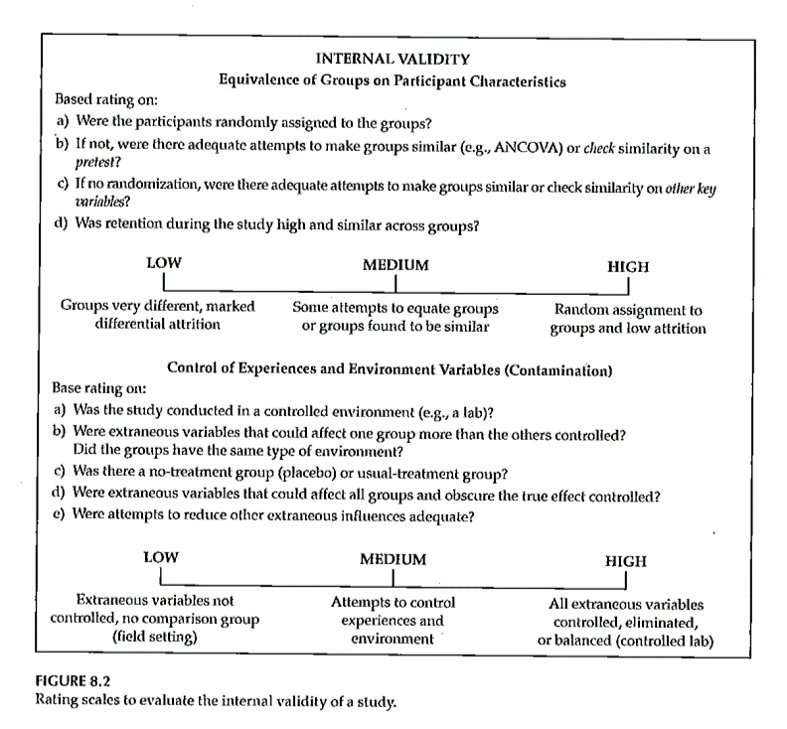
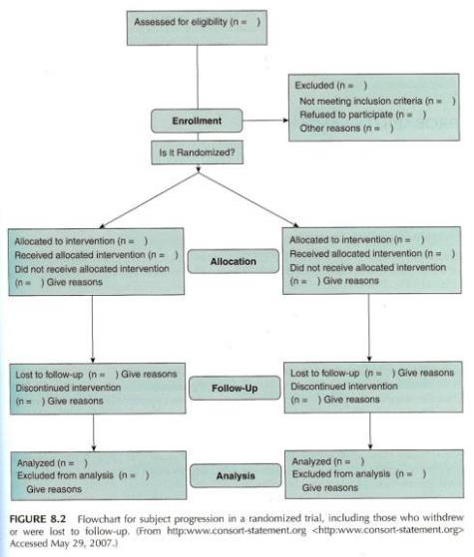

```{r echo=FALSE}
source("prelims.R", echo=FALSE)
```

***
`r read_text("objectives07")`

<div class="notes">

Here are the objectives for this week's class.

</div>

***
`r read_text("readings07")`

<div class="notes">

This is what you should have read already. If you haven't done the reading yet, pause this video and read this material. You'll get more out of the video if you do so.

</div>

***
### Validity 


<div class="notes">

Figure 8.1 has a very concise presentation. Three different types of validity that feed into what a study does. This lecture is just about internal validity. The extent to which you can infer that the independent variable caused the dependent variable.

</div>

***
### Internal Validity 

+ “The extent to which we can infer that the independent variable *caused* the dependent variable.”
	+ For non-experimental studies –
		+ How “well designed and conducted” was the study?
+ Three criteria for causality

<div class="notes">

It's really only randomized trials that can establish causality. But even in quasi-experimental and non-experimental studies, you can still talk about internal validity.

The cause has to precede the effect, it must be connected to the effect, and there must be no other variables that could explain why the cause is related to the effect.

</div>

***
### Internal Validity 

+ “The extent to which we can infer that the independent variable *caused* the dependent variable.”
+ Three criteria for causality
	+ IV *must precede* the outcome variable
	+ IV *must be related* to the outcome
	+ There must be no other variables that could explain why the IV is related to the outcome

<div class="notes">


</div>

***
### Internal Validity 

+ Three criteria for causality –
	+ IV *must precede* the outcome variable
	+ IV *must be related* to the outcome
	+ There must be no other variables that could explain why the IV is related to the outcome
+ By Research Approach –
	+ Randomized Exp
	+ Quasi- Exp
	+ Comparative
	+ Associational
	+ Descriptive

<div class="notes">


</div>

***
### Internal Validity 

```{r tbl5, echo = FALSE, eval=FALSE}
tbl5 <- tibble::tribble(
~`Criteria for Causality`, ~`Randomized Exp`, ~`Quasi-Exp`, ~`Comparative`, ~`Associational`, ~`Descriptive`,
"IV must precede the outcome variable","Met","Often met","Sometimes met, but order might not be clear","Sometimes met, but order might not be clear","NA",
"IV must be related to the outcome","Met","Usually met","Usually met","Usually met","NA",
"There must be no other variables that could explain why the IV is related to the outcome","Met","Met in the strongest designs","Not possible","Not possible","NA"
)

kableExtra::kable_styling(knitr::kable(tbl5), font_size = 18)
```

<div class="notes">

For randomized designs, the cause precedes the effect, the cause is related to the outcome and there are no other variables that could explain the relationship.

</div>

***
### Internal Validity 

+ Meeting the 3 causality criteria based on –
	+ Strength of the research design
	+ Internal validity

<div class="notes">

The strength of the research design and the internal validity determine whether you can claim causality. Try to design the study to maximize internal validity. 

</div>

***
### Internal Validity 

+ Internal validity -
	+ Most often discussed with reference to randomized experimental and quasi-experimental designs
	+ Can also be applied to non-experimental studies

<div class="notes">


</div>

***
### Internal Validity 

+ Evaluating the internal validity of a study –
	+ Equivalence of the groups on participant characteristics
	+ Control of extraneous experiences and environmental variables

<div class="notes">

There are two aspects of internal validity, equivalence and control.

</div>

***
### Internal Validity 

+ Equivalence of the groups on participant characteristics –
	+ Are groups equivalent prior to introduction of IV?
		+ Randomized experimental design –
			+ Random assignment
		+ Quasi-experimental design –
			+ Random assignment of treatments
			+ Matching
			+ Checking pretest scores

<div class="notes">

Random assignment assures equivalence of the two groups on average. A rule of thumb is 30 people assigned to each group should give you confidence that random assignment will assure equivalence. If you are using random assignment, you should not need to test for baseline equivalence. We feel that random assignment is the best way to achieve equivalence.

In quasi-experimental design, you don't have random assignment, but you can randomly assign between the two groups. You can also use matching to achieve equivalence. Finally, you can check baseline scores for equivalence.

</div>

***
### Internal Validity 

+ Equivalence of the groups on participant characteristics –
	+ Are groups equivalent prior to introduction of IV?
		+ Comparative design –
			+ Statistical adjustment (ANCOVA) to adjust DV scores to make groups more nearly equivalent
			+ Matching participants on variables other than the primary IV
				+ E.g. Case-control study
			+ Check after the study for comparability

<div class="notes">

Since non-randomized trials have an attribute variable, you need to rely on statistical adjustment or matching. You can also check after the study for comparability.

</div>

***
### Internal Validity 

+ Equivalence of the groups on participant characteristics –
	+ Are groups equivalent prior to introduction of IV?
		+ Associational design –
			+ Only 1 group
			+ Not able to provide evidence of causation
			+ “Equivalence” – “… whether those who score high on the IV … are similar to those … who score low in terms of other attributes that may be related to the DV.”
			+ May be able to provide some statistical control

<div class="notes">

Equivalence when you have a continuous independent variable means that those who score high on the variable are similar to those who score low.

</div>

***
### Internal Validity 

+ Control of extraneous experiences and environmental variables –
	+ Extraneous variables – variables other than the IV and DV
	+ Environmental variables – conditions/variables that occur during the study
	+ Contamination
	+ Issue – Is one group affected more than the other(s)?
	+ Less of an issue with a more controlled research setting

<div class="notes">

Your study could be contaminated by other variables. These variables might be out of your control but which can influence the outcome.

Contamination: people in the intervention group are friends with the control group and share information.

The key issue is whether one group is more affected by extraneous variables.

In a controlled setting, there are fewer extraneous variables, but this changes in a field setting.

</div>

***
### Internal Validity 

+ Rating the dimensions of internal validity
	+ Figure 8.2
	+ Evaluating Research Validity framework
	+ “Good” study – moderate to high internal validity on both dimensions

<div class="notes">

Internal validity is measured by whether the two dimensions are addressed.

</div>

***
### Internal Validity 



<div class="notes">

Figure 8.2. 

</div>

***
### Threats to Internal Validity 


<div class="notes">

Table 8.1 relates statistical terminology to identify threats to internal validity. This table tries to take those technical terms and express them 

Extreme groups have issues with regression to the mean. Even without any intervention, the extremities will tend to lessen.

Dropouts or attrition means that you've designed a setting that is so difficult that no one can stay in. Differential attrition is especially troublesome.

Bias in assignment occurs when patients or their physicians directly or indirectly influence the assignment. Random assignment eliminates this bias.

Cook and Campbell.

</div>

***
### Threats to Internal Validity 

+ Equivalence of Groups
	+ Use of extreme groups
	+ Participant dropouts or attrition during the study
	+ Bias in assignment to groups

<div class="notes">


</div>

***
### Threats to Internal Validity 

+ Control of extraneous/environmental variables
	+ Changes due to time or growth and development
	+ Extraneous environmental events
	+ Repeated testing, carryover effects
	+ Instrument or observer inconsistency
	+ Combinations of two or more threats
	+ Did the IV actually occur before the DV?

<div class="notes">

Here are some of the sources of extraneous variables. 

Maturation.

History. Something that occurs between the pre and post measurements that is independent of the intervention but which can influence the outcome.

Worry about sensitization to the issue in the baseline measurement that causes people to go out and find more.

Long studies have problems with instrumentation or observers (e.g., because of turnover).

There are also combinations of these events where one magnifies the other.

Temporal order of the variables. If you can't assure that the independent variable occurs before the dependent variable, you can't establish causation.

</div>

***
### Threats to Internal Validity 

+ Other threats
	+ Effects of being in the control group
	+ Expectation effect
		+ Control for expectation
	+ Observer / experimenter bias

<div class="notes">

Control group contamination. Demoralization.

Hawthorne effect.

Blinding helps control for expectation effects and observer bias.

</div>

***
### Validity 


<div class="notes">

Here is figure 8.1 again. The next part of this lecture talks about sampling and external validity.

</div>

***
### Validity 


<div class="notes">

Here is figure 8.1 again. The extent to which results will generalize.

</div>

***
### Sampling 

+ “… process of selecting *part* of a larger group of participants with the intent of generalizing from the sample (the smaller group) to the population (the larger group).”
	+ “… representativeness of the sample is more important than its size …”

<div class="notes">

Critically important in sampling is for the sample to be representative. That's even more important than the actual size of the sample.

College students are not representative of young adults.

</div>

***
### Sampling 

+ Reasons for sampling
	+ Expense
	+ Time
	+ Quality control

<div class="notes">

A small sample allows you to spend more time on quality control.

</div>

***
### Sampling 


<div class="notes">

Figure 9.1.

Target or theoretical population. From this, develop a sampling frame. Next select a sample. What you end up with are those who are selected, who agree to participate and who provide sufficient information to allow evaluation.

Response rate. A good value is context specific.

How much attrition occured and very importantly whether attrition differs between the two groups.

</div>

***
### Sampling 

+ Sampling designs – Probability sampling
	+ Simple random sampling
	+ Systematic random sampling
	+ Stratified random sampling
	+ Cluster (random) sampling

<div class="notes">

Probability sample: every person in the population has a known non-zero probability of being sample. 

Simple random sampling: equal and independent probability of being selected. Easier to achieve with an existing data.

Systematic, select a random starting point and then select the remainder using a fixed rule.

Stratification variable is divided into segments. Geographic regions, age groups, gender. That can influence the outcome.

Over sampling is done to insure decent sample size in minority groups.

Two stage selection: randomly select a cluster using a probability model and then either randomly select within a cluster or select everyone in that cluster.

</div>

***
### Sampling 

+ Sampling designs – Nonprobability sampling
	+ Quota sampling
	+ Purposive sampling
		+ Purposeful sampling
	+ Convenience sampling

<div class="notes">

Probability of being selected is unknown. Used because of cost or time constraints.

Quota: flexibility in who to select as long as certain quotas are met.

Purposive sampling. Identify characteristics that you feel are representative and search for 

Purposeful sampling is used with qualitative research.

Convenience without any planned attempt to make the sample representative. [[Maybe put this first??]]

</div>

***
### Sampling 

+ Sample size
	+ General rules
		+ Representativeness vs number
		+ Impact of having very large sample sizes
	+ Generally –
		+ Need sample to be large enough so you don’t miss important findings
		+ If very large sample, need to distinguish statistical significance vs clinically important

<div class="notes">

How many people do I need. This best done using a power analysis. Take account of the measures being used and what you expect to see. Information from previous research or other kinds of things.

Representativeness is more important than the absolute size of the sample.

Large enough so you don't miss important findings.

In cases with really large sample sizes where you get statistical significance without practical significance. Effects.

</div>

***
### External Validity 

+ Generalizability
	+ Fig. 9.3
	+ Evaluating Research Validity Framework
	+ Two main aspects
		+ Population external validity
		+ Ecological external validity

<div class="notes">

The extent to which results can be generalized beyond this study. Extrapolate to the bigger world.

Evaluating freamework (questions 14 and 15). 

Population: how participants were selected.

Ecologic validity: the more control you have, the better the internal validity but the less like it is for real world. The naturalness of the setting, rapport.

Figure 9.3. 

</div>

***
### External Validity 

+ Population external validity
	+ How participants were selected for the study?
	+ Is sample representative of the target population?
	+ Validity framework

<div class="notes">


</div>

***
### External Validity 

+ Ecological external validity
	+ Whether the results can be generalized to real-life outcomes
	+ Trade-off with control of study
	+ Validity framework

<div class="notes">


</div>

***
### External Validity 


<div class="notes">


</div>

***
### Sampling and Validity 


<div class="notes">

Figure 9.4. External validity is influenced by the sampling process. Internal validity is influenced by the allocation of this sample to treatment groups.

</div>

***
### Sampling 



<div class="notes">

Figure 8.2 from Portney & Watkins (2009), but really from the Consort statement.

Start with number assessed for eligibility. How many were enrolled. How many excluded and why. Then talk about treatment allocation. Report numbers at each follow-up point.

Moher et al publication of the Consort statement.

Review Table 1.

</div>

***
### Assignment #5 

+ Prepare a first draft of the literature review that supports your research topic and provides evidence of the significance of the topic. Submit this assignment using "Turnitin" through Blackboard.

<div class="notes">

Here are some examples of literature review. The first is a biology study. Notice that it includes subsections. It reflects a personal understanding.

Your literature review is not an annotated bibliography. Make the argument for why the study you are proposing needs to be done.

Turnitin. Will upload though a link on the Blackboard site. Turnitin takes the document that you submit and compares it to documents in the public space and gives a rating of similarity.

Two submission sites. One is a practice site. Stay under 20% similarity. It may be that your topic is such that the language appears the same in all research even though you did not plagiarize.

You will see a markup version of similarities.

Turnitin looks at student archive in addtion to the public space.

</div>

***
`r read_text("hw07", fri[7])`

<div class="notes">

Here is the homework.

</div>

***
`r read_text("discussion07", fri[7])`

<div class="notes">


</div>

***

### Additional slides