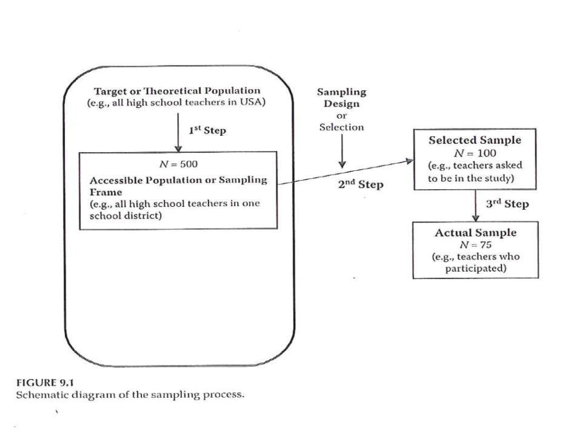
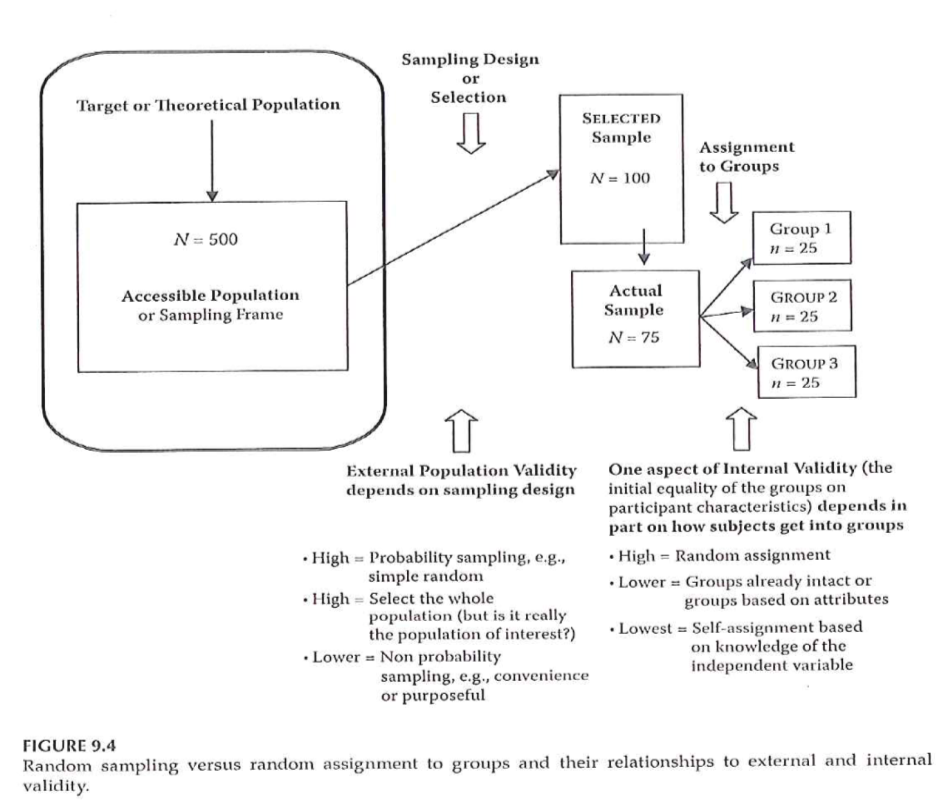

```{r echo=FALSE}
source("prelims.R", echo=FALSE)
```

***
`r read_text("objectives07")`

***
`r read_text("readings07")`

### Validity 


***
### Internal Validity 

+ “The extent to which we can infer that the independent variable *caused* the dependent variable.”
	+ For non-experimental studies –
		+ How “well designed and conducted” was the study?
+ Three criteria for causality

***
### Internal Validity 

+ “The extent to which we can infer that the independent variable *caused* the dependent variable.”
+ Three criteria for causality
	+ IV *must precede* the outcome variable
	+ IV *must be related* to the outcome
	+ There must be no other variables that could explain why the IV is related to the outcome

***
### Internal Validity 

+ Three criteria for causality –
	+ IV *must precede* the outcome variable
	+ IV *must be related* to the outcome
	+ There must be no other variables that could explain why the IV is related to the outcome
+ By Research Approach –
	+ Randomized Exp
	+ Quasi- Exp
	+ Comparative
	+ Associational
	+ Descriptive

***
### Internal Validity 

```{r tbl5, echo = FALSE, eval=FALSE}
tbl5 <- tibble::tribble(
~`Criteria for Causality`, ~`Randomized Exp`, ~`Quasi-Exp`, ~`Comparative`, ~`Associational`, ~`Descriptive`,
"IV must precede the outcome variable","Met","Often met","Sometimes met, but order might not be clear","Sometimes met, but order might not be clear","NA",
"IV must be related to the outcome","Met","Usually met","Usually met","Usually met","NA",
"There must be no other variables that could explain why the IV is related to the outcome","Met","Met in the strongest designs","Not possible","Not possible","NA"
)

kableExtra::kable_styling(knitr::kable(tbl5), font_size = 18)
```

***
### Internal Validity 

+ Meeting the 3 causality criteria based on –
	+ Strength of the research design
	+ Internal validity

***
### Internal Validity 

+ Internal validity -
	+ Most often discussed with reference to randomized experimental and quasi-experimental designs
	+ Can also be applied to non-experimental studies

***
### Internal Validity 

+ Evaluating the internal validity of a study –
	+ Equivalence of the groups on participant characteristics
	+ Control of extraneous experiences and environmental variables

***
### Internal Validity 

+ Equivalence of the groups on participant characteristics –
	+ Are groups equivalent prior to introduction of IV?
		+ Randomized experimental design –
			+ Random assignment
		+ Quasi-experimental design –
			+ Random assignment of treatments
			+ Matching
			+ Checking pretest scores

***
### Internal Validity 

+ Equivalence of the groups on participant characteristics –
	+ Are groups equivalent prior to introduction of IV?
		+ Comparative design –
			+ Statistical adjustment (ANCOVA) to adjust DV scores to make groups more nearly equivalent
			+ Matching participants on variables other than the primary IV
				+ E.g. Case-control study
			+ Check after the study for comparability

***
### Internal Validity 

+ Equivalence of the groups on participant characteristics –
	+ Are groups equivalent prior to introduction of IV?
		+ Associational design –
			+ Only 1 group
			+ Not able to provide evidence of causation
			+ “Equivalence” – “… whether those who score high on the IV … are similar to those … who score low in terms of other attributes that may be related to the DV.”
			+ May be able to provide some statistical control

***
### Internal Validity 

+ Control of extraneous experiences and environmental variables –
	+ Extraneous variables – variables other than the IV and DV
	+ Environmental variables – conditions/variables that occur during the study
	+ Contamination
	+ Issue – Is one group affected more than the other(s)?
	+ Less of an issue with a more controlled research setting

***
### Internal Validity 

+ Rating the dimensions of internal validity
	+ Figure 8.2
	+ Evaluating Research Validity framework
	+ “Good” study – moderate to high internal validity on both dimensions

***
### Internal Validity 


***
### Threats to Internal Validity 


***
### Threats to Internal Validity 

+ Equivalence of Groups
	+ Use of extreme groups
	+ Participant dropouts or attrition during the study
	+ Bias in assignment to groups

***
### Threats to Internal Validity 

+ Control of extraneous/environmental variables
	+ Changes due to time or growth and development
	+ Extraneous environmental events
	+ Repeated testing, carryover effects
	+ Instrument or observer inconsistency
	+ Combinations of two or more threats
	+ Did the IV actually occur before the DV?

***
### Threats to Internal Validity 

+ Other threats
	+ Effects of being in the control group
	+ Expectation effect
		+ Control for expectation
	+ Observer / experimenter bias

***
### Validity 


### Validity 


***
### Sampling 

+ “… process of selecting *part* of a larger group of participants with the intent of generalizing from the sample (the smaller group) to the population (the larger group).”
	+ “… representativeness of the sample is more important than its size …”

***
### Sampling 

+ Reasons for sampling
	+ Expense
	+ Time
	+ Quality control

***
### Sampling 



***
### Sampling 

+ Sampling designs – Probability sampling
	+ Simple random sampling
	+ Systematic random sampling
	+ Stratified random sampling
	+ Cluster (random) sampling

***
### Sampling 

+ Sampling designs – Nonprobability sampling
	+ Quota sampling
	+ Purposive sampling
		+ Purposeful sampling
	+ Convenience sampling

***
### Sampling 

+ Sample size
	+ General rules
		+ Representativeness vs number
		+ Impact of having very large sample sizes
	+ Generally –
		+ Need sample to be large enough so you don’t miss important findings
		+ If very large sample, need to distinguish statistical significance vs clinically important

***
### External Validity 

+ Generalizability
	+ Fig. 9.3
	+ Evaluating Research Validity Framework
	+ Two main aspects
		+ Population external validity
		+ Ecological external validity

***
### External Validity 

+ Population external validity
	+ How participants were selected for the study?
	+ Is sample representative of the target population?
	+ Validity framework

***
### External Validity 

+ Ecological external validity
	+ Whether the results can be generalized to real-life outcomes
	+ Trade-off with control of study
	+ Validity framework

***
### External Validity 


***
### Sampling and Validity 



***
### Sampling 

+ Portney & Watkins (2009)


***
### Assignment #5 

+ Prepare a first draft of the literature review that supports your research topic and provides evidence of the significance of the topic. Submit this assignment using “ Turnitin ” through Blackboard.

***
`r read_text("hw07", fri[7])`

***
`r read_text("discussion07", fri[7])`

***

### Additional slides