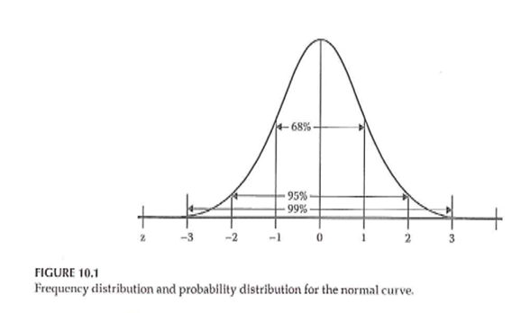

```{r echo=FALSE}
source("prelims.R", echo=FALSE)
```

***
`r read_text("objectives08")`

<div class="notes">


</div>

***
`r read_text("readings08")`

<div class="notes">


</div>

***
### Measurement 

+ What do we mean “ measurement ” ?
	+ assignment of numbers or symbols to the different levels or values of variables according to rules. ” 

<div class="notes">


</div>

***
### Measurement 

+ Assigning a number to represent …
	+ Continuous value
	+ Discrete value
+ Precision of measurement
	+ Continuous variable …
	+ Discrete variable …

<div class="notes">


</div>

***
### Measurement 

+ What is the measurement representing?
	+ Actual measurement …
		+ Length, time, …
	+ Indirect measurement
		+ Constructs
+ Whatever you are trying to measure ..
	+ Must be able to define it!

<div class="notes">


</div>

***
### Measurement 

+ Traditional levels (scales) of measurement
	+ Nominal
	+ Ordinal
	+ Interval
	+ Ratio

<div class="notes">


</div>

***
### Measurement 

+ Authors categorization of levels of measurement
	+ Nominal
	+ Dichotomous
	+ Ordinal
	+ Normally distributed
+ Table 10.1

<div class="notes">


</div>

***
### Measurement 


<div class="notes">


</div>

***
### Measurement 


<div class="notes">


</div>

***
### Measurement 

+ Why does the scale of measurement matter?
	+ How it reflects your design and your research question
	+ How it determines the types of statistical analyses you will do
	+ How it defines what you can say about your results

<div class="notes">


</div>

***
### Descriptive Statistics 



<div class="notes">


</div>

***
### Descriptive Statistics 

+ Descriptive graphs
	+ How to look at your data
	+ Options for viewing your data
		+ Frequency polygons
		+ Histograms
		+ Bar charts

<div class="notes">


</div>

***
### Descriptive Statistics 


<div class="notes">


</div>

***
### Descriptive Statistics 

+ Measures of central tendency
	+ Mean
	+ Median
	+ Mode

<div class="notes">


</div>

***
### Descriptive Statistics 

+ Measures of variability
	+ Range
	+ Standard deviation
	+ Interquartile range
	+ How many categories

<div class="notes">


</div>

***
### Descriptive Statistics 

+ Measures of association between 2 variables
	+ Correlation
		+ Pearson
		+ Spearman
	+ Cross-tabulation
	+ Scatterplot

<div class="notes">


</div>

***
### Descriptive Statistics 


<div class="notes">


</div>

***
### Descriptive Statistics 


<div class="notes">


</div>

***
### Descriptive Statistics 


<div class="notes">


</div>

***
### Descriptive Statistics 

+ Properties of the normal curve
	+ Unimodal
	+ Mean, median, and mode are equal
	+ Symmetric curve (skew)
	+ Range is infinite
	+ Shape – not too peaked or flat (kurtosis)

<div class="notes">


</div>

***
### Descriptive Statistics 


<div class="notes">


</div>

***
### Descriptive Statistics 

+ Standard normal curve
	+ Definition
	+ How to compute
	+ Effect size

<div class="notes">


</div>

***
### Measurement & Descriptive Statistics 


<div class="notes">


</div>

***
### Assignment #6 

+ Prepare a brief paragraph that describes the research design you are using for your research proposal. This is the information that will probably appear in the Methods section of your proposal.

<div class="notes">


</div>

***
`r read_text("hw08", fri[8])`

<div class="notes">


</div>

***
`r read_text("discussion08", fri[8])`

<div class="notes">


</div>

***

### Additional slides