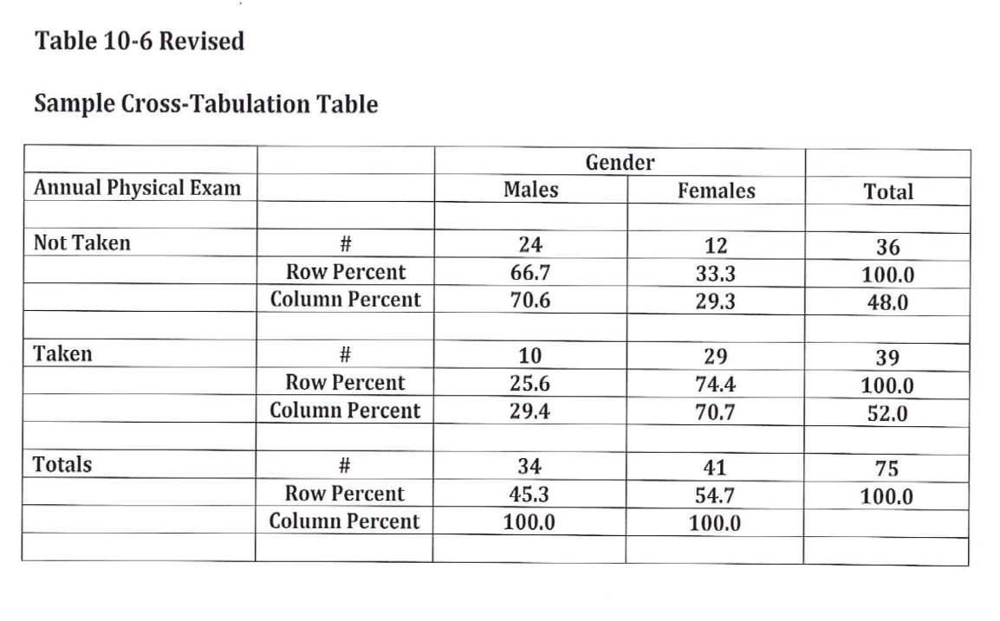
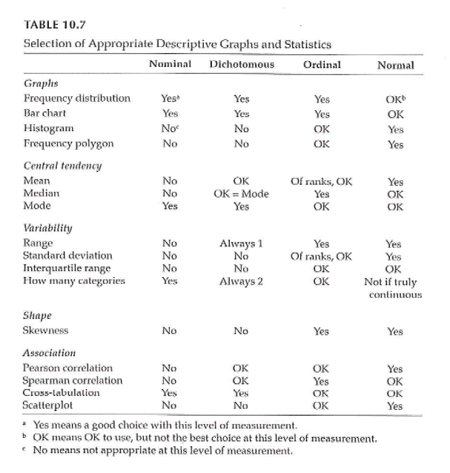

```{r echo=FALSE}
source("prelims.R", echo=FALSE)
```

***
`r read_text("objectives08")`

<div class="notes">

Here are the objectives for this week.

</div>

***
`r read_text("readings08")`

<div class="notes">

This is what you should have read already. If you haven't done the reading yet, pause this video and read this material. You'll get more out of the video if you do so.

</div>

***
### Additional issues to discuss

* Pilot studies

* Historical controls

* Questionnaires. http://www.pmean.com/02/questionnaire.html

* Validity. http://www.pmean.com/02/validity.html
***
### Measurement 

+ What do we mean “ measurement ” ?
	+ assignment of numbers or symbols to the different levels or values of variables according to rules. ” 

<div class="notes">

We are talking about measurement this week. You are either taking stats or have taken it in the past. This is not a statistics class. Think about what type of variables you will collect and propose what statistical analysis.

Your book defines it as the assignment of numbers or symbols. Notice that this takes a quantitative approach. But even in a qualitative study, you still going to want to summarize information like demographics of your sample. Describe the quality or quantity of a variable.

There are qualitative or quantitative ways to measure things like pain.

We can also use measurements to make absolute decisions. Establish a cut-point. 

Conditions, distinctions.

</div>

***
### Measurement 

+ Assigning a number to represent …
	+ Continuous value
	+ Discrete value
+ Precision of measurement
	+ Continuous variable …
	+ Discrete variable …

<div class="notes">

Value that is assigned can take on any value. Preciseness is dependent on the device used to collect the measurement. It could be the precision of a laser versus a cruder measure. Precision should be appropriate to what you are trying to get at. Lack precision does not mean that your results are not continuous. If you round to the nearest inch, you still are measuring an underlying construct that can take on more precision. Example is blood pressure, interbeat interval, where rounding is done but it still represents a continuous variable.

Discrete values because of rounding, using counts, or a limited number of categories. As long as it represents an underlying construct, consider it as continuous.

</div>

***
### Measurement 

+ What is the measurement representing?
	+ Actual measurement …
		+ Length, time, …
	+ Indirect measurement
		+ Constructs
+ Whatever you are trying to measure ..
	+ Must be able to define it!

<div class="notes">

A survey or scale to get at depression, pain, those kind of things. These are abstract variables.

Bottom line is to define and operationalize how you measure something. It's easy to say something like quality of life but you have to pin this down and establish measurement validity. Consistency is important to avoid measurement bias.

Even for pretty obvious values like blood pressure, there are different ways to measure and you need to choose a single method for consistency and careful control, and when there are multiple methods, chose the method that is optimal for your needs. Blood pressure, for example, can be influenced by whether you are sitting or standing and whether you are talking while the measurement is being done.

Formalizing the rules for measurement helps reduce bias. This is a real concern when you have a variety of people doing the same measurements. How are new hires trained? Can you verify that they are trained to the standard that you have promised.

</div>

***
### Measurement 

+ Traditional levels (scales) of measurement
	+ Nominal
	+ Ordinal
	+ Interval
	+ Ratio

<div class="notes">

Nominal means names, classification, or categorical assignment. Names are mutually exclusive and exhaustive. Value that is shown is a number code or a text word. 

Ordinal is similar to nominal plus some orderliness as to what those responses mean. Example five point scale.

There is no true zero point. Can't perform arithmetic operatitons on ordinal variables.

You can talk about the direction of change.

Interval - difference between levels is consistent across the range of the scale.

Ratio. There is a true zero point.

</div>

***
### Measurement 

+ Authors categorization of levels of measurement
	+ Nominal
	+ Dichotomous
	+ Ordinal
	+ Normally distributed
+ Table 10.1

<div class="notes">

Gliner et al have a slightly different take. They talk about a normally distributed scale. It is hard to talk about the difference between ordinal and interval. 

Look at the literature in the area you work with. Several Likert scales summed to get a subscale.

</div>

***
### Measurement 


<div class="notes">

Table 10.1. This scale splits nominal into those with two levels (dichotomous, also known as binary) and more than two levels (nominal).

Remember how you coded nominal variables. You can (and should) use zero-one coding for dichotomous variables.

The average of a zero-one coded variable represents a probability.

Approximately normal scale requires at least five levels accorind to Gliner et al.

</div>

***
### Measurement 


<div class="notes">

Table 10.3 gives examples of the Gliner et al scales.

</div>

***
### Measurement 

+ Why does the scale of measurement matter?
	+ How it reflects your design and your research question
	+ How it determines the types of statistical analyses you will do
	+ How it defines what you can say about your results

<div class="notes">

The level of measurement comes from what you are trying to get at in your research.

Measurement scales can limit what you can say about your results.

</div>

***
### Descriptive Statistics 


<div class="notes">

Figure 10.1 shows the standard bell shaped curve.

</div>

***
### Descriptive Statistics 

+ Descriptive graphs
	+ How to look at your data
	+ Options for viewing your data
		+ Frequency polygons
		+ Histograms
		+ Bar charts

<div class="notes">

Even for a qualitative study, you'll still want to describe characteristics of your sample.

For a fancier inferential analysis, you still should start with a descriptive analysis.

</div>

***
### Descriptive Statistics 


<div class="notes">

Figures 10.2 and 10.3.

Frequency polygon has a line connecting values and implicitly represents a normal distribution.

</div>

***
### Descriptive Statistics 

+ Measures of central tendency
	+ Mean
	+ Median
	+ Mode

<div class="notes">

These terms should already be familiar to you. The mean is the best choice for approximately normal distribution. The median is better for non-normal continuous variables and ordinal variables.

</div>

***
### Descriptive Statistics 

+ Measures of variability
	+ Range
	+ Standard deviation
	+ Interquartile range
	+ How many categories

<div class="notes">

The standard deviation is considered a poor measure of variability for a non-normal population. The interquartile is the difference between the 75th percentile and the 25th percentile. Define the 25th percentile as the value so that approximately 25% of the values are smaller and 75% are larger.

</div>

***
### Descriptive Statistics 

+ Measures of association between 2 variables
	+ Correlation
		+ Pearson
		+ Spearman
	+ Cross-tabulation
	+ Scatterplot

<div class="notes">

A correlation is a value between -1 and +1. There are two versions. Use Spearman for non-normal or ordinal variables.

Cross-tabulation is best for nominal and ordinal variables.

</div>

***
### Descriptive Statistics 


<div class="notes">

Figure 10.4 shows the relationship between grade level and performance on a math achievement test. It shows a trend line and an R-squared value.

Note that this is an association but not necessarily a causal relationship. Knowledge of one variable helps you predict the other.

</div>

***
### Descriptive Statistics 


<div class="notes">

Figure 10.5 shows a much weaker relationship between grade level and motivation scale. The trend line is flat and the R-squared value is small.

</div>

***
### Descriptive Statistics 



<div class="notes">

Table 10.6 shows a cross-tabulation. Mary revised this to include row and column percentages. Orient towards the row totals or the column totals. Row percentages add up to 100% within each row and column percentages add up to 100% within each row.

You might compute both row and column percentages, but only include one in your final table.

</div>

***
### Descriptive Statistics 

+ Properties of the normal curve
	+ Unimodal
	+ Mean, median, and mode are equal
	+ Symmetric curve (skew)
	+ Range is infinite
	+ Shape – not too peaked or flat (kurtosis)

<div class="notes">

This is not a Statistics class, but is intended to help you decide how to choose analyses for your research plan.

There are five properties. Unimodal, symmetric (no skewness), infinite range, peakedness or flatness tells you information about the tendency to produce outliers.

[[Talk about range restrictions.]]

</div>

***
### Descriptive Statistics 


<div class="notes">

Figure 10.1 (normal curve) again.

</div>

***
### Descriptive Statistics 

+ Standard normal curve
	+ Definition
	+ How to compute
	+ Effect size

<div class="notes">

Set the mean to zero and a standard deviation of one. The standard normal curve is useful for effect size calculations and power analysis.

</div>

***
### Measurement & Descriptive Statistics 



<div class="notes">

Table 10.7. This is a great table that tells you what graphical and numeric summaries are appropriate for what types of data. This doesn't address the statistical tests (inferential analyses).

</div>

***
### Assignment #6 

+ Prepare a brief paragraph that describes the research design you are using for your research proposal. This is the information that will probably appear in the Methods section of your proposal.

<div class="notes">

Go back are refer to Figure 4.1. Week 8 activities relate to the exemplar articles. These are on the Canvas site. There are six included. Pick one and get familiar with it.

</div>

***
`r read_text("hw08", fri[8])`

<div class="notes">


</div>

***
`r read_text("discussion08", fri[8])`

<div class="notes">


</div>

***

### Additional slides