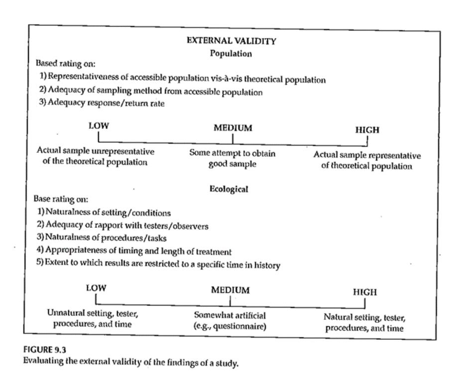
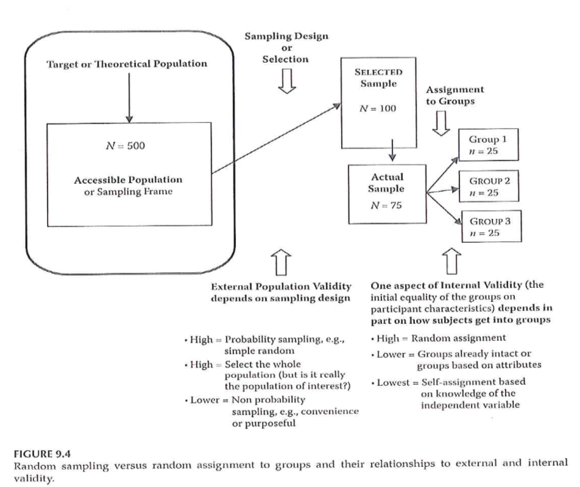
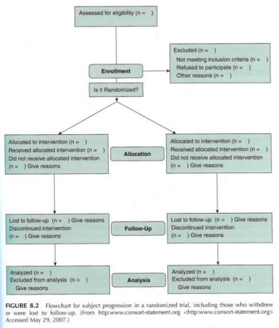
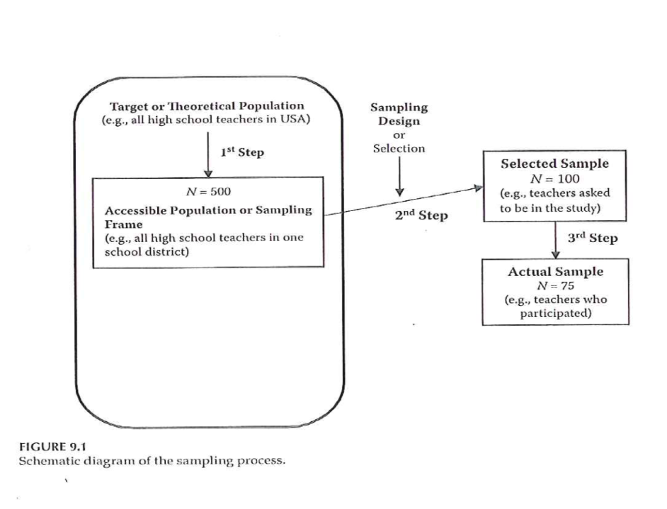

```{r echo=FALSE}
source("prelims.R", echo=FALSE)
```

***
`r read_text("objectives08")`

<div class="notes">

Here are the objectives for this week.

</div>

***
`r read_text("readings08")`

<div class="notes">

This is what you should have read already. If you haven't done the reading yet, pause this video and read this material. You'll get more out of the video if you do so.

</div>


### Additional issues to discuss

* Pilot studies

* Historical controls

* Questionnaires. http://www.pmean.com/02/questionnaire.html

### Sampling 

+ “… process of selecting *part* of a larger group of participants with the intent of generalizing from the sample (the smaller group) to the population (the larger group).”
	+ “… representativeness of the sample is more important than its size …”

<div class="notes">

Critically important in sampling is for the sample to be representative. That's even more important than the actual size of the sample.

College students are not representative of young adults.

</div>

***
### Sampling 

+ Reasons for sampling
	+ Expense
	+ Time
	+ Quality control

<div class="notes">

A small sample allows you to spend more time on quality control.

</div>

***
### What is a population?

* A group of people or objects that share one or more common features.
  + Demography
  + Geography
  + Occupation
  + Time
  + Care requirements
  + Diagnosis

<div class="notes">

A population is a group of people or objects, but in this class, we'll almost always talk about people. There are a few exceptions. Some of the problems that we study involve a population of hospital visits and that is not quite the same thing as a population of people who visit hospitals because some people visit a hospital more than once.

The population shares one or more common features. I got this list somewhere and I can't remember where, but it is a great list of the common characteristics of a population, from the perspective of health care.

</div>

### What is a sampling frame

* Physical list
  + Ideally everyone or almost everyone in population
  + Used to draw your sample

<div class="notes">

A sampling frame is a physical list associated with a population. It should include everyone (everything) in the population, but that's an ideal that is often difficult to meet.

Because it is a physical list, you can draw a sample from it.

</div>

### What is a sample?

* A sample is a subset of a population
* Random sample
  + Everyone has same selection probability
* Non-random sample
  + Different selection probabilities
  + Some may have zero selection probability

<div class="notes">

A sample is a subset of a population. It is usually smaller and easier to manage than the entire population.

A random sample is a sample where every individual (or every object) in the population has the same probabilitiy of being selected.

A random sample is an ideal which is rarely met perfectly, but sometimes you can get pretty close to this ideal. A random sample requires a sampling frame that is a complete list within the population.

A non-random sample is a sample where the probability of selection varies. A few lucky people might have a higher probability of being selected than others. There may be others who have a lower selection probability. Maybe they are trying to hide from you. Maybe they have caller id and they try to screen their calls. Maybe they work odd hours and are difficult to track down.

For any sample, always ask yourself "Who was left out?" if certain people in your sample have a zero probability of being selected, think long and hard about what this means.

</div>

### Extreme example:  World War II bombers


<div class="notes">

There was a statistician, Abraham Wald, who was asked to help out during World War II with a sampling problem.

A lot of bombers were not returning from their missions, so the Royal Air Force wanted to put armor on the bombers. But where to put it? They couldn't put it everywhere because it would be too heavy to take off. Even a little bit of extra armor was troublesome because it would decrease the total wieght of bombs that they might carry.

So Dr. Wald looked at the planes that returned and noted where they had holes from enemy fire. These holes were distributed more or less randomly throughout the plane except for two regions where there was nothing. This image, which was taken from the 1998 Howard Wainer article that I mention in the recommended readings, shows where there was nothing: in the middle of the plane between the two wings and underneath the tail.

His recommendation was to place the armor only in those two areas. This seems counterintuitive, which is why it makes such a good puzzle.

This mathematician hypothesized that any plane hit in those regions did not survive to return. The other areas could be hit and the plane could still limp back to safety. This is an example of selection bias. The bombers in the study were not a random sample of all bombers, they were a sample of bombers that returned safely. 

</div>

### Example: in school survey of drug use in teenagers

* Who has lower selection probability?
* Who has a zero selection probability?
* Can you redefine your population?

<div class="notes">

Suppose you are interested in a survey of teenagers in your community. You go to a high school and select a sample of students.

Who has a lower selection probability? Students with a chronic illness, because they tend to miss a lot of days of school.

Who has a zero selection probability? Home-schooled teenagers, for one, and dropouts for another.

Now is this a terrible thing? Students with a chronic illness probably have a different drug use pattern (both legal and illegal drugs) than most other studients. I'm not sure about home-schooled students, but students who have dropped out of high school almost certainly have a different drug use pattern.

But think about it from a high school principal's perspective. He or she might be interested only in drug use patterns among students who attend school, so the omission of home schooled students and dropouts may not be an issue.

What you should do, perhaps, is to redefine your population more narrowly when you recognize problems with differential selection probabilities.

</div>

### Example: prisoner IQ study

* Hypothetical study
  + Calculate average IQ of prisoners 
  + Lower than general public
* Conclude: criminals less intelligent than honest people.

<div class="notes">

This is a silly example, perhaps, but consider a hypothetical study where you give IQ tests to a random sample of prisoners. You find that the average IQ in this group is lower than the average IQ in the general public.

That seems reasonable enough, but what conclusion can you draw? You might be tempted to conclude that criminals have a lower IQ than honest people.

Maybe, but keep in mind that you won't find every criminal in prison. A better conclusion might be that criminals who get caught are dumber than criminals who don't get caught.

</div>

### Sampling 

* Sampling designs – Probability sampling
	+ Simple random sampling
	+ Systematic random sampling
	+ Stratified random sampling
	+ Cluster (random) sampling

<div class="notes">

Probability sample: every person in the population has a known non-zero probability of being sample. 

Simple random sampling: equal and independent probability of being selected. Easier to achieve with an existing data.

Systematic, select a random starting point and then select the remainder using a fixed rule.

Stratification variable is divided into segments. Geographic regions, age groups, gender. That can influence the outcome.

Over sampling is done to insure decent sample size in minority groups.

Two stage selection: randomly select a cluster using a probability model and then either randomly select within a cluster or select everyone in that cluster.

</div>

***
### Sampling 

+ Sampling designs – Nonprobability sampling
	+ Quota sampling
	+ Purposive sampling
		+ Purposeful sampling
	+ Convenience sampling

<div class="notes">

Probability of being selected is unknown. Used because of cost or time constraints.

Quota: flexibility in who to select as long as certain quotas are met.

Purposive sampling. Identify characteristics that you feel are representative and search for 

Purposeful sampling is used with qualitative research.

Convenience without any planned attempt to make the sample representative. [[Maybe put this first??]]

</div>

***
### Sampling 

+ Sample size
	+ General rules
		+ Representativeness vs number
		+ Impact of having very large sample sizes
	+ Generally –
		+ Need sample to be large enough so you don’t miss important findings
		+ If very large sample, need to distinguish statistical significance vs clinically important

<div class="notes">

How many people do I need. This best done using a power analysis. Take account of the measures being used and what you expect to see. Information from previous research or other kinds of things.

Representativeness is more important than the absolute size of the sample.

Large enough so you don't miss important findings.

In cases with really large sample sizes where you get statistical significance without practical significance. Effects.

</div>

***
### External Validity 

+ Generalizability
	+ Fig. 9.3
	+ Evaluating Research Validity Framework
	+ Two main aspects
		+ Population external validity
		+ Ecological external validity

<div class="notes">

The extent to which results can be generalized beyond this study. Extrapolate to the bigger world.

Evaluating freamework (questions 14 and 15). 

Population: how participants were selected.

Ecologic validity: the more control you have, the better the internal validity but the less like it is for real world. The naturalness of the setting, rapport.

Figure 9.3. 

</div>

***
### External Validity 

+ Population external validity
	+ How participants were selected for the study?
	+ Is sample representative of the target population?
	+ Validity framework

<div class="notes">


</div>

***
### External Validity 

+ Ecological external validity
	+ Whether the results can be generalized to real-life outcomes
	+ Trade-off with control of study
	+ Validity framework

<div class="notes">


</div>

***
### External Validity 



<div class="notes">


</div>

***
### Sampling and Validity 



<div class="notes">

Figure 9.4. External validity is influenced by the sampling process. Internal validity is influenced by the allocation of this sample to treatment groups.

</div>

***
### Sampling 



<div class="notes">

Figure 8.2 from Portney & Watkins (2009), but really from the Consort statement.

Start with number assessed for eligibility. How many were enrolled. How many excluded and why. Then talk about treatment allocation. Report numbers at each follow-up point.

Moher et al publication of the Consort statement.

Review Table 1.

</div>

***
### Assignment #5 

+ Prepare a first draft of the literature review that supports your research topic and provides evidence of the significance of the topic. Submit this assignment using "Turnitin" through Blackboard.

<div class="notes">

Here are some examples of literature review. The first is a biology study. Notice that it includes subsections. It reflects a personal understanding.

Your literature review is not an annotated bibliography. Make the argument for why the study you are proposing needs to be done.

Turnitin. Will upload though a link on the Blackboard site. Turnitin takes the document that you submit and compares it to documents in the public space and gives a rating of similarity.

Two submission sites. One is a practice site. Stay under 20% similarity. It may be that your topic is such that the language appears the same in all research even though you did not plagiarize.

You will see a markup version of similarities.

Turnitin looks at student archive in addtion to the public space.

</div>

***
`r read_text("hw07", fri[7])`

<div class="notes">

Here is the homework.

</div>

***
`r read_text("discussion07", fri[7])`

<div class="notes">


</div>

***

### Additional slides

### Next



Figure 9.1.

Target or theoretical population. From this, develop a sampling frame. Next select a sample. What you end up with are those who are selected, who agree to participate and who provide sufficient information to allow evaluation.

Response rate. A good value is context specific.

How much attrition occured and very importantly whether attrition differs between the two groups.

</div>

***
