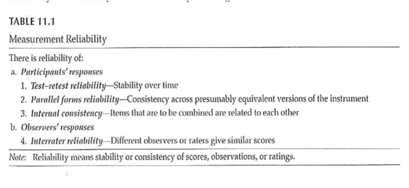

```{r echo=FALSE}
source("prelims.R", echo=FALSE)
```

***
`r read_text("objectives09")`

<div class="notes">

Here are the objectives for this week.

</div>

***
`r read_text("readings09")`

<div class="notes">

This is what you should have read already. If you haven't done the reading yet, pause this video and read this material. You'll get more out of the video if you do so.

</div>

***
### Measurement 

+ “Study quality also depends on the *consistency* (measurement reliability) and *accuracy* (measurement validity) of the specific instruments …”

<div class="notes">

The two articles Green et al, Ratliff et al will be the focus of discussion activities. Conistent and free from error, reproducible. It is measuring what it is intended to measure.

</div>

***
### Measurement Reliability 

+ What is measurement reliability?
	+ “… consistency of a series of measurements. ( Cronbach )
	+ “… a property of scores and is not immutable across all conceivable uses of a given measure.” (Thompson)
+ Importance – without reliable measures, can’t have confidence in study results.

<div class="notes">

We can expect consistent responses. It is able to produce with predictable consistency over time. Without reliability, you have to worry about what the study is telling you.

Suppose you are measuring change from baseline. Unless the scores change in a predictable way. Otherwise, you won't know if the changes are related to the intervention or if they represent random variation.

</div>

***
### Measurement Reliability 

+ Example – Want to determine change in some relevant measure after treatment/intervention.
	+ Baseline measure
	+ Treatment
	+ Follow-up measure
+ C hange from baseline to follow-up –
	+ Due to effect of treatment?
	+ Due to random variation in the measure?

<div class="notes">


</div>

***
### Measurement Reliability 

+ Observe score
	+ Lab value
	+ Test result
	+ Self-report measure
+ Classical test theory
	+ Observed score = True score + Error
+ Change in value – due to change in true score or error?

<div class="notes">

We don't expect the observed scores to have perfect reliability. There is some fallibility. Something random can occur and people are not always consistent in how they answer things. Measurement error (noise) is messing things up. You want the observed score to reflect the true score more than error.

Systematic error move in a consistent direction. You can often correct for this using calibration. It is often not a problem for reliability, but it will affect validity.

Random errors are errors due to chance. They have unpredictable effects. They usually occur due to unpredictable factors. Less random error means that the observed score more truly affects the underlying true score.

Errors could be due to observer making an error. It is really important to follow established protocols.

Resting heart rate could be influenced by a loud noise, for example. You would hope that this occurs randomly.

</div>

***
### Measurement Reliability 

+ Goal – Use measure that
	+ Best reflects the true score
	+ As little “error” as possible
	+ As “reliable” as possible
+ Measurement reliability –
	+ Coefficient
	+ Ratio – True score / Observed score

<div class="notes">

The reliability coefficient is a ratio of the true score to the observed score.

</div>

***
### Measurement Reliability 

+ How much confidence can we have that the measure we obtain reflects the true score?
	+ Reliability of the measure
	+ How variable is the measure
+ Standard error of measurement –
	+ Allows you to “… establish a range of scores (i.e., confidence interval) within which should lie … true score.”

<div class="notes">

Suppose you want to get at a person's level of functioning. If the functioning does not change, then the measure does not change. When functioning does change, you want to the measure to change as well.

The standard error places bounds on where the true score lies.

</div>

***
### Measurement Reliability 

+ Standard error of measurement –
	+ SEM = SD * SqRt (1 – r)
		+ SEM – Standard error of measurement
		+ SD – standard deviation
		+ r – correlation coefficient
			+ r – indication of the relationship between 2 measures

<div class="notes">


</div>

***
### Measurement Reliability 

+ In order to know the range of true scores that are indicated by the observed score –
	+ Need the SEM to compute a confidence interval around the observed score
	+ Confidence interval –
		+ U sually 95% CI (2 standard deviations)
		+ To have 95% confidence that the range will include the true score

<div class="notes">


</div>

***
### Measurement Reliability 

+ Example – Intelligence test #1
	+ SD = 15; r = .92
	+ SEM = 4.24
	+ Observed score = 110
	+ 95% CI <U+F0E8> SEM * 1.96 (z score for 2 SD)
	+ 95% CI <U+F0E8> Observed +/- SEM * 1.96
	+ 95% CI <U+F0E8> 101.68 – 118.32
	+ Range of scores that includes the true score given 95% CI

<div class="notes">

r is the reliability coefficient.

</div>

***
### Measurement Reliability 

+ Example – Intelligence test #2
	+ SD = 15; r = .65 (less reliable measure)
	+ SEM = 8.87
	+ Observed score = 110
	+ 95% CI <U+F0E8> SEM * 1.96 (z score for 2 SD)
	+ 95% CI <U+F0E8> Observed +/- SEM * 1.96
	+ 95% CI <U+F0E8> 92.61 – 127.61
	+ Range of scores that includes the true score given 95% CI

<div class="notes">

If the reliability is lower, then the range of scores is much wider.

</div>

***
### Measurement Reliability 

+ Correlation coefficient
	+ For measurement reliability, general rules –
		+ “reliable”	.7 to 1.0
	+ More strict criteria
		+ > = .90	for measures used to make decisions about individuals
		+ .80		acceptable for research
		+ .70 - .80	somewhat lower than desirable
	+ In practice
		+ Measures used with reliability of .60 and higher

<div class="notes">

It's not unusual to see reliabilities as low as 0.7 or even 0.6.

</div>

***
### Measurement Reliability 

+ Test-retest
+ Parallel forms
+ Internal consistency
	+ Split-half
	+ Kuder -Richardson 20
	+ Cronbach’s alpha
+ Interrater
	+ Percentage agreement methods
	+ Intraclass correlation coefficients
	+ Interrater

<div class="notes">

Reliability is usually established when a measure is developed. When you go about using a measure, look at what's already been published. Is it used in a context similar to yours. Was the time frame for test-retest reliability comparable to your time frames?

Test-retest reliability is the coefficent of stability (repeatability). This only makes sense in settings where you expect things to remain stable.

Intelligence is likely to be stable along long time frames but mood changes rapidly.

What size interval would you expect the measure to be stable?

Parallel forms, alternate forms. If you are concerned that information known at baseline, just that process of collecting that data might have an influence. You can get at this with using different items, reordering items.

Homogeneity of scale. The extent to which the items are measuring the same underlying construct.

Split half, compare first half versus second half, odd items versus even items, random items. It is not necessarily easy to do because you have to believe that the two items are comparable. Also when you reduce the number of items, this influences the reliability. The Spearman-Brown formula adjusts for this.

</div>

***
### Measurement Reliability 

+ Measurement reliability
	+ Generally established when a measure is developed
+ For your study
	+ Check past reliability of measure
	+ If test-retest, is time period comparable?
	+ Is sample comparable?
	+ Report both established reliability AND reliability coefficient found in your study

<div class="notes">


</div>

***
### Measurement Reliability 

+ Test-retest
+ Parallel forms
+ Internal consistency
	+ Split-half
	+ Kuder -Richardson 20
	+ Cronbach’s alpha
+ Interrater
	+ Percentage agreement methods
	+ Intraclass correlation coefficients
	+ Interrater

<div class="notes">


</div>

***
### Measurement Reliability 

+ Test – retest reliability
	+ Coefficient of stability ( Cronbach )
	+ Test score will be stable if measured at different time points
		+ Timing of testing interval is critical
	+ Test-retest reliability – previously established
	+ Concern if reliability is < .70

<div class="notes">

The average of all possible split half items. It is used with interval response scale.

</div>

***
### Measurement Reliability 

+ Test-retest
+ Parallel forms
+ Internal consistency
	+ Split-half
	+ Kuder -Richardson 20
	+ Cronbach’s alpha
+ Interrater
	+ Percentage agreement methods
	+ Intraclass correlation coefficients
	+ Interrater

<div class="notes">

Before you go into this assess the intra-rater reliability. Consistency of a single rater.

Look at percent agreement. How many different events are you going to have raters code for.

</div>

***
### Measurement Reliability 

+ Parallel forms reliability
	+ Addresses concerns about “testing” or “carryover” effects
	+ Second or parallel form
		+ Reordering the items
		+ New items
	+ Reliability coefficient of at least .80 is desirable

<div class="notes">


</div>

***
### Measurement Reliability 

+ Test-retest
+ Parallel forms
+ Internal consistency
	+ Split-half
	+ Kuder -Richardson 20
	+ Cronbach’s alpha
+ Interrater
	+ Percentage agreement methods
	+ Intraclass correlation coefficients
	+ Interrater

<div class="notes">


</div>

***
### Measurement Reliability 

+ Internal consistency – Split-Half method
	+ Correlate 2 halves of the same test/survey
		+ 1 st half vs 2 nd half
		+ Odd items vs even items
		+ Random sample of half the items vs the other half
	+ Issue – reducing ###of items
		+ Reduces strength of relationship
		+ Underestimate reliability
		+ Adjust using the Spearman-Brown formula

<div class="notes">


</div>

***
### Measurement Reliability 

+ Internal consistency – Kuder -Richardson 20
	+ Measures inter-item reliability
	+ Assuming instrument measures a single trait/construct
	+ Dichotomous item score

<div class="notes">


</div>

***
### Measurement Reliability 

+ Internal consistency – Cronbach’s Alpha
	+ Measures inter-item reliability
	+ Assuming instrument measures a single trait/construct
	+ Interval response scale
	+ Alpha values .70 and higher - acceptable

<div class="notes">


</div>

***
### Measurement Reliability 

+ Test-retest
+ Parallel forms
+ Internal consistency
	+ Split-half
	+ Kuder -Richardson 20
	+ Cronbach’s alpha
+ Interrater
	+ Percentage agreement methods
	+ Intraclass correlation coefficients
	+ Interrater

<div class="notes">


</div>

***
### Measurement Reliability 

+ Interrater Reliability – Percentage Agreement
	+ Two or more raters
	+ Agreement on what will be rated
	+ Each person rates independently
	+ Compute ratio of agreement
	+ Issue –
		+ Agreement on ###of events
		+ Agreement on when events occurred?

<div class="notes">


</div>

***
### Measurement Reliability 

+ Interrater Reliability – Intraclass Correlation Coefficients (ICCs)
	+ Calculate reliability coefficient for more than 2 raters
	+ Must have interval response scale
	+ Computation – ANOVA with repeated measures
		+ How related are the rating by different raters?

<div class="notes">


</div>

***
### Measurement Reliability 

+ Interrater Reliability – Kappa
	+ Calculate reliability coefficient for 2 or more  raters
	+ Nominal data
	+ Compute agreement between 2 raters, taking into account “ marginals ”

<div class="notes">

Kappa goes into more than agreement. Compares agreement to the amount expected by chance.

</div>

***
### Measurement Reliability 



<div class="notes">

From the textbook. Table 11.1. Some get at participant responses. Some get at observer responses.

</div>

***
### Measurement Reliability 

+ Theories
	+ Classical test theory
		+ Observed = True score + random error
	+ Generalizability theory
		+ Different components of error
			+ Random error
			+ Test-retest error
			+ Rater error
			+ Other identifiable sources of error
	+ Item response theory
		+ Separate test characteristics from participant characteristics

<div class="notes">

Generalizability theory gets at reliability differently from classical test theory. It looks at facets of reliability.

No one coefficient provides a complete assessment of reliability.

The third theory is item response theory separates test itmes from participant characteristics. All items are not equally revealing.

IRT useful for intelligence tests.

</div>

***
### Measurement Validity 

+ “… establishing evidence for the use of a particular measure or instrument in a particular setting with a particular population for a specific purpose.”
+ Providing evidence for validity
	+ NOT “test is valid” or “test is invalid”
+ MUST have reliable measure before you can have validity
	+ May have reliability without validity

<div class="notes">

When we develop measures it is with respect to discrimination, evaluation, or prediction. What is the measure intended for? Establishing validity isn't as simple as establishing validity.

Validity implies that the measure is relatively free from error.

</div>

***
### Measurement Validity 

+ Evidence of validity reported when measure is developed
	+ Not routinely reported in research reports when measure is used
+ Types of evidence for validity –
	+ Content
	+ Response processes
	+ Internal structure
	+ Relations to other variables
	+ Consequences

<div class="notes">

You are really interested in reflecting the underlying construct. If the hypothesis is not supported, could it be the measurement at fault?

You don't see ongoing evidence of validity. What is already out in the literature.

if you are using a measure in a very different context. For instance, if nobody has used this measure in a population, you might want a second measure that has been established.

</div>

***
### Measurement Validity 

+ Content evidence –
	+ “… whether the content that makes up the instrument is representative of the concept that one is attempting to measure.”
	+ Include major aspects of the concept
	+ Does not include irrelevant material

<div class="notes">

Is the content of the evidence is consistent with what you expect.

[[Face validity versus content validity]]

It represents model. Not influenced by things like literacy factors.

This is determined subjectively by a panel of experts. Needs to be an agreement and common understanding.

</div>

***
### Measurement Validity 

+ Content evidence –
	+ Definition of the concept
	+ Literature search to determine how concept has been measured previously
	+ Generate items to represent concept
	+ Use experts to reduce items to a final set to represent the concept

<div class="notes">


</div>

***
### Measurement Validity 

+ Response processes evidence –
	+ "the extent to which the types of participant responses match the intended construct."
		+ NOT socially desirable responses
		+ NOT "test-taking" skills
	+ Observe respondents as they complete measure
	+ Question respondents about reasons for responses
	+ Also, observation of raters / judges

<div class="notes">


</div>

***
### Measurement Validity 

+ Internal structure evidence –
	+ “Evidence from several types of analysis, including factor analysis and differential item functioning …”
	+ Does an analysis of the internal structure of a measure match the conceptual framework?

<div class="notes">

Factor analysis is a method of grouping items representative of individual constructs.

In the week 9 folder is the MOTIV* document. The CES-D score has twenty items rated on a 0 to 4 scale, with four of the items reverse scaled. 

There is a somatic factor in this scale. This might be considered a subscale. Run a factor analysis, even though it only has four levels. Do the items all hang together.


</div>

***
### Measurement Validity 

+ Factor analysis – Beliefs about ART measure
+ The following questions involve your personal views about the HIV medications that have been prescribed for you.  Please indicate the extent to which you agree or disagree with the following statements.
+ Response scale: 1 (strongly disagree), 2 (disagree), 3 (uncertain), 4 (agree), 5 (strongly agree)

```{r tbl34, echo = FALSE, eval=FALSE}
tbl34 <- tibble::tribble(
~``,
"(C) b. Having to take medicines worries me",
"(N) c. My life would be impossible without my medicines",
"(N) d. Without my medicines I would be very ill",
"(C) e. I sometimes worry about long-term effects of my medicines",
"(C) f. My medicines are a mystery to me",
"(N) g. My health in the future will depend on my medicines",
"(C) h. My medicines disrupt my life",
"(C) i.  I sometimes worry about becoming too dependent on my medicines",
"(N) j.  My medicines protect me from becoming worse"
)

kableExtra::kable_styling(knitr::kable(tbl34), font_size = 18)
```

<div class="notes">

The ones in yellow. Multiple items to represent a measure. Is there variability in any of those items. If you had selected one and only one item, it might be influenced by external factors like your mood. Multiple items avoid this problem.

The N items had Cronbach's alpha of ?? and the C items had Cronbach's alpha of ??.

A factor analysis allows us to see if the measure is behaving the way we expect it to.

</div>

***
### Measurement Validity 

+ Relations to other variables evidence –
	+ Are there relations with other measures that would be predicted from the theoretical framework of the measure?
	+ Test-criterion
		+ Predictive-criterion
		+ Concurrent-criterion
	+ Convergent
	+ Discriminant
	+ Validity generalization

<div class="notes">

Predictive: can your measure be a valid predictor of some future event. Example: does ACT score predict college GPA. There are practical limitations because the outcome measure needs to be obtained for everyone.

Concurrent: taken at about the same time, new measure versus an established one.

Convergent: Multiple measures behave similarly.

Discriminant: fail to find a relationship where there shouldn't be a relationship.

Generalization: The extent to which it can be generalized to a new situation.

</div>

***
### Measurement Validity 

+ Motivation/Readiness/Confidence to Adhere


<div class="notes">

Motivation/readiness/confidence to adhere. Look at predictive validity versus how well patients adhere. Test for concurrent validity. Different for people in different stages of the "stages of change".

Concurrent: self-efficacy, autonomy, locus of control.

Discriminant validity: not related to education.

</div>

***
### Measurement Validity 

+ Consequences evidence –
	+ “… includes both positive and negative anticipated and unanticipated consequences of measurement.”
	+ How do the use of measures affect respondents?

<div class="notes">


</div>

***
### Measurement Validity 

+ Evaluation of measurement validity
	+ For content, response process, internal structure, and consequence –
		+ Subjective, depends on logical judgment by researcher
	+ Relations with other variables –
		+ Often correlations
		+ Judgment; no established cut-offs

<div class="notes">

For four of these, it is largely a subjective assessment. Others involve relations (often correlations). There is no official dividing line for these correlations to establish valid versus not valid.

</div>

***
### Measurement Validity 

+ Evaluation of measurement validity
	+ Cohen’s guidelines – strength of relationship
	+ Correlation coefficient – most common
	+ Applied behavioral sciences
		+ r >= .5 <U+F0E8> large effect / strong support
		+ r > .3 <U+F0E8> acceptable level of support
		+ r > .1 <U+F0E8> weak support (if statistically significant)
	+ Table 12.2

<div class="notes">


</div>

***
### Measurement Validity 


<div class="notes">

Table 12.2 explains what each type of validity means.

</div>

***
### Measurement Validity 

+ Validity of diagnostic tests
+ Sensitivity
	+ A test's ability to obtain a positive result when the target condition is really present
		+ True positive rate
+ Specificity
	+ A test's ability to obtain a negative result when the target condition is really absent
		+ True negative rate

<div class="notes">


</div>

***
### Measurement Validity 


<div class="notes">

Table 27.1 from Portney & Watkins, 2009

Sensitivity and specificity are not affected by prevalence. But prevalence plays a part in calculation of positive and negative predictive values.

</div>

***
### Measurement Validity 


<div class="notes">

+ Sim & Wright . 2000.

</div>

***
### Measurement 

+ Validity vs Reliability
	+ The chicken and the egg!

<div class="notes">


</div>

***
### Measurement 


<div class="notes">

Figure 6.1 from Portney & Watkins, 2009. Not valid, not reliable. Valid, not reliable. Not valid, reliable. Valid, reliable.

</div>

***
### Measurement 

+ Validity vs Reliability
	+ “ … a high degree of validity presupposes a high degree of reliability… ”
	+ “ … reliability does *not* presuppose. ”
	+ To establish reliability – only need to know where points are in relation to each other
	+ To establish validity – need to know where the “ target ” is in order to evaluate how close points are to this “ target ” 

<div class="notes">

Sumary. Always start by establishing reliability (where the points are in relation to each other).

</div>

***
### Measurement 


<div class="notes">

+ Validity vs Reliability (Table 9.1)

.footnote[Sim & Wright. 2000.]

</div>

***
### Assignment #7 

+ Generate a list of variables that you plan to include in your research proposal. Include in the list both dependent and independent variables. In the list include:
	+ Variables you will need to describe your sample,
	+ Variables you will need to control for in your analysis, and
	+ Variables you will need in order to test your RQ/RH.

<div class="notes">


RQ=research question, RH=research hypothesis.
</div>

***
`r read_text("hw09", fri[9])`

<div class="notes">


</div>

***
`r read_text("discussion09", fri[9])`

<div class="notes">


</div>

***

### Additional slides