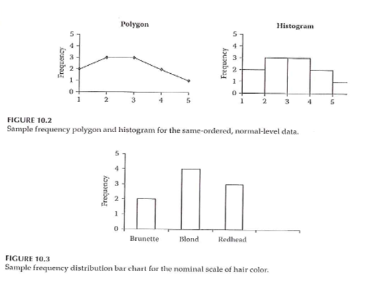
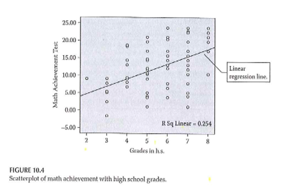
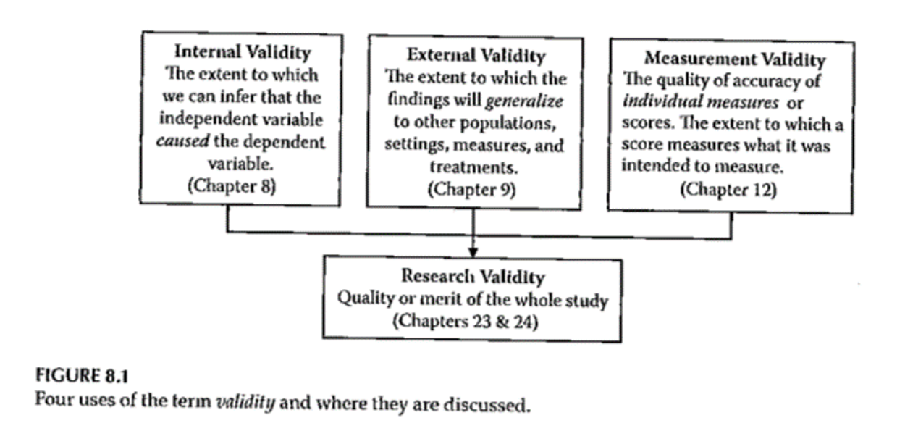
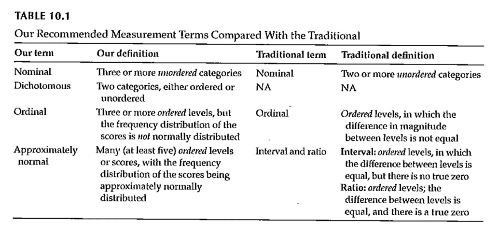

```{r echo=FALSE}
source("prelims.R", echo=FALSE)
```

***
`r read_text("objectives09")`

<div class="notes">

Here are the objectives for this week.

</div>

***
`r read_text("readings09")`

<div class="notes">

This is what you should have read already. If you haven't done the reading yet, pause this video and read this material. You'll get more out of the video if you do so.

</div>

### Measurement quotes (1 of 2)
  
* "The government is extremely fond of amassing great quantities of statistics. These are raised to the Nth degree, the cube roots are extracted, and the results are arranged into elaborate and impressive displays. What must be kept ever in mind, however, is that in every case, the figures are first put down by a village watchman, and he puts down anything he damn well pleases." 
  + Sir Josiah Stamp, as quoted on [Quotetab](https://www.quotetab.com/quotes/by-josiah-stamp).

<div class="notes">

As much as I love numbers, I have to admit that they are often abused. Just because you can attach a number to something does not mean that the number is useful in any way. I want to talk about some of the problems associated with measurement and some of the great pains that you need to take to be sure that your numbers have meaning.

</div>

### Measurement quotes (2 of 2)

* "only scientists are arrogant enough to think that they always observe with rigorous and objective scrutiny"
  + Stephen Jay Gould, The Mismeasure of Man, page 36.

<div class="notes">

I also have to quote Stephen Jay Gould here as well. He wrote an excellent book, The Mismeasure of Man, that addresses many of the points I will talk about today from the perspective of intelligence tests. It is well worth reading because it helps you to resist the temptation to think that writing down a number and giving it a name is enough. You have to think long and hard about whether your measurements are of sufficient quality that you can rely on them to draw firm conclusions about the clinical care that you provide to your patients.

</div>

### Measurements that warrant closer scrutiny

* Patient reported outcomes
  + Participant report
* Researcher evaluations
  + Only when concerned about subjectivity
* Psychological constructs
* Surrogate outcomes
  + Biomarkers
* Composite scores

<div class="notes">

For better or for worse, researchers tend to focus greater attention on certain types of measurements. There's no hard and fast rule here, but issues of measurement quality tend to appear most often in certain areas.

I think it is a bit unfair, but there is a lot of distrust of patient reported outcomes among researchers. Why not believe what the patient says about himself or herself? Part of it might be that a patient's answers could potentially be influenced by their mood.

There is also a belief that patient reported outcome measures vary too much from one individual to another. Some people are stoic to a fault and others will complain endlessly at the drop of a hat.

It is worth noting that these factors also influence researcher observation, but researchers don't like it when you point this out to them. It's mostly a good thing that researchers require a high level of scrutiny of patient reported outcomes, but perhaps other measures deserve just as high a level of scrutiny.

There is a fair amount of scrutiny of researcher evaluations when these evaluations are perceived as having a high level of subjectivity. Now, our perceptions as to what is subjective are also subjective, so you need to be careful.

Psychological constructs are tools used to measure aspects of human behavior, such as intelligence, self-esteem, stress, and extraversion. In spite of recent advances in brain imaging, you cannot, for the most part, peek inside someone's mind and understand how they think. Psychological constructs are a subset of latent variables, variables that you can only observe indirectly.

Your book does not talk about surrogate outcomes, but these are very important. Surrogate outcomes might be measured very accurately, but they have a dubious or uncertain relationship with outcomes that your patient considers important. Some examples of surrogate outcomes include cholesterol levels, tumor size, and CD4 cell counts.

Biomarkers, in general, deserve close scrutiny. Just because you can measure something in blood or tissue does not mean that the measurement has any value.

Finally, many measures in clinical research are composites of one or more items. These individual items are scored and added up to get a total. If the individual items are chosen well, this can be a very effective approach, but you need to be careful.

</div>

### Three types of validity

* Internal validity
  + "The extent to which we can infer that the independent variable caused the dependent variable."
* External validity
  + "The extent to which the findings will generalize to other populations, settings, measures, and treatments."
* Measurement validity
  + "The quality of accuracy of individual measures or scores. The extent to which a score measures what it was intended to measure."  

<div class="notes">

Your book specifies three types of validity: internal validity, external validity, and measurement validity. All three are important, but I want to focus just on measurement validity in this lecture. The other types of validity are important, but the explanations are fairly simple to follow. 

Measure validity is much harder to talk about, so I do want to spend a fair amount of time on it and on a closely related concept, measurement reliability.

</div>

### Measurement Reliability 

* Synoynms: consistency, precision, stability
* Classical test theory
  + Observed value = True value + Measurement error
  + This is a purely hypothetical model
* Reliability coefficient
  + Variance of true values / Variance of measured values
* No measurement is perfectly reliable
  + Strive for 0.7 or higher in research
  + 0.6 is "borderline".
  + Might require 0.9 or higher for individual decisions

<div class="notes">

When you measure something, you want that measurement to be consistent, precise, and stable. You don't want something that changes as the phases of the moon change. You don't want a measurement that changes depending on who the attending physician is. You don't want a measurement that changes depending on any environmental factors that are extraneous to what you are measuring.

If your measure is not stable, then you have difficulty in assessing whether a change in that measurement is due to your intervention or due to the phases of the moon.

Most measures of reliability rely on a the true value model. This model says that the observed value of a measurement is equal to the true value plus measurement error. A measurement is reliable if the measurement error is small. Since the true value is almost always unknown, it is only a hypothetical model. 

Your book talks about a reliability coefficient which is the variance of the true scores in a population divided by the variance of the observed scores in a population. Measurement error guarantees that the numerator is always less than or equal to the denominator. The reliability coefficient is equal to one only if there is no measurement error.

You should not be too surprised to find out that the reliability coefficient is a hypothetical value and can never be measured directly. But there are several indirect approaches.

One thing you need to keep in mind is that the reliability coefficient is dependent on the population it is based on. Your book doesn't mention this, but it is important. Change the population and you change the reliability coefficient. Something with a great reliability coefficient in a population of college students might be terrible in a population with limited literacy skills, for example.

Since, no measurement is ever conducted without some measurement error, no measurement has perfect reliability. You need to make a value judgement about whether the deviation from the truth is small enough that you can safely ignore it.

There are some informal standards for reliability. These choices can seem a bit arbitrary, but they are fairly well accepted in the research community.

In order for a measurement to be reliable enough to use in a research setting, where you are trying to characterize how a group of people are affected by an intervention, you would like a reliability coefficient of 0.7 or higher. It's not perfect, but the individual measurement errors would be averaged out when you compute group means.

But if you are making decisions that might affect an individual, then you'd want a much higher level of reliability. Individual decisions might involve acceptance into a training program, for example. You would hate to see a large measurement error dominate the decision about an individual. In these settings, a reliability coefficient of 0.9 or higher might be asked for.

Reliability is usually established when a measure is developed. When you go about using a measure, look at what's already been published. Make sure it used in a context similar to yours. It's a whole lot easier to find a measurement that is already proven to be reliable than to develop your own measure and then establish its reliability.

</div>

### Take a break here

* What you have learned.
  + Measurements that require special scrutiny
  + Reliability coefficient
  
* What's coming next
  + Indirect measures of the reliability coefficient

<div class="notes">

Let's take a break here. We've talked about the types of measurements that typically draw extra concern. We also developed a hypothetical model relating the observed measurement to the true measurement plus measurement error. This allowed us to define the reliability coefficient.

You can't measure the reliability coefficient directly, but in the next video, you'll see several approaches that can provide an indirect measure of this quantity.

</div>

### Indirect measures of the reliability coefficient

* Test-retest
* Interrater
	+ Percentage agreement methods
	+ Intraclass correlation coefficients
	+ Interrater
* Parallel forms
* Internal consistency
	+ Split-half
	+ Kuder-Richardson 20
	+ Cronbach’s alpha

<div class="notes">

Even though the reliability coefficient cannot be measured directly, you can usually get at it indirectly. What you do it take two measurements where the true value is expected to stay reasonably constant. If the two observed values correlate well, then you have indirect evidence that the measurement error is small.

</div>

### Test-retest reliability

* Also called repeatability
* Correlation of two measurements separated by time
* Length of time interval is critical
  + No carry-over
  + No changes in the true score

<div class="notes">

Test-retest reliability is the correlation coefficient of two measurements taken at different times. This is also known as repeatability.

The correlation coefficient between the two measurments is an estimate of the reliability coefficient.

The time interval is critical here. You don't want two measurements that are so close together that the measurement error for the first measurement is correlated with the measurement error of the second measurement.

Suppose you are measuring your patient's knowledge about a disease. If you give the same test only a few minutes apart, your patient will remember his/her answers to the first test when answering the second test.

So you want a long enough time interval that there is no carry over effect.

But too large an interval is also problematic. You want to make sure that the true score is the same (or very close)

Over what size interval would you expect the measure to be stable? It depends on what you are measuring. Intelligence is likely to be stable along long time frames but mood changes rapidly.

</div>

### Inter-rater reliability

* Used for researcher evaluations only
* Simplest case
  + Two independent raters
  + Ratings for every patient
* Analysis
  + Intraclass correlation
  + Cohen's Kappa
* Extensions
  + Rate random subsets
  + More than two raters

<div class="notes">

When the researcher does the evaluation and there is concern that a subjective element may creep in and cause measurement error. Your observed score might be higher or lower depending only on who is rating you.

Reliability is pretty simple to measure in this setting, if you have the resources. Just get two raters and have them both compute the measurement. If the correlation between the two raters is high, you have good reliability.

Rather than computing a direct correlation, inter-rater reliability is usually computed as an intra-class correlation. The intraclass correlation generalizes naturally to more complex settings.

If your measurement is binary (note the entire measurement is binary, which is not the same as saying that the individual components of a composite score are binary), then a different statistic, Cohen's Kappa is used. Like the intraclass correlation, there are extensions of Kappa to multiple raters.

You can't always have all the raters rate all the patients, especially if you have more than two raters. There are extensions to cases where you have random assignments of patients to different raters, but the formulas are tricky.

I say that, even though I like formulas. It's not tricky so much as tedious. So I do not want to share all the details here. If you are interested in looking at inter-rater reliability in a more complex setting than just two raters, I'd love to talk to you about it.

</div>

### Take a second break

* What have you learned so far.
  + Test-retest measures of reliability
  + Inter-rater reliability
* What is coming next
  + Measures of internal consistency
  
<div class="notes">

Time for another break. We've talked about test-retest reliability. The tricky part here is deciding how far apart in the time the test and retest have to be. You also learned about inter-rater reliability, which is used for researcher evaluations where you are concerned about subjectivity in the measurement process.

Next, we'll talk about some very different measures of reliability, measures of internal consistency. I don't like these measures nearly as much, but you do need to know about them because they are used quite often.

</div>

### Parallel forms

* "No man ever steps in the same river twice, for it's not the same river and he's not the same man."
  + Heraclitus
* Used when you can't run the same measurement twice.
* How to develop parallel forms
  + Change the question order 
  + Minor changes to the wording
* Difficult to develop two parallel forms of the same measurement.

<div class="notes">

Sometimes the very act of measuring someone changes that person. I do this all the time. I put a quiz up each week, not to test you so much as to reinforce some of the key messages in my videos. The questions are not intended to challenge you and assess how much you've learned. Having come up with an answer, that helps you remember the key concepts better.

The opposite tendency can occur as well. The novelty of answering questions wears off over time and people may grow tired or bored and not answer the exact same questions a second time.

How likely is this to happen? It depends a lot on what is being measured. Measures of knowledge and understanding are more likely to have carry over effects.

In some settings, you can create a second version of your measurement by making minor changes. This could be in the wording or the ordering of the questions.

How much of a change do you want? Too little and you still have problems with carry over. Too much and you are no longer measuring the same thing.

The parallel forms measure of reliability is not used that frequently, because it just about kills you to get one version of a measurement up and running. Who wants to develop two parallel forms. It's worth introducing here, though, because it helps you understand the next three forms of reliability.

</div>

### Split half reliability

* Only used for composite measurements
* Split into halves, correlated
  + Odd-even split
  + Random split
* Brown-Spearman adjustement

<div class="notes">

If your measurement is a composite measure, then you can look at the correlation of the individual components to assess reliability.

You could split the measure in half, calling the even numbered items the first form and the odd numbered items the second form. The correlation between the odds and the evens is a measure of reliability.

It doesn't have to be evens versus odds. You might want to assign items randomly to the first half versus the second half.

You do need to be careful, though. The reliability of a composite measurement is frequently thought to be related to the number of items in the composite. The greater the number of items, the greater the reliability. So if you artificially shorten the measurement, you are underestimating reliability. There is a simple adjustment, called the Spearman-Brown formula that most researchers use when looking at split half correlations.

</div>

### Kuder-Richardson 20

* Only for composite measures with binary items
* Book's formula is confusing
  + $S^2$ and $\sigma^2$ used interchangably
  + $\Sigma pq$ is a theoretical minimum variation
  + $S^2$ is observed variation
  + $S^2 = \Sigma pq$ implies randomness
  + $S^2 > \Sigma pq$ implies internal consistency
  
<div class="notes">

Another measure for reliability, Kuder-Richardson 20, is used for composite measures, but only those composite measures that have binary items. Your book does a poor job explaining this, and the notation is inconsistent.

If you are curious, the formula is comparing a theoretical minimum variation, a variation computed using independent Bernoulli random variables, but with different p's and q's for each item. Strictly speaking, this is not accurate, but a smaller value than the sum of the pq's could only occur if there is negative correlation among the individual items, and this implies almost a conspiracy among the individual items to make things as bad as possible for you.

You compare this to the variation observed among the total scores in the sample. If the observed variation is equal to the theoretical minimum, the individual items are behaving randomly, with no internal consistency. This means that any split halves that you could compute would have next to no correlation.

If there is much more observed variation, that means that people show positive correlations. Low on one item means low on most of the other items and high on one item means high on the other items. This positive correlation is a measure of internal consistency.

</div>
  
### Cronbach’s alpha

* Used for composite measurements with continuous items
* Book's formula is confusing
  + $\Sigma S^2$ should be $\Sigma S_i^2$
  + $\Sigma S_i^2$ is a theoretical minimum variation
  + $S^2$ is observed variation
  + $S^2 = \Sigma S_i^2$ implies randomness
  + $S^2 > \Sigma S_i^2$ implies internal consistency
* Cronbach's alpha is NOT a measure of unidimensionality

<div class="notes">

A similar measure, Cronbach's alpha is used for composite measures, but does not require the individual items to be binary.

Again, your book does a poor job explaining this, and the notation is confusing.

Just like Kuder-Richardson 20, Cronbach's alpha computes a a theoretical minimum variation. This time it is a sum of the variances for the individual items. Strictly speaking, this is not accurate, but a smaller value than the sum of the variances implies a deep and dark conspiracy against you by the individual items in your composite.

You compare this to the variation observed in the total score. If the two values are close, that tells you that the individual items are more or less independent of each other and that any split halves that you might compute would have little or no correlation.

If there is much more observed variation, that means that people show positive correlations. Low on one item means low on most of the other items and high on one item means high on the other items. This positive correlation is a measure of internal consistency.

Some people confuse the concept of internal consistency with uni-dimensionality. Uni-dimensionality means that all of the items are measuring the same construct. If they are, then Cronbach's alpha will be large. But you can also get a large value for Cronbach's alpha, even when the items are measuring multiple constructs, especially when you have a large number of items. Dimensionality can only be measured using some form of factor analysis.

</div>
  
### Practical guidance on reliability

* Is there previous literature?
  + Report their reliability coefficients
* Is your setting similar?
  + Different demographics?
  + Different cultural norms?
  + Different literacy?
  + Different language?
* Compare to reliability in your sample
  + Test-retest and inter-rater reliability preferred.

<div class="notes">

You should include a discussion of reliability in your literature review. Cite the reliability coefficients in previous work, as it adds to the credibility of your proposed research.

But take a step back and ask if you can extrapolate safely to the research setting that you propose. Recall the hypothetical reliability coefficient. It compared the variation of the true score to the variation of the observed score across patients in the population you are studying. If your population is quite different than the populations in your literature review, you have no guarantee that a measurement proven to be reliable in previous work will continue to stay reliable in your setting.

Some differences to look for are differences in the demographics of your population, differences in cultural norms and expectations, differences in literacy levels (especially for measurements that require your patients to read and respond to a questionnaire).

If you are measuring something that requires translation to a different language, keep in mind that not all concepts translate well from one language to another. Sometimes it helps to pay for a second and independent translation back to the original language. If there are discrepancies, then maybe it was in the back-translation, but more likely, you are asking for a different type of information in your new language without realizing it.

If you can, incorporate a measure of reliability into your study. There are two reasons for this. First, your setting may be different enough to raise concerns. Getting a current measure of reliability helps to allay those concerns. Second, reliability is never quite perfect, because all of the measures of reliability are indirect measures. Your effort to assess reliability will supplement the previous work on reliability and make things a bit easier for future researchers.

I have a strong preference for test-restest reliability or inter-rater reliability, if you can get it.  The other measures of reliability, parallel forms, the split half correlation, Kuder-Richardson 20, and Cronbach's alpha are measures of the internal homogeneity of your composite measure. In my mind they are a poor substitute for test-retest reliability or inter-rater reliability.

I do not like these measures. Let me restate that. I despise these measures. They are simplistic and fail to measure what I think are the important features of reliability (stability over time and consistency between raters). I think people use them mindlessly and fail to recognize that they are measuring something very limited.

If you can't measure reliability using a test-retest approach or using inter-rater reliability, then go ahead and use these other approaches. But they are a pale substitute in my opinion.

</div>

### Time for a third break

* What have you learned so far.
  + Measures of internal consistency
  + Practical advice about reliability
* What is coming next
  + Measurement validity

<div class="notes">

Wow. That's a lot to digest. Don't be afraid to ask me questions about reliability. Let's take a break here. We talked about measures of internal consistency and why I don't like them. We also talked about some practical advice: report reliability measures from your literature review and measure reliability, if you can, in your current study.

Next, we'll tackle measurement validity.

</div>

### Measurement Validity 

* Reliability by itself is not enough.
  + Consistent measures of the "wrong thing" is bad
* Examples of the wrong thing
  + Measuring anxiety instead of stress
  + Measuring transient changes in a patient's mood rather than chronic depression
* Validity
  + "Degree to which a measure ... measures that which it was intended to measure"
* Reliability is a pre-requisite for validity
* Validity is a journey and not a destination

<div class="notes">

Reliability by itself is not enough. That seems a bit unfair. You had to do a lot of work to establish reliability. But you can't stop there. If you have a reliable measurement, one that is consistent across time and between raters, then you could still have problems because you might be measuring the wrong thing.

This can happen very easily. You might think that you are measuring the stress that a patient is enduring, but it might be a measure of anxiety instead. Now these are often related, but people can experience one without the other very easily. Another example would be measuring transient changes in mood versus chronic depression.

So in addition to establishing that your measurement has good reliability, you also have to establish good validity.

Validity is, to quote from your book, the "degree to which a measure measures that which it was intended to measure."

If you intend to measure A and you measure B instead, you have poor validity.

Now I talked about reliability first because it is a pre-requisite for validity. If a measurement is inconsistent across time or between raters, it can't be measuring what you want it to measure. It needs stability and consistency first.

The other thing to keep in mind is that validity is not something that you establish and then you're done. Validity is a journey and a never-ending journey at that. Each study in a series of studies that uses a particular measurement will contribute information about the validity about a measurement.

</div>

### Types of measurement validity 

* Face validity
* Content validity
* Criterion validity
  + Concurrent
  + Predictive
* Construct validity
  + Convergent validity
  + Divergent validity

<div class="notes">

There are several different ways to establish validity. I'll talk about each of these in turn.

Face validity and content validity are fairly similar. Criterion validity is great, but can only be used when you have an external criterion that you can measure. There is a distinction between a criterion that is measured at the same time (concurrent validity) or a criterion that is measured in the future (predictive validity). 

Construct validity establishes validity by showing that your measurement is positively associated with the things you know it should be associated with (this is convergent validity) and unassociated with things that you know it should not be associatted with (this is divergent validity).

</div>

### Face validity and content validity

* Only used for composite measures
* Face validity
  + Opinions from your patients
  + Subjective and unquantifiable
* Content validity
  + Opinions from experts
  + Also subjective and unquantifiable

<div class="notes">

There are varying definitions of face validity and content validity. Let me share the defintions that I like. This is my class and I get to dictate the rules. But I'll let you know what others define these two terms as.

Face validity is information from your patients, typically for a composite measurement. They look at the individual items in your composite measurement and tell you the ones that don't really belong. They should also tell you about items that are missing in your composite measurement that you should include. Face validity is a totally subjective approach and to some people it seems like letting the inmates run the asylum.

To be fair, face validity is an important step in establishing validity, but it should probably not be the only step.

Content validity is information from content experts rather than your patients. But otherwise, it is the exact same thing. The experts look at your composite measurement and tell you that certain things need to go and other things need to be added.

Now, who is an expert? It can be anyone, really. Normally, you would use credentials like a degree and a publication record in the area to establish that someone is qualified to tinker with your measurement.

Both face validity and content validity are purely qualitative. There is no numeric measure or score that you get from these types of validity. You do have to establish consensus, if you seek face validity or content validity from more than one source, but this is usually established qualitatively.

There are structured ways to get information about face and content validity from your patients and from an expert panel, such as the Delphi method. You can use these methods, or you could just use a structured interview.

Even though these approaches are soft, they are well worth the effort.

Now some people use the terms face validity and content validity interchangably. Your book says that face validity is just looking at the measure and giving a general impression while content validity requires delving into the individual items of a composite measure.

I won't say that your book is wrong, but your book is wrong. Actually, I'm probably wrong, but I'm your teacher and you're stuck with my opinion, at least until the semester ends.

Seriously, if there is a disagreement in the research community about how to establish validity, what you do is you do it your way, but with the expectation that when you submit your paper to peer review, plan for the possibility that the peer reviewer will ask you to define things their way. It's normally not a good idea to fight a peer-reviewer, especially when there is no consensus in the research community, unless they are asking for something that is seriously wrong and misleading.

Now your teacher, on the other hand, you can argue with him until the cows come home. He actually will enjoy the argument and you won't get him to shut up about the varying research perspectives.

</div>

### Response process evidence

* Used for surveys, instruments that your patients complete.
* Observe the process
  + Watch as patients fill out the form
  + Ask questions along the way
  + Monitor response times
  + Encourage them to think aloud
  + Eye tracking
* Supplement with interview
* Goal is to identify problematic elements
  + Confusion, misunderstandings
  + Language issues
* Get experts to role play

<div class="notes">

Response process validity is the direct observation of patients as they fill out the survey that you are using for measurement. You can think of it as part of the face validation, or you can call it an additional type of validation. I like the latter because it sounds more impressive.

There's nothing too difficult about this. As you observe the process, ask questions, see if there are any items that seem to take too long to answer. Encourage your patients to talk aloud as they are working. If you want to get really fancy, you can use eye tracking to see if someone is losing focus or getting distracted.

You can supplement this process with an interveiw afterwards. Your goal in this exercise is to identify items that are confusing or ambiguous, or which seem to draw the wrong type of response. Look especially for issues which may come from the use of excessively technical language.

You can do this sort of exercise with experts as well as patients. Ask your experts to pretend that they are patients and get them to fill things out, talk aloud, and ask them questions along the way.

</div>

### Criterion validity

* Comparison to external criterion
  + Represents "truth"
  + Not always available
* Predictive criterion
  + Measurement in the future
* Concurrent 
  + Measured at the same time

***
### Measurement Validity 

+ Relations to other variables evidence –
	+ Are there relations with other measures that would be predicted from the theoretical framework of the measure?
	+ Test-criterion
		+ Predictive-criterion
		+ Concurrent-criterion
	+ Convergent
	+ Discriminant
	+ Validity generalization

<div class="notes">

Predictive: can your measure be a valid predictor of some future event. Example: does ACT score predict college GPA. There are practical limitations because the outcome measure needs to be obtained for everyone.

Concurrent: taken at about the same time, new measure versus an established one.

Convergent: Multiple measures behave similarly.

Discriminant: fail to find a relationship where there shouldn't be a relationship.

Generalization: The extent to which it can be generalized to a new situation.

</div>

***
### Measurement Validity 

+ Motivation/Readiness/Confidence to Adhere


<div class="notes">

Motivation/readiness/confidence to adhere. Look at predictive validity versus how well patients adhere. Test for concurrent validity. Different for people in different stages of the "stages of change".

Concurrent: self-efficacy, autonomy, locus of control.

Discriminant validity: not related to education.

</div>

***
### Measurement Validity 

+ Consequences evidence –
	+ “… includes both positive and negative anticipated and unanticipated consequences of measurement.”
	+ How do the use of measures affect respondents?

<div class="notes">


</div>

***
### Measurement Validity 

+ Evaluation of measurement validity
	+ For content, response process, internal structure, and consequence –
		+ Subjective, depends on logical judgment by researcher
	+ Relations with other variables –
		+ Often correlations
		+ Judgment; no established cut-offs

<div class="notes">

For four of these, it is largely a subjective assessment. Others involve relations (often correlations). There is no official dividing line for these correlations to establish valid versus not valid.

</div>

***
### Measurement Validity 

+ Evaluation of measurement validity
	+ Cohen’s guidelines – strength of relationship
	+ Correlation coefficient – most common
	+ Applied behavioral sciences
		+ r >= .5 <U+F0E8> large effect / strong support
		+ r > .3 <U+F0E8> acceptable level of support
		+ r > .1 <U+F0E8> weak support (if statistically significant)
	+ Table 12.2

<div class="notes">


</div>

***
### Measurement Validity 


<div class="notes">

Table 12.2 explains what each type of validity means.

</div>

***
### Measurement Validity 

+ Validity of diagnostic tests
+ Sensitivity
	+ A test's ability to obtain a positive result when the target condition is really present
		+ True positive rate
+ Specificity
	+ A test's ability to obtain a negative result when the target condition is really absent
		+ True negative rate

<div class="notes">


</div>

***
### Measurement Validity 



<div class="notes">

Table 27.1 from Portney & Watkins, 2009

Sensitivity and specificity are not affected by prevalence. But prevalence plays a part in calculation of positive and negative predictive values.

</div>

***
### Measurement Validity 



<div class="notes">

+ Sim & Wright . 2000.

</div>

***
### Measurement 

+ Validity vs Reliability
	+ The chicken and the egg!

<div class="notes">


</div>

***
### Measurement 


<div class="notes">

Figure 6.1 from Portney & Watkins, 2009. Not valid, not reliable. Valid, not reliable. Not valid, reliable. Valid, reliable.

</div>

***
### Measurement 

+ Validity vs Reliability
	+ “ … a high degree of validity presupposes a high degree of reliability… ”
	+ “ … reliability does *not* presuppose. ”
	+ To establish reliability – only need to know where points are in relation to each other
	+ To establish validity – need to know where the “ target ” is in order to evaluate how close points are to this “ target ” 

<div class="notes">

Sumary. Always start by establishing reliability (where the points are in relation to each other).

</div>

***
### Measurement 


<div class="notes">

+ Validity vs Reliability (Table 9.1)

.footnote[Sim & Wright. 2000.]

</div>

### Practical advice about validity

### Surrogate outcomes

***
### Internal Validity 

+ “The extent to which we can infer that the independent variable *caused* the dependent variable.”
	+ For non-experimental studies –
		+ How “well designed and conducted” was the study?
+ Three criteria for causality

<div class="notes">

It's really only randomized trials that can establish causality. But even in quasi-experimental and non-experimental studies, you can still talk about internal validity.

The cause has to precede the effect, it must be connected to the effect, and there must be no other variables that could explain why the cause is related to the effect.

</div>

***
### Internal Validity 

+ “The extent to which we can infer that the independent variable *caused* the dependent variable.”
+ Three criteria for causality
	+ IV *must precede* the outcome variable
	+ IV *must be related* to the outcome
	+ There must be no other variables that could explain why the IV is related to the outcome

<div class="notes">


</div>

***
### Internal Validity 

+ Three criteria for causality –
	+ IV *must precede* the outcome variable
	+ IV *must be related* to the outcome
	+ There must be no other variables that could explain why the IV is related to the outcome
+ By Research Approach –
	+ Randomized Exp
	+ Quasi- Exp
	+ Comparative
	+ Associational
	+ Descriptive

<div class="notes">


</div>

***
### Internal Validity 

```{r tbl5, echo = FALSE, eval=FALSE}
tbl5 <- tibble::tribble(
~`Criteria for Causality`, ~`Randomized Exp`, ~`Quasi-Exp`, ~`Comparative`, ~`Associational`, ~`Descriptive`,
"IV must precede the outcome variable","Met","Often met","Sometimes met, but order might not be clear","Sometimes met, but order might not be clear","NA",
"IV must be related to the outcome","Met","Usually met","Usually met","Usually met","NA",
"There must be no other variables that could explain why the IV is related to the outcome","Met","Met in the strongest designs","Not possible","Not possible","NA"
)

kableExtra::kable_styling(knitr::kable(tbl5), font_size = 18)
```

<div class="notes">

For randomized designs, the cause precedes the effect, the cause is related to the outcome and there are no other variables that could explain the relationship.

</div>

***
### Internal Validity 

+ Meeting the 3 causality criteria based on –
	+ Strength of the research design
	+ Internal validity

<div class="notes">

The strength of the research design and the internal validity determine whether you can claim causality. Try to design the study to maximize internal validity. 

</div>

***
### Internal Validity 

+ Internal validity -
	+ Most often discussed with reference to randomized experimental and quasi-experimental designs
	+ Can also be applied to non-experimental studies

<div class="notes">


</div>

***
### Internal Validity 

+ Evaluating the internal validity of a study –
	+ Equivalence of the groups on participant characteristics
	+ Control of extraneous experiences and environmental variables

<div class="notes">

There are two aspects of internal validity, equivalence and control.

</div>

***
### Internal Validity 

+ Equivalence of the groups on participant characteristics –
	+ Are groups equivalent prior to introduction of IV?
		+ Randomized experimental design –
			+ Random assignment
		+ Quasi-experimental design –
			+ Random assignment of treatments
			+ Matching
			+ Checking pretest scores

<div class="notes">

Random assignment assures equivalence of the two groups on average. A rule of thumb is 30 people assigned to each group should give you confidence that random assignment will assure equivalence. If you are using random assignment, you should not need to test for baseline equivalence. We feel that random assignment is the best way to achieve equivalence.

In quasi-experimental design, you don't have random assignment, but you can randomly assign between the two groups. You can also use matching to achieve equivalence. Finally, you can check baseline scores for equivalence.

</div>

***
### Internal Validity 

+ Equivalence of the groups on participant characteristics –
	+ Are groups equivalent prior to introduction of IV?
		+ Comparative design –
			+ Statistical adjustment (ANCOVA) to adjust DV scores to make groups more nearly equivalent
			+ Matching participants on variables other than the primary IV
				+ E.g. Case-control study
			+ Check after the study for comparability

<div class="notes">

Since non-randomized trials have an attribute variable, you need to rely on statistical adjustment or matching. You can also check after the study for comparability.

</div>

***
### Internal Validity 

+ Equivalence of the groups on participant characteristics –
	+ Are groups equivalent prior to introduction of IV?
		+ Associational design –
			+ Only 1 group
			+ Not able to provide evidence of causation
			+ “Equivalence” – “… whether those who score high on the IV … are similar to those … who score low in terms of other attributes that may be related to the DV.”
			+ May be able to provide some statistical control

<div class="notes">

Equivalence when you have a continuous independent variable means that those who score high on the variable are similar to those who score low.

</div>

***
### Internal Validity 

+ Control of extraneous experiences and environmental variables –
	+ Extraneous variables – variables other than the IV and DV
	+ Environmental variables – conditions/variables that occur during the study
	+ Contamination
	+ Issue – Is one group affected more than the other(s)?
	+ Less of an issue with a more controlled research setting

<div class="notes">

Your study could be contaminated by other variables. These variables might be out of your control but which can influence the outcome.

Contamination: people in the intervention group are friends with the control group and share information.

The key issue is whether one group is more affected by extraneous variables.

In a controlled setting, there are fewer extraneous variables, but this changes in a field setting.

</div>

***
### Internal Validity 

+ Rating the dimensions of internal validity
	+ Figure 8.2
	+ Evaluating Research Validity framework
	+ “Good” study – moderate to high internal validity on both dimensions

<div class="notes">

Internal validity is measured by whether the two dimensions are addressed.

</div>

***
### Internal Validity 


<div class="notes">

Figure 8.2. 

</div>

***
### Threats to Internal Validity 


<div class="notes">

Table 8.1 relates statistical terminology to identify threats to internal validity. This table tries to take those technical terms and express them 

Extreme groups have issues with regression to the mean. Even without any intervention, the extremities will tend to lessen.

Dropouts or attrition means that you've designed a setting that is so difficult that no one can stay in. Differential attrition is especially troublesome.

Bias in assignment occurs when patients or their physicians directly or indirectly influence the assignment. Random assignment eliminates this bias.

Cook and Campbell.

</div>

***
### Threats to Internal Validity 

+ Equivalence of Groups
	+ Use of extreme groups
	+ Participant dropouts or attrition during the study
	+ Bias in assignment to groups

<div class="notes">


</div>

***
### Threats to Internal Validity 

+ Control of extraneous/environmental variables
	+ Changes due to time or growth and development
	+ Extraneous environmental events
	+ Repeated testing, carryover effects
	+ Instrument or observer inconsistency
	+ Combinations of two or more threats
	+ Did the IV actually occur before the DV?

<div class="notes">

Here are some of the sources of extraneous variables. 

Maturation.

History. Something that occurs between the pre and post measurements that is independent of the intervention but which can influence the outcome.

Worry about sensitization to the issue in the baseline measurement that causes people to go out and find more.

Long studies have problems with instrumentation or observers (e.g., because of turnover).

There are also combinations of these events where one magnifies the other.

Temporal order of the variables. If you can't assure that the independent variable occurs before the dependent variable, you can't establish causation.

</div>

***
### Threats to Internal Validity 

+ Other threats
	+ Effects of being in the control group
	+ Expectation effect
		+ Control for expectation
	+ Observer / experimenter bias

<div class="notes">

Control group contamination. Demoralization.

Hawthorne effect.

Blinding helps control for expectation effects and observer bias.

</div>

***
### Validity 


<div class="notes">

Here is figure 8.1 again. The next part of this lecture talks about sampling and external validity.

</div>

***
### Validity 



<div class="notes">

Here is figure 8.1 again. The extent to which results will generalize.

</div>

***
### Assignment #7 

+ Generate a list of variables that you plan to include in your research proposal. Include in the list both dependent and independent variables. In the list include:
	+ Variables you will need to describe your sample,
	+ Variables you will need to control for in your analysis, and
	+ Variables you will need in order to test your RQ/RH.

<div class="notes">


RQ=research question, RH=research hypothesis.
</div>

***
`r read_text("hw09", fri[9])`

<div class="notes">


</div>

***
`r read_text("discussion09", fri[9])`

<div class="notes">


</div>

***

### Additional slides

### Additional issues to discuss

* Validity. http://www.pmean.com/02/validity.html
***
### Measurement 

+ What do we mean “ measurement ” ?
	+ assignment of numbers or symbols to the different levels or values of variables according to rules. ” 

<div class="notes">

We are talking about measurement this week. You are either taking stats or have taken it in the past. This is not a statistics class. Think about what type of variables you will collect and propose what statistical analysis.

Your book defines it as the assignment of numbers or symbols. Notice that this takes a quantitative approach. But even in a qualitative study, you still going to want to summarize information like demographics of your sample. Describe the quality or quantity of a variable.

There are qualitative or quantitative ways to measure things like pain.

We can also use measurements to make absolute decisions. Establish a cut-point. 

Conditions, distinctions.

</div>

***
### Measurement 

+ Assigning a number to represent …
	+ Continuous value
	+ Discrete value
+ Precision of measurement
	+ Continuous variable …
	+ Discrete variable …

<div class="notes">

Value that is assigned can take on any value. Preciseness is dependent on the device used to collect the measurement. It could be the precision of a laser versus a cruder measure. Precision should be appropriate to what you are trying to get at. Lack precision does not mean that your results are not continuous. If you round to the nearest inch, you still are measuring an underlying construct that can take on more precision. Example is blood pressure, interbeat interval, where rounding is done but it still represents a continuous variable.

Discrete values because of rounding, using counts, or a limited number of categories. As long as it represents an underlying construct, consider it as continuous.

</div>

***
### Measurement 

+ What is the measurement representing?
	+ Actual measurement …
		+ Length, time, …
	+ Indirect measurement
		+ Constructs
+ Whatever you are trying to measure ..
	+ Must be able to define it!

<div class="notes">

A survey or scale to get at depression, pain, those kind of things. These are abstract variables.

Bottom line is to define and operationalize how you measure something. It's easy to say something like quality of life but you have to pin this down and establish measurement validity. Consistency is important to avoid measurement bias.

Even for pretty obvious values like blood pressure, there are different ways to measure and you need to choose a single method for consistency and careful control, and when there are multiple methods, chose the method that is optimal for your needs. Blood pressure, for example, can be influenced by whether you are sitting or standing and whether you are talking while the measurement is being done.

Formalizing the rules for measurement helps reduce bias. This is a real concern when you have a variety of people doing the same measurements. How are new hires trained? Can you verify that they are trained to the standard that you have promised.

</div>

***
### Measurement 

+ Traditional levels (scales) of measurement
	+ Nominal
	+ Ordinal
	+ Interval
	+ Ratio

<div class="notes">

Nominal means names, classification, or categorical assignment. Names are mutually exclusive and exhaustive. Value that is shown is a number code or a text word. 

Ordinal is similar to nominal plus some orderliness as to what those responses mean. Example five point scale.

There is no true zero point. Can't perform arithmetic operatitons on ordinal variables.

You can talk about the direction of change.

Interval - difference between levels is consistent across the range of the scale.

Ratio. There is a true zero point.

</div>

***
### Measurement 

+ Authors categorization of levels of measurement
	+ Nominal
	+ Dichotomous
	+ Ordinal
	+ Normally distributed
+ Table 10.1

<div class="notes">

Gliner et al have a slightly different take. They talk about a normally distributed scale. It is hard to talk about the difference between ordinal and interval. 

Look at the literature in the area you work with. Several Likert scales summed to get a subscale.

</div>

***
### Measurement 



<div class="notes">

Table 10.1. This scale splits nominal into those with two levels (dichotomous, also known as binary) and more than two levels (nominal).

Remember how you coded nominal variables. You can (and should) use zero-one coding for dichotomous variables.

The average of a zero-one coded variable represents a probability.

Approximately normal scale requires at least five levels accorind to Gliner et al.

</div>

***
### Measurement 


<div class="notes">

Table 10.3 gives examples of the Gliner et al scales.

</div>

***
### Measurement 

+ Why does the scale of measurement matter?
	+ How it reflects your design and your research question
	+ How it determines the types of statistical analyses you will do
	+ How it defines what you can say about your results

<div class="notes">

The level of measurement comes from what you are trying to get at in your research.

Measurement scales can limit what you can say about your results.

</div>

***
### Assignment #6 

+ Prepare a brief paragraph that describes the research design you are using for your research proposal. This is the information that will probably appear in the Methods section of your proposal.

<div class="notes">

Go back are refer to Figure 4.1. Week 8 activities relate to the exemplar articles. These are on the Canvas site. There are six included. Pick one and get familiar with it.

</div>

***
`r read_text("hw08", fri[8])`

<div class="notes">


</div>

***
`r read_text("discussion08", fri[8])`

<div class="notes">


</div>

***

### Additional slides


### External Validity 

+ Generalizability
	+ Fig. 9.3
	+ Evaluating Research Validity Framework
	+ Two main aspects
		+ Population external validity
		+ Ecological external validity

<div class="notes">

The extent to which results can be generalized beyond this study. Extrapolate to the bigger world.

Evaluating freamework (questions 14 and 15). 

Population: how participants were selected.

Ecologic validity: the more control you have, the better the internal validity but the less like it is for real world. The naturalness of the setting, rapport.

Figure 9.3. 

</div>


### External Validity 

+ Population external validity
	+ How participants were selected for the study?
	+ Is sample representative of the target population?
	+ Validity framework

<div class="notes">


</div>


### External Validity 

+ Ecological external validity
	+ Whether the results can be generalized to real-life outcomes
	+ Trade-off with control of study
	+ Validity framework

<div class="notes">


</div>


### External Validity 


<div class="notes">


</div>


### Sampling and Validity 


<div class="notes">

Figure 9.4. External validity is influenced by the sampling process. Internal validity is influenced by the allocation of this sample to treatment groups.

</div>

***
### Measurement Validity 

+ Internal structure evidence –
	+ “Evidence from several types of analysis, including factor analysis and differential item functioning …”
	+ Does an analysis of the internal structure of a measure match the conceptual framework?

<div class="notes">

Factor analysis is a method of grouping items representative of individual constructs.

In the week 9 folder is the MOTIV* document. The CES-D score has twenty items rated on a 0 to 4 scale, with four of the items reverse scaled. 

There is a somatic factor in this scale. This might be considered a subscale. Run a factor analysis, even though it only has four levels. Do the items all hang together.


</div>

***
### Measurement Validity 

+ Factor analysis – Beliefs about ART measure
+ The following questions involve your personal views about the HIV medications that have been prescribed for you.  Please indicate the extent to which you agree or disagree with the following statements.
+ Response scale: 1 (strongly disagree), 2 (disagree), 3 (uncertain), 4 (agree), 5 (strongly agree)

```{r tbl34, echo = FALSE, eval=FALSE}
tbl34 <- tibble::tribble(
~``,
"(C) b. Having to take medicines worries me",
"(N) c. My life would be impossible without my medicines",
"(N) d. Without my medicines I would be very ill",
"(C) e. I sometimes worry about long-term effects of my medicines",
"(C) f. My medicines are a mystery to me",
"(N) g. My health in the future will depend on my medicines",
"(C) h. My medicines disrupt my life",
"(C) i.  I sometimes worry about becoming too dependent on my medicines",
"(N) j.  My medicines protect me from becoming worse"
)

kableExtra::kable_styling(knitr::kable(tbl34), font_size = 18)
```

<div class="notes">

The ones in yellow. Multiple items to represent a measure. Is there variability in any of those items. If you had selected one and only one item, it might be influenced by external factors like your mood. Multiple items avoid this problem.

The N items had Cronbach's alpha of ?? and the C items had Cronbach's alpha of ??.

A factor analysis allows us to see if the measure is behaving the way we expect it to.

</div>
