```{r echo=FALSE}
source("prelims.R", echo=FALSE)
```

### Data collection methods

* Data collection methods
  + Focus groups
  + Interviews
  + Questionnaires
  + Standardized instruments
  + Existing data
* Data quality

<div class="notes">

The first half of this talk will cover various data collection methods. The second half will cover data quality issues.

</div>

### Running Focus groups

* Two person job
* Facilitator
  + Asks questions
  + Guide discussion, but stays neutral
* Recorder
  + Runs the tape recorder
  + Keeps written notes
* Debriefing session
  
<div class="notes">

If you decide to collect data in a focus group, you need a second person. You could do it by yourself, but you are asking for trouble. One of you takes the role of the facilitator and one takes the role of the recorder.

The facilitator asks a series of prepared questions. Your role is to guide the discussion while still keeping neutral. This means that you intervene if the group is getting off target or if one person is dominating the discussion. You should prepare some brief prompts to get your participants to elaborate or to draw in other participants.

The recorder doesn't say anything after the introductions, but runs the recording device and take notes. The notes serve several purposes. First, they serve as a backup if your recording fails. Second, they note any significant non-verbal information such as gestures and body language. Third, the notes help to identify who is speaking when. A seating diagram is helpful for this. Note that not all focus groups track who is speaking.

After the session is complete, the two of you sit down and talk about how things went.

### Structure of a focus group

* Multiple groups
  + Stop when you achieve saturation
* Six to ten participants
* Sixty to ninety minutes
* Ten questions

<div class="notes">

There is no magic number for the size of a focus group, but it is important to plan for more than one group. The consistency of responses from one group to the next will tell you if you have reached saturation. 

Saturation is evidence that no new themes or ideas have emerged from your groups. Almost all assessments of whether saturation has been achieved are qualitative and subjective.

The concept of saturation makes it difficult for you to plan a budget, but keep in mind that you cannot even begin to assess saturation until you've run your second focus group.

The size of a focus group can vary, but I've seen recommendations of six to twelve people.

</div>

Interviews can be done in person or over the phone. This assumes a real-time exchange of information versus someone filling out information on their own time.

Focus groups involve more than one. The dynamic can be an advantage or disadvantage. It might stifle some interactions, but perhaps people think of things based on what other people say.

[[Rope in grain elevator]]

Focus groups can be faster.

</div>

### Measurement dichotomies

* Standardized versus investigator developed measures
* Researcher evaluation versus patient report
* Field measurements versus laboratory measurements
  + Ecological validity
* Standardized test

### Researcher evaluations

* Norm referenced tests
* Criterion referenced tests
* Achievement tests
* Performance assessment
  + Authentic assessment
* Aptitude tests
* Projective technique
* Documents

### Self report

* Standardized personality inventories
  + Paper and pencil
  + Machine scored

### Attitude scales

* Strongly disagree through strongly agree
* Semantic differential scales
  + Evaluative (good-bad)
  + Potency (strong-weak)
  + Activity (fast-slow)

### Questionnaires

* Definitions
  + Survey
  + Questionnaire
  + Interview
  
### Delivery

* Remote administration
  + Mail
  + Internet (Survey Monkey)
* Direct administration

### Structure

* Open-ended
* Partially open-ended
* Unordered closed response
* Ordered closed response

* Interviews
  + Telephone
  + Face-to-face
* Focus groups

### Pilot testing

* Clarity of items
* Content
* "Whether your items cover all aspects of the domain you intend to measure and whether they are in appropriate proportions relative to that domain."
  + page 258

### Coding

* Mutually exclusive
* Multiple response
* "Other" responses
* Use number codes for categorical data
* Missing codes
  + Never use blanks for missing (book is wrong)
  + -1, 99
  + Multiple codes for multiple reasons
* Dummy coding
  + 0/1 for absence/presence
* Reverse coding
  + High is always positive
* Tabular format
  + No more than one piece of information
* Double entry coding
* Standard coding for race/ethnicity

### Variable names

* Not too short, not too long
* Word delimiters
  + No spaces, symbols
* Example for Mother's age
* Bad choices
  + mom age
  + mom-age
  + momage
* Good choices
  + mom.age
  + mom_age
  + MomAge

### Codebook

* Also known as data dictionary

### Quality checks

* Minimum and maximum checks
  + Out of range
  + Zero variation
* Missing value count
* List five five rows, last five rows
* Correlations

### Data reduction

* Create composite scores
  + Check Cronbach's alpha
  + Examine leaving out single items
* Factor analysis
  + Supplanted by Structural Equations Modeling

### Data transformations

* Ideal - selected a priori
  + Sometimes based on precedent
  + Sometimes motivated by theory
  + Sometimes based on empirical findings

### Question order

* Sensitive questions last
* Broad categories
  + Income
  
### Additional topics

* Pilot studies

* Questionnaires. http://www.pmean.com/02/questionnaire.html

### Data Collection Techniques 

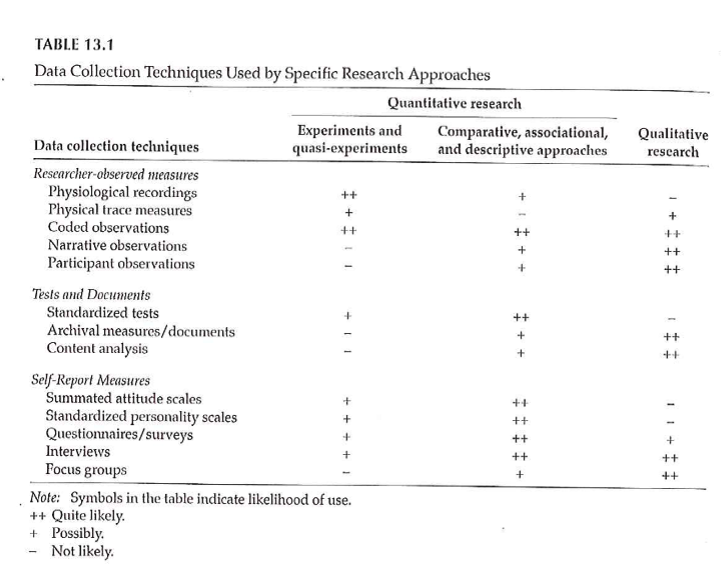

<div class="notes">

Table 13.1 is useful in terms of the various things that we will touch on. It classifies by the two types of quantitative research and by qualitative research. Organized by the potential amount of patient filtering. The ones at the top should have less participant filtering. Also note that the symbols are not hard and fast rules, but represent the likelihood.

</div>

***
### Data Collection Techniques 

+ Standardized vs Investigator-Developed Instruments
	+ Development and Use
	+ Evidence to support investigator-developed instruments

<div class="notes">

There is a lot of work in the development of standardized instruments, manual and documentaiton, normative values, apply to a broad area. Investigator developed instruments focus on a more specialized area, but you still need to supply information on validity and reliability.

Whenever possible use instruments already in use. You can find these in places like PROQOLID. This originally started as quality of life measurements, but has expanded. NIH compilation of patient reported outcome measures (PROMIS). NIH wants the research community to use common measures to allow easier compilation of studies in a meta-analysis.

</div>

***
### Data Collection Techniques 

+ Researcher-Observed Measures
	+ Naturalness of the setting
	+ Observer “participation”
	+ Amount of detail
	+ Breadth of coverage

<div class="notes">

The focus is on direct observation. The more natural the setting, the less control you have. This might hurt the internal validity of the study. It is a trade-off.

How much does the observer participate. In interviews and focus groups, there is a very clear high level of participation. On the other extreme, observation in public places might not have any knowledge of their participation. In the middle are studies where participants know they are being observed, but this knowledge may fade into the background.

</div>

***
### Data Collection Techniques 

+ Tests and Documents
	+ Standardized tests
		+ Norm referenced test
		+ Criterion referenced test
	+ Achievement tests
	+ Performance and Authentic assessments
	+ Aptitude tests
	+ Documents
	+ Content analysis

<div class="notes">

Norm scores allow you to compare to other scores (historical comparisons). These tests are very objective, but there is some subjectivity, perhaps, in their interpretation.

Measuring actual performance (ecologic validity). Tries to be very relevant to the setting.

Use existing documents. Existing records might have a higher level of accuracy but there is no gauarantee. Time is shorter because the documents already exist. Data extraction takes time. Do you need consent from the people associated with these documents.

Data abstraction is tedious, but the newer systems like i2b2 allow you to get the information more directly.

Content analysis is a more qualitative review. It gives you a lot of valuable information that a quantitative approach might miss.

</div>

***
### Data Collection Techniques 

+ Self-Report Measures
	+ Standardized Personality Inventories
	+ Attitudes / Beliefs scales
		+ Likert scale
		+ Semantic differential scale
	+ Questionnaires
		+ How delivered / administered
		+ Item types
	+ Interviews
	+ Focus groups

<div class="notes">

Personality inventories: the validity is dependent on an individual's self-awareness.

Attitudes and beliefs done for a variety of purposes. A "representative sample of all possible opinions or attitudes about a particularl subject." That's why measurement experts cringe when you ask a single question. You need a multiple set of items to get at how people feel.

The Likert scale is very popular. You may not see the semantic difference scale, but examples will follow.

Delivery by mail or Internet. There are pros and cons to all formats. Item types could include open-ended, partial (responses plus other), and close ended responses.

</div>

***
### Descriptive Research 

+ Surveys
	+ Methods
		+ Interview
		+ Questionnaires
	+ Design of surveys
		+ Research question
		+ Review of existing instruments
		+ Process of designing survey

<div class="notes">

Interview allows you to probe for comments. Video as well as audio is now available. It takes time and training. Concerns about anonymity with an interview.

Questionnaires are self-administered. Return rates are a concern. When sent out blindly, you can get low return rates, which hurts the generalizability of the study. There is potential for misunderstanding and people may get into a routine response and not provide as good quality of response.

Design the survey to address your research question. Thing about the pieces and the order.

</div>

***
### Data Collection Techniques 

+ Surveys
	+ Survey question format –
		+ Open-ended
		+ Close-ended
	+ Wording of questions
	+ Scales
		+ Scale of measurement
		+ Response options

<div class="notes">

Even as simple as something like age, you can ask it in an open-ended format that allows you to categorize any way you like or even to forgo categorization.

Wording is important. Simplicity and reading level. Use standardized scales whenever you can. 

Double-barreled questions. [[Ask option about supervisors and managers]]

How many times questions, think about the time frame (over the past 24 hours, past week, past month). Shorter time frames better recall, but subject to more external variations.

Building a level of trust. Don't ask people to admit to "bad behavior". Think of it from the perspective of the person providing the information.

[[Income: actual versus categories]]

</div>

***
### Data Collection Techniques 

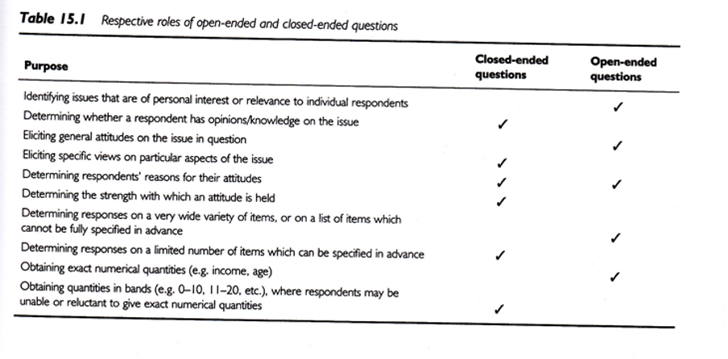

<div class="notes">

+ Open-ended vs Close-ended

Respective roles of open or close ended format. This is a nice guide.

.footnote[Sim & Wright, 2002]

</div>

***
### Data Collection Techniques 

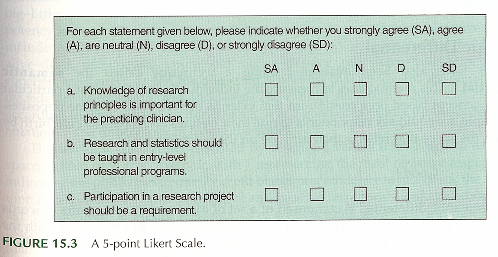

<div class="notes">

+ Surveys – Response Options
	+ Likert

.footnote[Portney & Watkins, 2009]

Example of five points (SD, D, N, A, SA)

</div>

***
### Data Collection Techniques 

..[](../images/image-10-04.png)

<div class="notes">

Everyone uses the term Likert with a hard-i, but the persons who developed this scale used a soft-i.

All items contributing to a total.

Some debate about the number of categories. Odd versus even. Even forces an opinion. Also a debate over a large versus a small number of items.

Do you want to reverse code some items. It could help keep the participants alert and thingking  This may end up confusing. [[13 questions, but question 8, first question on the bakc page, was the only reverse coding.]]

+ Surveys – Response Options
	+ Likert

.footnote[Sim & Wright, 2002]

Figure 15.8 is a different version of a five point scale.

Commercial plug for REDCap. Entry on a tablet. Coding is done on the back-end.

</div>

***
### Data Collection Techniques 

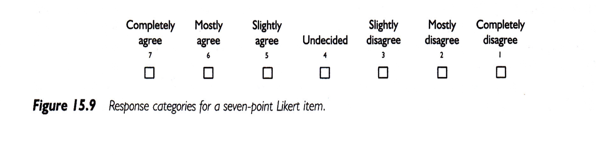

<div class="notes">

+ Surveys – Response Options
	+ Likert

.footnote[Sim & Wright, 2002] 

Figure 15.9 shows a seven point response.

IRB insistence on a "Prefer Not to Answer" response. Contrast this to a "Neutral" option.

</div>

***
### Data Collection Techniques 

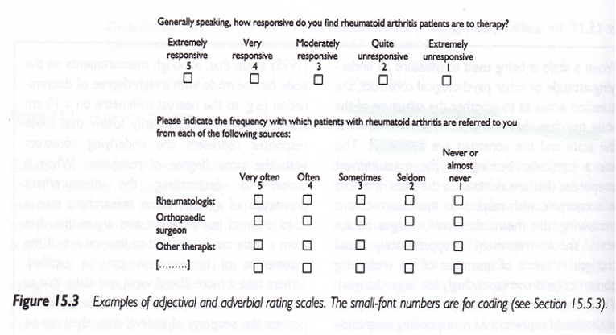

<div class="notes">

+ Surveys – Response Options

.footnote[Sim & Wright, 2002]

Figure 15.3 

These scales seem backwards to Mary. You don't necessarily need to include the numbers are on the form. They can be added on the back end.

</div>

***
### Data Collection Techniques 

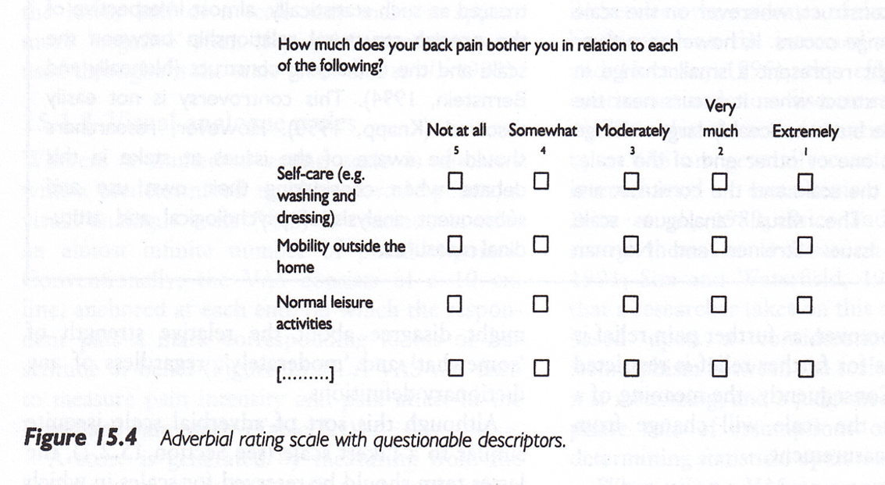

<div class="notes">

+ Surveys – Response Options

Figure 15.4, Sim & Wright, 2002.

Not at all, somewhat, moderately, very much, extremely.

Note that the largest number is associated with "not at all".

Double check that everyone agrees that somewhat is less than moderate, very much is less than extremely.

</div>

***
### Data Collection Techniques 

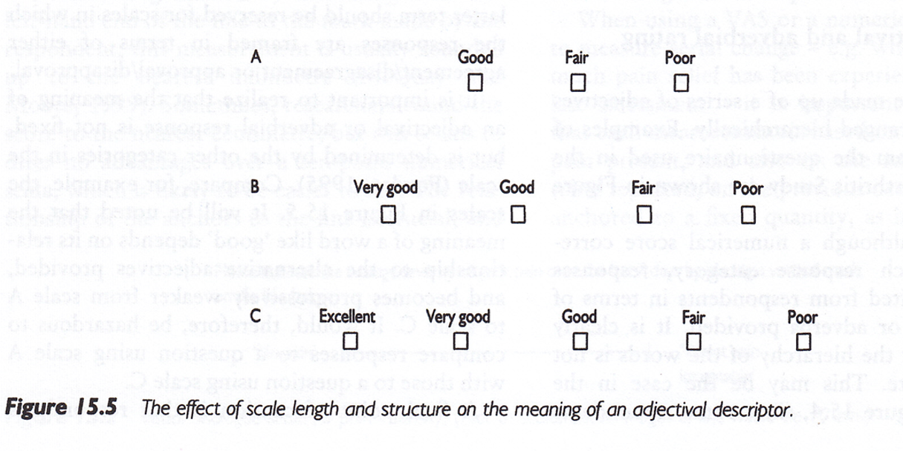

<div class="notes">

+ Surveys – Response Options

Figure 15.5. [Sim & Wright, 2002]

Good, Fair, Poor is a three point scale. Add Very good for a four point scale. Add Excellent to get a five point scale.

</div>

***
### Data Collection Techniques 

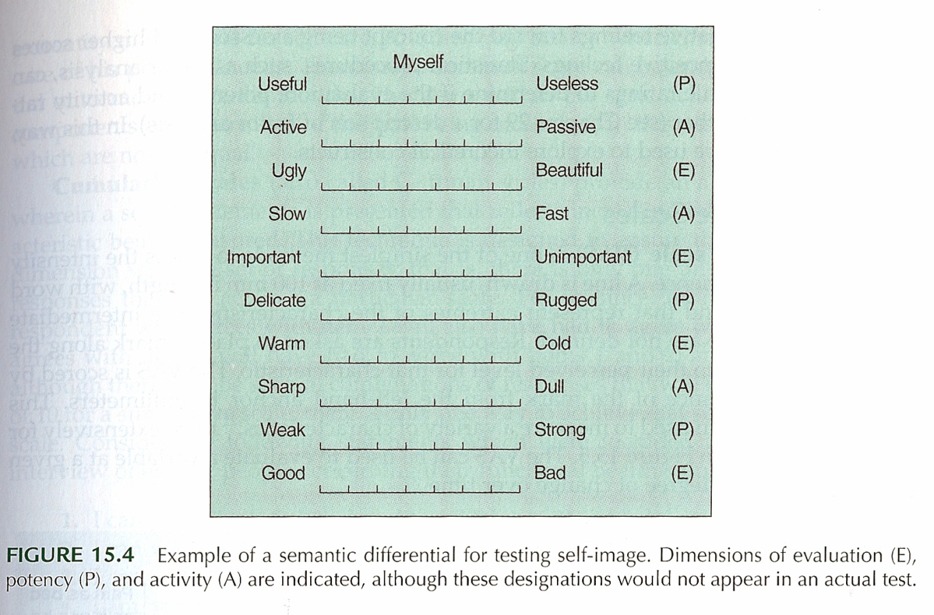

<div class="notes">

+ Surveys – Response Options
	+ Semantic Differential

Figure 15.4 [Portney & Watkins, 2009]

This is an example of a semantic differential. Seven point scale. Only label the extremes. Notice the reverse scaling of some items.

</div>

***
### Data Collection Techniques 

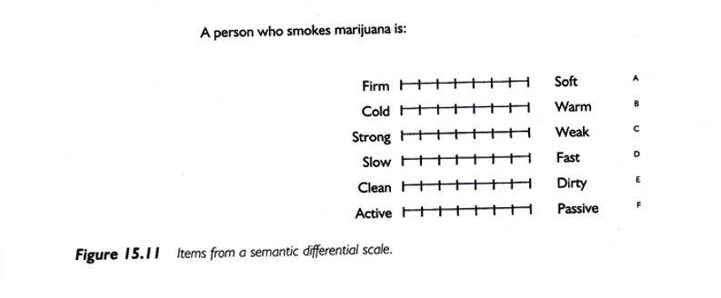

<div class="notes">

+ Surveys – Response Options
	+ Semantic Differential

Figure 15.11 [Portney & Watkins, 2009]

A second example of a semantic differential scale.

</div>

***
### Data Collection Techniques 

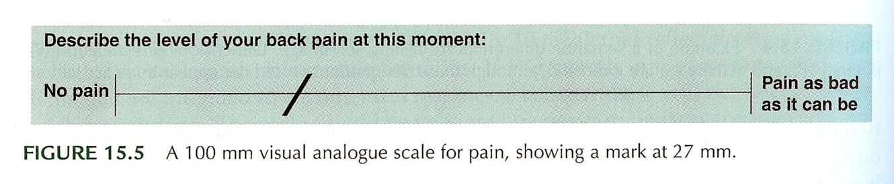

<div class="notes">

+ Surveys – Response Options
	+ Visual Analogue Scale (VAS)

Figure 15.5. [Portney & Watkins, 2009]

Commonly used for pain. Usually the line is 100 mm long. Gives you a number from 0 to 100, which allows you to treat this as a continuous variable.

Anchors at each extreme.

How do you handle a check mark.

This is a very labor intensive data entry task.

Note that the photocopy process can change the length of the scale (102 mm versus 100 mm).

</div>

***
### Data Collection Techniques 

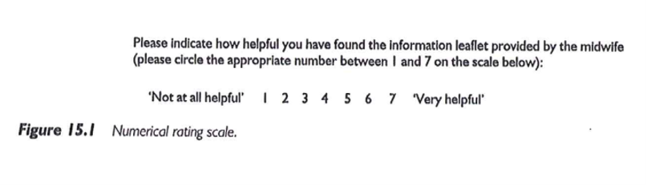

<div class="notes">

+ Surveys – Response Options
	+ Numerical Rating Scale

Figure 15.1 [Sim & Wright, 2002]

This scale has 7 numbers with anchors at each end.

</div>

***
### Descriptive Research 

+ Surveys
	+ Pit-falls and words of caution
		+ How responses are recorded
		+ Wording of items
			+ Literacy level
			+ “ Loaded ” wording
		+ Complexity of items
			+ More than 1 “ unit ” in a single item
			+ Clearly stated terms

<div class="notes">

There are ways of checking the reading level of the survey. Good instructions. Branching (if "no" skip) patterns need to be laid out very clearly.

</div>

***
### Data Collection Techniques 

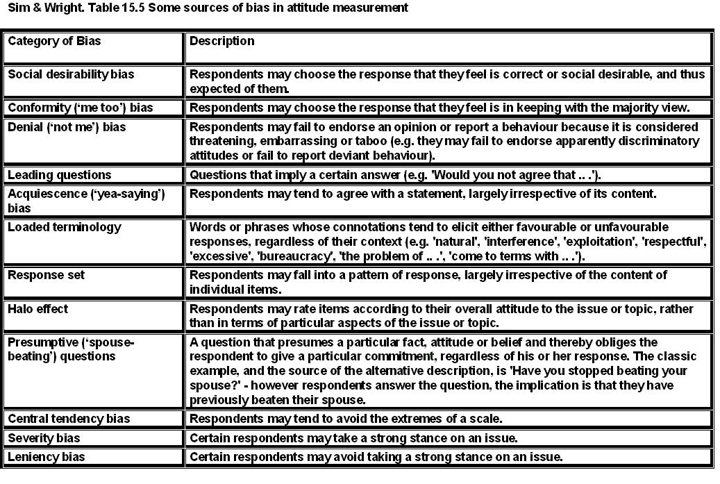

<div class="notes">

Sim and Wright. Sources of bias in attitude measurement.

Social desirability, conformity, denial, acquiescence.

Leading questions, loaded terminology, presumptive (wife-beating) 

Response set (stuck on the same value), or tendency to extremes.

Example of "push polling."

"Any other comments?" http://www.biomedcentral.com/1471-2288/4/25.

http://www.pmean.com/04/DesigningQuestionnaire.html

</div>

***
### Data Collection Techniques 

+ Surveys – Example
	+ Using a scale of 0 to 100, please indicate the percentage of time you take all the doses of your medicine?
	+ … take all the pills in each of your doses?
	+ … take all doses on the prescribed schedule?
	+ … follow all special instructions …
	+ … make sure you refill all of your medications on time?
	
<div class="notes">

Medical history interview. Anti-retroviral medication, but some had no history yet, so used adherence in general. This gets tricky with multiple medications.

There's an issue that came up when using this study, which will be discussed in the discussion board. Answer these questions yourself, and how you based your response to the second through fourth items.

</div>

***
### Data Collection Techniques 

+ Process of developing a survey
	+ List of measures/variables
	+ What's already available?
	+ Put the pieces together
	+ Test and revise as needed
	+ Final check – do you really need all of the items?
+ Analysis of survey data

<div class="notes">

Flows well and is clear.

Get some real test runs with people who have seen it for the first time. Do you really need all of these items? 

[[Example of sexual preferences in survey on Internet usage.]]

http://www.pmean.com/10/BadSurvey.html

</div>

***
### Data Collection & Coding 


<div class="notes">

Figure 2.1 from your book. This is back from Chapter 2, and keep this in mind when you are designing your data collection.

</div>

***
### Data Collection & Coding 

+ Initial Steps
	+ Planning the study
	+ Pilot testing
	+ Data collection
		+ Check for completeness if possible

<div class="notes">

How things are working, where there is lack of clarity, how long does it take, where the systems don't work.

Make sure that your extraction process is complete as possible for secondary data. For prospective surveys, flip through a survey upside down to see if items are all filled in. Hope that you haven't missed a page. Electronic collection can force someone to respond before they answer the next question.

[[Ethically can't force someone to complete a questionnaire.]]

How do you handle multiple responses.

Code the maximal detail of variables like age so you can collapse as you see fit. Make sure that you code missing or ambiguous responses consistently.

REDCap is great!

[[Double entry coding]]

</div>

***
### Data Collection & Coding 

+ Data Coding, Entry, and Checking
	+ Guidelines
		+ Mutually exclusive levels
		+ Code for maximum information
		+ Record is as complete as possible
		+ Consistency
	+ Data entry form
	+ Checking entry

<div class="notes">


</div>

***
### Data Collection & Coding 

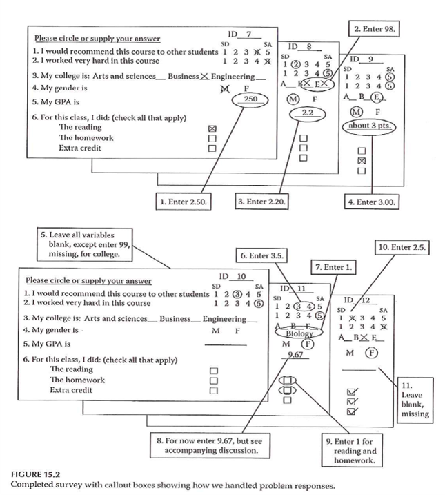

<div class="notes">

Figure 15.2. Completed survey with callout boxes showing how we handled problem responses.

</div>

***
### Data Collection & Coding 

+ Data Entry into Statistical Program
	+ Layout of data sheet
	+ Variable names
	+ Labeling
		+ Variables
		+ Values
	+ Codebook / documentation

<div class="notes">

[[See Intro to SAS/R material]]

By thinking about the backend process, you can sometimes fix things before you collect the data.

Mary uses Excel for documentation, but never for analysis, rarely for data entry.

Summarizes factor analysis, Cronbach's alpha. Note whether better to have high score or better to have low score.

[[EUSpRIG site]]

</div>

***
### Data Collection & Coding 

+ Data Summation
	+ Descriptive information
		+ Categorical variables
		+ Continuous variables
	+ Data checking – part 2

<div class="notes">

Look for inconsistent values, outliers, invalid values.

Note that certain responses on one question might lead to limits on the responses to other questions. Example, ever smoked? versus How many years?

</div>

***
### Data Collection & Coding 


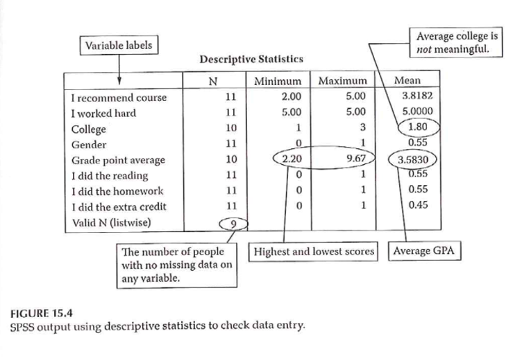

<div class="notes">

Figure 15.4 shows SPSS output using descriptive statisticis to check data entry. Example of Likert scale where everyone responded 5. Note the number of responses/missing responses.


Hopefully, you've done such a good job planning that these issues don't arise after the data is collected. [[Ha!]]

</div>

***
### Assignment #8 

+ Further refine your list of variables by specifying how each will be measured. Wherever appropriate, include the name of a specific measure. Do this by building onto the methods section of your research proposal draft. 

<div class="notes">

What's the evidence to support that measure.

</div>

***
`r read_text("hw10", fri[10])`

<div class="notes">


</div>

***
`r read_text("discussion10", fri[10])`

<div class="notes">


</div>

***

### Additional slides