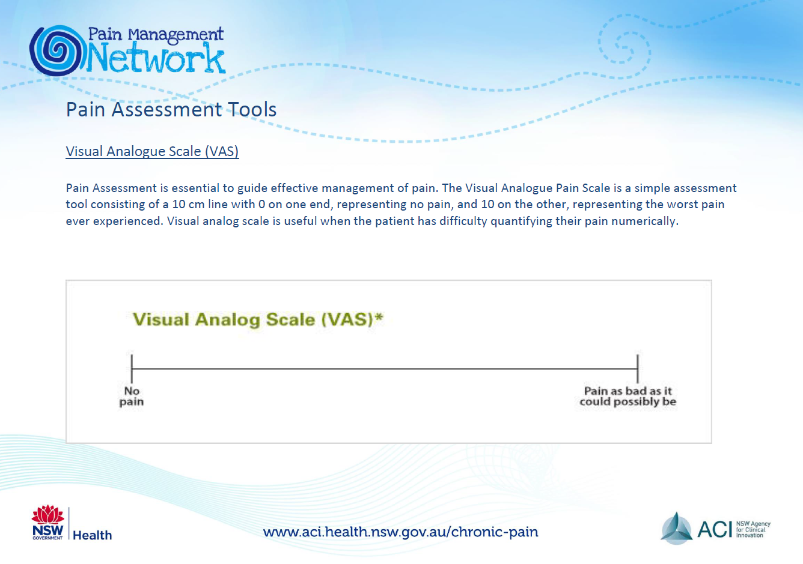
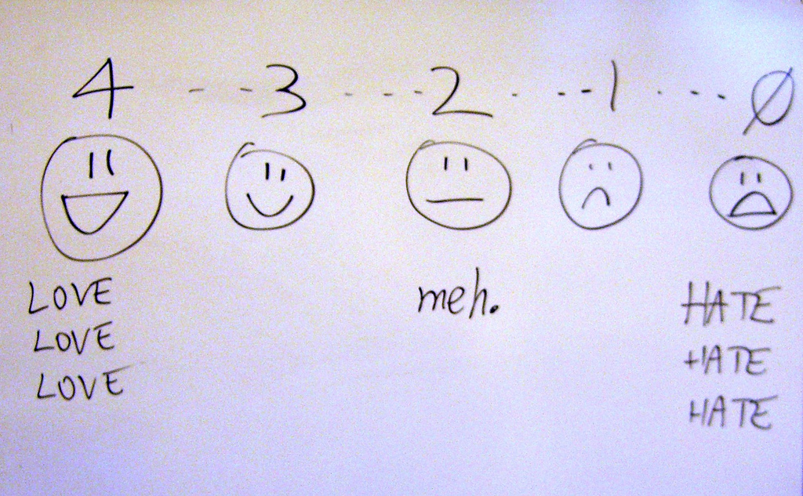
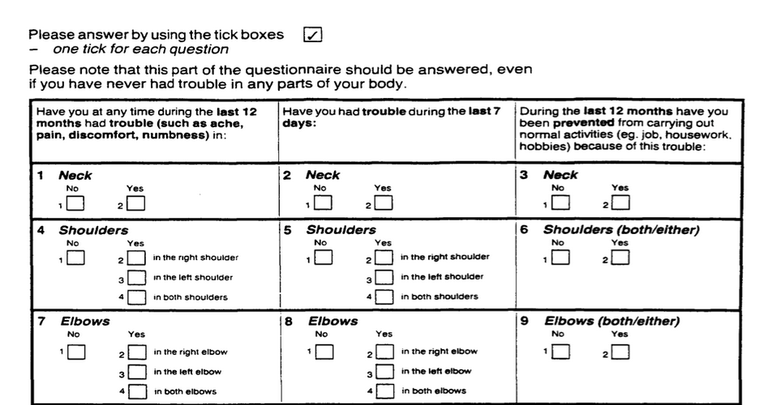
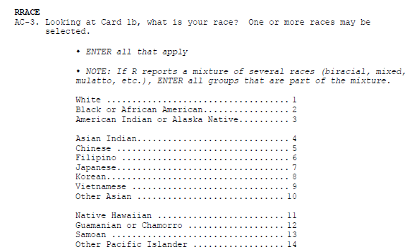

```{r echo=FALSE}
source("prelims.R", echo=FALSE)
```

### Data collection methods

* Data collection methods
  + Focus groups
  + Interviews
  + Questionnaires
  + Standardized instruments
  + Existing data
* Data quality

<div class="notes">

The first half of this talk will cover various data collection methods. The second half will cover data quality issues.

</div>

### Running focus groups

* Two person job
* Facilitator
  + Asks questions
  + Guide discussion, but stays neutral
* Recorder
  + Runs the tape recorder
  + Keeps written notes
* Debriefing session
  
<div class="notes">

If you decide to collect data in a focus group, you need a second person. You could do it by yourself, but you are asking for trouble. One of you takes the role of the facilitator and one takes the role of the recorder.

The facilitator asks a series of prepared questions. Your role is to guide the discussion while still keeping neutral. This means that you intervene if the group is getting off target or if one person is dominating the discussion. You should prepare some brief prompts to get your participants to elaborate or to draw in other participants.

The recorder doesn't say anything after the introductions, but runs the recording device and take notes. The notes serve several purposes. First, they serve as a backup if your recording fails. Second, they note any significant non-verbal information such as gestures and body language. Third, the notes help to identify who is speaking when. A seating diagram is helpful for this. Note that not all focus groups track who is speaking.

After the session is complete, the two of you sit down and talk about how things went.

</div>

### Structure of a focus group

* Six to ten participants
* Multiple groups
  + Stop when you achieve saturation
* Sixty to ninety minutes
* Ten questions, semi-structured interview

<div class="notes">

The size of a focus group can vary, but I've seen recommendations of six to twelve people.

What the research community does agree on is that you need to plan for more than one group. The consistency of responses from one group to the next will tell you if you have reached saturation. 

Saturation is evidence that no new themes or ideas have emerged from your groups. Almost all assessments of whether saturation has been achieved are qualitative and subjective.

The concept of saturation makes it difficult for you to plan a budget, but keep in mind that you cannot even begin to assess saturation until you've run your second focus group.

Other common recommendations are to keep each session short, 60 to 90 minutes, and to have no more than ten questions. Your questions should follow a semi-structured format, which I'll talk about in the context of interviewing.

Getting information from a group is a double-edged sword. Often in a focus group, one participant will build on the comments of another and provide a perspective that you may have missed in a single person interview. At other times, however, one person may stifle the feedback from another. A good focus group leader will recognize this and work to insure that everyone participates fully. It's easy to say this in theory, but in practice, it can be difficult.

</div>

### Interview

* Administration
  + Telephone
  + Face-to-face
* Format
  + Unstructured
  + Semi-structured
  + Structured

<div class="notes">

An interview is direct communication between the researcher and the subject. You can set up the interview on the telephone or conduct a face-to-face interview. The obvious advantage of a telephone interview is that it is fast and does not involve travel of either party. 

A face-to-face interview takes more effort, but can sometimes help with building a sense of rapport and trust.

Interviews have three formats, unstructured, semi-structured, or structured. An unstructured format is rarely used in research because it makes you work impossible to replicate.

An unstructured interview is not used too often, because of problems with repeatability. The interviewer goes in with a general idea of what to discuss, but no specific questions. The general direction of the interview will determine what questions to ask next.

A semi-structured interview has a planned structure that includes a list of questions to ask. These questions are typically open-ended, to allow the patient to bring up issues that the researcher may not have been aware of. Most semi-structured interviews have a series of probe questions that are intended to prompt the research subject to elaborate further on a topic of interest.

</div>

### Example of structured and unstructured interviews


<div class="notes">

Here's an example of two interviews. The first is a structured interview with four yes/no questions. 

Before you were 17 years of age (Each question had answer choices of “Yes” or “No):

 1. a parent or guardian ever do something to you on purpose (for example, hit or punch or cut you, or push you down) that made you bleed or gave you bruises or scratches.
 
 2. Did, or that broke bones or teeth?”
 
 3. Did either of your parents or guardians get so mad at you that they hurt you physically?
 
 4. Did either of your parents or guardians use physical punishment for discipline?

The second interview is described as unstructured. I would call it semi-structured, but that is a nitpick. The questions were

 1. How do your parents or guardians discipline you?

 2. Do they ever physically hit you?

 3. How do they punish you?

 4. Further probing was done depending on the responses to the questions: : having been hit, punched, kicked, or otherwise struck or pushed down; cut, bruised, made to bleed, scratched, having broken bones, broken teeth, or having been hurt physically
 
The questions in the structured interview are close-ended. This is quite common, but you can also have a structured interview with open ended questions. For the semi-structured or unstructured interview, however, the questions must be open ended so that you can probe for more information.

The article that these interview questions came from noted that the unstructured interview was far more likely to uncover reports of abus than the structured interview.

Image source: Diaz 2017 (see the reading list for full details).

</div>

### Questionnaire

* Not the same as a survey
  + Questionnaire is the form
  + Survey is the process
* Administration
  + Mail
  + Computer (REDCap)
  + Telephone
  + In person
  
Note: telephone and in person questionnaires could be classified as interviews.
  
<div class="notes">

A questionnaire is a form with questions that your research subjects fill out by themselves. The term "quesitonnaire" is often used interchangably with the word "survey," but there is a distinction. The questionnaire is a specific term referring to the form itself, while a survey is intended to describe the entire process of data collection.

Now I myself use these terms without regard to the semantics, so if you do so also, you are in good company. But once in a while you will find someone who insists on careful choices of words like this. These people are the same busy-bodies who insist that data is a plural noun.

You can send out a questionnaire by mail or you can ask people to fill out the questionnaire on the computer. If you are using the computer, you should consider REDCap instead of commercial products like SurveyMonkey or SurveyGizmo. REDCap is an open source product that is supported by the Center for Health Insights. It's useful for any research project, but especially for online questionnaires.

You can administer a questionnaire over the telephone or in person. If you wanted to get fussy about terminology, a telephone or in person questionnaire is actually an interview. This is like everything else. You'll find a fuss-budget who will insist on the proper terminology and they are correct to do so. But they are still fuss-budgets.

</div>
  
### Question types for interviews and questionnaires

* No one to supervise if person answers "incorrectly".
  + Q. What is your age? A. Older than dirt.
  + Q. What is the one word that describes your greatest weakness? A. Inability to follow directions.
* Three broad classes of questions
  + Open ended
  + Partial open-ended
  + Close ended

<div class="notes">

For both questionnaires and interviews, you have three broad class of questions

</div>

### Advantages of open ended questions

* Richer, more detailed responses
* Captures unanticipated responses
* Avoids "pigeonholing".
  + "Pigeonholing is a process that attempts to classify disparate entities into a limited number of categories (usually, mutually exclusive ones). The term usually carries connotations of criticism, implying that the classification scheme referred to inadequately reflects the entities being sorted, or that it is based on stereotypes." Wikipedia.
  
<div class="notes">

Open ended questions let people use their own words. You can get an unlimited number of responses, which is both good and bad. The open ended question provides a richer set of responses, but is harder to quantify.

If you don't know the general categories of responses that people can provide in advance, the open ended question is your best friend. But keep in mind that you could use a pilot study with open ended questions to get a general idea of what the possible responses might be and use that to design close ended questions for the full study.

The other big advantage of open ended questions is that it avoids pigeon-holing. A pigeon hole is an array of stacked boxes that allow you to sort through paperwork quickly by placing different types of papers into different boxes. The term is often used pejoratively to refer to the process of assigning categories that often are too simplistic because of the limited number of choices.

</div>
  
### Advantages of close ended questions

* Faster
* Easier to analyze
* Better quality control

Note: partially open-ended questions are a compromise and have the worst of both worlds.

<div class="notes">

Close ended questions are faster, and that's a benefit both to you and to the person filling out the questionnaire. This is especially true if you are using mobile devices like phones and tablets to collect your data. The keyboard that is available on these devices is small and difficult to use. Your research subjects will probably be much happier if they can tap to select one from a limited set of options.

Open ended questions are easier to analyze. 

Quality control is a bit easier with close ended questions. That doesn't mean that someone won't trip you up. But less latitude in how you can respond means fewer things that could be done wrong.

</div>

### Types of close ended questions

* Fill in the blank
* Ordinal scales
  + Visual analog scale
  + Likert scale
* Nominal scales
  + Select one option
  + Select all that apply

<div class="notes">

There are several possible ways to ask close ended questions.

You can ask people to fill in the blank. Strictly speaking this is not a close ended question, but the intent is to get responses from a limited subset. You might ask a person "What is your age?" and leave a blank and you're supposed to fill in a number.

In some cases, fill in the blank works just fine, but always watch out for unexpected responses.

For an ordinal response, the order of the choices has meaning. If you re-arranged the order of choices for an ordinal category, you would, at a minimum, make things confusing. So a common ordinal scale is strongly disagree, disagree, neutral, agree, strongly agree. it would mess things up if you tried to alphabetize these responses: agree, disagree, neutral, strongly agree, strongly disagree.

For a nominal response, the order is largely arbitrary. Suppose you had to choose between the marital status choices: single, married, divorced, widowed. Re-ordering these alphabetically (divorced, married, single, widowed) is a little weird, but not so much as the agree, disagree, neutral, etc. example from earlier.

Ordinal responses typically are collected using a visual analog scale or some type of Likert scale.

Nominal responses are collectetd using a check box, but there are two possibilities: check only one, or check all that apply.

</div>

### Visual analog scale



<div class="notes">

This is an example of the visual analog scale.

</div>

### Likert scale



<div class="notes">

This is an example of Likert scale. 

https://www.flickr.com/photos/billsophoto/4175299981

</div>

### Likert response options

* Number of points
  + Larger is better? worse? than smaller
  + Even is better? worse? than odd
* Anchors
* Not applicable, Don't know
* Reverse scaling

<div class="notes">

There are a large number of ways to present a ordinal scale, and very little consensus in the research community about which approach is best. It, very likely, will depend on the context of your particular research setting. Here are some of the things that people argue about.

You have to have more than two options for an ordinal scale, or it reduces to a binary scale. So you might see three choices, or as many as ten. More than ten is very rare.

The most common number is five and the two most common alternatives are four and seven. But the two biggest debates are small versus large and odd versus even.

Is a large number of choices better or worse than a small number of choices? Some people think that too many choices will confuse you. Others think that more choices are better because they allow you the freedom to make subtle, but important distinctions. Others will argue that a larger number of choices will make it easier to analyze, because you can get closer to a bell shaped curve with a larger number of responses. This can backfire, though. With too many choices, people may gravitate towards a few favorite values leading to dips in frequencies at the unpopular values.

Is there a reason to choose even versus odd numbers. An odd number of choices always has a middle value (3 for a five point scale, for example) that represents neutral, or neither agree nor disagree. Some researchers hate this, and think that a neutral response is too easy to select thoughtlessly. An even number of values forces you to commit, even if only slightly, to the agree side or the disagree side.

Anchors are the words that are atached to the ordinal values. In the most common form, you are asked to read a statement and choose among Strongly disagree, disagree, neutral, agree, and strongly agree. For a six point scale this would be modified to Strongly disagree, Disagree, Slightly disagree, Slightly agree, Agree, Strongly agree.

You can choose other options, though. So you might ask about frequency. The choices could be Very frequently, Frequently, Occasionally, Rarely. Another choice would be Never, Rarely, Sometimes, Often. You could refer to a calendar with responses like Every day, Two or three times a week, Once a week, Less than once a week.

If you are measuring satisfaction, you might choose Very satisfied, Satisfied, Dissatisfied, Very dissatisfied.

If you are measuring quality, you might choose Excellent, Very good, Good, Fair, Poor.

If you are asking how important something is, you might choose Very important, Important, Moderately important, Slightly important, Not at all important.

You might ask people to choose between two moods, such as Very happy, Happy, Neither happy nor unhappy, Unhappy, Very unhappy.

For moods, sometimes researchers will just place anchors at each end and leave the middle responses blank. This is often done with a range of polar adjectives like rude/courteous, calm/excited, violent/gentle, silly/serious. Choosing between two polar adjectives is often called a semantic differential scale.

Sometimes, you might want to leave a response blank because it is not applicable, or you don't know. Both of these responses are different from the neutral option in a five point Likert scale, but if you aren't give a not applicable or don't know option, you might choose the neutral option as the best alternative.

Reverse scaling is the inclusion of questions where a positive result is sometimes scored as a high number and sometimes scored as a low number. This is done sometimes to insure that people read each question carefully and don't just choose the same option thoughtlessly down the list.

</div>

### Single response



<div class="notes">

https://en.wikiversity.org/wiki/Module_Book_for_Occupational_Medicine_at_the_University_of_Panam%C3%A1

</div>

### Multiple response



<div class="notes">

This is an example of a question where respondents can choose more than one response.

Part of the CDC survey, National Survey of Family Growth. See https://www.cdc.gov/nchs/nsfg/nsfg_2015_2017_puf.htm for details.

</div>

### Pilot testing a questionnaire

### Existing data sources

* Curated databases
* Web scraping

### Advantages of focus groups

* Faster than separate interviews
* Participants build each others comments

### Advantages of interviews

* On-the-spot fixes
* Increased participation rate

### Advantages of a questionnaire

* Less labor
* No interviewer bias

### Advantages of existing data

* Fast

### Measurement dichotomies

* Standardized versus investigator developed measures
* Researcher evaluation versus patient report
* Field measurements versus laboratory measurements
  + Ecological validity
* Standardized test

### Researcher evaluations

* Norm referenced tests
* Criterion referenced tests
* Achievement tests
* Performance assessment
  + Authentic assessment
* Aptitude tests
* Projective technique
* Documents

### Self report

* Standardized personality inventories
  + Paper and pencil
  + Machine scored

### Attitude scales

* Strongly disagree through strongly agree
* Semantic differential scales
  + Evaluative (good-bad)
  + Potency (strong-weak)
  + Activity (fast-slow)

### Questionnaires

* Definitions
  + Survey
  + Questionnaire
  + Interview
  
### Delivery

* Remote administration
  + Mail
  + Internet (Survey Monkey)
* Direct administration

### Structure

* Open-ended
* Partially open-ended
* Unordered closed response
* Ordered closed response

* Interviews
  + Telephone
  + Face-to-face
* Focus groups

### Pilot testing

* Clarity of items
* Content
* "Whether your items cover all aspects of the domain you intend to measure and whether they are in appropriate proportions relative to that domain."
  + page 258

### Coding

* Mutually exclusive
* Multiple response
* "Other" responses
* Use number codes for categorical data
* Missing codes
  + Never use blanks for missing (book is wrong)
  + -1, 99
  + Multiple codes for multiple reasons
* Dummy coding
  + 0/1 for absence/presence
* Reverse coding
  + High is always positive
* Tabular format
  + No more than one piece of information
* Double entry coding
* Standard coding for race/ethnicity

### Variable names

* Not too short, not too long
* Word delimiters
  + No spaces, symbols
* Example for Mother's age
* Bad choices
  + mom age
  + mom-age
  + momage
* Good choices
  + mom.age
  + mom_age
  + MomAge

### Codebook

* Also known as data dictionary

### Quality checks

* Minimum and maximum checks
  + Out of range
  + Zero variation
* Missing value count
* List five five rows, last five rows
* Correlations

### Data reduction

* Create composite scores
  + Check Cronbach's alpha
  + Examine leaving out single items
* Factor analysis
  + Supplanted by Structural Equations Modeling

### Data transformations

* Ideal - selected a priori
  + Sometimes based on precedent
  + Sometimes motivated by theory
  + Sometimes based on empirical findings

### Question order

* Sensitive questions last
* Broad categories
  + Income
  
### Additional topics

* Pilot studies

* Questionnaires. http://www.pmean.com/02/questionnaire.html

### Data Collection Techniques 


<div class="notes">

Table 13.1 is useful in terms of the various things that we will touch on. It classifies by the two types of quantitative research and by qualitative research. Organized by the potential amount of patient filtering. The ones at the top should have less participant filtering. Also note that the symbols are not hard and fast rules, but represent the likelihood.

</div>

***
### Data Collection Techniques 

+ Standardized vs Investigator-Developed Instruments
	+ Development and Use
	+ Evidence to support investigator-developed instruments

<div class="notes">

There is a lot of work in the development of standardized instruments, manual and documentaiton, normative values, apply to a broad area. Investigator developed instruments focus on a more specialized area, but you still need to supply information on validity and reliability.

Whenever possible use instruments already in use. You can find these in places like PROQOLID. This originally started as quality of life measurements, but has expanded. NIH compilation of patient reported outcome measures (PROMIS). NIH wants the research community to use common measures to allow easier compilation of studies in a meta-analysis.

</div>

***
### Data Collection Techniques 

+ Researcher-Observed Measures
	+ Naturalness of the setting
	+ Observer “participation”
	+ Amount of detail
	+ Breadth of coverage

<div class="notes">

The focus is on direct observation. The more natural the setting, the less control you have. This might hurt the internal validity of the study. It is a trade-off.

How much does the observer participate. In interviews and focus groups, there is a very clear high level of participation. On the other extreme, observation in public places might not have any knowledge of their participation. In the middle are studies where participants know they are being observed, but this knowledge may fade into the background.

</div>

***
### Data Collection Techniques 

+ Tests and Documents
	+ Standardized tests
		+ Norm referenced test
		+ Criterion referenced test
	+ Achievement tests
	+ Performance and Authentic assessments
	+ Aptitude tests
	+ Documents
	+ Content analysis

<div class="notes">

Norm scores allow you to compare to other scores (historical comparisons). These tests are very objective, but there is some subjectivity, perhaps, in their interpretation.

Measuring actual performance (ecologic validity). Tries to be very relevant to the setting.

Use existing documents. Existing records might have a higher level of accuracy but there is no gauarantee. Time is shorter because the documents already exist. Data extraction takes time. Do you need consent from the people associated with these documents.

Data abstraction is tedious, but the newer systems like i2b2 allow you to get the information more directly.

Content analysis is a more qualitative review. It gives you a lot of valuable information that a quantitative approach might miss.

</div>

***
### Data Collection Techniques 

+ Self-Report Measures
	+ Standardized Personality Inventories
	+ Attitudes / Beliefs scales
		+ Likert scale
		+ Semantic differential scale
	+ Questionnaires
		+ How delivered / administered
		+ Item types
	+ Interviews
	+ Focus groups

<div class="notes">

Personality inventories: the validity is dependent on an individual's self-awareness.

Attitudes and beliefs done for a variety of purposes. A "representative sample of all possible opinions or attitudes about a particularl subject." That's why measurement experts cringe when you ask a single question. You need a multiple set of items to get at how people feel.

The Likert scale is very popular. You may not see the semantic difference scale, but examples will follow.

Delivery by mail or Internet. There are pros and cons to all formats. Item types could include open-ended, partial (responses plus other), and close ended responses.

</div>

***
### Descriptive Research 

+ Surveys
	+ Methods
		+ Interview
		+ Questionnaires
	+ Design of surveys
		+ Research question
		+ Review of existing instruments
		+ Process of designing survey

<div class="notes">

Interview allows you to probe for comments. Video as well as audio is now available. It takes time and training. Concerns about anonymity with an interview.

Questionnaires are self-administered. Return rates are a concern. When sent out blindly, you can get low return rates, which hurts the generalizability of the study. There is potential for misunderstanding and people may get into a routine response and not provide as good quality of response.

Design the survey to address your research question. Thing about the pieces and the order.

</div>

***
### Data Collection Techniques 

+ Surveys
	+ Survey question format –
		+ Open-ended
		+ Close-ended
	+ Wording of questions
	+ Scales
		+ Scale of measurement
		+ Response options

<div class="notes">

Even as simple as something like age, you can ask it in an open-ended format that allows you to categorize any way you like or even to forgo categorization.

Wording is important. Simplicity and reading level. Use standardized scales whenever you can. 

Double-barreled questions. [[Ask option about supervisors and managers]]

How many times questions, think about the time frame (over the past 24 hours, past week, past month). Shorter time frames better recall, but subject to more external variations.

Building a level of trust. Don't ask people to admit to "bad behavior". Think of it from the perspective of the person providing the information.

[[Income: actual versus categories]]

</div>

***
### Data Collection Techniques 


<div class="notes">

+ Open-ended vs Close-ended

Respective roles of open or close ended format. This is a nice guide.

.footnote[Sim & Wright, 2002]

</div>

***
### Data Collection Techniques 


<div class="notes">

+ Surveys – Response Options
	+ Likert

.footnote[Portney & Watkins, 2009]

Example of five points (SD, D, N, A, SA)

</div>

***
### Data Collection Techniques 

..[](../images/image-10-04.png)

<div class="notes">

Everyone uses the term Likert with a hard-i, but the persons who developed this scale used a soft-i.

All items contributing to a total.

Some debate about the number of categories. Odd versus even. Even forces an opinion. Also a debate over a large versus a small number of items.

Do you want to reverse code some items. It could help keep the participants alert and thingking  This may end up confusing. [[13 questions, but question 8, first question on the bakc page, was the only reverse coding.]]

+ Surveys – Response Options
	+ Likert

.footnote[Sim & Wright, 2002]

Figure 15.8 is a different version of a five point scale.

Commercial plug for REDCap. Entry on a tablet. Coding is done on the back-end.

</div>

***
### Data Collection Techniques 


<div class="notes">

+ Surveys – Response Options
	+ Likert

.footnote[Sim & Wright, 2002] 

Figure 15.9 shows a seven point response.

IRB insistence on a "Prefer Not to Answer" response. Contrast this to a "Neutral" option.

</div>

***
### Data Collection Techniques 


<div class="notes">

+ Surveys – Response Options

.footnote[Sim & Wright, 2002]

Figure 15.3 

These scales seem backwards to Mary. You don't necessarily need to include the numbers are on the form. They can be added on the back end.

</div>

***
### Data Collection Techniques 


<div class="notes">

+ Surveys – Response Options

Figure 15.4, Sim & Wright, 2002.

Not at all, somewhat, moderately, very much, extremely.

Note that the largest number is associated with "not at all".

Double check that everyone agrees that somewhat is less than moderate, very much is less than extremely.

</div>

***
### Data Collection Techniques 


<div class="notes">

+ Surveys – Response Options

Figure 15.5. [Sim & Wright, 2002]

Good, Fair, Poor is a three point scale. Add Very good for a four point scale. Add Excellent to get a five point scale.

</div>

***
### Data Collection Techniques 


<div class="notes">

+ Surveys – Response Options
	+ Semantic Differential

Figure 15.4 [Portney & Watkins, 2009]

This is an example of a semantic differential. Seven point scale. Only label the extremes. Notice the reverse scaling of some items.

</div>

***
### Data Collection Techniques 


<div class="notes">

+ Surveys – Response Options
	+ Semantic Differential

Figure 15.11 [Portney & Watkins, 2009]

A second example of a semantic differential scale.

</div>

***
### Data Collection Techniques 


<div class="notes">

+ Surveys – Response Options
	+ Visual Analogue Scale (VAS)

Figure 15.5. [Portney & Watkins, 2009]

Commonly used for pain. Usually the line is 100 mm long. Gives you a number from 0 to 100, which allows you to treat this as a continuous variable.

Anchors at each extreme.

How do you handle a check mark.

This is a very labor intensive data entry task.

Note that the photocopy process can change the length of the scale (102 mm versus 100 mm).

</div>

***
### Data Collection Techniques 


<div class="notes">

+ Surveys – Response Options
	+ Numerical Rating Scale

Figure 15.1 [Sim & Wright, 2002]

This scale has 7 numbers with anchors at each end.

</div>

***
### Descriptive Research 

+ Surveys
	+ Pit-falls and words of caution
		+ How responses are recorded
		+ Wording of items
			+ Literacy level
			+ “ Loaded ” wording
		+ Complexity of items
			+ More than 1 “ unit ” in a single item
			+ Clearly stated terms

<div class="notes">

There are ways of checking the reading level of the survey. Good instructions. Branching (if "no" skip) patterns need to be laid out very clearly.

</div>

***
### Data Collection Techniques 


<div class="notes">

Sim and Wright. Sources of bias in attitude measurement.

Social desirability, conformity, denial, acquiescence.

Leading questions, loaded terminology, presumptive (wife-beating) 

Response set (stuck on the same value), or tendency to extremes.

Example of "push polling."

"Any other comments?" http://www.biomedcentral.com/1471-2288/4/25.

http://www.pmean.com/04/DesigningQuestionnaire.html

</div>

***
### Data Collection Techniques 

+ Surveys – Example
	+ Using a scale of 0 to 100, please indicate the percentage of time you take all the doses of your medicine?
	+ … take all the pills in each of your doses?
	+ … take all doses on the prescribed schedule?
	+ … follow all special instructions …
	+ … make sure you refill all of your medications on time?
	
<div class="notes">

Medical history interview. Anti-retroviral medication, but some had no history yet, so used adherence in general. This gets tricky with multiple medications.

There's an issue that came up when using this study, which will be discussed in the discussion board. Answer these questions yourself, and how you based your response to the second through fourth items.

</div>

***
### Data Collection Techniques 

+ Process of developing a survey
	+ List of measures/variables
	+ What's already available?
	+ Put the pieces together
	+ Test and revise as needed
	+ Final check – do you really need all of the items?
+ Analysis of survey data

<div class="notes">

Flows well and is clear.

Get some real test runs with people who have seen it for the first time. Do you really need all of these items? 

[[Example of sexual preferences in survey on Internet usage.]]

http://www.pmean.com/10/BadSurvey.html

</div>

***
### Data Collection & Coding 


<div class="notes">

Figure 2.1 from your book. This is back from Chapter 2, and keep this in mind when you are designing your data collection.

</div>

***
### Data Collection & Coding 

+ Initial Steps
	+ Planning the study
	+ Pilot testing
	+ Data collection
		+ Check for completeness if possible

<div class="notes">

How things are working, where there is lack of clarity, how long does it take, where the systems don't work.

Make sure that your extraction process is complete as possible for secondary data. For prospective surveys, flip through a survey upside down to see if items are all filled in. Hope that you haven't missed a page. Electronic collection can force someone to respond before they answer the next question.

[[Ethically can't force someone to complete a questionnaire.]]

How do you handle multiple responses.

Code the maximal detail of variables like age so you can collapse as you see fit. Make sure that you code missing or ambiguous responses consistently.

REDCap is great!

[[Double entry coding]]

</div>

***
### Data Collection & Coding 

+ Data Coding, Entry, and Checking
	+ Guidelines
		+ Mutually exclusive levels
		+ Code for maximum information
		+ Record is as complete as possible
		+ Consistency
	+ Data entry form
	+ Checking entry

<div class="notes">


</div>

***
### Data Collection & Coding 


<div class="notes">

Figure 15.2. Completed survey with callout boxes showing how we handled problem responses.

</div>

***
### Data Collection & Coding 

+ Data Entry into Statistical Program
	+ Layout of data sheet
	+ Variable names
	+ Labeling
		+ Variables
		+ Values
	+ Codebook / documentation

<div class="notes">

[[See Intro to SAS/R material]]

By thinking about the backend process, you can sometimes fix things before you collect the data.

Mary uses Excel for documentation, but never for analysis, rarely for data entry.

Summarizes factor analysis, Cronbach's alpha. Note whether better to have high score or better to have low score.

[[EUSpRIG site]]

</div>

***
### Data Collection & Coding 

+ Data Summation
	+ Descriptive information
		+ Categorical variables
		+ Continuous variables
	+ Data checking – part 2

<div class="notes">

Look for inconsistent values, outliers, invalid values.

Note that certain responses on one question might lead to limits on the responses to other questions. Example, ever smoked? versus How many years?

</div>

***
### Data Collection & Coding 


<div class="notes">

Figure 15.4 shows SPSS output using descriptive statisticis to check data entry. Example of Likert scale where everyone responded 5. Note the number of responses/missing responses.


Hopefully, you've done such a good job planning that these issues don't arise after the data is collected. [[Ha!]]

</div>

### Additional slides