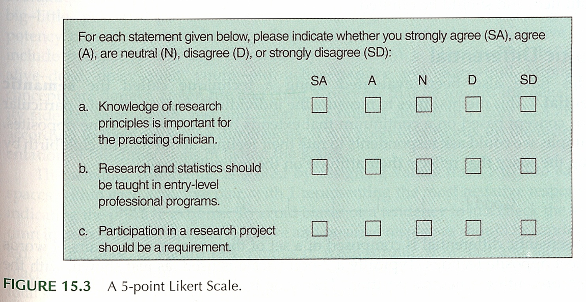
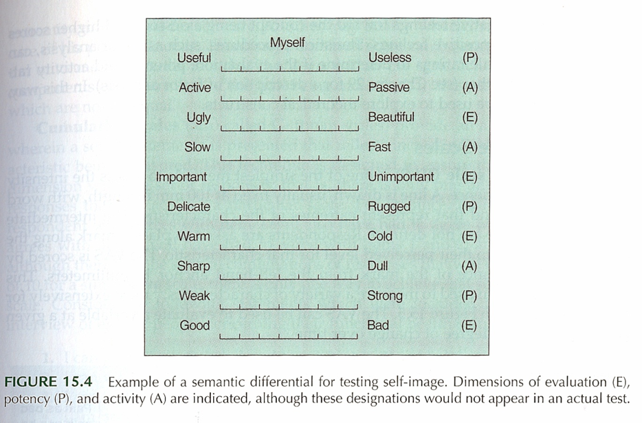
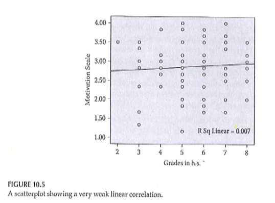
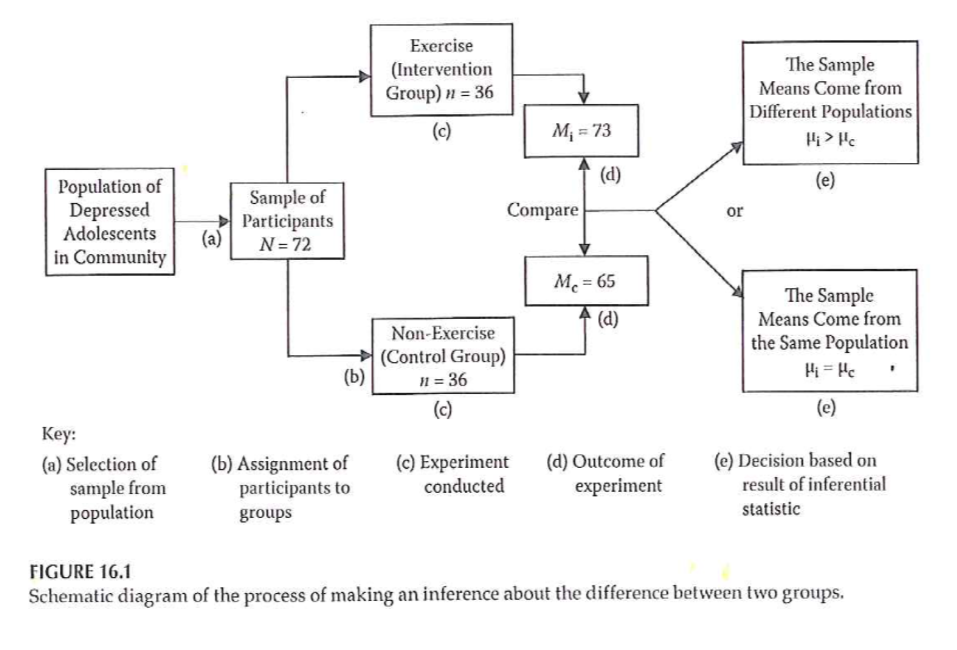
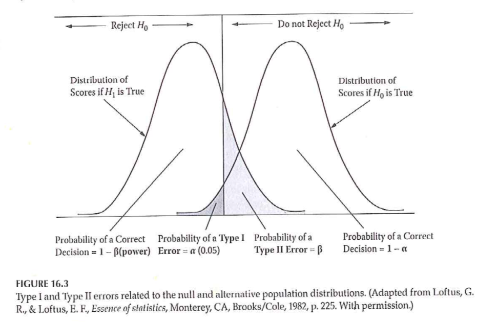
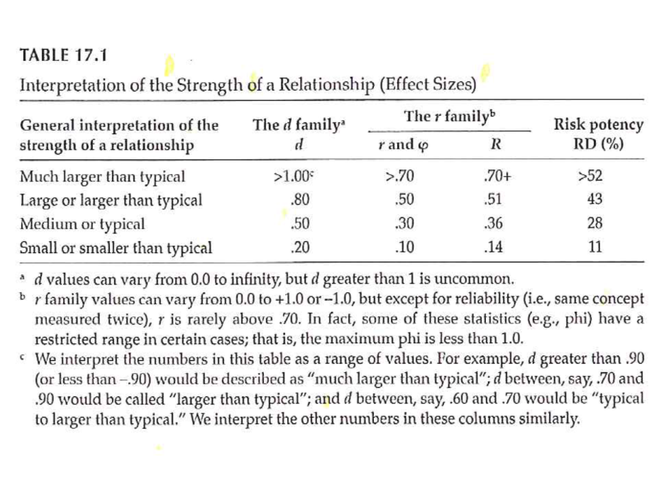
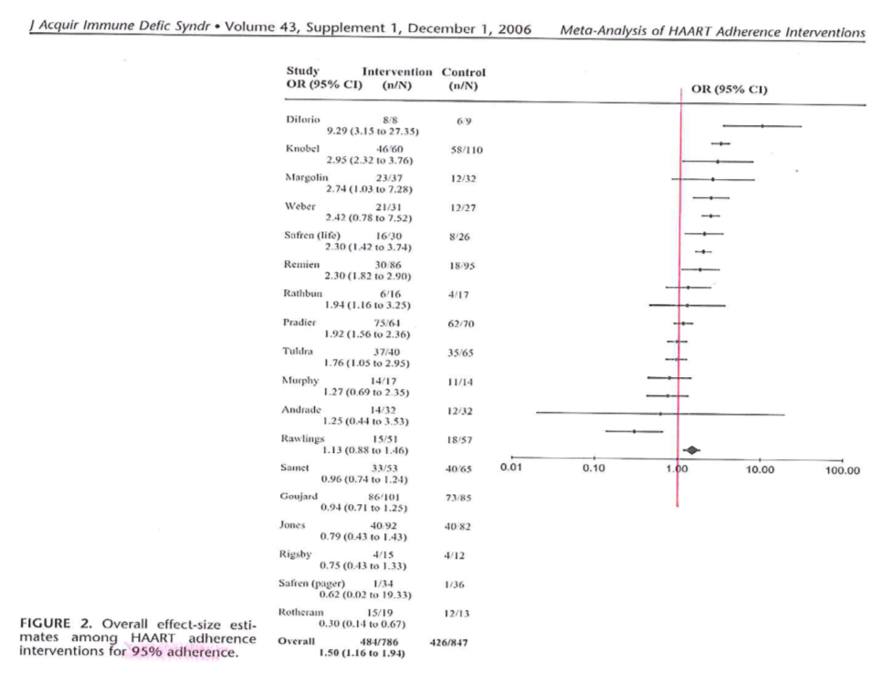
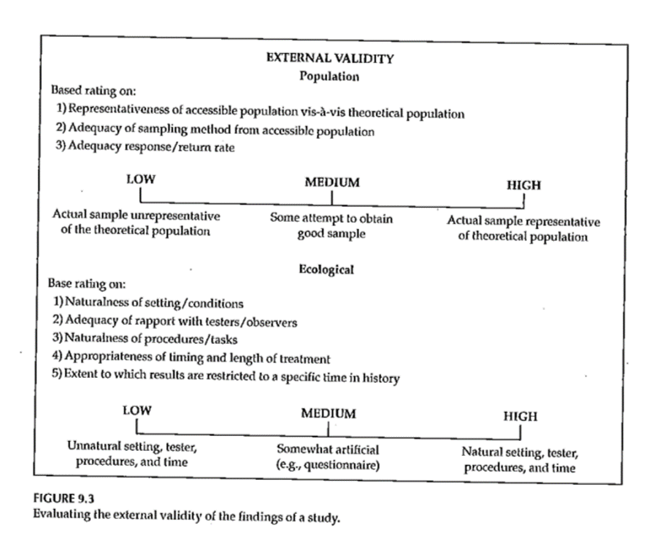

```{r echo=FALSE}
source("prelims.R", echo=FALSE)
```

### Variable names

* Brief, but descriptive explanation
* Roughly 4 to 16 characters
* No blanks and (Almost) no symbols
* One to three words

<div class="notes">

Define a brief variable name for every variable that you collect. It should be just long enough to be understandable, but short enough to minimize the typing in your data analysis program. I would recommend something between 4 to 16 characters and one or three short words.

Sometimes a very brief abbreviation is okay, like bw for birthweight or bmi for body mass index. 

</div>

### Good and bad variable names

* Names to avoid (www.writersexchange.com)
  + systolic blood pressure
  + systolic-blood-pressure
* Names that work
  + systolic_blood_pressure
  + systolic.blood.pressure
  + SystolicBloodPressure

<div class="notes">

If your variable name is two or three short words (former smoker, or plasma beta carotene), you need to be careful. There's a story about a group called Writer's Exchange. They wanted to set up a website, www.writersexchange.com. It seemed like a good idea until they noticed that the website could be read as writer sex change. cannot use blanks between the words. It would work for some systems easily, for others, it would require some tedious work-arounds, and for still others, it would lead to system errors.

You can't connect the words with dashes, because most systems will interpret the dash as a subtraction. Actually, just about any symbol (dollar sign, percent sign, asterisk) is a no-no. This can seriously stifle your creativity, but you have to live with it. Most statistical software programs reserve these symbols for special purposes, and if you use them in your variable names, you will confuse things.

There are two exceptions, the underscore character and the dot. These can be used almost anywhere. The dot is tricky in SQL and Java, as I understand it, but fine almost everywhere else. I believe the underscore is fine just about anywhere. But you can also use a mixture of upper and lower case, known as CamelCase.

</div>

### Codes for categorical data

* Beware of ambiguities
  + YES, Yes, and yes are three distinct levels.
* Use number codes
  + 0, 1, 9 for binary variables

<div class="notes">


</div>

### Data dictionary

* Also called a code book
* Start before collecting data
* Revise as needed

<div class="notes">

The data dictionary, also known as the code book, is a short document (usually one page or less) that describes your data. It helps you organize and structure your data entry process. It also helps anyone else who might be working with you on the project. Finally, it is invaluable if you plan to share your data with outside groups.

You should start a data dictionary before you collect any data. You will find, during the data collection, that you failed to specify something important, and it's okay to revise your data dictionary. Keep it handy when you need to figure out how to handle special cases, like the person who circled both 3 and 4 on a five point Likert scale.

</div>

### Contents of a data dictionary

  + Variable names
  + Variable labels
  + Units of measurement
  + Permissible/impermissible values
  + Value labels
  + Missing value codes
  + Source
  + License

<div class="notes">

The data dictionary should list variable names. We already talked about variable names. Also include a longer description, a variable label. The variable label can use blanks, special symbols, and typically has a longer length. Be sure to specify the units of measurement, if applicable.

If there are permissible/impermissible values or a legal range, then include this information in the data dictionary. It could be put in as part of the variable label or listed as a footnote.

If your variable is categorical, specify what the categories are. There is nothing worse than not knowing whether 1 is male and 2 is female or if 1 is female and 2 is male.

</div>

### If you enter data into Excel

* Do not use colors
* Do not include summary statistics
* Rectangular grid
* Don't squeeze two data values into one cell
  + Systolic/diastolic blood pressures
  + 44M for a 44 year old male
* Variable names in first row
* No blank cells
  + Contradicts your book

<div class="notes">

A lot of researchers do their data entry in Microsoft Excel or some similar spreadsheet program. This is, at best, sub-optimal. REDCap is a much better option. But if you decide to use a spreadsheet, be careful. Spreadsheets are very flexible. Too flexible. You can put some of your numbers over here and others over there and then some more in the middle, and what you end up with is a muddle.

The key rule for a spreadsheet is to use a rectangular grid. A rectangular grid has a single number at the intersection of every row and column. Don't leave holes in your grid, even if the value is missing. 

Don't try to squeeze to pieces of data into the same cell. A common problem is when researchers put 120/80 into a cell to represent the systolic and diastolic blood pressures. When you enter data like this, you have two problems. First, there is no easy way to compute the average systolic or diastolic blood pressure. Second, some statistical software will see the slash and confuse it for division, converting your 120/80 into 1.5.

Use one cell for the systolic blood pressure and a different cell for the diastolic blood pressure. Likewise, an entry of 44M for a forty four year old male is troublesome. You can't easily compute the average age or the percentage of males.

It's a good idea to place the variable names in the first row of the spreadsheet. It's not a strict requirement, as you have already provided the variable names in your data dictionary. If you are nice enough to do this, however, it will be easier to import the data. the first row also makes it possibile to spot check your data to make sure that the columns are lining up properly.

Don't use the first two or three rows to organize your variables into headings and subheadings.

A lot of people will include some brief summary statistics as the last row or two of the spreadsheet. This is a bad idea, as the summary statistics might be confused for actual data points. If you need to compute a few summary statistics, learn how to place these in a separate worksheet.

Don't use a lot of fancy formatting in your spreadsheet. This means, no colors, no different fonts or sizes, and no merged cells. All of this is lost when you import your data into SAS, SPSS, or R.

Let me emphasize one more thing. Do not use blank cells ever in your spreadsheet. If your data is missing, use a missing value code. This contradicts your book's advice, but your book is wrong. A blank cell could easily be converted into a zero, if you're not careful and zero is quite different than missing.

If the structure of your data is irregular and cannot fit into a rectangular grid, re-organize. If you have measurements on 24 treatment subjects and 26 controls, don't put the outcome measure for the 24 treatment patients in one column and the 26 control patients in a second column. Put all 50 in a single column and add an additional column with 26 ones and 24 twos to distinguish who is a treatment patient and who is a control.

</div>

### A poorly structured spreadsheet 


<div class="notes">

This image and the next three might be a bit tricky to see on your screen. You can download the original images from the Canvas site and magnify them, if you want to see the details.

Here is a spreadsheet that I received recently that violates many of the recommendations that I just made.

The first row contains information that should belong in the data dictionary. The second and third rows organize the variables into major groupings: the Kear HTN Management Tool, and the Motivators of and Barriers to Health-Smart Behaviors Inventory. There are subgroups within these two groups: Medication Adherence, Health Behaviors, Medication Side Effects, and Barriers to Managing Blood Pressure for the Kear HTN Management Tool, and Healthy Breakfast - Motivators, and some other subgrous for the Motivators of and Barriers to Health-Smart Behaviors Inventory.

The groupings and subgroupings belong in the data dictionary but not here. 

The fourth column gives a description of each variable. The first two columns are: I forgot to take my medication for high blood pressure,	I took all my medication for high blood pressure. These are much too long to serve as variable names. They would make great variable labels instead, and this information belongs in a data dictionary.

There is an important bit of information hidden in the formatting of the variable labels.

"Any question from any survey that is in yellow text indicates that the "ideal response" would run on a spectrum opposite to the majority of other responses, e.g. most responses on the MBHBI are "ideally" 4 for a healthy individual, but for a question in yellow text, a healthy individual would indicate 1."

So the ninth column (I participate in activities to reduce or limit my stress to help lower my blood pressure) is in black because a large value is good. But the tenth column (I have experienced side effects from my high blood pressure medication (such a dizziness, unsteadiness, weakness, decreased heart rate, or fatigue)) is in yellow because a small value is good.

The sixth row is totally blank which is great for readability but an annoyance when you import the data.

Finally, notice the blank cells. I found out that these represented cases where someone skipped a question.

</div>

### Revisions to this spreadsheet


<div class="notes">

I was able to work with this data set, as is, without too much trouble, but here's a modification that would have been a bit easier to work with.

The first row includes brief, but descriptive variable names. The column names are MedAdherence1 through 3, HealthBehaviors1	through 5, SideEffects1 through 3, and so forth. I anticipated that I would not need to distinguish among the particular questions within a subgroup, since I would probably just use an aggregate sum of each subgroup (after reverse scaling) for most of the analyses. 

</div>

### The codebook from this spreadsheet


<div class="notes">

I also cut and pasted some of the preliminary rows in the original spreadsheet and restructured things a bit to develop a data dictionary.

</div>

### Reverse coding

* Context specific
* Sequence of IF THEN ELSE statements
  + if (is.na(x)) then y=NA
     else if (x=1) then y=4
     else if (x=2) then y=3
     else if (x=3) then y=2
     else if (x=4) then y=1
     else y=9
* Functional transformations
  + 0,1 to 1,0 is f(x)=1-x
  + 1,2,3,4 to 4,3,2,1 is f(x)=5-x
  + 0,1,2,3,4 to 4,3,2,1,0 is f(x)=4-x
* Always check your results
* Watch out for missing value codes

<div class="notes">

Reverse scaling is tedious and always go slowly, because tedium tends to produce simple mistakes. SPSS has a very nice recode dialog box that is hard to mess up. You can also use a series of IF THEN ELSE commands to do the reverse coding. Notice that I took the time to code as 9 anything outside what I believed were the only possible values.

But if you want to be clever, there is usually a simple mathematical function of the form k-x  or k+1-x that will reverse scale everything all at once.

If you had a variable with values 0 and 1, the function f(x)=1-x will effectively convert the 0 to a 1 and the 1 to a 0.

If you had a variable with values 1, 2, 3, and 4, the function f(x)=5-x would effectively reverse these values. But note that if 0 were legal, if the possible values were 0, 1, 2, 3, and 4, then the proper function would be f(x)=4-x.

Always account properly for missing values when reverse scaling. It's a good idea to do a simple frequency table before and after reverse coding. It is also a good idea to store the reverse coded variable under a different name, so that you could easily undo any mistakes that you might have made.

</div>

```{r multiple-response1, echo=FALSE}
plot1 <- function() {
  r <- c(10, 30)
  plot(r, r, type="n")
  q <- c(
    "Q1. What are a few of your favorite things?",
    "        a. Raindrops on roses",
    "        b. Whiskers on kittens",
    "        c. Bright copper kettles",
    "        d. Warm woolen mittens")
  text(rep(10, 5), 27:23, q, adj=0, cex=0.75)
  points(rep(10.35, 4), 26:23, pch=c(0, 7, 7, 7), cex=2)
  text(rep(10, 5), 21:17, q, adj=0, cex=0.75)
  points(rep(10.35, 4), 20:17, pch=c(7, 7, 7, 0), cex=2)
  text(rep(10, 5), 15:11, q, adj=0, cex=0.75)
  points(rep(10.35, 4), 14:11, pch=c(0, 0, 7, 7), cex=2)
}

plot2 <- function(xe=30){
  segments(xe, 30, xe, 10)
  segments(22, 30, 22, 10)

  segments(22, 30, xe, 30)
  segments(22, 28, xe, 28)
  segments(22, 22, xe, 22)
  segments(22, 16, xe, 16)
  segments(22, 10, xe, 10)
}

plot3 <- function(xm=c(24, 26, 28)) {
  for (x in xm) {
    segments(x, 30, x, 10)
  }
}
fn <- "../images/11/multiple_response%01d.png"
png(file=fn, width=350, height=350)
par(mar=rep(0, 4))

plot1()

plot1()
plot2(24)
text(23, 29, "q1", cex=0.75)
text(23, 25, "bcd", cex=0.75, adj=0.5)
text(23, 19, "abc", cex=0.75, adj=0.5)
text(23, 13, "cd", cex=0.75, adj=0.5)

plot1()
plot2(28)
plot3(c(24, 26))
text(23, 29, "q1.1", cex=0.75)
text(25, 29, "q1.2", cex=0.75)
text(27, 29, "q1.3", cex=0.75)
text(23, 25, "b", cex=0.75, adj=0.5)
text(25, 25, "c", cex=0.75, adj=0.5)
text(27, 25, "d", cex=0.75, adj=0.5)
text(23, 19, "a", cex=0.75, adj=0.5)
text(25, 19, "b", cex=0.75, adj=0.5)
text(27, 19, "c", cex=0.75, adj=0.5)
text(23, 13, "c", cex=0.75, adj=0.5)
text(25, 13, "d", cex=0.75, adj=0.5)

par(mar=rep(0, 4))
plot1()
plot2(30)
plot3(c(24, 26, 28))
text(23, 29, "q1.a", cex=0.75)
text(25, 29, "q1.b", cex=0.75)
text(27, 29, "q1.c", cex=0.75)
text(29, 29, "q1.d", cex=0.75)
text(23, 25, "0", cex=0.75, adj=0.5)
text(25, 25, "1", cex=0.75, adj=0.5)
text(27, 25, "1", cex=0.75, adj=0.5)
text(29, 25, "1", cex=0.75, adj=0.5)
text(23, 19, "1", cex=0.75, adj=0.5)
text(25, 19, "1", cex=0.75, adj=0.5)
text(27, 19, "1", cex=0.75, adj=0.5)
text(29, 19, "0", cex=0.75, adj=0.5)
text(23, 13, "0", cex=0.75, adj=0.5)
text(25, 13, "0", cex=0.75, adj=0.5)
text(27, 13, "1", cex=0.75, adj=0.5)
text(29, 13, "1", cex=0.75, adj=0.5)

silence <- dev.off()
```

### A multiple response example


<div class="notes">

This is an example of a questionnaire where the patients can choose one of more of the following favorite things: Raindrops on roses, or whiskers on kittens. Bright copper kettles, or warm woolen mittens.

The first patient liked the last three things: whiskers on kittens, bright copper kettles, and warm woolen mittens.

The second patient liked first three things: raindrops on roses, whiskers on kittens, and bright copper kettles.

The third patient liked the last two things: bright copper kettles, and warm woolen mittens.

This approach makes it difficult to compute even simple statistics 

</div>

### Coding multiple response with a single column


<div class="notes">

You can code all the possible responses in a single column. Since the first person chose the last three responses, code their response as bcd. The second person chose the first three responses, and would be coded as abc. The third person only chose the last two responses, and would be coded cd.

This approach makes it difficult to compute even simple statistics, such as the proportion of patients who chose "Whiskers on kittens." You'd have to work with a string search function. It's not a terribly hard amount of work, but with a bit of planning, you could make it a bit easier down the road. 

</div>

### A different way to code multiple response


<div class="notes">

You could split this into three columns, putting the first selection in the first column, the second selection in the second column, and the third selection in the third column.

This is a bit better, but there are still some problems. 

This format produces some unneeded missing values, such as for the patient who has less than three favorite things.

If you find out halfway through the survey that someone chose all four favorite things, you'd have to go back and add a new column. 

This format is also a bit tricky. Notice how even though all three patients selected c, the letter appears once in the third column, once in the second column, and once in the first column. If you wanted the percentage of patients who chose "c," you'd have to calculate the percentage of c's in the first column, and add it to the percentage of c's in the second column and the percentage of c's in the third column.

</div>

### The recommended way to code multiple response


<div class="notes">

The recommended way to code multiple response is to create indicator variables for each possible response. The q1.a column is one for the second patient, as he/she was the only one who who liked raindrops on roses. The other two patients get a zero in this column. The q1.b column is one for the first and second patients, who both liked whiskers on kittens, but zero for the third patient who did not like whiskers on kittens. What's wrong here? Who doesn't like whiskers on kittens? The q1.c column is one for everybody because everybody liked bright copper kettles. Finally, in column q1.d, the first and third patients get ones for the like of warm woolen mittens, and the second patient gets a zero.

</div>

### Text files

* Fixed width
* Delimited
  + Commas
  + Spaces
  + Tabs
  + "Quotes around text"
  
<div class="notes">

You may wish to create a text file for others to use. The text format is popular for sharing your data, because others can inspect the data easily without needing any specialized software.

You can used a fixed width format. The

</div>

### Alternate

```{r test, eval=FALSE}
Year	Indigenous	Prisoners	Deaths	Population
1990	Yes	2041	6	168317
1991	Yes	2166	8	172462
1992	Yes	2223	2	176827
1993	Yes	2416	7	181341
1994	Yes	2742	11	185836
1995	Yes	2907	17	190438
1990	No	12264	27	13141817
1991	No	12855	31	13326044
1992	No	13336	34	13501987
1993	No	13450	42	13649262
1994	No	14302	42	13810095
1995	No	14501	42	13995940
```

### Fixed width

```{r fixed_width, eval=FALSE}
Subject	Treatment	Endurance	Order
1	Vitamin	145	1
1	Placebo	417	2
2	Vitamin	185	2	
2	Placebo	279	1
3	Vitamin	387	1
3	Placebo	678	2
4	Vitamin	593	2
4	Placebo	636	1
5	Vitamin	248	1
5	Placebo	170	2
6	Vitamin	245	2
6	Placebo	699	1
7	Vitamin	349	1
7	Placebo	372	2
8	Vitamin	902	2
8	Placebo	582	1
9	Vitamin	159	1
9	Placebo	363	2
10	Vitamin	122	2
10	Placebo	258	1
```


### Missing value example


<div class="notes">

Here's a humorous example of failure to account properly for missing values. The printer had a sales price of 299 dollars and 99 cents. The original price was listed as 9,999 dollars and 99 cents, which is an outrageous price for a printer. Clearly, a field of all nines was intended to be a missing value code. But the system that computed the savings did not recognize this as a missing value and calculated that if you bought this printer, you would be saving $9,700 dollars.

</div>

### Missing value codes

* Explain WHY the value is missing.
  + Did not answer
  + Not applicable
  + Below the limit of detection

<div class="notes">

Sometimes you do not have data for a particular variable for some of your patients. This is perfectly fine. You must explain why the value is missing. 

Sometimes a value is missing because a patient skipped the item on your questionnaire. Sometimes, it represents not applicable, such as your spouse's age if you are not married. Sometimes, it represents a lab value below the limit of detection. There are a whole host of other reasons.

How you handle missing values in your data analysis depends largely on the reason why that value is missing. Using the wrong approach can seriously bias your results.

</div>

### Example of missing value codes

* Use extreme number code
  + 9, 99, 999
  + -1
* Use symbols
  + NA
  + * (asterisk)
  + . (dot)
* Never use blanks to designate missing
* Note missing value code on data dictionary

<div class="notes">

There are several ways you can code missing values. I recommend an extreme number code. 9 works well for values that can't get any larger than 5. Use 99 or 999 if the values can get larger. You want to choose enough nines so that the value is clearly outside of any reasonable range of legitimate values. So a birthweight of 99 kilograms is obviously a missing value for anyone except for a baby elephant. An IQ score of 999 is outside the range even of Albert Einstein.

Some people use -1 for a missing value code if the variable is clearly not ever going to be a negative value. A baby could not have a birth weight of -1 kilogram, because such a baby would float up to the ceiling after being delivered.

If there are several reasons why a variable could be missing, use a separate code for each reason, such as 997 for lost test tube, 998 for insufficient volume for testing, and 999 for a result below the limit of detection.

You can also use symbols for missing values such as an asterisk or a dot. You can also use the letters NA, which is what R expects. These last three have a disadvantage for numeric variables. They end up confusing some imports and force your numeric column into a character string.
</div>

### Date formats


<div class="notes">


</div>

### Longitudinal data


### Additional topics

* As another aside, I was involved with a similar study (prospective, not retrospective). We planned this study using a one-sided hypothesis (remote prayer has a positive effect on health). The Institutional Review Board suggested changing this to a two-sided hypothesis (remote prayer has either a positive or a negative effect on health). Thankfully, we did not observe an outcome in the opposite tail as that would have been very difficult to explain.

### Pilot testing

* Clarity of items
* Content
* "Whether your items cover all aspects of the domain you intend to measure and whether they are in appropriate proportions relative to that domain."
  + page 258

### Data Collection Techniques 

+ Process of developing a survey
	+ List of measures/variables
	+ What's already available?
	+ Put the pieces together
	+ Test and revise as needed
	+ Final check – do you really need all of the items?
+ Analysis of survey data

<div class="notes">

Flows well and is clear.

Get some real test runs with people who have seen it for the first time. Do you really need all of these items? 

[[Example of sexual preferences in survey on Internet usage.]]

http://www.pmean.com/10/BadSurvey.html

</div>

### Coding

* Mutually exclusive
* Multiple response
* "Other" responses
* Use number codes for categorical data
* Missing codes
  + Never use blanks for missing (book is wrong)
  + -1, 99
  + Multiple codes for multiple reasons
* Dummy coding
  + 0/1 for absence/presence
* Reverse coding
  + High is always positive
* Tabular format
  + No more than one piece of information
* Double entry coding
* Standard coding for race/ethnicity

### Variable names

* Not too short, not too long
* Word delimiters
  + No spaces, symbols
* Example for Mother's age
* Bad choices
  + mom age
  + mom-age
  + momage
* Good choices
  + mom.age
  + mom_age
  + MomAge

### Codebook

* Also known as data dictionary

### Quality checks

* Minimum and maximum checks
  + Out of range
  + Zero variation
* Missing value count
* List five five rows, last five rows
* Correlations

### Data reduction

* Create composite scores
  + Check Cronbach's alpha
  + Examine leaving out single items
* Factor analysis
  + Supplanted by Structural Equations Modeling

### Data transformations

* Ideal - selected a priori
  + Sometimes based on precedent
  + Sometimes motivated by theory
  + Sometimes based on empirical findings

### Additional topics

* Pilot studies

* Questionnaires. http://www.pmean.com/02/questionnaire.html

### Data Collection Techniques 


<div class="notes">

Table 13.1 is useful in terms of the various things that we will touch on. It classifies by the two types of quantitative research and by qualitative research. Organized by the potential amount of patient filtering. The ones at the top should have less participant filtering. Also note that the symbols are not hard and fast rules, but represent the likelihood.

</div>

***
### Data Collection Techniques 

+ Standardized vs Investigator-Developed Instruments
	+ Development and Use
	+ Evidence to support investigator-developed instruments

<div class="notes">

There is a lot of work in the development of standardized instruments, manual and documentaiton, normative values, apply to a broad area. Investigator developed instruments focus on a more specialized area, but you still need to supply information on validity and reliability.

Whenever possible use instruments already in use. You can find these in places like PROQOLID. This originally started as quality of life measurements, but has expanded. NIH compilation of patient reported outcome measures (PROMIS). NIH wants the research community to use common measures to allow easier compilation of studies in a meta-analysis.

</div>

***
### Data Collection Techniques 

+ Researcher-Observed Measures
	+ Naturalness of the setting
	+ Observer “participation”
	+ Amount of detail
	+ Breadth of coverage

<div class="notes">

The focus is on direct observation. The more natural the setting, the less control you have. This might hurt the internal validity of the study. It is a trade-off.

How much does the observer participate. In interviews and focus groups, there is a very clear high level of participation. On the other extreme, observation in public places might not have any knowledge of their participation. In the middle are studies where participants know they are being observed, but this knowledge may fade into the background.

</div>

***
### Data Collection Techniques 

+ Tests and Documents
	+ Standardized tests
		+ Norm referenced test
		+ Criterion referenced test
	+ Achievement tests
	+ Performance and Authentic assessments
	+ Aptitude tests
	+ Documents
	+ Content analysis

<div class="notes">

Norm scores allow you to compare to other scores (historical comparisons). These tests are very objective, but there is some subjectivity, perhaps, in their interpretation.

Measuring actual performance (ecologic validity). Tries to be very relevant to the setting.

Use existing documents. Existing records might have a higher level of accuracy but there is no gauarantee. Time is shorter because the documents already exist. Data extraction takes time. Do you need consent from the people associated with these documents.

Data abstraction is tedious, but the newer systems like i2b2 allow you to get the information more directly.

Content analysis is a more qualitative review. It gives you a lot of valuable information that a quantitative approach might miss.

</div>

***
### Data Collection Techniques 

+ Self-Report Measures
	+ Standardized Personality Inventories
	+ Attitudes / Beliefs scales
		+ Likert scale
		+ Semantic differential scale
	+ Questionnaires
		+ How delivered / administered
		+ Item types
	+ Interviews
	+ Focus groups

<div class="notes">

Personality inventories: the validity is dependent on an individual's self-awareness.

Attitudes and beliefs done for a variety of purposes. A "representative sample of all possible opinions or attitudes about a particularl subject." That's why measurement experts cringe when you ask a single question. You need a multiple set of items to get at how people feel.

The Likert scale is very popular. You may not see the semantic difference scale, but examples will follow.

Delivery by mail or Internet. There are pros and cons to all formats. Item types could include open ended, partial (responses plus other), and close ended responses.

</div>

***
### Descriptive Research 

+ Surveys
	+ Methods
		+ Interview
		+ Questionnaires
	+ Design of surveys
		+ Research question
		+ Review of existing instruments
		+ Process of designing survey

<div class="notes">

Interview allows you to probe for comments. Video as well as audio is now available. It takes time and training. Concerns about anonymity with an interview.

Questionnaires are self-administered. Return rates are a concern. When sent out blindly, you can get low return rates, which hurts the generalizability of the study. There is potential for misunderstanding and people may get into a routine response and not provide as good quality of response.

Design the survey to address your research question. Thing about the pieces and the order.

</div>

***
### Data Collection Techniques 

+ Surveys
	+ Survey question format –
		+ Open ended
		+ Close ended
	+ Wording of questions
	+ Scales
		+ Scale of measurement
		+ Response options

<div class="notes">

Even as simple as something like age, you can ask it in an open ended format that allows you to categorize any way you like or even to forgo categorization.

Wording is important. Simplicity and reading level. Use standardized scales whenever you can. 

Double-barreled questions. [[Ask option about supervisors and managers]]

How many times questions, think about the time frame (over the past 24 hours, past week, past month). Shorter time frames better recall, but subject to more external variations.

Building a level of trust. Don't ask people to admit to "bad behavior". Think of it from the perspective of the person providing the information.

[[Income: actual versus categories]]

</div>

***
### Data Collection Techniques 


<div class="notes">

+ Open ended vs Close ended

Respective roles of open or close ended format. This is a nice guide.

.footnote[Sim & Wright, 2002]

</div>

***
### Data Collection Techniques 



<div class="notes">

+ Surveys – Response Options
	+ Likert

.footnote[Portney & Watkins, 2009]

Example of five points (SD, D, N, A, SA)

</div>

***
### Data Collection Techniques 

..[](../images/image-10-04.png)

<div class="notes">

Everyone uses the term Likert with a hard-i, but the persons who developed this scale used a soft-i.

All items contributing to a total.

Some debate about the number of categories. Odd versus even. Even forces an opinion. Also a debate over a large versus a small number of items.

Do you want to reverse code some items. It could help keep the participants alert and thingking  This may end up confusing. [[13 questions, but question 8, first question on the bakc page, was the only reverse coding.]]

+ Surveys – Response Options
	+ Likert

.footnote[Sim & Wright, 2002]

Figure 15.8 is a different version of a five point scale.

Commercial plug for REDCap. Entry on a tablet. Coding is done on the back-end.

</div>

***
### Data Collection Techniques 


<div class="notes">

+ Surveys – Response Options
	+ Likert

.footnote[Sim & Wright, 2002] 

Figure 15.9 shows a seven point response.

IRB insistence on a "Prefer Not to Answer" response. Contrast this to a "Neutral" option.

</div>

***
### Data Collection Techniques 


<div class="notes">

+ Surveys – Response Options

.footnote[Sim & Wright, 2002]

Figure 15.3 

These scales seem backwards to Mary. You don't necessarily need to include the numbers are on the form. They can be added on the back end.

</div>

***
### Data Collection Techniques 


<div class="notes">

+ Surveys – Response Options

Figure 15.4, Sim & Wright, 2002.

Not at all, somewhat, moderately, very much, extremely.

Note that the largest number is associated with "not at all".

Double check that everyone agrees that somewhat is less than moderate, very much is less than extremely.

</div>

***
### Data Collection Techniques 


<div class="notes">

+ Surveys – Response Options

Figure 15.5. [Sim & Wright, 2002]

Good, Fair, Poor is a three point scale. Add Very good for a four point scale. Add Excellent to get a five point scale.

</div>

***
### Data Collection Techniques 



<div class="notes">

+ Surveys – Response Options
	+ Semantic Differential

Figure 15.4 [Portney & Watkins, 2009]

This is an example of a semantic differential. Seven point scale. Only label the extremes. Notice the reverse scaling of some items.

</div>

***
### Data Collection Techniques 


<div class="notes">

+ Surveys – Response Options
	+ Semantic Differential

Figure 15.11 [Portney & Watkins, 2009]

A second example of a semantic differential scale.

</div>

***
### Data Collection Techniques 


<div class="notes">

+ Surveys – Response Options
	+ Visual Analogue Scale (VAS)

Figure 15.5. [Portney & Watkins, 2009]

Commonly used for pain. Usually the line is 100 mm long. Gives you a number from 0 to 100, which allows you to treat this as a continuous variable.

Anchors at each extreme.

How do you handle a check mark.

This is a very labor intensive data entry task.

Note that the photocopy process can change the length of the scale (102 mm versus 100 mm).

</div>

***
### Data Collection Techniques 


<div class="notes">

+ Surveys – Response Options
	+ Numerical Rating Scale

Figure 15.1 [Sim & Wright, 2002]

This scale has 7 numbers with anchors at each end.

</div>

***
### Descriptive Research 

+ Surveys
	+ Pit-falls and words of caution
		+ How responses are recorded
		+ Wording of items
			+ Literacy level
			+ “ Loaded ” wording
		+ Complexity of items
			+ More than 1 “ unit ” in a single item
			+ Clearly stated terms

<div class="notes">

There are ways of checking the reading level of the survey. Good instructions. Branching (if "no" skip) patterns need to be laid out very clearly.

</div>

***
### Data Collection Techniques 


<div class="notes">

Sim and Wright. Sources of bias in attitude measurement.

Social desirability, conformity, denial, acquiescence.

Leading questions, loaded terminology, presumptive (wife-beating) 

Response set (stuck on the same value), or tendency to extremes.

Example of "push polling."

"Any other comments?" http://www.biomedcentral.com/1471-2288/4/25.

http://www.pmean.com/04/DesigningQuestionnaire.html

</div>

***
### Data Collection Techniques 

+ Surveys – Example
	+ Using a scale of 0 to 100, please indicate the percentage of time you take all the doses of your medicine?
	+ … take all the pills in each of your doses?
	+ … take all doses on the prescribed schedule?
	+ … follow all special instructions …
	+ … make sure you refill all of your medications on time?
	
<div class="notes">

Medical history interview. Anti-retroviral medication, but some had no history yet, so used adherence in general. This gets tricky with multiple medications.

There's an issue that came up when using this study, which will be discussed in the discussion board. Answer these questions yourself, and how you based your response to the second through fourth items.

</div>

***
***
### Data Collection & Coding 


<div class="notes">

Figure 2.1 from your book. This is back from Chapter 2, and keep this in mind when you are designing your data collection.

</div>

***
### Data Collection & Coding 

+ Initial Steps
	+ Planning the study
	+ Pilot testing
	+ Data collection
		+ Check for completeness if possible

<div class="notes">

How things are working, where there is lack of clarity, how long does it take, where the systems don't work.

Make sure that your extraction process is complete as possible for secondary data. For prospective surveys, flip through a survey upside down to see if items are all filled in. Hope that you haven't missed a page. Electronic collection can force someone to respond before they answer the next question.

[[Ethically can't force someone to complete a questionnaire.]]

How do you handle multiple responses.

Code the maximal detail of variables like age so you can collapse as you see fit. Make sure that you code missing or ambiguous responses consistently.

REDCap is great!

[[Double entry coding]]

</div>

***
### Data Collection & Coding 

+ Data Coding, Entry, and Checking
	+ Guidelines
		+ Mutually exclusive levels
		+ Code for maximum information
		+ Record is as complete as possible
		+ Consistency
	+ Data entry form
	+ Checking entry

<div class="notes">


</div>

***
### Data Collection & Coding 


<div class="notes">

Figure 15.2. Completed survey with callout boxes showing how we handled problem responses.

</div>

***
### Data Collection & Coding 

+ Data Entry into Statistical Program
	+ Layout of data sheet
	+ Variable names
	+ Labeling
		+ Variables
		+ Values
	+ Codebook / documentation

<div class="notes">

[[See Intro to SAS/R material]]

By thinking about the backend process, you can sometimes fix things before you collect the data.

Mary uses Excel for documentation, but never for analysis, rarely for data entry.

Summarizes factor analysis, Cronbach's alpha. Note whether better to have high score or better to have low score.

[[EUSpRIG site]]

</div>

***
### Data Collection & Coding 

+ Data Summation
	+ Descriptive information
		+ Categorical variables
		+ Continuous variables
	+ Data checking – part 2

<div class="notes">

Look for inconsistent values, outliers, invalid values.

Note that certain responses on one question might lead to limits on the responses to other questions. Example, ever smoked? versus How many years?

</div>

***
### Data Collection & Coding 


<div class="notes">

Figure 15.4 shows SPSS output using descriptive statisticis to check data entry. Example of Likert scale where everyone responded 5. Note the number of responses/missing responses.


Hopefully, you've done such a good job planning that these issues don't arise after the data is collected. [[Ha!]]

</div>


### Measurement dichotomies

* Standardized versus investigator developed measures
* Researcher evaluation versus patient report
* Field measurements versus laboratory measurements
  + Ecological validity
* Standardized test

### Researcher evaluations

* Norm referenced tests
* Criterion referenced tests
* Achievement tests
* Performance assessment
  + Authentic assessment
* Aptitude tests
* Projective technique
* Documents

### Self report

* Standardized personality inventories
  + Paper and pencil
  + Machine scored

### Questionnaires

* Definitions
  + Survey
  + Questionnaire
  + Interview
  
### Delivery

* Remote administration
  + Mail
  + Internet (Survey Monkey)
* Direct administration

### Structure

* Open ended
* Partially open ended
* Unordered closed response
* Ordered closed response

* Interviews
  + Telephone
  + Face-to-face
* Focus groups

### Analysis of Qualitative Data

* http://blog.pmean.com/semi-structured-interviews/

* Positivism versus constructivism, revisited
  + https://www.sagepub.com/sites/default/files/upm-binaries/29985_Chapter1.pdf
  + http://blog.pmean.com/recommended-philosophy-news-network-postmodernism-special-report/
  
Tools: semi-structured interviews, participant observation, photo elicitation(?), mapping exercises(?), web and space design workshops(?), archival records, physical artifacts, 

Typically, a one-hour interview requires a minimum of three to four hours (or more) of analysis.

Involve the participants in the process, especially for narrative research.

### Analysis of Qualitative Data 

+ Inductive process –
	+ Start with the specific (raw data / transcript)
	+ Develop a theoretical framework from the data
	+ Conceptual categories emerge from the data

<div class="notes">


</div>


### Analysis of Qualitative Data 

+ Start the study with a research question
	+ This may provide a potential starting point for analyzing text
	+ If you do this, DO NOT let it prevent you from seeing what is in the text
+ Steps
	+ From raw data to theory building
	+ “ Iterative ” process
		+ e.g. , as you are developing categories, check them back against the raw data – do they continue to reflect the original data?

<div class="notes">

Keep alert and look for things that come out in the material that you were not anticipating. As your categories, go back and compare them against the raw data. Make sure that you allow the data to guide you. Often coding from transcripts. But it is also good to have access to the original recordings. Sometimes there is a doubt about what some was saying (joking or sarcasm). Look for tone of voice and non-verbal cues.

Content analysis is a generic term, but you can look at things like ad messages in magazines that appeal to young adults.

Thematic analysis is looking for patterns.

</div>


### Analysis of Qualitative Data 

+ Analysis process –
	+ Given research question, may have some idea of a general conceptual structure; serve only as a starting point
	+ Usually work from transcripts
	+ If possible, refer back to audio recordings when needed
	+ Qualitative form of analysis
		+ Content analysis – analysis of the content of communication
		+ Thematic analysis – identifying patterns or themes in the data

<div class="notes">

Break up the text into "bits" that represent specific thoughts. Open coding lots of themes. Axial coding looks at the relationships between themes, builds a superstructure of ideas.

</div>


### Analysis of Qualitative Data 

+ Category Formation – assign sections (data bits) to analytical categories/themes "coding"
	+ Summarizing the data by identifying similarities and differences / commonalities and contrasts
	+ Categories:
		+ More manageable units of information
		+ "open coding"
		+ Descriptive – Concrete
		+ Interpretive – Abstract
		+ Relational
	+ Cross-reference categories back to text
		+ Makes it easier to revise coding as needed

<div class="notes">

Software allows you to go back and forth between themes and the original text. Cross-referencing is important. Find examples easily. It helps provide validity checks. Does someone agree with your categorization.

Categories need to be faithful to the data. This is internal validity. But you need to place this in a broader understanding.

You need to be careful about trying to quantify this too much. Keep in mind that just because someone talks about something a lot does not mean that this is the most important thing to them. The most important thing might be something that people are uncomfortable talking about.

</div>


### Analysis of Qualitative Data 

+ Category Formation
	+ Faithful to the data – "internal" aspect
	+ Meaningful to other categories – "external" aspect
	+ Balance
		+ Generality vs Specificity
		+ Inclusivity vs Exclusivity
	+ Number of times idea mentioned does NOT necessarily reflect importance

<div class="notes">


</div>


### Analysis of Qualitative Data 

+ Labeling / Revising Categories
	+ Member-generated – “ first-order ” account
	+ Observer-generated – “ second-order ” account
	+ Labels are provisional; may be revised
	+ Iteration – move back and forth between raw data and labeled categories
	+ “ Zoom in ” vs “ Wide angle ” view of the coding
	+ Revision – may end up dividing or combining categories
	+ May establish criteria for category coding

<div class="notes">

Phrasing of the person versus observations generated by the researcher. Labels should be considered as provisional as you work with more complete information. It is an iterative process. Go back to original data. You're looking at the specific of what's been told versus a broader understanding.

Establishing the criteria may depend on how many people are doing the coding. If you don't have a pre-existing structure, the coding may evolve and may involve 100% review (both raters review everything and resolve discrepancy). Then a third person does an audit.

</div>


### Analysis of Qualitative Data 

+ Saturation – the point at which you are not gaining any new insight, no new categories being identified, no new relationships being defined
	+ Don't need any additional analysis
	+ Don't need any additional data collection (if collection & analysis done in parallel)
	+ Determinant – nature of the information being collection – NOT amount of information
	+ Keeping notes – of the coding/analysis process
	+ Help identify categories/relationships
	+ Help if "stuck"
	+ Document analysis process

<div class="notes">

Saturation is a way to assess your sample size. Have you gotten a representative amount of data. 

Really important to keep notes of the coding and analysis process, so you can check your work. Allows you to do qualirty checks on the process.

</div>


### Analysis of Qualitative Data 

+ Role of Judgment
	+ Balancing act –
		+ Level of creativity by coder to identify categories/relationships
		+ Must reflect the informants thoughts
		+ Audit of the coding by an independent person can check for the match between the coding and the source information
	+ Low-inference descriptors
	+ Look for "negative cases"

<div class="notes">

You develop a framework, but that framework must always represent what the subjects have said.

Low inference descriptors are those things involving just the basic words or text.

</div>


### Analysis of Qualitative Data 

+ Quantifying Information
	+ Pros & Cons
	+ When quantifying might be of value
	+ Simple frequency of occurrence does NOT necessarily reflect importance

<div class="notes">

This was mentioned earlier.

</div>

***
### Descriptive Statistics 


<div class="notes">

Figure 10.1 shows the standard bell shaped curve.

</div>

***
### Descriptive Statistics 

+ Descriptive graphs
	+ How to look at your data
	+ Options for viewing your data
		+ Frequency polygons
		+ Histograms
		+ Bar charts

<div class="notes">

Even for a qualitative study, you'll still want to describe characteristics of your sample.

For a fancier inferential analysis, you still should start with a descriptive analysis.

</div>

***
### Descriptive Statistics 


<div class="notes">

Figures 10.2 and 10.3.

Frequency polygon has a line connecting values and implicitly represents a normal distribution.

</div>

***
### Descriptive Statistics 

+ Measures of central tendency
	+ Mean
	+ Median
	+ Mode

<div class="notes">

These terms should already be familiar to you. The mean is the best choice for approximately normal distribution. The median is better for non-normal continuous variables and ordinal variables.

</div>

***
### Descriptive Statistics 

+ Measures of variability
	+ Range
	+ Standard deviation
	+ Interquartile range
	+ How many categories

<div class="notes">

The standard deviation is considered a poor measure of variability for a non-normal population. The interquartile is the difference between the 75th percentile and the 25th percentile. Define the 25th percentile as the value so that approximately 25% of the values are smaller and 75% are larger.

</div>

***
### Descriptive Statistics 

+ Measures of association between 2 variables
	+ Correlation
		+ Pearson
		+ Spearman
	+ Cross-tabulation
	+ Scatterplot

<div class="notes">

A correlation is a value between -1 and +1. There are two versions. Use Spearman for non-normal or ordinal variables.

Cross-tabulation is best for nominal and ordinal variables.

</div>

***
### Descriptive Statistics 


<div class="notes">

Figure 10.4 shows the relationship between grade level and performance on a math achievement test. It shows a trend line and an R-squared value.

Note that this is an association but not necessarily a causal relationship. Knowledge of one variable helps you predict the other.

</div>

***
### Descriptive Statistics 



<div class="notes">

Figure 10.5 shows a much weaker relationship between grade level and motivation scale. The trend line is flat and the R-squared value is small.

</div>

***
### Descriptive Statistics 


<div class="notes">

Table 10.6 shows a cross-tabulation. Mary revised this to include row and column percentages. Orient towards the row totals or the column totals. Row percentages add up to 100% within each row and column percentages add up to 100% within each row.

You might compute both row and column percentages, but only include one in your final table.

</div>

***
### Descriptive Statistics 

+ Properties of the normal curve
	+ Unimodal
	+ Mean, median, and mode are equal
	+ Symmetric curve (skew)
	+ Range is infinite
	+ Shape – not too peaked or flat (kurtosis)

<div class="notes">

This is not a Statistics class, but is intended to help you decide how to choose analyses for your research plan.

There are five properties. Unimodal, symmetric (no skewness), infinite range, peakedness or flatness tells you information about the tendency to produce outliers.

[[Talk about range restrictions.]]

</div>

***
### Descriptive Statistics 


<div class="notes">

Figure 10.1 (normal curve) again.

</div>

***
### Descriptive Statistics 

+ Standard normal curve
	+ Definition
	+ How to compute
	+ Effect size

<div class="notes">

Set the mean to zero and a standard deviation of one. The standard normal curve is useful for effect size calculations and power analysis.

</div>

***
### Measurement & Descriptive Statistics 


<div class="notes">

Table 10.7. This is a great table that tells you what graphical and numeric summaries are appropriate for what types of data. This doesn't address the statistical tests (inferential analyses).

</div>

***
### Making Inferences - NHST 

+ Populations versus Samples
+ Use inferential statistics
	+ Sample statistics (M, SD) <U+F0E8>
	+ Population parameters (mu, sigma)
+ Null Hypothesis Significance Testing (NHST)
	+ Null hypothesis (H 0 )
	+ Alternative hypothesis (H 1 )
		+ AKA research hypothesis
		+ Directional
		+ Non-directional

<div class="notes">

We are talking about data analysis and interpretation. Planning. Some of this will be familiar to you. This is not a full statistical coverage of the topic.

Take the data from the sample and make inferences about the population. The sample is a subset. Inferential statistics is the process by which you infer information about the population.

NHST is the traditional way that a huge amount of research relies on.

Null hypothesis is no difference or no relationship. The alternative is often called the research hypothesis.

</div>

***
### Making Inferences - NHST 

+ NHST – Goal of research –
	+ Reject the H 0 in favor of H 1
+ “Reject” the null hypothesis
	+ Practically – “reject” means difference / relationship greater than just random variability
+ Alternative hypothesis –
	+ 3 versions
		+ Non-directional
		+ Directional positive
		+ Directional negative

<div class="notes">

Does the data allow us to reject the null hypothesis. Rejecting means the difference or relationship is greater than what you'd expect due to sampling error.

[[Directional only for two group comparisons or bivariate relationships]]

never talk about proving the null hypothesis. A large p-value does not mean that you proved the null hypothesis. There might be sources of error that lead to failure to reject the null hypothesis.

</div>

***
### Making Inferences - NHST 

+ Directional vs Non-directional H 1
	+ Comparing treatment to control
	+ Comparing different treatments
+ Choosing directional vs non-directional
	+ Basis for choice
	+ Consequences
		+ Statistical analysis
		+ Interpretation

<div class="notes">

Directional is more likely when comparing a treatment to a control [[placebo]]. When comparing two different treatments, you would have to use a non-directional hypothesis.

Is there existing evidence to support a directional hypothesis.

If you use a directional hypothesis, and you get an extreme result in the opposite direction, you can't claim statistical significance.

Some people think that directional hypotheses are "cheating".

</div>

***
### Making Inferences - NHST 

+ Sampling review
	+ Target / theoretical population
	+ Accessible population
	+ Sample
+ Inference from the study sample to the population

<div class="notes">

So how well does your sample reflect the population?

</div>

***
### Making Inferences - NHST 



<div class="notes">

+ Example

Figure 16.1 from your book.

Flow chart of selecting from a population, randomizing to two groups, and then comparing the results in each group, and choosing between two hypotheses.

</div>

***
### Making Inferences - NHST 

+ Accessible population -> Sample
+ Random assignment to groups
+ Conduct study and collect data
+ Conduct statistical analysis
	+ Intervention group: mean = 73
	+ Control group: mean = 65

<div class="notes">

[[This is a re-iteration of Figure 16.1]]

From your basic Statistics class, you may recognize that this setting would require a two-sample t-test.

[[Knowing which statistic to use in what setting is one of the most difficult tasks that you will encounter.]]

</div>

***
### Making Inferences - NHST 

+ Significant difference or not?
	+ Inferential statistics – allow you to determine this
+ Reject the null ->
	+ The observed difference is highly unlikely if the null hypothesis is actually true
+ Fail to reject the null ->
	+ We can not say that the observed difference is highly unlikely
	+ Do NOT “accept” the null hypothesis

<div class="notes">

[[If a particular sample result is unlikely under the null hypothesis, this causes you to question the null hypothesis.]]

Reasons why you failed to reject the null hypothesis. A poorly implemented intervention, failure to use valid and reliabile measures, quality problems during the study.

Why never say that we accept the null.

</div>

***
### Making Inferences - NHST 

+ ( Portney & Watkins, 2009)

<div class="notes">

This is a table of possible outcomes H0 true, H0 false versus reject H0, accept H0.

Define power as the probability of rejecting the null hypotheis when the alternative hypothesis is true. [[Since the ]]

</div>

***
```{r tbl8, echo = FALSE, eval=FALSE}
tbl8 <- tibble::tribble(
~` `, ~`TRUTH`, ~` `,
"DECISION","H o is true (there is no relationship)","H o is false (there is a relationship)",
"Reject H o (you find a relationship)","Type I Error Alpha","Correct  (Decision agrees with Truth ) Power",
"Do not reject H o (you do NOT find a relationship)","Correct  (Decision agrees with Truth)","Type II Error Beta (Power = 1 - Beta)"
)

kableExtra::kable_styling(knitr::kable(tbl8), font_size = 18)
```

<div class="notes">


</div>

***
### Making Inferences - NHST 


<div class="notes">

+ Statistical testing – possible outcomes

Figure 16.2 provides a different way of displaying Type I and Type II errors in a two by two table.

</div>

***
### Making Inferences - NHST 



<div class="notes">

+ Statistical testing – possible outcomes

Two normal distributions and bell shaped curves. 

Figure 16.3 from your book. Directional negative hypothesis. Example an intervention that results in a reduction in symptoms/pain.

</div>

***
### Making Inferences - NHST 

+ Statistical testing
	+ Fig 16.3 – Directional negative
		+ Example – hypothesize that intervention will result in reduction of symptoms
	+ If you made a directional positive alternative hypothesis …. ?

<div class="notes">

[[This is a rehash of Figure 16.3.]]

</div>

***
### Making Inferences - NHST 


<div class="notes">

+ Statistical testing
	+ Fig 16.4 – Non-directional

</div>

***
### Null value

```{r null-value, eval=FALSE, echo=FALSE}
x <- seq(-3.5, 6.5, length=100)
y <- dnorm(x)
plot(x, y, xlab=" ", ylab=" ", axes=FALSE, type="n", ylim=c(0, 0.6))
abline(h=0)
segments(0, 0, 0, 0.45)
text(0, 0.55, cex=0.5, "Null\nvalue")
```

***
### Critical value

```{r critical-value, eval=FALSE, echo=FALSE}
x <- seq(-3.5, 6.5, length=100)
y <- dnorm(x)
lb <- c("\nNull\nvalue", "\nCritical\nvalue")
plot(x, y, xlab=" ", ylab=" ", axes=FALSE, type="n", ylim=c(0, 0.6))
abline(h=0)
segments(0, 0, 0, 0.45, col="gray")
text(0, 0.55, cex=0.5, "Null\nvalue", col="gray")
segments(1.2, 0, 1.2, 0.45)
text(1.2, 0.55, cex=0.5, "Critical\nvalue")
```

***
### Alpha level

```{r alpha-level, eval=FALSE, echo=FALSE}
x <- seq(-3.5, 6.5, length=100)
y <- dnorm(x)
lb <- c("\nNull\nvalue", "\nCritical\nvalue")
plot(x, y, xlab=" ", ylab=" ", axes=FALSE, type="l", ylim=c(0, 0.6))
abline(h=0)
segments(0, 0, 0, 0.45, col="gray")
text(0, 0.55, cex=0.5, "Null\nvalue", col="gray")
segments(1.2, 0, 1.2, 0.45, col="gray")
text(1.2, 0.55, cex=0.5, "Critical\nvalue", col="gray")
```


```{r beta-level, eval=FALSE, echo=FALSE}
x <- seq(-3.5, 6.5, length=100)
y <- dnorm(x, m=3)
lb <- c("\nNull\nvalue", "\nCritical\nvalue")
plot(x, y, xlab=" ", ylab=" ", axes=FALSE, type="l", ylim=c(0, 0.6))
abline(h=0)
segments(0, 0, 0, 0.45, col="gray")
text(0, 0.55, cex=0.5, "Null\nvalue", col="gray")
segments(1.2, 0, 1.2, 0.45, col="gray")
text(1.2, 0.55, cex=0.5, "Critical\nvalue", col="gray")
```

### Power Analysis 

+ Probability of rejecting a false H 0
	+ This is a GOOD thing!
	+ Want to maximize this (within reasonable limits!)
	+ What is power analysis
	+ “… the probability that his investigation would lead to statistically significant results.”

<div class="notes">


</div>

***
### Power Analysis 

+ ( Portney & Watkins, 2009)

<div class="notes">


</div>

### Type I and II errors

~` `, ~`TRUTH`, ~` `,
"DECISION","H o is true (there is no relationship)","H o is false (there is a relationship)",
"Reject H o (you find a relationship)","Type I Error Alpha","Correct  (Decision agrees with Truth ) Power",
"Do not reject H o (you do NOT find a relationship)","Correct  (Decision agrees with Truth)","Type II Error Beta (Power = 1 - Beta)"

<div class="notes">


</div>

***
### Power Analysis 


<div class="notes">

+ Power of a study – probability of rejecting a false null hypothesis

</div>

***
### Power Analysis 

+ Statistical power analysis concepts (Cohen)
	+ Significance criterion – alpha
	+ Power – desired level
	+ Sample size
	+ Effect size
+ Power analysis method depends on research design

<div class="notes">


</div>

***
### Power Analysis 

+ Performing a power analysis when planning a study
	+ What is the study design?
	+ What do you already know about the measure you are interested in?
	+ What significance level to you want to use for hypothesis testing?
	+ What level of power do you want to achieve?

<div class="notes">


</div>

***
### Power Analysis 


<div class="notes">

+ Determining power (Fig 16.1)

</div>

***
### Power Analysis 

+ Increasing power –
	+ Alpha level
	+ Formulation of hypothesis
	+ Decrease variability / increase precision
		+ Groups
		+ Outcome measure(s)
	+ Increase sample size

<div class="notes">


</div>

***
### Power Analysis 


<div class="notes">


</div>

***
### Power Analysis 


<div class="notes">


</div>

***
### Problems with NHST 

+ Knowledge based on outcome of single study
+ Interpretation of statistical significance
+ Complications
	+ H 0 is rarely true – in a strict sense
	+ Too large of a sample size – hard NOT to get statistical significance
	+ Significance testing as a dichotomous decision
	+ Interpretation of changes in the p value
	+ Statistical significant versus clinical/ substative meaningfulness

<div class="notes">

There is always a level of uncertainty associated with a single study.

[[ASA statement on p-values]]

[[Sackett article. http://www.cmaj.ca/content/165/9/1226.short or http://blog.pmean.com/physiological-statistics/ ]]

[[ Example of PiFace http://blog.pmean.com/simple-sample-size/ ]]

[[ Range of clinical indifference http://www.pmean.com/04/confidence.html ]]

[[p-values with lots of zeros, doesn't make up for biases in the study.]]

</div>

***
### Improving NHST 

+ Propose specific alternative hypotheses
+ Use a random sample if possible
+ Use an outcome variable that has good reliability and validity
+ Have a good idea of the level of difference that will be clinically important

<div class="notes">


</div>

***
### Making Inferences - EBA 

+ EBA – Evidence-Based Approach
	+ Reliability of findings
	+ Accumulation of evidence
+ Premise – “… a single study is not sufficient to use as evidence to substantiate a hypothesis or theory.”
+ Methods
	+ Confidence intervals
	+ Effect sizes
	+ Meta-analysis

<div class="notes">


</div>

***
### Making Inferences - EBA 

+ Confidence Intervals (CI)
	+ Range of scores that should contain the true population score
+ CI <U+F0E8> An interval around the point estimate
+ CI <U+F0E8> “… range of the dependent variable scores that *should contain the true population difference between means* .”
+ CI computed using sample mean and standard deviation

<div class="notes">


</div>

***
### Making Inferences - EBA 

+ Interpretation of CI –
	+ 95% CI most common
	+ 95% CI – with infinite studies and computed CI, the true population difference would be found within 95% of the intervals
	+ NOT – .95 probability that true population difference is within the CI computed from our single study
	+ Option – 95% CI for a given study “… *estimates* the population mean difference with 95% confidence.”

<div class="notes">


</div>

***
### Making Inferences - EBA 

+ Why compute and report CI?
	+ Part of philosophy to encourage replication
	+ Size of interval – “… how much of the estimate might be due to sampling error.”

<div class="notes">


</div>

***
### Making Inferences - EBA 


<div class="notes">

+ Interpreting 95% CI (Fig 17.1)

</div>

***
### Making Inferences – EBA 

+ Effect size –
	+ Strength of relationship between IV & DV
	+ Magnitude of the difference between levels of the IV with respect to the DV
	+ 3 types of effect size measures
		+ r family
		+ d family
		+ Measures of risk potency

<div class="notes">


</div>

***
### Making Inferences – EBA 


<div class="notes">

+ Why is effect size at least as important as significance level?
	+ Influence of sample size on results

</div>

***
### Making Inferences – EBA 

+ Effect sizes –
	+ Unstandardized – in the units of the raw DV
	+ Standardized –
		+ Standardized using pooled standard deviation of the groups
		+ Measure that can be used to compare to other studies with different DVs

<div class="notes">


</div>

***
### Making Inferences – EBA 

+ Types of effect sizes –
	+ R family – strength of association
	+ D family – magnitude of differences
	+ Measures of risk potency – when both IV and DV are dichotomous
		+ Odds ratio
		+ Relative risk
		+ Risk difference

<div class="notes">


</div>

***
### Making Inferences – EBA 

+ R family of effect sizes – association
	+ r 2  vs r
+ Cohen’s guidelines
	+ Weak approx +/- .1
	+ Medium approx +/- .3
	+ Strong approx +/- .5
+ Authors labeling
	+ Less than typical
	+ Typical
	+ Greater than typical
+ Also rho, phi, eta, R

<div class="notes">


</div>

***
### Making Inferences – EBA 

+ D family of effect sizes – differences
+ d <U+F0E8> Two group comparison
	+ Treatment group mean – Comparison group mean
	+ Divided by pooled standard deviations from both samples
+ eta 2  <U+F0E8> Multiple group comparison
	+ Statistics packages will compute
	+ Interpret like r 2 (amount of variance in DV accounted for by IV)

<div class="notes">


</div>

***
### Making Inferences – EBA 

+ Risk family of effect sizes – When both IV and DV are dichotomous
	+ Phi – measure of association / correlation
+ Clinical / medical research – the risk of clinical outcomes
	+ Relative risk – ratio that compares the risk of an outcome between groups
	+ Risk difference – percentage difference that compares risk of an outcome between groups
	+ Odds ratio – Odds of outcome in control group compared to odds in treatment group

<div class="notes">


</div>

***
### Making Inferences – EBA 



<div class="notes">

+ Interpretation of effect sizes –

</div>

***
### Making Inferences – EBA 

+ Value of effect sizes –
	+ Indicates the strength of a relationship or a difference
	+ Allows you
		+ Combine results from studies with dissimilar outcome measures
		+ Use findings of previous study to plan study with different outcome measure
+ Online source to perform power analysis –
	+ Sample Power (part of SPSS)
	+ Russell Lenth – U of Iowa

<div class="notes">


</div>

***
### Making Inferences – EBA 

+ Meta-Analysis
	+ Research synthesis of multiple studies
	+ Uses effect size value from each study
	+ Advantage over systematic review – compute a summary statistic that represents overall estimate
	+ Provides evidence of reliability of research finding
	+ Include findings from studies that failed to find statistical significance
	+ Increased external validity

<div class="notes">


</div>

***
### Making Inferences – EBA 



<div class="notes">

+ Simoni et al., 2006

</div>

***
### Making Inferences – EBA 


<div class="notes">

+ Simoni et al., 2006

</div>

***
### Assignment #9 

+ Complete an “outline ” of your written proposal. Refer to the “Research Proposal Structure Overview/Structure” document in the Course Content folder on Blackboard. This “outline” should reflect a substantial amount of detail including sub-headings in the literature review section and methods section. Sections that reflect earlier assignments should contain near-complete drafts of the information that is relevant to your proposed project.
+ Available resource –
	+ Research Proposal Structure Information document
		+ Week by Week / General Information

<div class="notes">


</div>

***
`r read_text("hw12", fri[12])`

<div class="notes">


</div>

***
`r read_text("discussion12", fri[12])`

<div class="notes">


</div>

***

### Additional slides

### Sampling 

+ Sample size
	+ General rules
		+ Representativeness vs number
		+ Impact of having very large sample sizes
	+ Generally –
		+ Need sample to be large enough so you don’t miss important findings
		+ If very large sample, need to distinguish statistical significance vs clinically important

<div class="notes">

How many people do I need. This best done using a power analysis. Take account of the measures being used and what you expect to see. Information from previous research or other kinds of things.

Representativeness is more important than the absolute size of the sample.

Large enough so you don't miss important findings.

In cases with really large sample sizes where you get statistical significance without practical significance. Effects.

</div>


### Internal Validity 

+ “The extent to which we can infer that the independent variable *caused* the dependent variable.”
	+ For non-experimental studies –
		+ How “well designed and conducted” was the study?
+ Three criteria for causality

<div class="notes">

It's really only randomized trials that can establish causality. But even in quasi-experimental and non-experimental studies, you can still talk about internal validity.

The cause has to precede the effect, it must be connected to the effect, and there must be no other variables that could explain why the cause is related to the effect.

</div>

***
### Internal Validity 

+ “The extent to which we can infer that the independent variable *caused* the dependent variable.”
+ Three criteria for causality
	+ IV *must precede* the outcome variable
	+ IV *must be related* to the outcome
	+ There must be no other variables that could explain why the IV is related to the outcome

<div class="notes">


</div>

***
### Internal Validity 

+ Three criteria for causality –
	+ IV *must precede* the outcome variable
	+ IV *must be related* to the outcome
	+ There must be no other variables that could explain why the IV is related to the outcome
+ By Research Approach –
	+ Randomized Exp
	+ Quasi- Exp
	+ Comparative
	+ Associational
	+ Descriptive

<div class="notes">


</div>

### Internal validity

<div class="notes">

For randomized designs, the cause precedes the effect, the cause is related to the outcome and there are no other variables that could explain the relationship.

</div>

***
### Internal Validity 

+ Meeting the 3 causality criteria based on –
	+ Strength of the research design
	+ Internal validity

<div class="notes">

The strength of the research design and the internal validity determine whether you can claim causality. Try to design the study to maximize internal validity. 

</div>

***
### Internal Validity 

+ Internal validity -
	+ Most often discussed with reference to randomized experimental and quasi-experimental designs
	+ Can also be applied to non-experimental studies

<div class="notes">


</div>

***
### Internal Validity 

+ Evaluating the internal validity of a study –
	+ Equivalence of the groups on participant characteristics
	+ Control of extraneous experiences and environmental variables

<div class="notes">

There are two aspects of internal validity, equivalence and control.

</div>

***
### Internal Validity 

+ Equivalence of the groups on participant characteristics –
	+ Are groups equivalent prior to introduction of IV?
		+ Randomized experimental design –
			+ Random assignment
		+ Quasi-experimental design –
			+ Random assignment of treatments
			+ Matching
			+ Checking pretest scores

<div class="notes">

Random assignment assures equivalence of the two groups on average. A rule of thumb is 30 people assigned to each group should give you confidence that random assignment will assure equivalence. If you are using random assignment, you should not need to test for baseline equivalence. We feel that random assignment is the best way to achieve equivalence.

In quasi-experimental design, you don't have random assignment, but you can randomly assign between the two groups. You can also use matching to achieve equivalence. Finally, you can check baseline scores for equivalence.

</div>

***
### Internal Validity 

+ Equivalence of the groups on participant characteristics –
	+ Are groups equivalent prior to introduction of IV?
		+ Comparative design –
			+ Statistical adjustment (ANCOVA) to adjust DV scores to make groups more nearly equivalent
			+ Matching participants on variables other than the primary IV
				+ E.g. Case-control study
			+ Check after the study for comparability

<div class="notes">

Since non-randomized trials have an attribute variable, you need to rely on statistical adjustment or matching. You can also check after the study for comparability.

</div>

***
### Internal Validity 

+ Equivalence of the groups on participant characteristics –
	+ Are groups equivalent prior to introduction of IV?
		+ Associational design –
			+ Only 1 group
			+ Not able to provide evidence of causation
			+ “Equivalence” – “… whether those who score high on the IV … are similar to those … who score low in terms of other attributes that may be related to the DV.”
			+ May be able to provide some statistical control

<div class="notes">

Equivalence when you have a continuous independent variable means that those who score high on the variable are similar to those who score low.

</div>

***
### Internal Validity 

+ Control of extraneous experiences and environmental variables –
	+ Extraneous variables – variables other than the IV and DV
	+ Environmental variables – conditions/variables that occur during the study
	+ Contamination
	+ Issue – Is one group affected more than the other(s)?
	+ Less of an issue with a more controlled research setting

<div class="notes">

Your study could be contaminated by other variables. These variables might be out of your control but which can influence the outcome.

Contamination: people in the intervention group are friends with the control group and share information.

The key issue is whether one group is more affected by extraneous variables.

In a controlled setting, there are fewer extraneous variables, but this changes in a field setting.

</div>

***
### Internal Validity 

+ Rating the dimensions of internal validity
	+ Figure 8.2
	+ Evaluating Research Validity framework
	+ “Good” study – moderate to high internal validity on both dimensions

<div class="notes">

Internal validity is measured by whether the two dimensions are addressed.

</div>

***
### Internal Validity 


<div class="notes">

Figure 8.2. 

</div>

***
### Threats to Internal Validity 


<div class="notes">

Table 8.1 relates statistical terminology to identify threats to internal validity. This table tries to take those technical terms and express them 

Extreme groups have issues with regression to the mean. Even without any intervention, the extremities will tend to lessen.

Dropouts or attrition means that you've designed a setting that is so difficult that no one can stay in. Differential attrition is especially troublesome.

Bias in assignment occurs when patients or their physicians directly or indirectly influence the assignment. Random assignment eliminates this bias.

Cook and Campbell.

</div>

***
### Threats to Internal Validity 

+ Equivalence of Groups
	+ Use of extreme groups
	+ Participant dropouts or attrition during the study
	+ Bias in assignment to groups

<div class="notes">


</div>

***
### Threats to Internal Validity 

+ Control of extraneous/environmental variables
	+ Changes due to time or growth and development
	+ Extraneous environmental events
	+ Repeated testing, carryover effects
	+ Instrument or observer inconsistency
	+ Combinations of two or more threats
	+ Did the IV actually occur before the DV?

<div class="notes">

Here are some of the sources of extraneous variables. 

Maturation.

History. Something that occurs between the pre and post measurements that is independent of the intervention but which can influence the outcome.

Worry about sensitization to the issue in the baseline measurement that causes people to go out and find more.

Long studies have problems with instrumentation or observers (e.g., because of turnover).

There are also combinations of these events where one magnifies the other.

Temporal order of the variables. If you can't assure that the independent variable occurs before the dependent variable, you can't establish causation.

</div>

***
### Threats to Internal Validity 

+ Other threats
	+ Effects of being in the control group
	+ Expectation effect
		+ Control for expectation
	+ Observer / experimenter bias

<div class="notes">

Control group contamination. Demoralization.

Hawthorne effect.

Blinding helps control for expectation effects and observer bias.

</div>

***
### Validity 


<div class="notes">

Here is figure 8.1 again. The next part of this lecture talks about sampling and external validity.

</div>

***
### Validity 


<div class="notes">

Here is figure 8.1 again. The extent to which results will generalize.

</div>

***
### Assignment #7 

+ Generate a list of variables that you plan to include in your research proposal. Include in the list both dependent and independent variables. In the list include:
	+ Variables you will need to describe your sample,
	+ Variables you will need to control for in your analysis, and
	+ Variables you will need in order to test your RQ/RH.

<div class="notes">


RQ=research question, RH=research hypothesis.
</div>

### Measurement 

+ What do we mean “ measurement ” ?
	+ assignment of numbers or symbols to the different levels or values of variables according to rules. ” 

<div class="notes">

We are talking about measurement this week. You are either taking stats or have taken it in the past. This is not a statistics class. Think about what type of variables you will collect and propose what statistical analysis.

Your book defines it as the assignment of numbers or symbols. Notice that this takes a quantitative approach. But even in a qualitative study, you still going to want to summarize information like demographics of your sample. Describe the quality or quantity of a variable.

There are qualitative or quantitative ways to measure things like pain.

We can also use measurements to make absolute decisions. Establish a cut-point. 

Conditions, distinctions.

</div>

***
### Measurement 

+ Assigning a number to represent …
	+ Continuous value
	+ Discrete value
+ Precision of measurement
	+ Continuous variable …
	+ Discrete variable …

<div class="notes">

Value that is assigned can take on any value. Preciseness is dependent on the device used to collect the measurement. It could be the precision of a laser versus a cruder measure. Precision should be appropriate to what you are trying to get at. Lack precision does not mean that your results are not continuous. If you round to the nearest inch, you still are measuring an underlying construct that can take on more precision. Example is blood pressure, interbeat interval, where rounding is done but it still represents a continuous variable.

Discrete values because of rounding, using counts, or a limited number of categories. As long as it represents an underlying construct, consider it as continuous.

</div>

***
### Measurement 

+ What is the measurement representing?
	+ Actual measurement …
		+ Length, time, …
	+ Indirect measurement
		+ Constructs
+ Whatever you are trying to measure ..
	+ Must be able to define it!

<div class="notes">

A survey or scale to get at depression, pain, those kind of things. These are abstract variables.

Bottom line is to define and operationalize how you measure something. It's easy to say something like quality of life but you have to pin this down and establish measurement validity. Consistency is important to avoid measurement bias.

Even for pretty obvious values like blood pressure, there are different ways to measure and you need to choose a single method for consistency and careful control, and when there are multiple methods, chose the method that is optimal for your needs. Blood pressure, for example, can be influenced by whether you are sitting or standing and whether you are talking while the measurement is being done.

Formalizing the rules for measurement helps reduce bias. This is a real concern when you have a variety of people doing the same measurements. How are new hires trained? Can you verify that they are trained to the standard that you have promised.

</div>

***
### Measurement 

+ Traditional levels (scales) of measurement
	+ Nominal
	+ Ordinal
	+ Interval
	+ Ratio

<div class="notes">

Nominal means names, classification, or categorical assignment. Names are mutually exclusive and exhaustive. Value that is shown is a number code or a text word. 

Ordinal is similar to nominal plus some orderliness as to what those responses mean. Example five point scale.

There is no true zero point. Can't perform arithmetic operatitons on ordinal variables.

You can talk about the direction of change.

Interval - difference between levels is consistent across the range of the scale.

Ratio. There is a true zero point.

</div>

***
### Measurement 

+ Authors categorization of levels of measurement
	+ Nominal
	+ Dichotomous
	+ Ordinal
	+ Normally distributed
+ Table 10.1

<div class="notes">

Gliner et al have a slightly different take. They talk about a normally distributed scale. It is hard to talk about the difference between ordinal and interval. 

Look at the literature in the area you work with. Several Likert scales summed to get a subscale.

</div>

***
### Measurement 


<div class="notes">

Table 10.1. This scale splits nominal into those with two levels (dichotomous, also known as binary) and more than two levels (nominal).

Remember how you coded nominal variables. You can (and should) use zero-one coding for dichotomous variables.

The average of a zero-one coded variable represents a probability.

Approximately normal scale requires at least five levels accorind to Gliner et al.

</div>

***
### Measurement 


<div class="notes">

Table 10.3 gives examples of the Gliner et al scales.

</div>

***
### Measurement 

+ Why does the scale of measurement matter?
	+ How it reflects your design and your research question
	+ How it determines the types of statistical analyses you will do
	+ How it defines what you can say about your results

<div class="notes">

The level of measurement comes from what you are trying to get at in your research.

Measurement scales can limit what you can say about your results.

</div>

***
### Assignment #6 

+ Prepare a brief paragraph that describes the research design you are using for your research proposal. This is the information that will probably appear in the Methods section of your proposal.

<div class="notes">

Go back are refer to Figure 4.1. Week 8 activities relate to the exemplar articles. These are on the Canvas site. There are six included. Pick one and get familiar with it.

</div>

***
`r read_text("hw08", fri[8])`

<div class="notes">


</div>

***
`r read_text("discussion08", fri[8])`

<div class="notes">


</div>

***

### Additional slides


### External Validity 

+ Generalizability
	+ Fig. 9.3
	+ Evaluating Research Validity Framework
	+ Two main aspects
		+ Population external validity
		+ Ecological external validity

<div class="notes">

The extent to which results can be generalized beyond this study. Extrapolate to the bigger world.

Evaluating freamework (questions 14 and 15). 

Population: how participants were selected.

Ecologic validity: the more control you have, the better the internal validity but the less like it is for real world. The naturalness of the setting, rapport.

Figure 9.3. 

</div>


### External Validity 

+ Population external validity
	+ How participants were selected for the study?
	+ Is sample representative of the target population?
	+ Validity framework

<div class="notes">


</div>


### External Validity 

+ Ecological external validity
	+ Whether the results can be generalized to real-life outcomes
	+ Trade-off with control of study
	+ Validity framework

<div class="notes">


</div>


### External Validity 



<div class="notes">


</div>


### Sampling and Validity 


<div class="notes">

Figure 9.4. External validity is influenced by the sampling process. Internal validity is influenced by the allocation of this sample to treatment groups.

</div>

***
### Measurement Validity 

+ Internal structure evidence –
	+ “Evidence from several types of analysis, including factor analysis and differential item functioning …”
	+ Does an analysis of the internal structure of a measure match the conceptual framework?

<div class="notes">

Factor analysis is a method of grouping items representative of individual constructs.

In the week 9 folder is the MOTIV* document. The CES-D score has twenty items rated on a 0 to 4 scale, with four of the items reverse scaled. 

There is a somatic factor in this scale. This might be considered a subscale. Run a factor analysis, even though it only has four levels. Do the items all hang together.


</div>

***
### Measurement Validity 

+ Factor analysis – Beliefs about ART measure
+ The following questions involve your personal views about the HIV medications that have been prescribed for you.  Please indicate the extent to which you agree or disagree with the following statements.
+ Response scale: 1 (strongly disagree), 2 (disagree), 3 (uncertain), 4 (agree), 5 (strongly agree)

```{r tbl34, echo = FALSE, eval=FALSE}
tbl34 <- tibble::tribble(
~``,
"(C) b. Having to take medicines worries me",
"(N) c. My life would be impossible without my medicines",
"(N) d. Without my medicines I would be very ill",
"(C) e. I sometimes worry about long-term effects of my medicines",
"(C) f. My medicines are a mystery to me",
"(N) g. My health in the future will depend on my medicines",
"(C) h. My medicines disrupt my life",
"(C) i.  I sometimes worry about becoming too dependent on my medicines",
"(N) j.  My medicines protect me from becoming worse"
)

kableExtra::kable_styling(knitr::kable(tbl34), font_size = 18)
```

<div class="notes">

The ones in yellow. Multiple items to represent a measure. Is there variability in any of those items. If you had selected one and only one item, it might be influenced by external factors like your mood. Multiple items avoid this problem.

The N items had Cronbach's alpha of ?? and the C items had Cronbach's alpha of ??.

A factor analysis allows us to see if the measure is behaving the way we expect it to.

</div>
