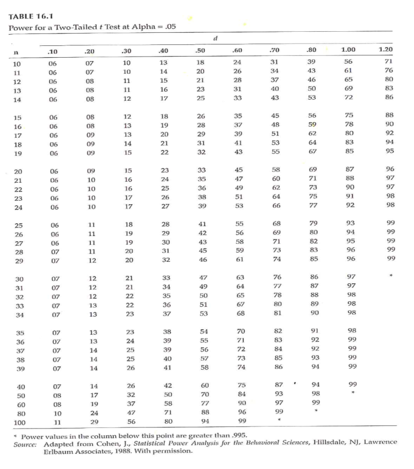
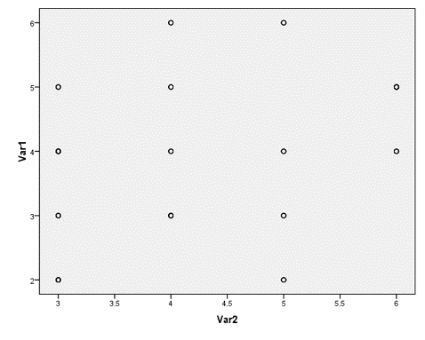

```{r echo=FALSE}
source("prelims.R", echo=FALSE)
```

***
`r read_text("objectives12")`

<div class="notes">


</div>

***
`r read_text("readings12")`

<div class="notes">


</div>

***
### Making Inferences - NHST 

+ Populations versus Samples
+ Use inferential statistics
	+ Sample statistics (M, SD) <U+F0E8>
	+ Population parameters (mu, sigma)
+ Null Hypothesis Significance Testing (NHST)
	+ Null hypothesis (H 0 )
	+ Alternative hypothesis (H 1 )
		+ AKA research hypothesis
		+ Directional
		+ Non-directional

<div class="notes">


</div>

***
### Making Inferences - NHST 

+ NHST – Goal of research –
	+ Reject the H 0 in favor of H 1
+ “Reject” the null hypothesis
	+ Practically – “reject” means difference / relationship greater than just random variability
+ Alternative hypothesis –
	+ 3 versions
		+ Non-directional
		+ Directional positive
		+ Directional negative

<div class="notes">


</div>

***
### Making Inferences - NHST 

+ Directional vs Non-directional H 1
	+ Comparing treatment to control
	+ Comparing different treatments
+ Choosing directional vs non-directional
	+ Basis for choice
	+ Consequences
		+ Statistical analysis
		+ Interpretation

<div class="notes">


</div>

***
### Making Inferences - NHST 

+ Sampling review
	+ Target / theoretical population
	+ Accessible population
	+ Sample
+ Inference from the study sample to the population

<div class="notes">


</div>

***
### Making Inferences - NHST 


<div class="notes">

+ Example

</div>

***
### Making Inferences - NHST 

+ Accessible population <U+F0E8> Sample
+ Random assignment to groups
+ Conduct study and collect data
+ Conduct statistical analysis
	+ Intervention group: mean = 73
	+ Control group: mean = 65

<div class="notes">


</div>

***
### Making Inferences - NHST 

+ Significant difference or not?
	+ Inferential statistics – allow you to determine this
+ Reject the null <U+F0E8>
	+ The observed difference is highly unlikely if the null hypothesis is actually true
+ Fail to reject the null <U+F0E8>
	+ We can not say that the observed difference is highly unlikely
	+ Do NOT “accept” the null hypothesis

<div class="notes">


</div>

***
### Making Inferences - NHST 

+ ( Portney & Watkins, 2009)

<div class="notes">


</div>

***
```{r tbl8, echo = FALSE, eval=FALSE}
tbl8 <- tibble::tribble(
~` `, ~`TRUTH`, ~` `,
"DECISION","H o is true (there is no relationship)","H o is false (there is a relationship)",
"Reject H o (you find a relationship)","Type I Error Alpha","Correct  (Decision agrees with Truth ) Power",
"Do not reject H o (you do NOT find a relationship)","Correct  (Decision agrees with Truth)","Type II Error Beta (Power = 1 - Beta)"
)

kableExtra::kable_styling(knitr::kable(tbl8), font_size = 18)
```

<div class="notes">


</div>

***
### Making Inferences - NHST 


<div class="notes">

+ Statistical testing – possible outcomes

</div>

***
### Making Inferences - NHST 


+ Statistical testing – possible outcomes

<div class="notes">


</div>

***
### Making Inferences - NHST 

+ Statistical testing
	+ Fig 16.3 – Directional negative
		+ Example – hypothesize that intervention will result in reduction of symptoms
	+ If you made a directional positive alternative hypothesis …. ?

<div class="notes">


</div>

***
### Making Inferences - NHST 


<div class="notes">

+ Statistical testing
	+ Fig 16.4 – Non-directional

</div>

***
### Power Analysis 

+ Probability of rejecting a false H 0
	+ This is a GOOD thing!
	+ Want to maximize this (within reasonable limits!)
	+ What is power analysis
	+ “… the probability that his investigation would lead to statistically significant results.”

<div class="notes">


</div>

***
### Power Analysis 

+ ( Portney & Watkins, 2009)

<div class="notes">


</div>

***
```{r tbl14, echo = FALSE, eval=FALSE}
tbl14 <- tibble::tribble(
~` `, ~`TRUTH`, ~` `,
"DECISION","H o is true (there is no relationship)","H o is false (there is a relationship)",
"Reject H o (you find a relationship)","Type I Error Alpha","Correct  (Decision agrees with Truth ) Power",
"Do not reject H o (you do NOT find a relationship)","Correct  (Decision agrees with Truth)","Type II Error Beta (Power = 1 - Beta)"
)

kableExtra::kable_styling(knitr::kable(tbl14), font_size = 18)
```

<div class="notes">


</div>

***
### Power Analysis 


<div class="notes">

+ Power of a study – probability of rejecting a false null hypothesis

</div>

***
### Power Analysis 

+ Statistical power analysis concepts (Cohen)
	+ Significance criterion – alpha
	+ Power – desired level
	+ Sample size
	+ Effect size
+ Power analysis method depends on research design

<div class="notes">


</div>

***
### Power Analysis 

+ Performing a power analysis when planning a study
	+ What is the study design?
	+ What do you already know about the measure you are interested in?
	+ What significance level to you want to use for hypothesis testing?
	+ What level of power do you want to achieve?

<div class="notes">


</div>

***
### Power Analysis 



<div class="notes">

+ Determining power (Fig 16.1)

</div>

***
### Power Analysis 

+ Increasing power –
	+ Alpha level
	+ Formulation of hypothesis
	+ Decrease variability / increase precision
		+ Groups
		+ Outcome measure(s)
	+ Increase sample size

<div class="notes">


</div>

***
### Power Analysis 


<div class="notes">


</div>

***
### Power Analysis 


<div class="notes">


</div>

***
### Problems with NHST 

+ Knowledge based on outcome of single study
+ Interpretation of statistical significance
+ Complications
	+ H 0 is rarely true – in a strict sense
	+ Too large of a sample size – hard NOT to get statistical significance
	+ Significance testing as a dichotomous decision
	+ Interpretation of changes in the p value
	+ Statistical significant versus clinical/ substative meaningfulness

<div class="notes">


</div>

***
### Improving NHST 

+ Propose specific alternative hypotheses
+ Use a random sample if possible
+ Use an outcome variable that has good reliability and validity
+ Have a good idea of the level of difference that will be clinically important

<div class="notes">


</div>

***
### Making Inferences - EBA 

+ EBA – Evidence-Based Approach
	+ Reliability of findings
	+ Accumulation of evidence
+ Premise – “… a single study is not sufficient to use as evidence to substantiate a hypothesis or theory.”
+ Methods
	+ Confidence intervals
	+ Effect sizes
	+ Meta-analysis

<div class="notes">


</div>

***
### Making Inferences - EBA 

+ Confidence Intervals (CI)
	+ Range of scores that should contain the true population score
+ CI <U+F0E8> An interval around the point estimate
+ CI <U+F0E8> “… range of the dependent variable scores that *should contain the true population difference between means* .”
+ CI computed using sample mean and standard deviation

<div class="notes">


</div>

***
### Making Inferences - EBA 

+ Interpretation of CI –
	+ 95% CI most common
	+ 95% CI – with infinite studies and computed CI, the true population difference would be found within 95% of the intervals
	+ NOT – .95 probability that true population difference is within the CI computed from our single study
	+ Option – 95% CI for a given study “… *estimates* the population mean difference with 95% confidence.”

<div class="notes">


</div>

***
### Making Inferences - EBA 

+ Why compute and report CI?
	+ Part of philosophy to encourage replication
	+ Size of interval – “… how much of the estimate might be due to sampling error.”

<div class="notes">


</div>

***
### Making Inferences - EBA 


<div class="notes">

+ Interpreting 95% CI (Fig 17.1)

</div>

***
### Making Inferences – EBA 

+ Effect size –
	+ Strength of relationship between IV & DV
	+ Magnitude of the difference between levels of the IV with respect to the DV
	+ 3 types of effect size measures
		+ r family
		+ d family
		+ Measures of risk potency

<div class="notes">


</div>

***
### Making Inferences – EBA 



<div class="notes">

+ Why is effect size at least as important as significance level?
	+ Influence of sample size on results

</div>

***
### Making Inferences – EBA 

+ Effect sizes –
	+ Unstandardized – in the units of the raw DV
	+ Standardized –
		+ Standardized using pooled standard deviation of the groups
		+ Measure that can be used to compare to other studies with different DVs

<div class="notes">


</div>

***
### Making Inferences – EBA 

+ Types of effect sizes –
	+ R family – strength of association
	+ D family – magnitude of differences
	+ Measures of risk potency – when both IV and DV are dichotomous
		+ Odds ratio
		+ Relative risk
		+ Risk difference

<div class="notes">


</div>

***
### Making Inferences – EBA 

+ R family of effect sizes – association
	+ r 2  vs r
+ Cohen’s guidelines
	+ Weak approx +/- .1
	+ Medium approx +/- .3
	+ Strong approx +/- .5
+ Authors labeling
	+ Less than typical
	+ Typical
	+ Greater than typical
+ Also rho, phi, eta, R

<div class="notes">


</div>

***
### Making Inferences – EBA 

+ D family of effect sizes – differences
+ d <U+F0E8> Two group comparison
	+ Treatment group mean – Comparison group mean
	+ Divided by pooled standard deviations from both samples
+ eta 2  <U+F0E8> Multiple group comparison
	+ Statistics packages will compute
	+ Interpret like r 2 (amount of variance in DV accounted for by IV)

<div class="notes">


</div>

***
### Making Inferences – EBA 

+ Risk family of effect sizes – When both IV and DV are dichotomous
	+ Phi – measure of association / correlation
+ Clinical / medical research – the risk of clinical outcomes
	+ Relative risk – ratio that compares the risk of an outcome between groups
	+ Risk difference – percentage difference that compares risk of an outcome between groups
	+ Odds ratio – Odds of outcome in control group compared to odds in treatment group

<div class="notes">


</div>

***
### Making Inferences – EBA 


<div class="notes">

+ Interpretation of effect sizes –

</div>

***
### Making Inferences – EBA 

+ Value of effect sizes –
	+ Indicates the strength of a relationship or a difference
	+ Allows you
		+ Combine results from studies with dissimilar outcome measures
		+ Use findings of previous study to plan study with different outcome measure
+ Online source to perform power analysis –
	+ Sample Power (part of SPSS)
	+ Russell Lenth – U of Iowa

<div class="notes">


</div>

***
### Making Inferences – EBA 

+ Meta-Analysis
	+ Research synthesis of multiple studies
	+ Uses effect size value from each study
	+ Advantage over systematic review – compute a summary statistic that represents overall estimate
	+ Provides evidence of reliability of research finding
	+ Include findings from studies that failed to find statistical significance
	+ Increased external validity

<div class="notes">


</div>

***
### Making Inferences – EBA 


<div class="notes">

+ Simoni et al., 2006

</div>

***
### Making Inferences – EBA 


<div class="notes">

+ Simoni et al., 2006

</div>

***
### Assignment #9 

+ Complete an “outline ” of your written proposal. Refer to the “Research Proposal Structure Overview/Structure” document in the Course Content folder on Blackboard. This “outline” should reflect a substantial amount of detail including sub-headings in the literature review section and methods section. Sections that reflect earlier assignments should contain near-complete drafts of the information that is relevant to your proposed project.
+ Available resource –
	+ Research Proposal Structure Information document
		+ Week by Week / General Information

<div class="notes">


</div>

***
`r read_text("hw12", fri[12])`

<div class="notes">


</div>

***
`r read_text("discussion12", fri[12])`

<div class="notes">


</div>

***

### Additional slides