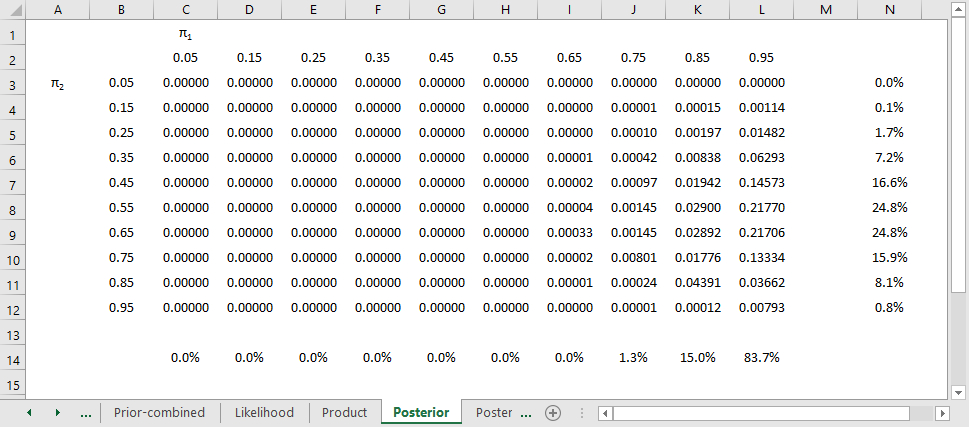

```{r echo=FALSE}
source("prelims.R", echo=FALSE)
```

### Pop quiz

+ A research paper computes a p-value of 0.45. How would you interpret this p-value?
  + Strong evidence for the null hypothesis.
  + Strong evidence for the alternative hypothesis.
  + Little or no evidence for the null hypothesis.
  + Little or no evidence for the alternative hypothesis.
  + More than one answer above is correct.

<div class="notes">

I gave a talk about ten years ago, and I had a "pop quiz" to start out the talk. It turns out that I was a bit careless in how I worded the question, but I decided to keep it in for future talks about p-values to help illustrate an important point. I won't ask you for the answer just yet, but here is the question.

A research paper computes a p-value of 0.45. How would you interpret this p-value? 

Strong evidence for the null hypothesis;

Strong evidence for the alternative hypothesis;

Little or no evidence for the null hypothesis;

Little or no evidence for the alternative hypothesis;

More than one answer above is correct.


</div>

### Another question

+ A research paper computes a confidence interval for a relative risk of 0.82 to 3.94. What does this confidence interval tell you that the result is:
  + statistically significant and clinically important.
  + not statistically significant, but is clinically important.
  + statistically significant, but not clinically important.
  + is not statistically significant, and not clinically important.
  + is ambiguous.


<div class="notes">

Here's another question to toss out, but this time it is not poorly worded.

A research paper computes a confidence interval for a relative risk of 0.82 to 3.94. What does this confidence interval tell you.

The result is statistically significant and clinically important.

The result is not statistically significant, but is clinically important.

The result is statistically significant, but not clinically important.

The result is not statistically significant, and not clinically important.

The result is ambiguous.

I do not know the answer.

</div>

### What is a population?

+ A population is a collection of items of interest often defined in terms of
  + demography,
  + geography,
  + occupation,
  + time,
  + care requirements,
  + diagnosis, or 
  + some combination of the above.

<div class="notes">

Here's a definition of a population that I found somewhere but then I lost the link. So if anyone ever runs across this list of characteristics of a population, please let me know. It is too clever a list for me to have figured it out by myself.

A population is a collection of items of research. In clinical research, the population is often a collection of people, sharing some commmon features. They may all be in the same demographic group, the may all come from the same area, they may all have the same job, they may be getting the same type of medical care, they may have the same diseases, or it may be a combination of these items.

</div>

### Example of a population

Population: All infants born in the state of Missouri during the 1995 calendar year who have one or more visits to the Emergency Room during their first year of life.

<div class="notes">

Here's an example that hits on about all these.

All infants (demography)

born in the state of Missouri (geography)

during the 1995 calendar year (time)

who have one or more visits to the Emergency Room (care requirements)

during their first year of life (time, again)

</div>

### What is a sample?

+ A sample is a subset of a population
  + Small and manageable
+ Is your sample representative?
+ Your goal
  + Make inferences about the population
  + Using information from the sample
  
<div class="notes">

A sample is a subet of a population. Usually it is of a much smaller size than the population. It has to be small enough to be manageable.

A key question you should always is whether your sample is representative of your population.

The primary goal of much research is to use information collected from a sample to try to characterize a certain population. As such, you should pay a lot of attention to how representative the sample is of the population.

If there are problems, with representativeness, consider redefining your population a bit more narrowly. For example, a sample of 85 smokers between the ages of 13 and 18 in Rochester, Minnesota who respond to an advertisement about participation in a smoking cessation program might not be considered representative of the population of all teenage smokers, because the participants selected themselves. The sample might be more representative if we restrict our population to those teenage smokers who want to quit.

</div>

### More definitions for hypothesis testing

+ Parameter
  + Computed for a population
  + Almost always unknown
+ Statistic
  + Computed for a sample
  + Estimate of population parameter
+ Sampling error  
  
<div class="notes">

A parameter is a number computed from a population. Since the population is often very large, it is often impossible to compute a parameter.

A statistic is a number computed from a sample. Since the sample is small enough to be manageable, the values of the statistic are computed with the hope that they will be good estimates of the corresponding population parameter.

</div>

### Hypotheses

+ Null hypothesis
  + Designated by $H_0$
  + No change, no effect
+ Alternative hypothesis
  + Designated by $H_a$

<div class="notes">

Researchers will often designate a null and alternative hypothesis. The null hypothesis (H0) is traditionally reserved for a hypothesis involving no effect, no change, or no trend.

The alternative hypothesis implies some type of change, either an improvement or decrement. It could also imply some type of association: a positive association (as one variable increases, the other variable also increases), or a negative association (as one variable increases, the other variable decreases).

</div>

### Comparison of continuous outcome for two populations

+ Most common research problem
+ Population parameters ($\mu_1$ and $\mu_2$)
+ Sample statistics ($\bar{X}_1$ and $\bar{X}_2$)
+ $H_0 \ \mu_1-\mu_2=0$ 
+ Accept $H_0$ if $\bar{X}_1-\bar{X}_2$ is close to zero.

<div class="notes">

The most frequent hypothesis involves a comparison of continuous outcomes between two groups, a treatment group and a control group. These are designated by the subscripts 1 and 2, but there is no standard that says that 1 is the treatment and 2 is the control. It is just as likely to be the reverse. You have to look for some context to make sure you know which subscript is which.

The null hypothesis is that the difference in population means is zero. You compute the difference in sample means and accept the null hypothesis if that difference is close to zero.

How close is close? It depends on how much sampling error you have.

</div>

### Comparison of binary outcome for two populations

+ Population parameters ($\pi_1$ and $\pi_2$)
+ Sample statistics ($p_1$ and $p_2$)
+ $H_0 \ \pi_1-\pi_2=0$ 
+ Accept $H_0$ if $p_1-p_2$ is close to zero.

<div class="notes">

Another common hypothesis involves a comparison of binary outcomes between two groups, a treatment group and a control group. The population parameters are proportions instead of means, but otherwise the concept is the same.

Close to zero, as before, means close to zero relative to the amount of sampling error.

</div>

### Regression models

+ Population parameters, $\beta_0$ and $\beta_1$
  + $\beta_1$ quantifies a relationship
  + $\beta_1=0$ implies no relationship
+ Sample statistics $b_0$ and $b_1$
+ $H_0 \ \beta_1=0$
+ Accept $H_0$ if $b1$ is close to zero

<div class="notes">

I'll talk a lot about regression models later, but let me introduce a hypothesis involving a regression model. Typically, but not always, a regression model has an intercept term and a slope term. The slope term quantifies the relationship between your independent variable and your dependent variable. If the population parameter is zero that means there is no relationship in the population. Like the other models, you compute a sample statistic and accept the null hypothesis if that sample statistic is close to zero.

Regression models are quite flexible. They can incorporate a variety of measurements for your outcome variable and can provide for risk adjustments to your outcome variable.

This is not a data analysis class, but I do want to provide you with enough information so you can write a good data analysis plan. More likely than not, your data analysis plan will involve a regression model of some type.

</div>

### First break

+ What have you learned
  + Poulation, sample
  + Parameter, statistic
  + Basic hypotheses
+ What's coming next
  + Text hypotheses
  + Type I and Type II errors

### Directional alternatives

+ Used when changes in opposite direction are
  + Impossible
  + Irrelevant/equivalent to no change
  + Must be stated a priori
+ $H_0 \ \mu_1-\mu_2 \le 0$ 
+ $H_a \ \mu_1-\mu_2 \gt 0$ 
+ Reject $H_0$ if $\bar{X}_1-\bar{X}_2 > t \times se$

<div class="notes">

It is a bit unusual, but there are situations where changes in the "wrong" direction are considered impossible or irrelevant or equivalent to no change.

Consider the situation where you are testing a new drug versus placebo. A drug could be worse than a placebo. It happens all the time. But there is no reason to test for this. You would not adopt a new drug if it were equivalent to placebo and you would not adopt a new drug if it were inferior to placebo. So your null hypothesis is that the new drug is not better than placebo, meaning equal to placebo or worse than the placebo.

The actual orientation of a directional hypothesis depends on whether a larger value of the outcome measure is good or a smaller value is good. So for an outcome like pain, pain is like golf. A lower score on a pain scale is good. It also depends on which group gets labelled with a 1 and which gets a 2. And it depends on whether you consider a good effect to be impossible/irrelevant or a bad effect to be impossible/irrelevant.

Let's assume that you are testing a new pain relief drug versus placebo, that the placebo is group 1 and that higher values of pain with the new drug are irrelevant because that leads to the same decision as equivalent values of pain.

In this case, mu1-mu2 a measure where positive values are good and worth reporting, and where negative values are bad and lead to the same decision as zero values. So the null hypothesis uses a less than or equal to sign and the alternative hypothesis uses a greater than sign.

In this setting, you would compute the sample average pain levels in the placebo minus the sample average pain in the treatment group. If that difference was large and positive, you would reject the null hypothesis. How large? Typically you would compare this difference in sample means to a percentile from the t-distribution times the standard error for the difference in sample means.

</div>

### Passive smoking controversy

+ EPA meta-analysis of passive smoking
+ Criticized for using a one-sided hypothesis
  + Samet JM, Burke TA. Turning science into junk: the tobacco industry and passive smoking. Am J Public Health. 2001;91(11):1742–1744. Available in [html format](https://www.ncbi.nlm.nih.gov/pmc/articles/PMC1446866/) or [PDF format](https://www.ncbi.nlm.nih.gov/pmc/articles/PMC1446866/pdf/0911742.pdf).
  
<div class="notes">

Consider a study of the effects of second-hand smoke. These studies always use directional alternatives. From what we know about active cigarette smoking is that it increases the risk of cancer and cardiovascular disease. So there is no reason to expect that passive smoke exposure should be any different. There is no scientific basis for a protective effect of passive smoking, so it makes sense to test that passive smoking has no effect versus it having an increase in bad outcomes compared to the control group. So your null hypothesis is "not harmful" and your alternative is "harmful". The beneficial hypothesis is lumped into the null hypothesis, but no one would dare claim that passive smoking was protective.

As another aside, I was involved with prayer study. We planned this study using a one-sided hypothesis (remote prayer has a positive effect on health). The Institutional Review Board suggested changing this to a two-sided hypothesis (remote prayer has either a positive or a negative effect on health). Thankfully, we did not observe an outcome in the opposite tail as that would have been very difficult to explain.

</div>

### Hypothesis in English instead of Greek

+ Only statisticians like Greek letters
  + Translate to simple text
+ For two group comparisons
  + Safer, more effective
+ For regression models
  + Trend, association
  
<div class="notes">

As a researcher, you should always think about your hypothesis in terms of population parameters, but your writing should use text. Translate the Greek letters to English.

If you have a hypothesis that compares two groups, look for comparative words like "safer" or "more effective". If your hypothesis involves some type of regression model, you should consider terms like "trend" or "association".

</div>

### Examples of text hypotheses (1 of 1)

+ "... the objective of this 78-week randomised, placebo-controlled study was to determine whether treatment with nilvadipine sustained-release 8 mg, once a day, was effective and safe in slowing the rate of cognitive decline in patients with mild to moderate Alzheimer disease."
  + Lawlor B, Segurado R, Kennelly S, et al. Nilvadipine in mild to moderate Alzheimer disease: A randomised controlled trial. PLoS Med. 2018; 15(9): e1002660. DOI: 10.1371/journal.pmed.1002660
  
<div class="notes">

Here's an example of a two group comparison. One group gets nilvadipine and the other group gets a placebo. Safety was measured as the proportion of patients who experienced an adverse event. The researchers also measured the proportion of patients who experienced a serious adverse event. So the Greek hypothesis would involve pi's and p's. 

Effectiveness was measured using the Alzheimer's Disease Assessment Scale Cognitive Subscale-12 and the Clinical Dementia Rating Scale sum of boxes. Both of these outcome measurements are continuous, so the Greek hypothesis would involve mu's and X-bar's.

</div>

### Examples of text hypotheses (2 of 2)

+ "... we investigated trends in BCC incidence over a span of 20 years and the associations between incident BCC and risk factors in a total population of 140,171 participants from 2 large US-based cohort studies: women in the Nurses' Health Study (NHS; 1986–2006) and men in the Health Professionals' Follow-up Study (HPFS; 1988–2006)."
  + Wu S, Han J, Li WQ, Li T, Qureshi AA. Basal-cell carcinoma incidence and associated risk factors in U.S. women and men. Am J Epidemiol. 2013; 178(6): 890–897. DOI: 10.1093/aje/kwt073
  
<div class="notes">

This study used a regression model, a Cox regression model, to study trends and associations, so the Greek hypotheses would involve beta's.

</div>

### What is a Type I Error?

+ Type I error
  + Rejecting the null hypothesis when the null hypothesis is true.
  + False positive result
  + Example: allowing an ineffective drug on the market
+ $\alpha$ = P[Type I error]

<div class="notes">

In your research, you specify a null hypothesis (typically labeled H0) and an alternative hypothesis (typically labeled Ha, or sometimes H1). By tradition, the null hypothesis corresponds to no change. When you are using Statistics to decide between these two hypothesis, you have to allow for the possibility of error. Actually, if you are using any other procedure, you should still allow for the possibility of error, but we statisticians are the only ones honest enough to admit this.

A Type I error is rejecting the null hypothesis when the null hypothesis is true. 

Consider a new drug that we will put on the market if we can show that it is better than a placebo. In this context, H0 would represent the hypothesis that the average improvement (or perhaps the probability of improvement) among all patients taking the new drug is equal to the average improvement (probability of improvement) among all patients taking the placebo. A Type I error would be allowing an ineffective drug onto the market.

</div>

### What is a Type II Error? 

+ Type II error
  + Accepting the null hypothesis when the null hypothesis is false.
  + False negative result
  + Example: keeping an effective drug off of the market
+ $\beta$ = P[Type II error]
+ Power = $1-\beta$

<div class="notes">

A Type II error is accepting the null hypothesis when the null hypothesis is false. You should always remember that it is impossible to prove a negative. Some statisticians will emphasize this fact by using the phrase "fail to reject the null hypothesis" in place of "accept the null hypothesis." The former phrase always strikes me as semantic overkill. 

Many studies have small sample sizes that make it difficult to reject the null hypothesis, even when there is a big change in the data. In these situations, a Type II error might be a possible explanation for the negative study results.

Consider a new drug that we will put on the market if we can show that it is better than a placebo. In this context, H0 would represent the hypothesis that the average improvement (or perhaps the probability of improvement) among all patients taking the new drug is equal to the average improvement (probability of improvement) among all patients taking the placebo. A Type II error would be keeping an effective drug off the market.

Power is defined as 1-beta. I will talk more about power in a little bit.

</div>

### Second break

+ What have you learned?
  + Text hypotheses
  + Type I and Type II errors
+ What's combing next
  + p-values
  + p-hacking

### What is a p-value?

+ p-value = $P[\bar{X}_1-\bar{X}_2>t \times se \ | \ \mu_1-\mu_2=0 ]$
  + Probability of sample results OR a result more extreme, given that $H_0$ is true

<div class="notes">

Here's the formula for the p-value. It changes depending on what your hypothesis is, but this formula gets the general idea across. Don't worry for now about details like the absolute value sign and the "2 times" in front of the probability.

In English, this formula is telling you that the p-value is the probability that you observe the sample results or a result more extreme, assuming that the null hypothesis is true.

You can think of the p-value as a measure of consistency, consistency between the data and the null hypothesis.

</div>

### Alternate explanations of the p-value

+ The p-value is a measure of consistency between the data and the null hypothesis
  + Small value implies inconsistent
  + Large value implies consistent
+ The p-value as a measure of evidence against the null hypothesis
  + Small value implies lots of evidence
  + Large value implies little or no evidence

<div class="notes">

There are two interpretations that I feel are more practical. You can think of the p-value as a measure of consistency between the data and the null hypothesis. A small value implies inconsistency. It is very unlikely that you will get a value like you've seen in your sample or a value more extreme under the assumption that the null hypothesis is true. So you should reject that assumption.

On the other hand if the sample results or anything more extreme has a high probability under the assumption that the null hypothesis is true, then you should feel comfortable accepting that assumption.

I have argued that the p-value is a measure of evidence. If the p-value is small, you have lots of evidence against the null hypothesis. If the p-value is large, you have little or no evidence against the null hypothesis.

</div>

### What the p-value is NOT (1 of 2)

+ Not the probability that the null hypothesis is true
  + Don't reverse the condition
  + p-value $=P\Big[\bar{X}_1-\bar{X}_2>t \times se \ | \ \mu_1-\mu_2=0 \Big]$
  + p-value $\ne P\Big[\mu_1-\mu_2=0 \ | \ \bar{X}_1-\bar{X}_2>t \times se \Big]$

<div class="notes">

The p-value is a conditional probability, and you always need to be careful about conditional probabilities. It is a probability about a sample result given an assumption about the population. It is not a probability about a population result given the sample result. There are two reasons for this. First, you can't reorder a conditional probability. The probability of A given B is almost never the same as the probability of B given A. The example I give for this is the probability of being happy given that you are rich. That's a pretty high number, I hope you'll agree. There are a few rich people who lead miserable lives, but from everything I've seen, most rich people are pretty darn happy. The reverse of this is the probability of being rich given that you are happy. That number is much smaller. Because although I believe that money can buy happiness, a lot of other things can also buy happiness just as well. It's not quite as easy to find happiness if you're poor, but somehow, a lot of poor people find a way to be happy anyway.

A second reason that you can't reverse the order is that you cannot make a probability statement about population parameters. They are numbers computed from the entire population, and are fixed values. You cannot make a probability statement about something that has no sampling error.

</div>

### Pop quiz, revisited

+ A research paper computes a p-value of 0.45. How would you interpret this p-value?
  + Strong evidence for the null hypothesis
  + Strong evidence for the alternative hypothesis
  + Little or no evidence for the null hypothesis
  + Little or no evidence for the alternative hypothesis
  + More than one answer above is correct.
  + I do not know the answer.
  
<div class="notes">

Here's that pop quiz again. Take a look at it quickly. Note that the p-value is of evidence against the null hypothesis. So each of the first four responses is wrong.

I wrote this question quickly, so shame, shame on me. But I've reproduced the example because it illustrates an important point.

</div>

### What the p-value is not (2 of 2)

+ Not a measure FOR either hypothesis
  + Little evidence against the null $\ne$ lots of evidence for the null
+ Not very informative if it is large
  + Need a power calculation, OR
  + Narrow confidence interval

<div class="notes">

The p-value is not a measure for either hypothesis. It is always a measure against a particular hypothesis. Now when hte p-value is small, you can make a strong statement. We have lots of evidence against the null hypothesis. That translates into lots of evidence in favor of the alternative hypothesis.

When the p-value is large, however, you are in a quandry. Little or no evidence against the null hypothesis is not the same as lots of evidence for the null hypothesis. 

It's possible to have little or no evidence against the null and also have little or no evidence against the alternative.

You can't prove a negative, so the saying goes. Well, you can prove a negative, but you have to work harder at it. A large p-value by itself is not persuasive, but if you combine it with a power calculation done prior to data collection, that's pretty good evidence in support of the null hypothesis.

You could also combine a large p-value with a narrow confidence interval to support the null hypothesis. I'll talk about that more in just a bit.

</div>
  
### p-value

<div class="notes">

A large p-value should not automatically be construed as evidence in support of the null hypothesis. Perhaps the failure to reject the null hypothesis was caused by an inadequate sample size. When you see a large p-value in a research study, you should also look for one of two things:

a power calculation that confirms that the sample size in that study was adequate for detecting a clinically relevant difference; and/or

a confidence interval that lies entirely within the range of clinical indifference.

You should also be cautious about a small p-value, but for different reasons. In some situations, the sample size is so large that even differences that are trivial from a medical perspective can still achieve statistical significance.

</div>

### p-hacking

### Third break

+ What have you learned?
  + p-values
  + p-hacking
+ What's coming next?
  + Confidence intervals
  + Range of clinical indifference

### What is a confidence interval?

Dear Professor Mean:  Can you give me a simple explanation of what a confidence interval is?

+ A confidence interval is a range of values that quantifies the size of sampling error.

<div class="notes">

We statisticians have a habit of hedging our bets. We always insert qualifiers into our reports, warn about all sorts of assumptions, and never admit to anything more extreme than probable. There's a famous saying: "Statistics means never having to say you're certain."

We qualify our statements, of course, because we are always dealing with imperfect information. In particular, we are often asked to make statements about a population (a large group of subjects) using information from a sample (a small, but carefully selected subset of this population). No matter how carefully this sample is selected to be a fair and unbiased representation of the population, relying on information from a sample will always lead to some level of uncertainty.

A confidence interval is a range of values that tries to quantify this uncertainty. Consider it as a range of plausible values. A narrow confidence interval implies high precision; we can specify plausible values to within a tiny range. A wide interval implies poor precision; we can only specify plausible values to a broad and uninformative range.

</div>

### Example of a confidence interval

+ Homeopathic treatment of swelling after oral surgery
  + Lokken 1995
  + Lokken P, Straumsheim PA, Tveiten D, Skjelbred P, Borchgrevink CF. Effect of homoeopathy on pain and other events after acute trauma: placebo controlled trial with bilateral oral surgery BMJ. 1995;310(6992):1439-1442. http://www.bmj.com/content/310/6992/1439.full
  
<div class="notes">

Consider a recent study of homoeopathic treatment of pain and swelling after oral surgery (Lokken 1995). When examining swelling 3 days after the operation, they showed that homoeopathy led to 1 mm less swelling on average. The 95% confidence interval, however, ranged from -5.5 to 7.5 mm. From what little I know about oral surgery, this appears to be a very wide interval. This interval implies that neither a large improvement due to homoeopathy nor a large decrement could be ruled out.

Generally when a confidence interval is very wide like this one, it is an indication of an inadequate sample size, an issue that the authors mention in the discussion section of this paper.

</div>

### How to Interpret a Confidence Interval

When you see a confidence interval in a published medical report, you should look for two things. First, does the interval contain a value that implies no change or no effect? For example, with a confidence interval for a difference look to see whether that interval includes zero. With a confidence interval for a ratio, look to see whether that interval contains one.

### Confidence interval interpretation (1 of 7)


<div class="notes">

Here's an example of a confidence interval that contains the null value. The interval shown below implies no statistically significant change.

</div>

### Confidence interval interpretation (2 of 7)


<div class="notes">

Here's an example of a confidence interval that excludes the null value. If we assume that larger implies better, then the interval shown below would imply a statistically significant improvement.

</div>

### Confidence interval interpretation (3 of 7)


<div class="notes">

Here's a different example of a confidence interval that excludes the null value. The interval shown below implies a statistically significant decline.

</div>

### Confidence interval interpretation (4 of 7)


<div class="notes">

You should also see whether the confidence interval lies partly or entirely within a range of clinical indifference. Clinical indifference represents values of such a trivial size that you would not want to change your current practice. For example, you would not recommend a special diet that showed a one year weight loss of only five pounds. You would not order a diagnostic test that had a predictive value of less than 50%.

Clinical indifference is a medical judgment, and not a statistical judgment. It depends on your knowledge of the range of possible treatments, their costs, and their side effects. As statistician, I can only speculate on what a range of clinical indifference is. I do want to emphasize, however, that if a confidence interval is contained entirely within your range of clinical indifference, then you have clear and convincing evidence to keep doing things the same way (see below).

</div>

### Confidence interval interpretation (5 of 7)


<div class="notes">

One the other hand, if part of the confidence interval lies outside the range of clinical indifference, then you should consider the possibility that the sample size is too small (see below).

</div>

### Confidence interval interpretation (6 of 7)


<div class="notes">

Some studies have sample sizes that are so large that even trivial differences are declared statistically significant. If your confidence interval excludes the null value but still lies entirely within the range of clinical indifference, then you have a result with statistical significance, but no practical significance (see below).

</div>

### Confidence interval interpretation (7 of 7)


<div class="notes">

Finally, if your confidence interval excludes the null value and lies outside the range of clinical indifference, then you have both statistical and practical significance (see below).

</div>

### Fourth break

+ What have you learned?
  + Confidence intervals
  + Range of clinical indifference
+ What's coming next?
  + Non-inferiority testing
  + Sample size justification

### Non-inferiority testing

+ Reasons for adopting a new drug/therapy
  + Greater efficacy
  + Lower cost
  + Better compliance
  + Fewer side effects
+ $H_0 \ \pi_1-\pi_2 \le -\Delta$ 
+ $H_a \ \pi_1-\pi_2 \gt -\Delta$ 
  + $\Delta$ is the non-inferiority margin
  + Reject $H_0$ if $p_1-p_2 \gt -\Delta + z \times se$
  + Trade-off between efficacy and cost, compliance, or side effects
  
<div class="notes">

Why does a new drug replace an old drug? I should talk about therapies instead of drugs, but it is easier to pretend that the only thing that doctors do is hand out pills.

There are several reasons to switch. First, the new drug might be more efficacious. It cures more people.

But there are other things that are important as well. The new therapy might be cheaper. Money is never the only consideration, of course, but you can't ignore it either. Even when the cost of drugs is hidden by insurance coverage, there is a price that all of society pays when you ignore simple economics. 

Another reason to switch is compliance. If you can replace needles with a pill or replace three times a day dosing with twice a day dosing, you'll find that a lot more of your patients will take the drug.

A third reason to switch would be a change in side effects. All drugs have side effects, of course, but sometimes you can reduce the number of patients that experience these side effects. Sometimes, you can replace serious side effects with more mild side effects.

If you expect a new drug to show reduced cost, better compliance, or fewer side effects, you might be willing to tolerate a deficit in efficacy. Now, it would have to be a small deficit, often a very small deficit. 

Non-inferiority testing addresses the problem where you want to show that a new drug, superior in other ways, does not give away too much in efficacy. So you want to test that your new drug is not substantially inferior than the old drug with respect to therapy.

A formal hypothesis test to demonstrate that a new drug is not substantially worse on an efficacy endpoint is called a non-inferiority test. To conduct this test, you need to define a non-inferiority margin. This a value that separate an intolerable loss in efficacy from a tolerable loss. How do you pick a non-inferiority margin? 

Sometimes it's easy. So in testing a flu vaccine, you might tolerate a 20% decline in the number of colds if you could knew that you would be getting at least a 20% increase in the number of people who would be getting vaccinated.

Other times, it's tricky. A side effect of the flu vaccine is localized soreness, and while we want to minimize this, experiencing localized soreness and experiencing the flu are not the same thing. You might want to set up a ratio, that ten localized soreness events equals one flu event. Then, if you knew that the new vaccine would have 20% fewer problems with localized soreness, you'd be able to only tolerate a 2% decline in efficacy. Anything worse, and you'd have less than a 10 to 1 ratio.

If the new vaccine were 50% cheaper, you'd just have to figure out the dollar value associated with a single case of the flu and do make sure that the proportion of fewer cures times cost of a single cure was smaller than the cost savings. So if all the bad things associated with the flu, the suffering, the lost work time, and the increased risk of other bad things like pneumonia had a dollar value of five thousand dollars, and you could save two hundred dollars per dose of vaccine, then you'd need to need to make sure that the decline in efficacy was not 4% or worse. 

I'm vastly oversimplifying things here. I'm not talking, for example, about the complexities associated with absolute versus relative risk. And some of my math calculations might be a bit dicey. But to be honest, no one even tries to look at things from this simpilistic of an approach. They just pick a number out of thin air, and don't offer any justification. If you need to set a non-inferiority margin, talk to a bunch of people and make sure that you are assessing the trade-offs properly.

Once you have your non-inferiority margin, the rest is easy. Your alternative hypothesis is that the difference in means is above the non-inferiority margin. The way I have described the hypotheses might need to change the direction of the sign depending on whether you label the group with the new drug with a 1 or a 2. Instead of rejecting H0 if you are above zero by a certain amount determined by sampling error, you reject 

</div>

### Null value

```{r null-value, echo=FALSE}
x <- seq(-3.5, 6.5, length=100)
y <- dnorm(x)
plot(x, y, xlab=" ", ylab=" ", axes=FALSE, type="n", ylim=c(0, 0.6))
abline(h=0)
segments(0, 0, 0, 0.45)
text(0, 0.55, cex=0.5, "Null\nvalue")
```

***
### Critical value

```{r critical-value, echo=FALSE}
x <- seq(-3.5, 6.5, length=100)
y <- dnorm(x)
lb <- c("\nNull\nvalue", "\nCritical\nvalue")
plot(x, y, xlab=" ", ylab=" ", axes=FALSE, type="n", ylim=c(0, 0.6))
abline(h=0)
segments(0, 0, 0, 0.45, col="gray")
text(0, 0.55, cex=0.5, "Null\nvalue", col="gray")
segments(1.2, 0, 1.2, 0.45)
text(1.2, 0.55, cex=0.5, "Critical\nvalue")
```

***
### Alpha level

```{r alpha-level, echo=FALSE}
x <- seq(-3.5, 6.5, length=100)
y <- dnorm(x)
lb <- c("\nNull\nvalue", "\nCritical\nvalue")
plot(x, y, xlab=" ", ylab=" ", axes=FALSE, type="l", ylim=c(0, 0.6))
abline(h=0)
segments(0, 0, 0, 0.45, col="gray")
text(0, 0.55, cex=0.5, "Null\nvalue", col="gray")
segments(1.2, 0, 1.2, 0.45, col="gray")
text(1.2, 0.55, cex=0.5, "Critical\nvalue", col="gray")
```


```{r beta-level, echo=FALSE}
x <- seq(-3.5, 6.5, length=100)
y <- dnorm(x, m=3)
lb <- c("\nNull\nvalue", "\nCritical\nvalue")
plot(x, y, xlab=" ", ylab=" ", axes=FALSE, type="l", ylim=c(0, 0.6))
abline(h=0)
segments(0, 0, 0, 0.45, col="gray")
text(0, 0.55, cex=0.5, "Null\nvalue", col="gray")
segments(1.2, 0, 1.2, 0.45, col="gray")
text(1.2, 0.55, cex=0.5, "Critical\nvalue", col="gray")
```

***
### Power Analysis 

+ Probability of rejecting a false H 0
	+ This is a GOOD thing!
	+ Want to maximize this (within reasonable limits!)
	+ What is power analysis
	+ “… the probability that his investigation would lead to statistically significant results.”

<div class="notes">


</div>

### Power Analysis 

+ Statistical power analysis concepts (Cohen)
	+ Significance criterion – alpha
	+ Power – desired level
	+ Sample size
	+ Effect size
+ Power analysis method depends on research design

<div class="notes">


</div>

***
### Power Analysis 

+ Performing a power analysis when planning a study
	+ What is the study design?
	+ What do you already know about the measure you are interested in?
	+ What significance level to you want to use for hypothesis testing?
	+ What level of power do you want to achieve?

<div class="notes">


</div>

### Fifth break

+ What have you learned?
  + Non-inferiority testing
  + Sample size justification
+ What is coming next?
  + Criticisms of hypothesis testing
  + Bayesian data analysis

### Criticisms of hypothesis testing (1 of 3)

+ Criticisms of the binary hypothesis
  + Point null is never true
  + Cannot prove the null
  + Dichotomy is simplistic
  
<div class="notes">


</div>

### Criticisms of hypothesis testing (2 of 3)

+ Criticisms of the p-value
  + Not intuitive, easily misunderstood
  + "results more extreme"
  + Ignores clinical importance
  + Does not measure uncontrolled biases

<div class="notes">


</div>

### Criticisms of hypothesis testing (3 of 3)

+ General criticisms
  + Too hard to reject H0
  + Too easy to reject H0
  + Too reliant on a single study
  + Thoughtless application

<div class="notes">


</div>

### A simple example of Bayesian data analysis.

* ECMO study
* Treatment versus control, mortality endpoint
  + Treatment: 28 of 29 babies survived
  + Control: 6 of 10 babies survived
  + Source: Jim Albert in the Journal of Statistics Education (1995, vol. 3 no. 3) which is available on the web at www.amstat.org/publications/jse/v3n3/albert.html.

<div class="notes">

Bayesian data analysis seems hard, and it is. Even for me, I struggle with understanding Bayesian data analysis. In fairness, I must admit that much of my discomfort is just lack of experience with Bayesian methods. In fact, I've found that in some ways, Bayesian data analysis is simpler than classical data analysis. You, too, can understand Bayesian data analysis, even if you'll never be an expert at it. There's a wonderful example of Bayesian data analysis at work that is simple and fun. It's taken directly from an article by Jim Albert in the Journal of Statistics Education (1995, vol. 3 no. 3) which is available on the web at www.amstat.org/publications/jse/v3n3/albert.html.

I want to use his second example, involving a comparison of ECMO to conventional therapy in the treatment of babies with severe respiratory failure. In this study, 28 of 29 babies assigned to ECMO survived and 6 of 10 babies assigned to conventional therapy survived. Refer to the Albert article for the source of the original data. Before I show how Jim Albert tackled a Bayesian analysis of this data, let me review the general paradigm of Bayesian data analysis.

</div>

### Wikipedia introduction

* P(H|E) = P(E|H) P(H) / P(E)
  + H = hypothesis
  + E = evidence
  + P(H) = prior
  + P(E|H) = likelihood
  + P(H|E) = posterior
  
<div class="notes">

Wikipedia gives a nice general introduction to the concept of Bayesian data analysis with the following formula:

P(H|E) = P(E|H) P(H) / P(E)

where H represents a particular hypothesis, and E represents evidence (data). P, of course, stands for probability.

</div>

### Prior distribution

* Degree of belief
  + Based on previous studies
  + Subjective opinion (!?!)
* Examples of subjective opinions
  + Simpler is better
  + Be cautious about subgroup analysis
  + Biological mechanism adds evidence
* Flat or non-informative prior

<div class="notes">

The first step is to specify P(H), which is called the prior probability. Specifying the prior probability is probably the one aspect of Bayesian data analysis that causes the most controversy. The prior probability represents the degree of belief that you have in a particular hypothesis prior to collection of your data. The prior distribution can incorporate data from previous related studies or it can incorporate subjective impressions of the researcher. What!?! you're saying right now. Aren't statistics supposed to remove the need for subjective opinions? There is a lot that can be written about this, but I would just like to note a few things.

First, it is impossible to totally remove subjective opinion from a data analysis. You can't do research without adopting some informal rules. These rules may be reasonable, they may be supported to some extent by empirical data, but they are still applied in a largely subjective fashion. Here are some of the subjective beliefs that I use in my work:

you should always prefer a simple model to a complex model if both predict the data with the same level of precision.

you should be cautious about any subgroup finding that was not pre-specified in the research protocol.

if you can find a plausible biological mechanism, that adds credibility to your results.

Advocates of Bayesian data analysis will point out that use of prior distributions will force you to explicit some of the subjective opinions that you bring with you to the data analysis.

Second, the use of a range of prior distributions can help resolve controversies involving conflicting beliefs. For example, an important research question is whether a research finding should "close the book" to further research. If data indicates a negative result, and this result is negative even using an optimistic prior probability, then all researchers, even those with the most optimistic hopes for the therapy, should move on. Similarly, if the data indicates a positive result, and this result is positive even using a pessimistic prior probability, then it's time for everyone to adopt the new therapy. Now, you shouldn't let the research agenda be held hostage by extremely optimistic or pessimistic priors, but if any reasonable prior indicates the same final result, then any reasonable person should close the book on this research area.

Third, while Bayesian data analysis allows you to incorporate subjective opinions into your prior probability, it does not require you to incorporate subjectivity. Many Bayesian data analyses use what it called a diffuse or non-informative prior distribution. This is a prior distribution that is neither optimistic nor pessimistic, but spreads the probability more or less evenly across all hypotheses.

</div>

### Difuse prior


### Difuse prior


### Difuse prior


### Difuse prior


<div class="notes">

Here's a simple example of a diffuse prior that Dr. Albert used for the ECMO versus conventional therapy example. Let's assume that the true survival rate could be either 0, 10%, 20%, ..., 100% in the ECMO group and similarly for the conventional therapy group. This is not an optimal assumption, but it isn't terrible either, and it allows us to see some of the calculations in action. With 11 probabilities for ECMO and 11 probabilities for conventional therapy, we have 121 possible combinations. How should we arrange those probabilities? One possibility is to assign half of the total probability to combinations where the probabilities are the same for ECMO and conventional therapy and the remaining half to combinations where the probabilities are different. Split each of these probabilities evenly over all the combinations.

If you split 0.50 among the eleven combinations where the two survival rates are equal, you get 0.04545. Splitting 0.50 among the 110 combinations where the two survival rates are unequal, you get 0.004545.

You can arrange these prior probabilities into a rectangular grid where the columns represent a specific survival rate with ECMO and the rows represent a specific survival rate with conventional therapy. To simplify the display, we multiplied each probability by 1000 and rounded the result. So we have 121 hypotheses, ranging from ECMO and conventional therapy both having 0% survival rates to ECMO having 100% survival and conventional therapy having 0% survival rates to ECMO having 0% and conventional therapy having 100% survival rates to both therapies having 100% surivival rates. Each hypothesis has a probability assigned to it. The probability for ECMO 90% and conventional therapy 60% has a probability of roughly 5 in a thousand and the probability for ECMO 80% and conventional therapy 80% has a probability of roughly 45 in a thousand.

</div>

### Likelihood


<div class="notes">

The second step in a Bayesian data analysis is to calculate P(E | H), the probability of the observed data under each hypothesis. If the ECMO survival rate is 90% and the conventional therapy survival rate is 60%, then the probability of observed 28 out of 29 survivors in the ECMO group is 152 out of one thousand, the probability of observing 6 out of 10 survivors in the conventional therapy group is 251 out of one thousand. The product of those two probabilities is 38,152 out of one million which we can round to 38 out of one thousand. If you've forgotten how to calculate probabilities like this, that's okay. It involves the binomial distribution, and there are functions in many programs that will produce this calculation for you. In Microsoft Excel, for example, you can use the following formula.

binomdist(28,29,0.9,FALSE)*binomdist(6,10,0.6,FALSE)

The calculation under different hypotheses will lead to different probabilities. If both ECMO and conventional therapy have a survival probability of 0.8, Then the probability of 28 out of 29 for ECMO is 11 out of one thousand, the probability of 6 out of 10 for conventional therapy is 88 out of one thousand. The product of these two probabilities is 968 out of one million, which we round to 1 out of one thousand.

The table above shows the binomial probabilities under each of the 121 different hypotheses.  Many of the probabilities are much smaller than one out of one thousand. The likelihood of seeing 28 survivals out of 29 babies in the ECMO survivals is very small when the hypothesized survival rate is 10%, 30%, or even 50%. Very small probabilities are represented by zeros.

</div>

### Multiply


<div class="notes">

Now multiply the prior probability of each hypothesis by the likelihood of the data under each hypothesis. For ECMO=0.9, conventional therapy=0.6, this product is 5 out of a thousand times 38 out of a thousand, which equals 190 out of a million (actually it is 173 out of a million when you don't round the data so much). For ECMO=conventional=0.8, the product is 45 out of a thousand times 1 out of a thousand, or 45 out of a million.

This table shows the product of the prior probabilities and the likelihoods. We're almost done, but there is one catch. These numbers do not add up to 1 (they add up to 794 out of a million), so we need to rescale them. We divide by P(E) which is defined in the wikipedia article as

P(E) = P(E|H1) P(H1) + P(E|H2) P(H2) + ...

In the example shown here, this calculation is pretty easy: add up the 121 cells to get 794 out of a million and then divide each cell by that sum. For more complex setting, this calculation requires some calculus, which should put some fear and dread into most of you. It turns out that even experts in Calculus will find it impossible to get an answer for some data analysis settings, so often Bayesian data analysis requires computer simulations at this point.

</div>

### Standardize



<div class="notes">

Here's the table after standardizing all the terms so they add up to 1.

This table is the posterior probabilities, P(H | E). You can combine and manipulate these posterior probabilities far more easily than classical statistics would allow. For example, how likely are we to believe the hypothesis that ECMO and conventional therapy have the same survival rates? Just add the cells along the diagonal (0+0+...+5+57+97+0) to get 159 out of a thousand. Prior to collecting the data, we placed the probability that the two rates were equal at 500 out of a thousand, so the data has greatly (but not completely) dissuaded us from this belief. You can calculate the probability that ECMO is exactly 10% better than conventional therapy (0+0+...+1+13+84+0 = 98 out of a thousand), that ECMO is exactly 20% better (0+0+...+13+218+0 = 231 out of a thousand), exactly 30% better (0+0+...+7+178+0 = 185 out of a thousand), and so forth.

Here's something fun that Dr. Albert didn't show. You could take each of the cells in the table, compute a ratio of survival rates and then calculate the median of these ratios as 1.5 (see above for details). You might argue that 1.33 is a "better" median because 448 is closer to 500 than 666, and I wouldn't argue too much with you about that choice.

</div>

### Posterior


<div class="notes">


</div>

### Posterior


<div class="notes">

Dr. Albert goes on to show an informative prior distribution. There is a fair amount of data to indicate that the survival rate for the conventional therapy is somewhere between 10% and 30%, but little or no data about the survival rates under ECMO.

The table above shows this informative prior distribution. Recall that the rows represent survival rates under conventional therapy. This prior distribution restricts the probabilities for survival rates in the conventional therapy to less than 70%. There is no such absolute restriction for ECMO, though the probabilities for survival rates of 70% and higher are fairly small.

</div>

### Sixth break

+ What have you learned?
  + Criticisms of hypothesis testing
  + Bayesian data analysis
+ What's coming next?
  + Scales of measurement
  + Ordinal verus interval controversy

### Measurement 

+ Traditional levels (scales) of measurement
	+ Nominal
	+ Ordinal
	+ Interval
	+ Ratio

+ Special cases
  + Binary data
  + Count data
  + Time-to-event

<div class="notes">

Measurement scales are an important, but controversial, categorization of the types of variables used in research. They help you decide what statistics are appropriate for your data. I don't want to get to deeply into this, but I do want to give you enough context so that you can write a decent data analysis plan for your methods section.

There are four categories: nominal, ordinal, interval, and ratio, that were first described by a psychologist, S.S. Stevens, over 80 years ago.

Nominal data is categorical, meaning a small number of values. An additional requirement for nominal data is that order is not important. If you can re-order the list of categories without causing too much fuss, you have nominal data. Examples of nominal data include race, gender, and geographic region.

Ordinal data is also categorical, but you cannot re-order the list without changing things. Order is important. All Likert scale items are ordinal. Military ranks are ordinal. Education levels are ordinal, more or less, but if you make distinctions along the level of M.D. versus Ph.D., it is not. Use a bit of common sense. It works just fine for High school, some college, two year degree, four year degree, graduate/professional degree. Stages of cancer is another example.

Interval data and ratio data are two types of continuous data. Don't worry too much about the distinction between interval and ratio. It is not that important. The very important distinction is between ordinal data and interval data.

For an interval scale, the difference of one unit means the same thing when you are on the low end versus the high end of the scale. Examples of interval scales include temperature, dates, and IQ tests.

for a ratio scale, the ratio of two measurements means the same thing when you are on the low end versus the high end of the scale. Concepts such as "twice as much" are meaningful for ratio data. Ratio data also have a fixed zero point. Examples of ratio scales include birth weight, age, income.

There are three special cases worth describing.

Binary data is data that only has two possible values. Examples include yes/no responses, gender (male/female, assuming that transgender is not an issue), and correct/incorrect responses on a test. Don't bother making a distinction between nominal or ordinal data if your variable is binary. There is no way to re-order the data if there are only two values, except for the trivial case of reversing the two levels. It is best to treat binary data as a subset of nominal data.

Count data is a type of ratio data, but it is a bit unsual because it cannot include fractional or decimal values. It is also bounded below by zero. For the most part, you can treat count data as ratio data, except that linear regression does not work well for count data. Count data almost always violates the linear regression assumptions of normality and homogeneity of variance.

Time-to-event data is also a type of ratio data, but it is also a bit unusual. Time-to-event data almost always has censored values, values where the event has not occurred yet. It also is bounded below by zero. It also tends to violate the same assumptions in linear regression: normality and homogeneity.

</div>

### Permissible measurements

+ Nominal: percentage, mode
+ Ordinal: median
+ Interval: mean, standard deviation
+ Ratio: Coefficient of variation
+ Special cases

<div class="notes">

For nominal data, there are very few numeric summaries that are meaningful. You can't compute a standard deviation for gender or an average race. About the only meaningful numeric summary for nominal data is percentages. You could compute a mode, the most frequently occurring value, but this is not used all that often.

For ordinal data, you can compute the median in addtion to percentages. You might also compute other percentiles like the quartiles. But an average is not a good option here.

You can, however, compute an average for interval data, as well as a standard deviation.

The ratio scale allows you to calculate one additional statistic, the coefficient of variance, but this is hardly worth mentioning. The coefficient of variance, if you are curious, is computed as the standard deviation divided by the mean. It is a unitless measure of spread, which is helpful at times. But quite honestly, there is almost no practical difference between interval data and ratio data.

There is a natural hierarchy to these measurements in that any statistic that can be used to summarize nominal data can also be used to summarize ordinal, interval, or ratio data. Any statistic that can be used to summarize ordinal data can also be used to summarize interval or ratio data. Finally, any statistic that can be used to summarize interval data can also be used to summarize ratio data.

</div>

### Permissible models

+ Binary: Logistic regression
+ Nominal: Chi-square tests, multinomial logistic regression
+ Ordinal: Non-parametric tests, ordinal logistic regression
+ Interval/ratio: linear regression
+ Counts: Poisson regression
+ Time-to-event data: Cox proportional hazards regression

<div class="notes">


</div>

### Measurement 

+ Why does the scale of measurement matter?
	+ How it reflects your design and your research question
	+ How it determines the types of statistical analyses you will do
	+ How it defines what you can say about your results

<div class="notes">

The level of measurement comes from what you are trying to get at in your research.

Measurement scales can limit what you can say about your results.

</div>

### Seventh break

+ What have you learned?
  + Scales of measurement
  + Ordinal verus interval controversy
+ What's coming next?
  + Descriptive statistics
  + Linear regression

### Quality checks

* Minimum and maximum checks
  + Out of range
  + Zero variation
* Missing value count
* List five five rows, last five rows
* Correlations

### Data reduction

* Create composite scores
  + Check Cronbach's alpha
  + Examine leaving out single items
* Factor analysis
  + Supplanted by Structural Equations Modeling

### Data transformations

* Ideal - selected a priori
  + Sometimes based on precedent
  + Sometimes motivated by theory
  + Sometimes based on empirical findings

### Seventh break

+ What have you learned?
  + Descriptive statistics
  + Linear regression
+ What's coming next?
  + Logistic regression
  + Poisson regression
  
### Eight break

+ What have you learned?
  + Logistic regression
  + Poisson regression
+ What's coming next?
  + Cox regression
  
### Ninth break

+ What have you learned?
  + Cox regression
+ What's coming next?
  + Qualitative data analysis

### Analysis of Qualitative Data-resources

+ http://blog.pmean.com/semi-structured-interviews/
+ Positivism versus constructivism, revisited
  + https://www.sagepub.com/sites/default/files/upm-binaries/29985_Chapter1.pdf
  + http://blog.pmean.com/recommended-philosophy-news-network-postmodernism-special-report/
+ Typically, a one-hour interview requires a minimum of three to four hours (or more) of analysis.
+ Involve the participants in the process, especially for narrative research.

### Tools

+ Tools:
  + semi-structured interviews,
  + participant observation,
  + photo elicitation(?),
  + mapping exercises(?),
  + web and space design workshops(?),
  + archival records, 
  + physical artifacts, 

### Inductive process
+ Start with the specific (raw data / transcript)
	+ Develop a theoretical framework from the data
	+ Conceptual categories emerge from the data

<div class="notes">


</div>


###  Start with a research question
+ This may provide a potential starting point for analyzing text
	+ If you do this, DO NOT let it prevent you from seeing what is in the text
+ Steps
	+ From raw data to theory building
	+ “ Iterative ” process
		+ e.g. , as you are developing categories, check them back against the raw data – do they continue to reflect the original data?

<div class="notes">

Start the study with a research question.

Keep alert and look for things that come out in the material that you were not anticipating. As your categories, go back and compare them against the raw data. Make sure that you allow the data to guide you. Often coding from transcripts. But it is also good to have access to the original recordings. Sometimes there is a doubt about what some was saying (joking or sarcasm). Look for tone of voice and non-verbal cues.

Content analysis is a generic term, but you can look at things like ad messages in magazines that appeal to young adults.

Thematic analysis is looking for patterns.

</div>


### Analysis process
+ Given research question, may have some idea of a general conceptual structure; serve only as a starting point
	+ Usually work from transcripts
	+ If possible, refer back to audio recordings when needed
	+ Qualitative form of analysis
		+ Content analysis – analysis of the content of communication
		+ Thematic analysis – identifying patterns or themes in the data

<div class="notes">

Break up the text into "bits" that represent specific thoughts. Open coding lots of themes. Axial coding looks at the relationships between themes, builds a superstructure of ideas.

</div>


### Category Formation
+ Assign sections (data bits) to analytical categories/themes "coding"
+ Summarizing the data by identifying similarities and differences / commonalities and contrasts
	+ Categories:
		+ More manageable units of information
		+ "open coding"
		+ Descriptive – Concrete
		+ Interpretive – Abstract
		+ Relational
	+ Cross-reference categories back to text
		+ Makes it easier to revise coding as needed

<div class="notes">

Software allows you to go back and forth between themes and the original text. Cross-referencing is important. Find examples easily. It helps provide validity checks. Does someone agree with your categorization.

Categories need to be faithful to the data. This is internal validity. But you need to place this in a broader understanding.

You need to be careful about trying to quantify this too much. Keep in mind that just because someone talks about something a lot does not mean that this is the most important thing to them. The most important thing might be something that people are uncomfortable talking about.

</div>


### Category Formation
+ Faithful to the data – "internal" aspect
	+ Meaningful to other categories – "external" aspect
	+ Balance
		+ Generality vs Specificity
		+ Inclusivity vs Exclusivity
	+ Number of times idea mentioned does NOT necessarily reflect importance

<div class="notes">


</div>


### Labeling / Revising Categories
+ Member-generated – “ first-order ” account
	+ Observer-generated – “ second-order ” account
	+ Labels are provisional; may be revised
	+ Iteration – move back and forth between raw data and labeled categories
	+ “ Zoom in ” vs “ Wide angle ” view of the coding
	+ Revision – may end up dividing or combining categories
	+ May establish criteria for category coding

<div class="notes">

Phrasing of the person versus observations generated by the researcher. Labels should be considered as provisional as you work with more complete information. It is an iterative process. Go back to original data. You're looking at the specific of what's been told versus a broader understanding.

Establishing the criteria may depend on how many people are doing the coding. If you don't have a pre-existing structure, the coding may evolve and may involve 100% review (both raters review everything and resolve discrepancy). Then a third person does an audit.

</div>


### Saturation

+ Don't need any additional analysis
	+ Don't need any additional data collection (if collection & analysis done in parallel)
	+ Determinant – nature of the information being collection – NOT amount of information
	+ Keeping notes – of the coding/analysis process
	+ Help identify categories/relationships
	+ Help if "stuck"
	+ Document analysis process

<div class="notes">

The point at which you are not gaining any new insight, no new categories being identified, no new relationships being defined. Saturation is a way to assess your sample size. Have you gotten a representative amount of data. 

Really important to keep notes of the coding and analysis process, so you can check your work. Allows you to do qualirty checks on the process.

</div>


### Role of Judgment
+ Balancing act –
	+ Level of creativity by coder to identify categories/relationships
	+ Must reflect the informants thoughts
	+ Audit of the coding by an independent person can check for the match between the coding and the source information
	+ Low-inference descriptors
+ Look for "negative cases"

<div class="notes">

You develop a framework, but that framework must always represent what the subjects have said.

Low inference descriptors are those things involving just the basic words or text.

</div>


### Quantifying Information
	+ Pros & Cons
	+ When quantifying might be of value
	+ Simple frequency of occurrence does NOT necessarily reflect importance

<div class="notes">

This was mentioned earlier.

</div>

### Tenth break

+ What have you learned?
  + Qualitative data analysis
+ What's coming next?
  + Writing a methods section
  
### Conclusion

+ Hypothesis testing
+ p-values and confidence intervals
+ Sample size justification
+ Scales of measurement
+ Descriptive statistics
+ Linear, logistic, Poisson, and Cox regression
+ Analysis of qualitative data
+ Writing a methods section

