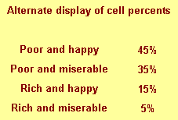
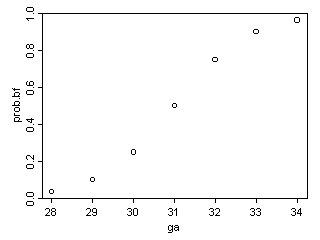
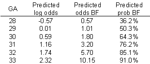
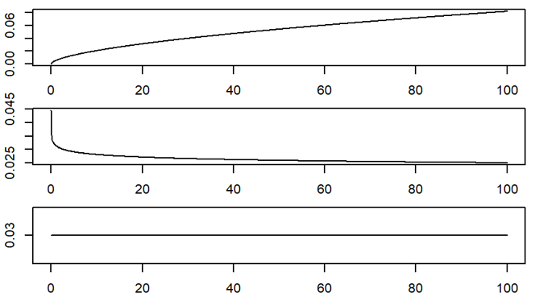

```{r echo=FALSE}
source("prelims.R", echo=FALSE)
```

### Measurement 

+ Traditional levels (scales) of measurement
	+ Nominal
	+ Ordinal
	+ Interval
	+ Ratio

+ Special cases
  + Binary data
  + Count data, rate data
  + Time-to-event

<div class="notes">

Measurement scales are an important, but controversial, categorization of the types of variables used in research. They help you decide what statistics are appropriate for your data. I don't want to get to deeply into this, but I do want to give you enough context so that you can write a decent data analysis plan for your methods section.

There are four categories: nominal, ordinal, interval, and ratio, that were first described by a psychologist, S.S. Stevens, over 80 years ago.

Nominal data is categorical, meaning you only have a small number of possible values. An additional requirement for nominal data is that order is not important. If you can re-order the list of categories without causing too much fuss, you have nominal data. Examples of nominal data include race, gender, and geographic region.

Ordinal data is also categorical, but you cannot re-arrange the list without changing things. Order is important. All Likert scale items are ordinal. Military ranks are ordinal. Education levels are ordinal, more or less, but if you make distinctions along the level of M.D. versus Ph.D., it is not. Use a bit of common sense. It works just fine for High school, some college, two year degree, four year degree, graduate/professional degree. Stages of cancer is another example.

Interval data and ratio data are two types of continuous data. Don't worry too much about the distinction between interval and ratio. It is not that important. The very important distinction is between ordinal data and interval data.

For an interval scale, the difference of one unit means the same thing when you are on the low end versus the high end of the scale. Examples of interval scales include temperature and IQ tests.

For a ratio scale, the ratio of two measurements means the same thing when you are on the low end versus the high end of the scale. Concepts such as "twice as much" are meaningful for ratio data. Ratio data also have a fixed zero point. Examples of ratio scales include birth weight, age, income.

There are three special cases worth describing.

Binary data is data that only has two possible values. Examples include yes/no responses, gender (male/female, assuming that transgender is not an issue), and correct/incorrect responses on a test. Don't bother making a distinction between nominal or ordinal data if your variable is binary. There is no way to re-order the data if there are only two values, except for the trivial case of reversing the two levels. It is best to treat binary data as a subset of nominal data.

Count data is a type of ratio data, but it is a bit unsual because it cannot include fractional or decimal values. It is also bounded below by zero. For the most part, you can treat count data as ratio data, except that linear regression does not work well for count data. Count data almost always violates the linear regression assumptions of normality and homogeneity of variance.

Time-to-event data is also a type of ratio data, but it is also a bit unusual. Time-to-event data almost always has censored values, values where the event has not occurred yet. It also is bounded below by zero. It also tends to violate the same assumptions in linear regression: normality and homogeneity.

A neagtive requirement for ordinal data is that sums computed on an ordinal scale are meaningless. You can't talk about how a private plus a sergeant is equal to two corporals, even though you might code private=1, corporal=2, sergeant=3.

</div>

### ordinal verus interval controversy
+ Example: grade point average
  + Two B's equal and A plus a C?
  + Shift from A to B versus a shift from D to F?
+ Likert scale
  + Is an average meaningful?
  + Independent variable for linear regression?
  + Dependent variable for linear regression?
+ Is a sum of Likert scale items different?
+ Purist versus pragmatist

<div class="notes">


</div>

### Permissible statistical summaries

+ Nominal: percentage, mode
+ Ordinal: median
+ Interval: mean, standard deviation
+ Ratio: Coefficient of variation
+ Special cases

<div class="notes">

For nominal data, there are very few numeric summaries that are meaningful. You can't compute a standard deviation for gender or an average race. About the only meaningful numeric summary for nominal data is percentages. You could compute a mode, the most frequently occurring value, but this is not used all that often.

For ordinal data, you can compute the median in addtion to percentages. You might also compute other percentiles like the quartiles. But an average is not a good option here.

You can, however, compute an average for interval data, as well as a standard deviation.

The ratio scale allows you to calculate one additional statistic, the coefficient of variance, but this is hardly worth mentioning. The coefficient of variance, if you are curious, is computed as the standard deviation divided by the mean. It is a unitless measure of spread, which is helpful at times. But quite honestly, there is almost no practical difference between interval data and ratio data.

There is a natural hierarchy to these measurements in that any statistic that can be used to summarize nominal data can also be used to summarize ordinal, interval, or ratio data. Any statistic that can be used to summarize ordinal data can also be used to summarize interval or ratio data. Finally, any statistic that can be used to summarize interval data can also be used to summarize ratio data.

</div>

### Permissible models

+ Special cases
  + Binary: Logistic regression
  + Counts: Poisson regression
  + Time-to-event data: Cox proportional hazards regression
+ Nominal: Chi-square tests
+ Ordinal outcome variable: Non-parametric tests
+ Ordinal indepdent variable" p for trend tests
+ Interval/ratio: linear regression

<div class="notes">

In addition to the permissible statistical summaries, there are permissible statistical models. Let's deal with the special cases first.

</div>

### First break

+ What have you learned?
  + Scales of measurement
  + Ordinal verus interval controversy
+ What's coming next?
  + Descriptive statistics
  + Linear regression

### Descriptive statistics
+ Part of every quantitative study
+ Table 1, overall summaries
  + Outcomes and covariates
  + Means and standard deviations
  + Percentages (always show denominator)
+ Key subgroup comparisons
  + Crosstabulations
  + Means/standard deviations by subgroup

<div class="notes">

Your descriptive statistics should be a part of any research study. This is done in almost every research paper and it almost always appears as the first table in your paper. So we sometimes call these table 1 statistics.

Your descriptive statistics should include your outcome variables, most certainly, but also your covariates. Covariates are variables that are not of direct interest but which can potentially influence your outcome anyway. This includes, in any human study, things like age and gender.

if your data are continuous (interval or ratio scale), summarize your data with a mean and standard deviation. Some people advocate a different summary if your data is skewed, using the median and the range, for example, instead of the mean and standard deviation. There is no consensus on how much the data has to be skewed, or even if you need to switch at all. I, for one, see the mean and standard deviation as useful summaries, even for skewed data, but I am in a minority on this.

For categorical outcomes summarize using a percentage. Always show what your numerator and denominator would be if you report percentages.

If you want to compare across key demographic groups, use crosstabulations for categorical outcomes and means/standard deviations by subgroup for continuous outcomes.

Let me talk a bit about crosstabulations because these are almost always done poorly.

</div>

### Statistical Analysis Selection 

+ Parametric statistics – assumptions
	+ DV values come from a population of values that is normally distributed (normality)
	+ Variances of the groups are equal (homogeneity of variance)
		+ Unequal group sizes and unequal variances <U+F0E8> increased Type I errors
	+ All participants with a particular group must be independent of each other (independence)
		+ Also an assumption for nonparametric statistics

<div class="notes">


</div>

### Data Analysis 

+ What do you need to accomplish with your data analysis?
	+ Quality check of data
	+ Description of sample
	+ Test of hypotheses/research questions
	+ Additional exploratory analyses

<div class="notes">


</div>

***
### Data Analysis 

+ Quality check of data
	+ Completeness of data collection
	+ Review for responses that are ambiguous, out of range, etc
	+ “ Edit ” responses as needed
	+ Check response frequencies
		+ Discover need for recoding
		+ Scale of measurement
	+ Check subscale coding and scores
		+ Check inter-item reliability

<div class="notes">


</div>

### Rules for crosstabulations

+ Never display multiple statistics
+ Place treatment/exposure categories in the rows
+ Summarize using row percentages
+ Many rows, not many columns
+ Round liberally.

<div class="notes">

When you are deciding how to display two by two (or larger) tables, you have a variety of ways to do this. No way is correct all the time, and some of choices reflect subjective judgment. But here are some rules I use.

Never display more than one type of number in a table. Statistical software like SPSS can produce counts, row percents, column percents, cell percents, expected counts, residuals, and/or cell contribution to chi-squared values. At one time or another you might want to use each of these statistics, but never all at one time. Two or more numbers in a table causes confusion and makes your tables harder to interpret.

Present a single summary statistic in the table if at all possible. If you need to display two summary statistics (for example, both counts and row percentages), then place the counts in one table and the row percentages in a different table. If you have to fit them in the same table, place the two numbers side by side with the less important number appearing second and in parentheses For example, 54% (257).

Row percentages are usually best. Row percentages are the percentages you compute by dividing each count by the row total. Row percentages place the comparison between two numbers within a single column, so that one number is directly beneath the number you want to compare it to. This is usually better than column percents, where the numbers you want to compare are side by side. If you find that column percentages make more sense. Consider swapping the rows and columns.

If you find that cell percentages make the most sense, consider creating composite categories that combine the row and column categories. Cell percentages are the percentages that you get when you divide each cell count by the overall total. When cell percents are interesting, it usually means that you are interested in the four distinct categories in your two by two table. For example, you are interested in seeing what fraction of job candidates are white males, rather than seeing how the probability of being male influences the probability of being white. For this type of data, treat it as a single categorical variable with four levels (white males, white females, black males, black females) rather than two categorical variables with each having two levels (black/white, male/female).

Place the treatment/exposure variable as rows and outcome variable as columns. This relates to the above item. You usually are interested in the probability of an outcome like death or disease, and you are interested in how this probability changes when the treatment or exposure changes. Arranging the table thusly and using row percents usually gets you the comparison you are interested in.

If one variable has a lot more levels than the other variable, place that variable in rows. A table that is tall and thin is usually easier to read than a table that is short and wide. It is easier to scroll up and down rather than left and right. For a really large number of levels, you might have to print your table on two or more pages. Usually it is a lot easier to align these pages if the table is tall and thin. A short wide table that is split on two or more pages is often a disaster.

Whenever you report percentages, always round. A change on the order of tenths of a percent are almost never interesting or important. Displaying that tenth of a percent makes it harder to manipulate the numbers to see the big picture.

Don't worry about whether your percentages add up to 99% or 101%. First of all, it can't happen with a two by two table unless you round incorrectly. For a larger table, it can happen, but your audience is sophisticated enough to understand why this is the case. No one, for example, is going to be upset when 33% plus 33% plus 33% adds up to less than 100%.

When in doubt, write out your table several different ways. Pick out the one that gives the clearest picture of what is really happening. Don't rely on the first draft of your table, just like you would never rely on the first draft of your writing.

</div>
### Table of percentages


<div class="notes">

A simple fictitious example will help illustrate these points.

We classify people by their income (rich/poor) and also by their attitude (happy/miserable). There are, for example,  30 rich happy people in our sample and 70 poor miserable people.

</div>
  
### Table of column percentages


<div class="notes">

This figure shows column percentages. We compute this by dividing each number by the column total.

We see for example that only 25% of all happy people are rich. This is a conditional probability and is usually written as P[Rich | Happy]. Read the vertical bar as "given." So this probability is read as the probability of being rich given that you are happy.

</div>
  
### Table of row percentages


<div class="notes">

This figure shows row percentages. We compute this by dividing each number by the row total.

We see, for example that 75% of rich people are happy. This is a different conditional probability, P[Happy | Rich]. Read this as the probability of being happy given that you are rich.

Notice the distinction between the two probabilities. Only a few happy people are rich, but most rich people are happy.

</div>
  
### Table of cell percentages


<div class="notes">

This figure shows cell percentages. We compute this by dividing each number by the grand total. Each percentage represents the probability of having two conditions. For example, there is a 15% chance of being rich and happy.

</div>
  
### Combining two numbers


<div class="notes">

The table above shows a good format for combining two numbers in a single table.

</div>
  
### Table of percentages



<div class="notes">

This is an alternate way of displaying cell percentages.

If we had a six categories for attitude rather than just two, we might arrange the table differently.

</div>
  
### Table of percentages


<div class="notes">

Notice that this table would not require any sideways scrolling.

</div>

### Rules for crosstabulations

+ Never display multiple statistics
+ Place treatment/exposure categories in the rows
+ Summarize using row percentages
+ Many rows, not many columns
+ Round liberally.

<div class="notes">

Here are those rules again.

Never display more than one type of number in a table.

Place the treatment/exposure variable as rows and outcome variable as columns.

Row percentages are usually best.

If one variable has a lot more levels than the other variable, place that variable in rows.

Whenever you report percentages, always round.

Don't worry about whether your percentages add up to 99% or 101%.

When in doubt, write out your table several different ways.

</div>

### Graphs
+ Overall summaries
  + Histograms for continuous data
  + Bar/pie charts for categorical data
+ Assessing relationships
  + Side by side pie/bar charts
  + Boxplots
  + Scatterplots
  
### Histogram examples (1 of 3)


### Histogram examples (2 of 3)


### Histogram examples (3 of 3)


### Side by side pie/bar charts

+ Pies and bars only work well for 2 or 3 categories
  + Pacman charts
+ No good graphs for more categories
+ Avoid cheap 3D effects

### Boxplot


<div class="notes">

The box plot is a graphical display of a five number summary. Sometimes the box plot is also known as a box and whiskers plot. It is very useful for examining relationships between a categorical variable and a continuous variable.

Here are the four steps you follow to draw a boxplot.

Draw a box from the 25th to the 75th percentile.

Split the box with a line at the median.

Draw a thin lines (whisker) from the 75th percentile up to the maximum value.

Draw another thin line from the 25th percentile down to the minimum value.

The length of the box in a box plot, i.e., the distance between the 25th and 75th percentiles, is known as the interquartile range. You can use this box length to detect outliers. If any whisker is more than 1.5 times as long as the length of the box, then we have evidence of outliers. A common variation on the box plot is to draw the whisker to the value which is just shy of 1.5 box lengths away, and highlight each individual data point more than 1.5 box lengths away.

The boxplot is useful for comparing the distributions of two different groups. If the median in one box exceeds the end of the box of the other group, that is evidence of a "large" discrepancy between the two groups. What passes as the median for one group would actually be the 25th or 75th percentile of the other group.

Just about any statistical software program (SAS, SPSS, Stata, R, etc.) can produce boxplots and you can find code to produce boxplots in many programming languages.

Notice that these boxplots are horizontal rather than vertical. The main reason to turn these 90 degrees is if your labels and axes fit better this way.

</div>

### Scatterplot


<div class="notes">

This is a scatterplot, a useful way to summarize the association between two continuous variables.

Often a trend line or a smoothing curve helps. This seems to be the case when you have a lot of data, meaning a lot of overprinting, and the data is fairly noisy.

</div>

### Quality checks (internal use, mostly)

+ Minimum and maximum checks
  + Out of range
  + Zero variation
+ Missing value count
+ List five five rows, last five rows
+ Correlations

<div class="notes">

There are some descriptive statistics that you should run just for your own benefit. Check the minimum and maximum values for every numeric variable in your data set. I received a data set with a bunch of 5 point Likert scale items and for most of the variables, the minimum was 1, but the maximum was 33 or 55. Guess what happened?

Get a missing value count and monitor it closely. See if there are odd patterns, such as the missing values declining over time but then jumping back up at the end. It could be normal, but it could be an indication of a problem.

When you get correlations, look for unexpected patterns, such as a negative correlation where a positive one was expected. It could be okay, or it could mean that the scales on a Likert scale got switched around halfway through the survey due to a misprint.

</div>

### Data reduction

* Check composite scores
  + Check Cronbach's alpha
  + Examine leaving out single items
  + Factor analysis, Structural Equations Modeling

### Data transformations

* Ideal - selected a priori
  + Sometimes based on precedent
  + Sometimes motivated by theory
  + Sometimes based on empirical findings
+ Log transformation
+ Collapse low frequency categories
  
### Linear regression
+ Continuous outcome variable
+ Either categorical or continuous independent variables
+ Multiple variables (risk adjustment)
+ Interactions

### Linear regression

+ High school algebra
  + Y = m X + b
  + m = Δy / Δx
+ The slope represents the estimated average change in Y when X increases by one unit.
+ The intercept represents the estimated average value of Y when X equals zero.

<div class="notes">

When I ask most people to remember their high school algebra class, I get a mixture of reactions. Most recoil in horror. About one in every four people say they liked that class. Personally, I thought that algebra, and all the other math classes I took were great because they didn't require writing a term paper.

One formula in algebra that most people can recall is the formula for a straight line. Actually, there are several different formulas, but the one that most people cite is

Y = m X + b

where m represents the slope, and b represents the y-intercept (we'll call it just the intercept here). They can also sometimes remember the formula for the slope:

m = Δy / Δx

In English, we would say that this is the change in y divided by the change in x.

In linear regression, we use a straight linear to estimate a trend in data. We can't always draw a straight line that passes through every data point, but we can find a line that "comes close" to most of the data. This line is an estimate, and we interpret the slope and the intercept of this line as follows:

The slope represents the estimated average change in Y when X increases by one unit.

The intercept represents the estimated average value of Y when X equals zero.

Be cautious with your interpretation of the intercept. Sometimes the value X=0 is impossible, implausible, or represents a dangerous extrapolation outside the range of the data.

</div>

### Age vs duration


<div class="notes">

The graph shown below represents the relationship between mother's age and the duration of breast feeding in a research study on breast feeding in pre-term infants.

The regression coefficients are shown below. The intercept, 6, is represented the estimated average duration of breast feeding for a mother that is zero years old. This is an impossible value, so the interpretation is not useful. What is useful, is the interpretation of the slope.

Notice that a 20 year old mother has a duration of 13 weeks. A 40 year old mother has a duration of 21 weeks.

Calculate 21-13 divided by 40-20 equals 8 divided by 20 equals 0.4. The estimated average duration of breast feeding increases by 0.4 weeks for every extra year in the mother's age.

</div>

### Age vs duration


### Treatment vs duration


<div class="notes">

When X is categorical, the interpretation changes somewhat. Let's look at the simplest situation, a binary variable. A binary variable can have only two possible categories. Some examples are live/dead, treatment/control, diseased/healthy, male/female. We need to assign number codes to the categories. Most people assign the codes 1 and 2, but it is actually better to assign the codes 0 and 1.

In a study of breast feeding, we have a treatment group and a control group. Let us label the treatment group as 1 and the control group as 0. The outcome variable is the age when breast feeding stopped.

In this situation, the intercept, 13, represents the average duration for the control group. 

Calculate 20-13 divided by 1-0.

The slope is 7, which is the change in the average duration when we move from the control group to the treatment group.

When we represent a binary variable using 0-1 coding, the slope represents the estimated average change in Y when you switch from one group to the other.

The intercept represents the estimated average value of Y for the group coded as zero. 

</div>

### Treatment vs duration


### Adjusted


<div class="notes">

There are two types of models, crude models and adjusted models. A crude model looks at how a single factor affects your outcome measure and ignores potential covariates. An adjusted model incorporates these potential covariaties. Start with a crude model. It's simpler and it helps you to get a quick overview of how things are panning out. Then continue by making adjustments for important confounders.

A crude model for comparing duration of breast feeding to feeding group would be a t-test. I prefer, however, to present a general linear model because it provides a unifying framework for diverse statistical methods like analysis of variance, analysis of covariance, multiple linear regression, repeated measures designs, and t-tests.

Shown below is the table of tests from the general linear model procedure.

The general linear model uses an F test instead of the t test, but in this context, these two tests are mathematically equivalent. The p-value for comparing feeding groups is .001, which indicates a significant difference between the two groups.

The general linear model also has a table of estimates, which is presented below.

The intercept represents the average duration of breast feeding for the NG tube group. We see that the average duration is 20 weeks for the NG tube group. The (FEED_TYP=1) term is an estimate of how much the average duration changes when we move from the NG tube group to the bottle group. We see that the bottle group has an average duration that is 7 weeks shorter.

Shown below is a table of means from the general linear model.

We see that the difference between the two means is roughly 7 weeks, which confirms the results shown previously.

The previous model was a crude model. We see a seven week difference between the two groups, but could some of all of this difference be due to the fact that the NG tube group had older mothers? To answer this, we need to fit an adjusted model.

Shown below is the table of tests for a general linear model that includes mother's age in the model.

The p-value for feeding group is .009, which is still significant, even after adjusting for the effect of mother's age.

Shown below is the table of estimates from the same general linear model.

This table shows that the effect of bottle feeding is to decrease duration of breast feeding by about six weeks, after adjusting for mother's age. Each year that a mother is older increase the duration of breast feeding by a quarter of a week.

A previous descriptive analysis of this data revealed that the average age for mothers in the treatment group is 29 years and the average age for mothers in the control group is 25 years. When you see a discrepancy like this in an important covariate, you need to assess whether the four year gap in average ages could account for part or all of the effect of the treatment group.

This analysis shows that the four year gap only accounts for a small portion of the difference. Since each year of age changes the duration by a quarter week, this means that the difference between mother's ages acounts for just one week in the 7 week difference we saw in the crude model.

Shown below is the table of means.

This table now adjusts for mother's age. The mean for the bottle fed group is adjusted upward to what it would be if the average age of the mothers in this group were 27 rather than 25. The mean for the NG tube group is adjusted downward to what it would be if the average age were 27 instead of 29. Note that the adjusted mean duration is half a week higher than the crude mean duration in the bottle group and that the adjusted mean duration is half a week lower than the crude mean duration for the NG tube group. This confirms that the difference between the two feeding groups is roughly 6 weeks, after adjusting for mother's age. This is one week less than the crude model.

This is not the final model. We should examine the effect of delivery type and account for the fact that we have some data on twins. I hope, though, that this presentation gives you a general idea of what crude and adjusted models are.

</div>

### Continuous outcomes - summary
+ Linear regression
+ Two-sample t-test
+ Analysis of variance

<div class="notes">


</div>

### Second break

+ What have you learned?
  + Descriptive statistics
  + Linear regression
+ What's coming next?
  + Logistic regression
  + Poisson regression
  
### Logistic regression
+ Binary outcome variable
+ Either categorical or continuous independent variables
+ Multiple variables (risk adjustment)
+ Interactions

<div class="notes">

The logistic regression model is a model that uses a binary (two possible values) outcome variable. Examples of a binary variable are mortality (live/dead), and morbidity (healthy/diseased). Sometimes you might take a continuous outcome and convert it into a binary outcome. For example, you might be interested in the length of stay in the hospital for mothers during an unremarkable delivery. A binary outcome might compare mothers who were discharged within 48 hours versus mothers discharged more than 48 hours.

The covariates in a logistic regression model represent variables that might be associated with the outcome variable. Covariates can be either continuous or categorical variables.

For binary outcomes, you might find it helpful to code the variable using indicator variables. An indicator variable equals either zero or one. Use the value of one to represent the presence of a condition and zero to represent absence of that condition. As an example, let 1=diseased, 0=healthy.

Indicator variables have many nice mathematical properties. One simple property is that the average of an indicator variable equals the observed probability in your data of the specific condition for that variable.

A logistic regression model examines the relationship between one or more independent variable and the log odds of your binary outcome variable. Log odds seem like a complex way to describe your data, but when you are dealing with probabilities, this approach leads to the simplest description of your data that is consistent with the rules of probability.

</div>

### A linear model for probability (1/2)


<div class="notes">

Let's consider an artificial data example where we collect data on the gestational age of infants (GA), which is a continuous variable, and the probability that these infants will be breast feeding at discharge from the hospital (BF), which is a binary variable. We expect an increasing trend in the probability of BF as GA increases. Premature infants are usually sicker and they have to stay in the hospital longer. Both of these present obstacles to BF.

A linear model for probability

A linear model would presume that the probability of BF increases as a linear function of GA. You can represent a linear function algebraically as

prob BF = a + b*GA

This means that each unit increase in GA would add b percentage points to the probability of BF. The table shown below gives an example of a linear function.

This table represents the linear function

prob BF = 4 + 2*GA

which means that you can get the probability of BF by doubling GA and adding 4. So an infant with a gestational age of 30 would have a probability of 4+2*30 = 64.

A simple interpretation of this model is that each additional week of GA adds an extra 2% to the probability of BF. We could call this an additive probability model.

</div>

### A linear model for probability (2/2)


<div class="notes">

I'm not an expert on BF; what little experience I've had with the topic occurred over 40 years ago. But I do know that an additive probability model tends to have problems when you get probabilities close to 0% or 100%. Let's change the linear model slightly to the following:

prob BF = 4 + 3*GA

This model would produce the following table of probabilities.

You may find it difficult to explain what a probability of 106% means. This is a reason to avoid using a additive model for estimating probabilities. In particular, try to avoid using an additive model unless you have good reason to expect that all of your estimated probabilities will be between 20% and 80%.

</div>

### A multiplicative model for probability


<div class="notes">

It's worthwhile to consider a different model here, a multiplicative model for probability, even though it suffers from the same problems as the additive model.

In a multiplicative model, you change the probabilities by multiplying rather than adding. Here's a simple example.

In this example, each extra week of GA produces a tripling in the probability of BF. Contrast this to the linear models shown above, where each extra week of GA adds 2% or 3% to the probability of BF.

A multiplicative model can't produce any probabilities less than 0%, but it's pretty easy to get a probability bigger than 100%. A multiplicative model for probability is actually quite attractive, as long as you have good reason to expect that all of the probabilities are small, say less than 20%.

</div>

### The relationship between odds and probability
+ Usually only seen in gambling contexts
+ Sometimes ambiguous
  + Odds in favor versus odds against
+ Odds = Prob / (1-Prob)
+ Prob = Odds / (1+Odds)

<div class="notes">

Another approach is to try to model the odds rather than the probability of BF. You see odds mentioned quite frequently in gambling contexts. If the odds are three to one in favor of your favorite football team, that means you would expect a win to occur about three times as often as a loss. If the odds are four to one against your team, you would expect a loss to occur about four times as often as a win.

You need to be careful with odds. Sometimes the odds represent the odds in favor of winning and sometimes they represent the odds against winning. Usually it is pretty clear from the context. When you are told that your odds of winning the lottery are a million to one, you know that this means that you would expect to having a losing ticket about a million times more often than you would expect to hit the jackpot.

It's easy to convert odds into probabilities and vice versa. With odds of three to one in favor, you would expect to see roughly three wins and only one loss out of every four attempts. In other words, your probability for winning is 0.75.

If you expect the probability of winning to be 20%, you would expect to see roughly one win and four losses out of every five attempts. In other words, your odds are 4 to 1 against.

The formulas for conversion are

odds = prob / (1-prob)

and

prob = odds / (1+odds).

In medicine and epidemiology, when an event is less likely to happen and more likely not to happen, we represent the odds as a value less than one. So odds of four to one against an event would be represented by the fraction 1/4 or 0.25. When an event is more likely to happen than not, we represent the odds as a value greater than one. So odds of three to one in favor of an event would be represented simply as an odds of 3. With this convention, odds are bounded below by zero, but have no upper bound.

</div>

### A multiplicative odds model


<div class="notes">

Let's consider a multiplicative model for the odds (not the probability) of BF.

This model implies that each additional week of GA triples the odds of BF. A multiplicative model for odds is nice because it can't produce any meaningless estimates.

It's interesting to look at how the logarithm of the odds behave.

Notice that an extra week of GA adds 1.1 units to the log odds. So you can describe this model as linear (additive) in the log odds. When you run a logistic regression model in SPSS or other statistical software, it uses a model just like this, a model that is linear on the log odds scale. This may not seem too important now, but when you look at the output, you need to remember that SPSS presents all of the results in terms of log odds. If you want to see results in terms of probabilities instead of logs, you have to transform your results.

Let's look at how the probabilities behave in this model.

Notice that even when the odds get as large as 27 to 1, the probability still stays below 100%. Also notice that the probabilities change in neither an additive nor a multiplicative fashion.

</div>

### Linearity on log-odds scale


### The S-shaped logistic curve (1/2)


### The S-shaped logistic curve (2/2)



<div class="notes">

The probabilities follow an S-shaped curve that is characteristic of all logistic regression models. The curve levels off at zero on one side and at one on the other side. This curve ensures that the estimated probabilities are always between 0% and 100%.

</div>

### An example of a log odds model with real data (1/2)


<div class="notes">


</div>

### An example of a log odds model with real data (2/2)



<div class="notes">

There are other approaches that also work well for this type of data, such as a probit model, that I won't discuss here. But I did want to show you what the data relating GA and BF really looks like.

I've simplified this data set by removing some of the extreme gestational ages. The estimated logistic regression model is

log odds = -16.72 + 0.577*GA

The table below shows the predicted log odds, and the calculations needed to transform this estimate back into predicted probabilities.

Let's examine these calculations for GA = 30. The predicted log odds would be

log odds = -16.72 + 0.577*30 = 0.59

Convert from log odds to odds by exponentiating.

odds = exp(0.59) = 1.80

And finally, convert from odds back into probability.

prob = 1.80 / (1+1.80) = 0.643

The predicted probability of 64.3% is reasonably close to the true probability (77.8%).

You might also want to take note of the predicted odds. Notice that the ratio of any odds to the odds in the next row is 1.78. For example,

3.20/1.80 = 1.78

5.70/3.20 = 1.78

It's not a coincidence that you get the same value when you exponentiate the slope term in the log odds equation.

exp(0.59) = 1.78

This is a general property of the logistic model. The slope term in a logistic regression model represents the log of the odds ratio representing the increase (decrease) in risk as the independent variable increases by one unit.

</div>

### Categorical variables in a logistic regression model

</div class="notes">

You treat categorical variables in much the same way as you would in a linear regression model. Let's start with some data that listed survival outcomes on the Titanic. That ship was struck by an iceberg and 863 passengers died out of a total of 1,313. This happened during an era where there was a strong belief in "women and children" first.

You can see this in the crosstabulation shown above. Among females, the odds of dying were 2-1 against, because the number of survivors (308) was twice as big as the number who died (154). Among males, the odds of dying were almost 5 to 1 in favor (actually 4.993 to 1), since the number who survived (142) was about one-fifth the number who died (709).

The odds ratio is 0.1, and we are very confident that this odds ratio is less than one, because the confidence interval goes up to only 0.13. Let's analyze this data by creating an indicator variable for sex.

In SPSS, you would do this by selecting TRANSFORM | RECODE from the menu

Then click on the OLD AND NEW VALUES button.

Here, I use the codes of 0 for female and 1 for male. To run a logistic regression in SPSS, select ANALYZE | REGRESSION | BINARY LOGISTIC from the menu.

Click on the OPTIONS button.

Select the CI for exp(B) option, then click on the CONTINUE button and then on the OK button. Here is what the output looks like:

Let's start with the CONSTANT row of the data. This has an interpretation similar to the intercept in the linear regression model. the B column represents the estimated log odds when SexMale=0. Above, you saw that the odds for dying were 2 to 1 against for females, and the natural logarithm of 2 is 0.693. The last column, EXP(B) represents the odds, or 2.000. You need to be careful with this interpretation, because sometimes SPSS will report the odds in favor of an event and sometimes it will report the odds against an event. You have to look at the crosstabulation to be sure which it is.

The SexMale row has an interpretation similar to the slope term in a linear regression model. The B column represents the estimated change in the log odds when SexMale increases by one unit. This is effectively the log odds ratio. We computed the odds ratio above, and -2.301 is the natural logarithm of 0.1. The last column, EXP(B) provides you with the odds ratio (0.100).

Coding is very important here. Suppose you had chosen the coding for SexFemale where1=female and 0=male.

Then the output would look quite different.

The log odds is now -1.608 which represents the log odds for males. The log odds ratio is now 2.301 and the odds ratio is 9.986 (which you might want to round to 10).

</div>
  
### Categorical outcomes -- summary
+ Binary outcome variables
  + Test of two proportions
  + Chi-square test
  + Logistic regression
+ Ordinal outcome variables
  + Nonparametric tests
  + Ordinal logistic regression
+ Multiple level nominal variables
  + Chi-squre test
  + Multinomial logistic regression.

### Poisson regression
+ The problems with counts
  + Skewed
  + Non-negative
  + Unequal variances
+ Analysis of rates

<div class="notes">

Poisson regression assumes that your outcome variable follows a Poisson distribution, a distribution that we frequently encounter when we are counting a number of events. The distribution was first used to characterize deaths by horse kicks in the Prussian army. Let's hope that your application is not as unpleasant.

Poisson distributions have three special problems that make traditional (i.e., least squares) regression problematic.

The Poisson distribution is skewed; traditional regression assumes a symmetric distribution of errors.
The Poisson distribution is non-negative; traditional regression might sometimes produce predicted values that are negative.
For the Poisson distribution, the variance increases as the mean increases; traditional regression assumes a constant variance.

In contrast, the Poisson regression model is not troubled by any of the above conditions. In particular, Poisson regression implicitly uses a log transformation which adjusts for the skewness and prevents the model from producing negative predicted values. Poisson regression also models the variance as a function of the mean.

What if my data is a rate and not a count?

Poisson regression can also be used to analyze rate data. Rates are simply counts divided by a measure like area or time. For example, infection rates are often measured as a number per patient day of exposure. To fit a model using rates, you need to have the original counts (the numerator of the rate) and the measure of time/area (the denominator of the rate). The Poisson model is fit to the counts and uses the log of the denominator as an offset variable. The details are a bit messy, so refer to the appropriate software manual.

</div>

### Example

<div class="notes">

I've been working on an interesting project that requires Poisson regression. A company sends out a mailing and gets a certain number of telephone calls back on each of the days following. The number of phone calls is typically (but not always) highest on the first day afterwards and declines rapidly on successive days. I wanted to develop a simple Poisson regression model for this data.

Here's an example of this data

1 9
2 4
3 2
4 3
5 0
6 0
7 1

You can fit a simple Poisson regression model in R using the following code:

ct <- c(9,4,2,3,0,0,1)
tm <- 0:6
pmod <- glm(ct~tm,family=poisson)

Using 0 as the starting point rather than 1 makes the interpretation of this model simpler. When you list the contents of  pmod, you get the following

Call: glm(formula = ct ~ tm, family = poisson)

Coefficients:
(Intercept)           tm
     2.1063      -0.5505

Degrees of Freedom: 6 Total (i.e. Null); 5 Residual
Null Deviance:      22.06
Residual Deviance: 5.289        AIC: 24.21

How would you interpret these coefficients?  The Poisson regression model uses a log link function. This means that the average value for the data is assumed to be linear on a log scale.

In a linear regression model, the intercept is the estimated average value of the dependent variable when the independent variable is equal to zero. In a Poisson regression model, the antilog of the intercept represents the estimated average count when the independent variable is zero. Since exp(2.1) = 8.2, you would say that the estimated average count at time zero is 8.2.

You might be tempted to make the intercept equal to 9. While this is not an outrageous thing to do, it is not quite as efficient. The Poisson regression model has to fit all of the counts well, not just the count at 0.

In a linear regression model, the slope represents the estimated average change in the dependent variable when the independent variable increases by one unit. In a Poisson regression model, the antilog of the slope represents the estimated average change in the count when the independent variable increases by one unit. An important difference, though, is that the change is a multiplicative change. Since exp(-0.55) = 0.58, you would say that the estimated average count declines by a factor of 0.58 (a 42% decline) when time increases by one day.

A zero slope in a Poisson regression model corresponds to a multiplicative change of 1 which, of course, is no change. A positive slope in a Poisson regression model corresponds to a multiplicative change greater than 1. You could call this an exponential rise. A negative slope in a Poisson regression model corresponds to a multiplicative change less than 1. This is an exponential decline.

The predict function in R produces estimated average values on a log scale for each time point.

> round(predict(pmod),4)
     1      2      3      4       5       6       7
2.1063 1.5558 1.0053 0.4548 -0.0957 -0.6462 -1.1967

I've rounded these data slightly from the actual output to save space. Note that R places an index of 1 through 7 above each predicted value. This is a bit confusing, perhaps, because the first value corresponds to time=0 and the last value corresponds to time=6.

If you take the antilog of these values, you get the estimated average count at each time point.

> round(exp(predict(pmod)),4)
     1      2      3      4      5      6      7
8.2177 4.7388 2.7327 1.5758 0.9087 0.5240 0.3022

To demonstrate that this is an exponential decline, note that

8.2*0.58^0 = 8.2
8.2*0.58^1 = 4.8
8.2*0.58^2 = 2.8
8.2*0.58^3 = 1.6
8.2*0.58^4 = 0.93
8.2*0.58^5 = 0.54
8.2*0.58^6 = 0.31

There is a bit of rounding here, but the series matches the values shown using the antilog of the predicted values.

You might wonder if you are likely to see any more values beyond time=6. The estimated average counts for times 7, 8, etc. are

8.2*0.58^7 = 0.18
8.2*0.58^8 = 0.11
 .
 .
 .

You can sum the infinite series from time=0 to time=infinity if you like. Notice that the terms in the above expression can be represented by a classic geometric series

a
ar
ar2
ar3
 .
 .
 .

For r<1, the sum of this infinite series is

a/(1-r)

For a=8.2 and r=0.58, this equals 19.5. Since we've already seen 19 events, we would expect to see half an event on average for the remainder the time. You can use the dpois function to estimate probabilities for a Poisson random variable with a mean of 0.5.

> round(dpois(0:4,0.5),2)
[1] 0.61 0.30 0.08 0.01 0.00

You would estimate that it is more than likely (61% probability) that you will not see any more events. There is still a reasonable chance (30%) that you will see one more event. It is unlikely (9% probability) that you will see 2 or more events.

This page was written by Steve Simon while working at Children's Mercy Hospital. Although I do not hold the copyright for this material, I am reproducing it here as a service, as it is no longer available on the Children's Mercy Hospital website. Need more information? I have a page with general help resources. You can also browse for pages similar to this one at Category: Poisson regression.

</div>

### Third break

+ What have you learned?
  + Logistic regression
  + Poisson regression
+ What's coming next?
  + Cox regression
  + Longitudinal/hierarchical designs
  
### Cox regression


  
### Cox regression


  
### Cox regression


  
### Cox regression



### Cox regression - summary
+ Time-to-event outcome
+ Continuous or categorical independent variables
+ Mutiple independent variables
  + Risk adjustment
  + Interactions
+ Alternatives
  + Log rank test
  + Parametric models
  
### Hierarchical/longitudinal designs
+ Matching
+ Baseline measures
+ Longitudinal designs
+ Cluster effects

<div class="notes">

If you have a hierarchical or longitudinal design, you must, must, must account for it in your data analysis plan. Failure to do this will lead to invalid statistical results.

A longitudinal or hierarchical design appear in various forms, but I want to talk about four important settings: matching, baseline measaures, longitudinal designs, and cluster effects.

</div>

### Matching
+ Greatly improves precision
+ Logistical issues
  + Close but not exact matches
  + Loss of data due to mismatches
+ Analysis methods
  + Paired t-test
  + Random effects models
  
<div class="notes">


</div>

### Baseline measures
+ Nice to have
  + Adjust for baseline imbalance
  + Improve precision
+ Analysis methods
  + Change score
  + Baseline covariate
  
<div class="notes">


</div>

### Longitudinal designs
+ Advantages
  + Rich, complete picture
  + Improved precision
+ Disadvantages
  + Expensive
  + Dropout
+ Analysis methods
  + Within subject designs
  + Nested effects
  + Repeated measures
  + Split plot designs
  + Random effects models
  
<div class="notes">


</div>

### Cluster effects
+ More than one source of variation
+ Sources
  + Families
  + Clinics/Hospitals
  + Schools
  + Multicenter trials
+ What is the unit of randomization?
+ Analysis methods
  + Random effects models
  + Hierarchical models

<div class="notes">


</div>

### Fourth break

+ What have you learned?
  + Cox regression
  + Longitudinal/hierarchical designs
+ What's coming next?
  + Qualitative data analysis

### Analysis of Qualitative Data-resources

+ Typically, a one-hour interview requires a minimum of three to four hours (or more) of analysis.
+ Involve the participants in the process, especially for narrative research.
+ Tools:
  + focus groups
  + semi-structured interviews
  + participant observation
  + archival records
  
### Tools


### Inductive process
+ Start with the specific (raw data / transcript)
	+ Develop a theoretical framework from the data
	+ Conceptual categories emerge from the data
	+ Iterative process
+ Define the process
  + Who does the work
  + Privacy protections
  + How you will adapt

<div class="notes">

Quantitative analysis is almost always structured and defined in detail prior to data collection. But qualitative analysis is different. You are trying to build a theoretical frame work from data, so you are moving from specific data to a generality. This is known as inductive research. You are using small pieces of text to develop broad themes and establish an overarching pattern or framework.

You data collection may change as you collect information. I was helping a group of nurses who were running some focus groups (I didn't do too much other than observe from a distance). A big pattern emerged with the very first focus group. There was a generational difference in norms and expectations. So much so that the first focus group almost devolved into a shouting match. So the nurses decided to ask lots of questions about generational issues and they also decided wisely to separate the boomer generation from the Xers.

So if things can and should change as you collect data, how do you write a methods section? You have to focus on the process. Well there are small things, such as who does the questions in the interviews, how the interviews will be recorded and transcibed, and so forth. You should mention privacy protections.

Most importantly, if you expect to let the early data drive how you will collect later data collection efforts, say this explicitly and explain what you will be looking for as you decide how and when to make mid-course adaptations.

</div>

### Analysis process for qualitative data
+ Your research question is only your starting point.
+ Don't let your question blind you to new information
+ Build themes before you complete your data collection
	+ Check back against the  raw data
	+ Look for negative examples
	+ Don't ignore infrequently voiced themes
+ When have you achieved saturation?

<div class="notes">

Software allows you to go back and forth between themes and the original text. Cross-referencing is important. Find examples easily. It helps provide validity checks. Does someone agree with your categorization.

Categories need to be faithful to the data. This is internal validity. But you need to place this in a broader understanding.

You need to be careful about trying to quantify this too much. Keep in mind that just because someone talks about something a lot does not mean that this is the most important thing to them. The most important thing might be something that people are uncomfortable talking about.

Phrasing of the person versus observations generated by the researcher. Labels should be considered as provisional as you work with more complete information. It is an iterative process. Go back to original data. You're looking at the specific of what's been told versus a broader understanding.

Establishing the criteria may depend on how many people are doing the coding. If you don't have a pre-existing structure, the coding may evolve and may involve 100% review (both raters review everything and resolve discrepancy). Then a third person does an audit.

The point at which you are not gaining any new insight, no new categories being identified, no new relationships being defined. Saturation is a way to assess your sample size. Have you gotten a representative amount of data. 

Really important to keep notes of the coding and analysis process, so you can check your work. Allows you to do qualirty checks on the process.

</div>


### Role of Judgment
+ Balancing act 
	+ Level of creativity by coder to identify categories/relationships
	+ Must reflect the informants thoughts
	+ Audit of the coding by an independent person can check for the match between the coding and the source information
+ Look for "negative cases"

<div class="notes">

</div>

### Tenth break

+ What have you learned?
  + Qualitative data analysis
+ What's coming next?
  + Writing a methods section
  
### What purpose does a methods section serve?
+ Assessment of the quality of your research
  + Brag here about your rigor
  + Save limitations for discussion
+ Allow others to replicate
  + Non-obvious details

### What should not be included in the methods section

+ "The Methods section should include only information that was available at the time the plan or protocol for the study was being written; all information obtained during the study belongs in the Results section."
  + International Commitee of Medical Journal Editors. Uniform requirements for manuscripts submitted to biomedical journals: Writing and editing for biomedical publication. J Pharmacol Pharmacother. 2010;1(1):42–58.

### What belongs in the methods section
+ Every methods section is different
+ General structure
  + Participants
  + Materials
  + Procedures
  + Measures
  + Analysis
  
### Participants
+ Where you will find your participants
+ Inclusion/exclusion criteria
+ Efforts to insure representativeness

### Materials/Procedures
+ Only document the non-routine
+ Materials
  + Chemicals
  + Include company and location
+ Procedures
  + Running complex equipment
  + Multiple step laboratory methods

### Measures
+ Outcome variables
+ Independent variables
+ Covariates
+ Validity/reliability


### Analysis
+ Research hypotheses / questions
+ Sample size justification
+ Descriptive methods (see boilerplate)
  + Boilerplate: "Continuous variables were summarized as means and SDs, and categorical variables were summarized as percentages." Saleem 2019.
+ Statistical model
+ Adjustments for multiplicity
+ Handling missing values/dropout
+ Alpha level and one/two sided tests
  + Boilerplate: "All tests were two sided, and P values below the 5% level were regarded as significant." Lokken 1995.

<div class="notes">

Boilerplate refers to text that is used so often and without any changes that you can safely use it in your publication without fear of being accused of plagiarism. The first boilerplate comes early in your data analysis methods, and describes how you are summarizing continuous variables using means and standard deviations and summarizing categorical variables using percentages. The second boilerplate mentions that all of your statistical tests are two sided (which they are 90% of the time) and that you use an alpha level of 0.05 to decide what is statistically significant (which you do 99.99% of the time).

Between-Groups Designs: Each person "... is in one and only one condition or group."
Within-Subjects (Repeated Measures) Designs: Each person "...receives or experiences all of the conditions or levels of the independent variable"

Reason to use and not use Within-Subjects design?

</div>

### Sections of a methods section
+ Participants, Procedure, Measures/Materials, Analysis section (Frye, no date)

<div class="notes">

https://www.uml.edu/Images/Writing%20a%20Method%20Section-Participants_tcm18-117657.pptx
https://www.uml.edu/Images/Writing%20a%20Method%20Section-Procedure_tcm18-117659.pptx
https://www.uml.edu/Images/Writing%20a%20Method%20Section-Measures_tcm18-117658.pptx

</div>

### Sections of a methods section
+ Subjects, Ethical considerations, Preparations, Protocol design, Measurements and calculations, Data analysis (Kallet 2004)

<div class="notes">

http://rc.rcjournal.com/content/49/10/1229

</div>

### Sections of a methods section
+ Participants, Materials (Stimuli, Testing materials, Background questionnaire), Procedure (Tasks, Design and analyses)

### Sections of a methods section
+ What materials did you use? Who were the subjects of your study? What was the design of your research? What procedure did you follow? (Kallestinova 2011)

<div class="notes">

https://www.ncbi.nlm.nih.gov/pmc/articles/PMC3178846/

</div>

### Sections of a methods section

+ Selection and description of participants, Technical information, Statistics. International Commitee of Medical Journal Editors 2010.

<div class="notes">

http://icmje.org/recommendations/browse/manuscript-preparation/preparing-for-submission.html

</div>

### Sections of a methods section

+ Materials (Chemical, Experimental materials, Experimental animals, Human subjects), Methods (Study design, Measurements/assessments, Statistical analyses) (Ghasemi 2019)

<div class="notes">


</div>

### Conclusion

+ Scales of measurement
+ Descriptive statistics
+ Linear, logistic, Poisson, and Cox regression
+ Analysis of qualitative data
+ Writing a methods section

