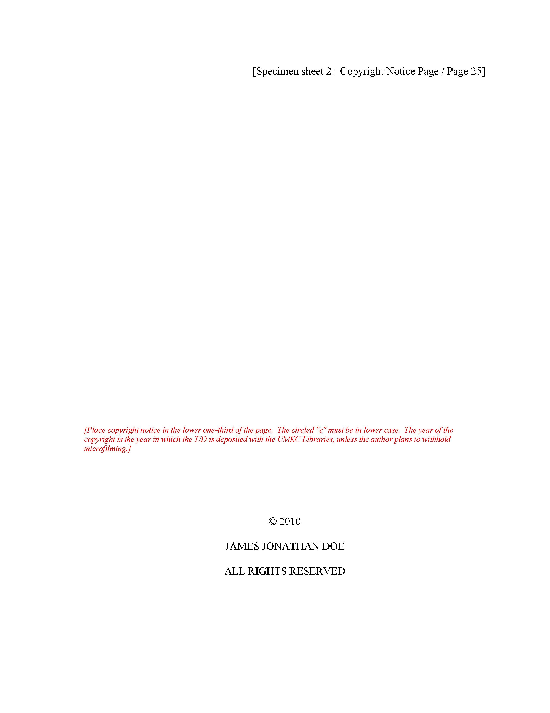
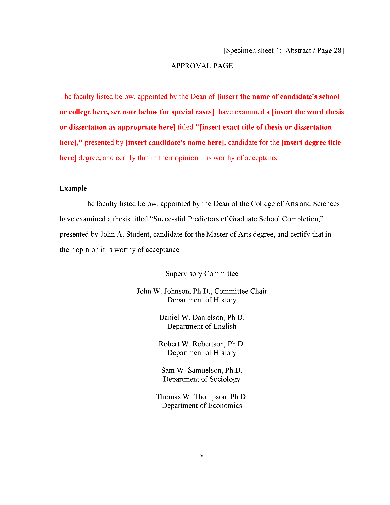
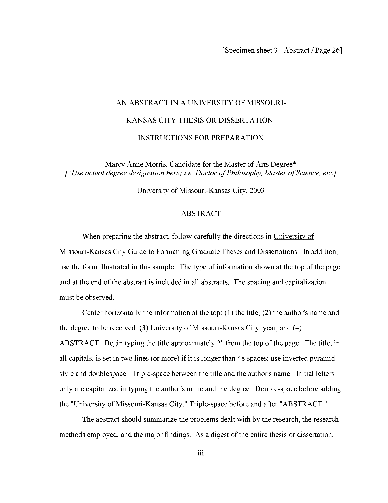
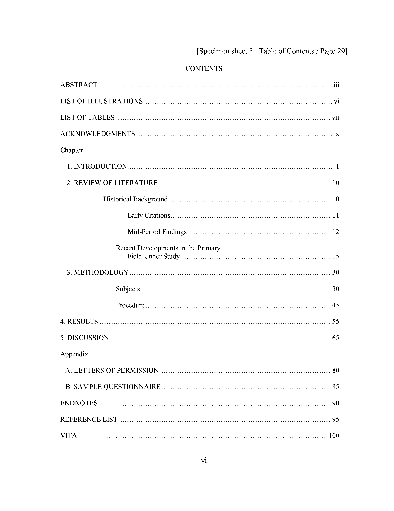
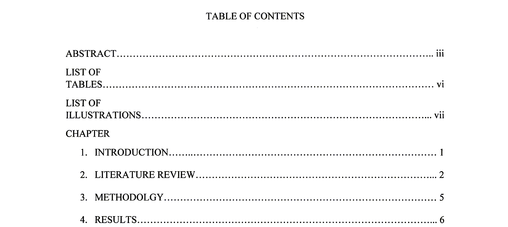
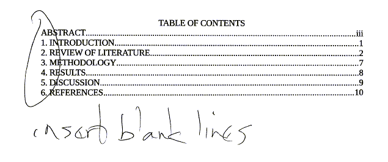

```{r echo=FALSE}
source("prelims.R", echo=FALSE)
```

***
`r read_text("objectives06")`

<div class="notes">

Here are the objectives for this week.

</div>

***
`r read_text("readings07")`

<div class="notes">

This is what you should have read already. If you haven't done the reading yet, pause this video and read this material. You'll get more out of the video if you do so.

</div>

### The title page


<div class="notes">

Here is what your title page should look like. The fonts are small and hard to read, so I will zoom in on several sections.

</div>

### The title page


<div class="notes">

Don't type the line in brackets.

Notice the extra generous top margin here. Also your title is centered in all caps and double spaced.

Change "History and Sociology" to your degree area.

</div>

### The title page


<div class="notes">

Note the single spacing of the "Presented to" paragraph. Your degree is probably a Master of Science. Your full name is in all caps. Put the year you expect to graduate at the bottom. You can't tell from this snip, but there is a generous bottom margin as well.

</div>

### The title page


<div class="notes">

Ths student single spaced where double spacing was needed and double spaced where single spacing was needed. Note that the "Great!" refers to the overall paper, adnd not the title page.

</div>

### The title page


<div class="notes">

This is a more serious deviation from the standard. The title should be all caps and no bold. The students name (which I have blacked out) comes in way to early. This student also forgot the "A THESIS IN" section. Notice again the problem of using double spacing in the wrong section.

</div>

### The title page


<div class="notes">

This student, whose name is blocked out made many mistakes. There is no running head in a thesis, no page numbers in the upper right corner. Page numbers go in the bottom center and do not start until after the first two pages. The title needed to be all caps and the students name comes after the "A THESIS IN" and "Presented to" sections.

</div>

### The copyright page



<div class="notes">

Put in a second page, to keep with the format. This is the copyright page. Put your name in, and you have the option of using an open source license if you like.

It may seem wasteful to add a page like this, but I want you to get comfortable with the general thesis format. Anyway, you are submitting a PDF rather than a paper copy, so no trees will be lost in the process.

</div>

### The copyright page


<div class="notes">

Watch for little details. One student used bold which I commented on. I failed at the time to notice that everything on the copyright page is all uppercase. There's also no copyright symbol (C within a circle). This is a minor deviation and probably did not lead to loss of more than a single point.

But please try to get these details down now. I do look for strict consistency to the published guidelines.

</div>

### The approval page



<div class="notes">

Also put in an approval page. Just make up some names, put my name in, put in some "To be added later" text. It doesn't matter. Just make sure that you get the format right.

</div>

### The abstract page



<div class="notes">

Put in an abstract page, but list the abstract itself as "To be added later". I am more interested in seeing if you can follow the format. ABSTRACT is centered and in all caps for example. Some of my students last year put in an abstract and that's fine. I offered some comments and suggestions, but did not grade on the basis of what was in the abstract.

Of course, if you do include an abstract, do not talk about results. You don't have any results, and don't try to make them up.

</div>

### Table of contents page



<div class="notes">

Put in a Table of Contents. I know you don't know the page numbers yet. You don't even know what the sections are yet. Just put in some reasonable guess. Notice the use of Roman numbers for the first few sections and regular numbers for the rest. I want you to get all these little details down accurately.

</div>

### Table of contents page



<div class="notes">

THis one is not too bad. I missed a few details when I graded it thought. The words "TABLE OF CONTENTS" should just be "CONTENTS". The "LIST OF TABLES" and "LIST OF ILLUSTRATIONS" should be on a single line and not broken across two lines. The word "CHAPTER" should not be all upper case. These are fairly minor deviations and if I would have noticed them I would not have taken off more than a single point.

</div>

### Table of contents page



<div class="notes">

This one made several mistakes, but the most glaring is forgetting to insert blank lines everywhere.

</div>

### Section heads and subheads
+ Main (chapter) heads 
  + Centered
  + No bold
  + All uppercase
+ First subheads
  + Centered
  + Bold or italic
  + Headline (title) case 
+ Second, third, etc. subheads
  + See guidelines
  
<div class="notes">

There are fairly strict rules for section heads and subheads. The main heads (the names of each chapter) have to be centered, no bold, and all uppercase.

If you have a subheading within a chapter, that is also centered, with a bold or italic font, and headline case.

</div>

### Headline (title) case

+ Initial capital for "important" words
  + Nouns, pronouns, verbs, adjectives, adverbs
+ Lower case for short and "unimportant" words
  + Articles, prepositions, conjunctions
+ Initial capital for very first word and very last word
  + Even "unimportant" words
+ Longer "unimportant" words also use initial caps
  + Five letters or longer
+ Some other details
+ Minor contradictions from one source to another
  
<div class="notes">

Headline case is initial capital letters for all "important" words (nouns, pronouns, verbs, adjectives, adverbs). Do not capitalize most unimportant words: articles (a, an, the), prepositions (of, to, from), and conjunctions (and, but, or, if, who). Some exceptions are made for prepositions that are five letters or longer (among, between). 

There are minor details involving words following marks of punctuation (colons and dashes).

Also there are contradictions from one source to another, but these are fairly minor.

</div>