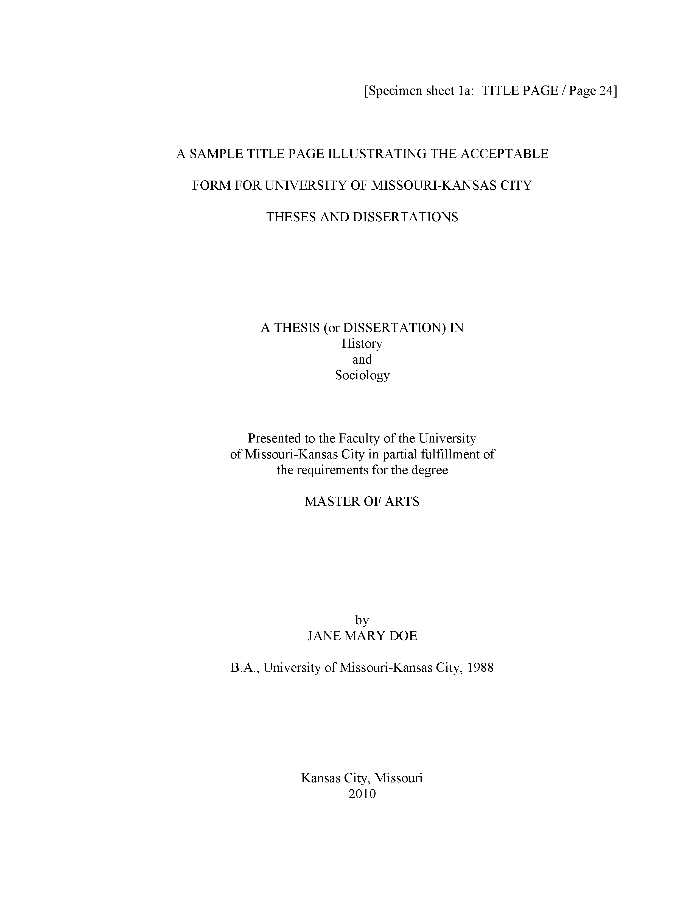
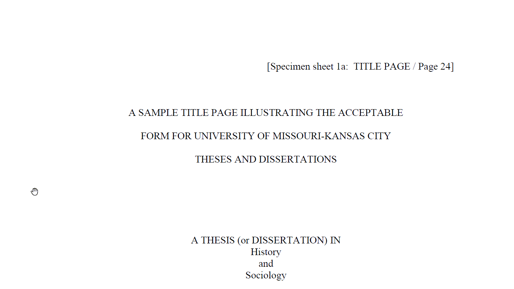
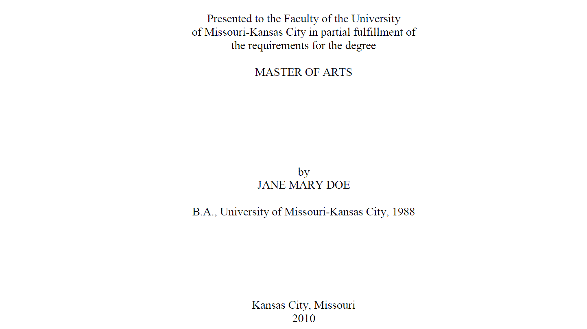
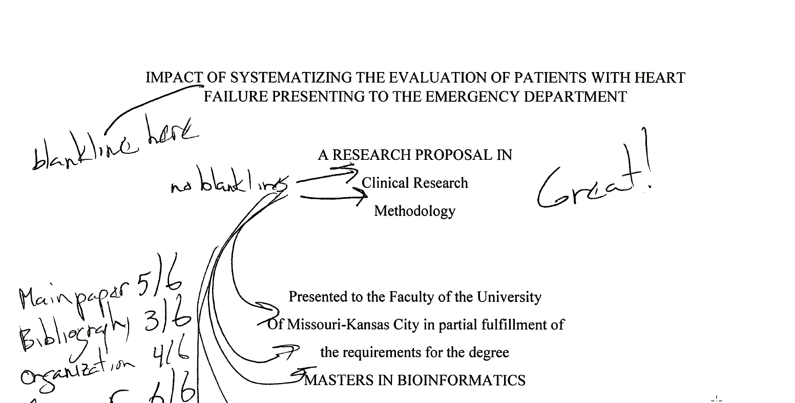
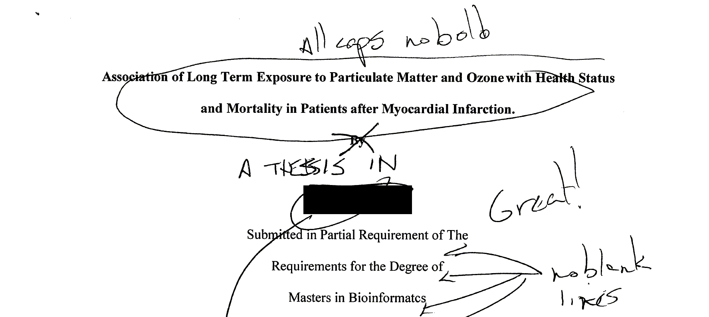
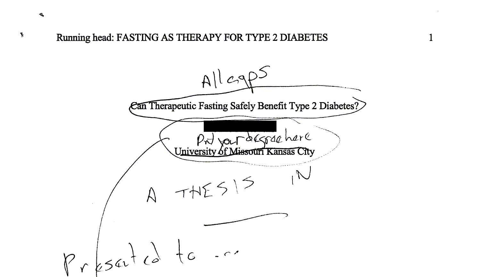

```{r echo=FALSE}
source("prelims.R", echo=FALSE)
```

***
`r read_text("objectives06")`

<div class="notes">

Here are the objectives for this week.

</div>

***
`r read_text("readings07")`

<div class="notes">

This is what you should have read already. If you haven't done the reading yet, pause this video and read this material. You'll get more out of the video if you do so.

</div>

### The title page



<div class="notes">

Here is what your title page should look like. The fonts are small and hard to read, so I will zoom in on several sections.

</div>

### The title page



<div class="notes">

Don't type the line in brackets.

Notice the extra generous top margin here. Also your title is centered in all caps and double spaced.

Change "History and Sociology" to your degree area.

</div>

### The title page



<div class="notes">

Note the single spacing of the "Presented to" paragraph. Your degree is probably a Master of Science. Your full name is in all caps. Put the year you expect to graduate at the bottom. You can't tell from this snip, but there is a generous bottom margin as well.

</div>

### The title page



<div class="notes">

Ths student single spaced where double spacing was needed and double spaced where single spacing was needed. Note that the "Great!" refers to the overall paper, adnd not the title page.

</div>

### The title page



<div class="notes">

This is a more serious deviation from the standard. The title should be all caps and no bold. The students name (which I have blacked out) comes in way to early. This student also forgot the "A THESIS IN" section. Notice again the problem of using double spacing in the wrong section.

</div>

### The title page



<div class="notes">

This student, whose name is blocked out made many mistakes. There is no running head in a thesis, no page numbers in the upper right corner. Page numbers go in the bottom center and do not start until after the first two pages. The title needed to be all caps and the students name comes after the "A THESIS IN" and "Presented to" sections.

</div>
